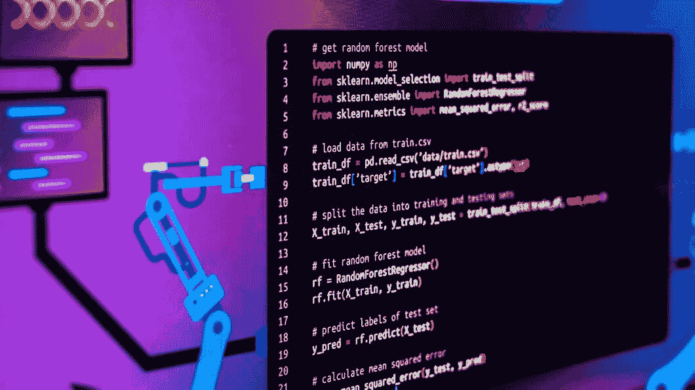

# 掌握 Python 数据科学：超越基础

> 原文：[`www.kdnuggets.com/mastering-python-for-data-science-beyond-the-basics`](https://www.kdnuggets.com/mastering-python-for-data-science-beyond-the-basics)

图片来源：[Freepik](https://www.freepik.com/free-photo/ai-site-helping-with-software-production_41673046.htm#fromView=search&page=1&position=0&uuid=c9c5be64-dc30-4a63-b268-62f14bc67126)

Python 在数据科学领域中无可匹敌，但许多有抱负的（甚至是经验丰富的）数据科学家仅仅触及了其真正能力的表面。要真正掌握 Python 的数据分析，你必须超越基础，[使用高级技术](https://dzone.com/articles/advanced-python-techniques-every-programmer-should-know)来高效处理数据、并行处理以及利用专业库。

* * *

## 我们的前三大课程推荐

 1\. [Google 网络安全证书](https://www.kdnuggets.com/google-cybersecurity) - 快速进入网络安全职业道路。

 2\. [Google 数据分析专业证书](https://www.kdnuggets.com/google-data-analytics) - 提升你的数据分析水平

 3\. [Google IT 支持专业证书](https://www.kdnuggets.com/google-itsupport) - 支持你的组织的 IT

* * *

大型复杂的数据集和计算密集型任务要求的不仅仅是入门级的 Python 技能。

本文作为提升你的 Python 技能的详细指南。我们将深入探讨加速代码的技术，使用 Python 处理大数据集，以及将模型转化为 Web 服务。在整个过程中，我们将探索有效处理复杂数据问题的方法。

# 掌握数据科学的高级 Python 技术

在当前的就业市场上，掌握高级 Python 技术对于数据科学至关重要。大多数公司需要具备 Python 技能的数据科学家。Django 和 Flask。

这些组件简化了关键安全功能的集成，特别是在相邻领域，如运行[PCI 合规托管](https://www.atlantic.net/pci-compliant-hosting/)、构建数字支付的 SaaS 产品或在网站上接受支付。

那么，实际步骤呢？以下是一些你现在可以开始掌握的技术：

## 高效的数据处理与 Pandas

高效的数据处理与 Pandas 相关，围绕着利用其强大的 DataFrame 和 Series 对象来处理和分析数据。

Pandas 在过滤、分组和 合并数据集 等任务中表现出色，使得可以用最少的代码进行复杂的数据操作。其索引功能，包括多级索引，能够快速检索和切片数据，使其非常适合处理大型数据集。

此外，Pandas 与其他数据分析 和可视化库（如 NumPy 和 Matplotlib）的集成，进一步提升了其高效数据分析的能力。

这些功能使得 Pandas 成为数据科学工具箱中不可或缺的工具。因此，即使 Python 是一种非常常见的语言，你也不应该把这视为一个缺陷。Python 既普遍又多才多艺——掌握 Python 可以让你从统计分析、数据清理和可视化，到一些更“专业”的任务，比如使用 [vapt 工具](https://www.getastra.com/blog/security-audit/what-are-vapt-tools/) 甚至 自然语言处理 应用。

## 使用 NumPy 进行高性能计算

NumPy 显著提升了 Python 的高性能计算能力，特别是通过对大型 [多维数组](https://www.freecodecamp.org/news/multi-dimensional-arrays-in-python/) 和矩阵的支持。它通过提供一整套旨在高效操作这些数据结构的数学函数来实现这一点。

NumPy 的关键特性之一 是其 C 实现，这允许使用矢量化操作快速执行复杂的数学计算。这与使用 Python 的本地数据结构和循环进行类似任务相比，显著提高了性能。例如，像矩阵乘法这样的任务，在许多科学计算中很常见，可以使用 [np.dot() 函数](https://numpy.org/doc/stable/reference/generated/numpy.dot.html) 快速执行。

数据科学家可以利用 NumPy 对数组的高效处理和强大的计算能力，在 Python 代码中实现显著的加速，使其适用于需要高水平数值计算的应用。

## 通过多进程提升性能

通过 Python 中的多进程 提升性能涉及使用‘**multiprocessing**’模块在多个 CPU 核心上并行运行任务，而不是在单个核心上按顺序运行。

这对需要大量计算资源的 CPU 密集型任务特别有利，因为它允许任务的分割和并发执行，从而减少整体执行时间。基本用法包括创建‘**Process**’对象并指定要并行执行的目标函数。

此外，**‘Pool’** 类可以用来管理多个工作进程并在它们之间分配任务，这可以抽象化许多手动的进程管理。进程间通信机制如 **‘Queue’** 和 **‘Pipe’** 促进了进程间的数据交换，而同步原语如 **‘Lock’** 和 **‘Semaphore’** 确保了进程在访问共享资源时不会互相干扰。

为了进一步提高代码执行效率，像 [JIT 编译库](https://github.com/wdv4758h/awesome-jit) 中的 Numba 这样的技术可以通过在运行时动态编译代码的部分来显著加速 Python 代码。

## 利用小众库提升数据分析水平

使用特定的 Python 库进行数据分析可以显著提升你的工作效率。例如，Pandas 非常适合用于组织和处理数据，而 PyTorch [提供了先进的深度学习功能](https://pytorch.org/tutorials/beginner/deep_learning_60min_blitz.html)，并支持 GPU 加速。

另一方面，Plotly 和 Seaborn 可以帮助你在创建可视化时使数据更易于理解和吸引人。对于计算要求较高的任务，像 LightGBM 和 XGBoost 这样的库 提供了高效的实现 的梯度提升算法，可以处理具有高维度的大型数据集。

这些库中的每一个都专注于数据分析和机器学习的不同方面，使它们成为任何数据科学家的宝贵工具。

# 数据可视化技术

Python 中的数据可视化已经有了显著进步，提供了多种技术来以有意义和吸引人的方式展示数据。

高级数据可视化不仅提升了数据的解释能力，还 帮助发现潜在的模式、趋势和相关性，这些可能通过传统方法并不明显。

掌握 Python 可以独立完成的工作是不可或缺的，但对 [Python 平台如何在企业环境中充分利用](https://platform.sh/marketplace/python/) 的概述将使你在其他数据科学家中脱颖而出。

这里有一些值得考虑的高级技术：

+   **交互式可视化。** 像 [Bokeh](https://docs.bokeh.org/en/latest/) 和 Plotly 这样的库允许创建用户可以交互的动态图表，例如放大特定区域或悬停在数据点上以查看更多信息。这种交互性可以使复杂的数据变得更易于理解和访问。

+   **复杂图表类型**。除了基本的折线图和柱状图，Python [支持高级图表类型](https://plotly.com/python/)，如热图、箱形图、小提琴图以及更专业的图表如雨云图。每种图表类型都有特定的用途，帮助突出数据的不同方面，从分布和相关性到组间比较。

+   **使用 matplotlib 自定义**。Matplotlib [提供广泛的自定义选项](https://www.scaler.com/topics/matplotlib/how-to-customize-plots-in-matplotlib/)，允许对图表外观进行精确控制。通过使用 **plt.getp** 和 **plt.setp** 函数调整图表参数，或操作图表组件的属性，可以创建出版质量的图形，以最佳方式展示数据。

+   **时间序列可视化**。对于时间数据，时间序列图可以有效地显示随时间变化的值，帮助识别趋势、模式或不同时间段的异常。像 Seaborn 这样的库使创建和自定义时间序列图变得简单，提升了对时间数据的分析。

# 数据科学的可视化工具

通过 [Python 中的多线程](https://docs.python.org/3/library/multiprocessing.html) 来提升性能，可以实现并行代码执行，非常适合 CPU 密集型任务，而无需 IO 或用户交互。

不同的解决方案适用于不同的目的——从创建简单的折线图到复杂的互动仪表盘，以及介于两者之间的各种用途。以下是一些流行的工具：

1.  **Infogram** 以其用户友好的界面和多样化的模板库而闻名，涵盖了媒体、营销、教育和政府等多个行业。它提供免费基础账户和各种高级功能的定价计划。

1.  **FusionCharts** 允许创建超过 100 种不同类型的互动图表和地图，适用于网页和移动项目。它支持自定义，并提供各种导出选项。

1.  **Plotly** 提供了简单的语法和多种交互选项，甚至对于没有技术背景的用户也适用，得益于其 GUI。不过，其社区版存在一些限制，如公共可视化和有限的美学选项。

1.  **RAWGraphs** 是一个开源框架，强调无代码、拖放数据可视化，使复杂数据的视觉理解变得简单易懂。它特别适合填补电子表格应用程序与矢量图形编辑器之间的差距。

1.  **QlikView** 受到经验丰富的数据科学家青睐，用于分析大规模数据。它与各种数据源集成，并且数据分析速度非常快。

# 结论

掌握高级 Python 技术对数据科学家至关重要，以释放这一强大语言的全部潜力。虽然基础 Python 技能非常宝贵，但掌握复杂的数据处理、性能优化和利用专门的库可以提升你的数据分析能力。

持续学习、迎接挑战并保持对最新 Python 发展动态的关注是成为熟练实践者的关键。

因此，投入时间掌握 Python 的高级特性，以增强自己解决复杂数据分析任务、推动创新并做出创造实际影响的数据驱动决策的能力。

[Nahla Davies](http://nahlawrites.com/)是软件开发人员和技术作家。在全职从事技术写作之前，她曾在一家 Inc. 5,000 的体验品牌组织担任首席程序员，该组织的客户包括三星、时代华纳、Netflix 和索尼。

### 更多相关话题

+   [回到基础第 1 周：Python 编程与数据科学基础](https://www.kdnuggets.com/back-to-basics-week-1-python-programming-data-science-foundations)

+   [Python 基础：语法、数据类型和控制结构](https://www.kdnuggets.com/python-basics-syntax-data-types-and-control-structures)

+   [如何通过 ChatGPT 学习 Python 基础](https://www.kdnuggets.com/how-to-learn-python-basics-with-chatgpt)

+   [回到基础第 2 周：数据库、SQL、数据管理等](https://www.kdnuggets.com/back-to-basics-week-2-database-sql-data-management-and-statistical-concepts)

+   [回到基础，第二部分：梯度下降](https://www.kdnuggets.com/2023/03/back-basics-part-dos-gradient-descent.html)

+   [通过这本免费电子书学习 MLOps 基础](https://www.kdnuggets.com/2023/08/learn-mlops-basics-free-ebook.html)
