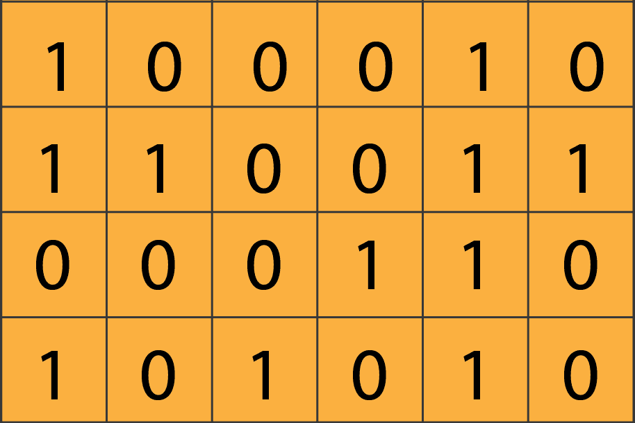
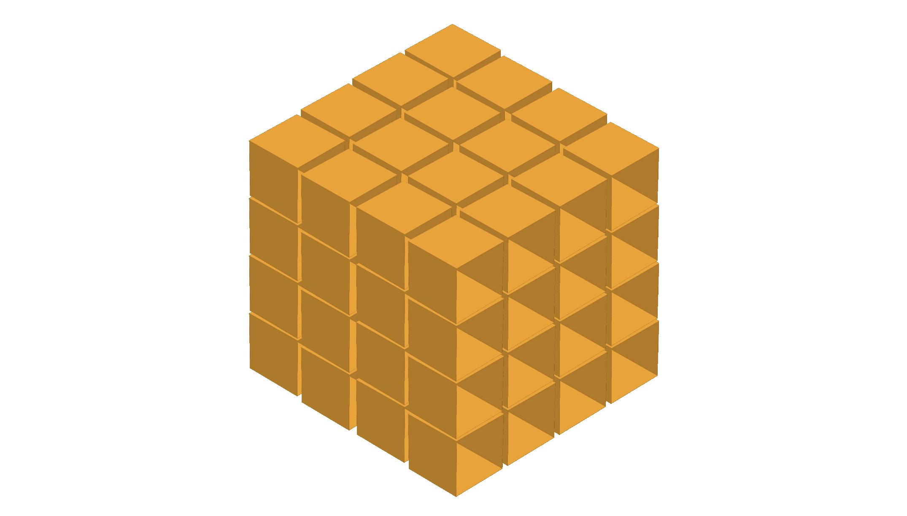

# 在 5 个简单步骤中掌握 TensorFlow 变量

> 原文：[`www.kdnuggets.com/2021/01/mastering-tensorflow-variables-5-easy-steps.html`](https://www.kdnuggets.com/2021/01/mastering-tensorflow-variables-5-easy-steps.html)

评论

**作者：[Orhan G. Yalçın](https://www.linkedin.com/in/orhangaziyalcin/)，AI 研究员**

> **警告：** 请勿将本文与“[在 5 个简单步骤中掌握 TensorFlow 张量](https://towardsdatascience.com/mastering-tensorflow-tensors-in-5-easy-steps-35f21998bb86)”混淆！

*如果你正在阅读这篇文章，我相信我们有相似的兴趣，并且在相似的行业中工作/将会工作。所以让我们通过*[Linkedin](https://linkedin.com/in/orhangaziyalcin/)*联系吧！请随时发送联系请求！*[Orhan G. Yalçın — Linkedin](https://linkedin.com/in/orhangaziyalcin/)*

图 1。照片由[Crissy Jarvis](https://unsplash.com/@crissyjarvis?utm_source=medium&utm_medium=referral)提供，发布在[Unsplash](https://unsplash.com/?utm_source=medium&utm_medium=referral)

在本教程中，我们将重点关注[TensorFlow 变量](https://www.tensorflow.org/api_docs/python/tf/Variable)。教程结束后，你将能够有效地创建、更新和管理[TensorFlow 变量](https://www.tensorflow.org/api_docs/python/tf/Variable)。像往常一样，我们的教程将提供详细的代码示例以及概念解释。我们将在 5 个简单步骤中掌握[TensorFlow 变量](https://www.tensorflow.org/api_docs/python/tf/Variable)：

+   **步骤 1：变量定义** → 简要介绍，与[Tensors](https://www.kdnuggets.com/2018/05/wtf-tensor.html)的比较

+   **步骤 2：变量创建** → 实例化 tf.Variable 对象

+   **步骤 3：** **变量的资格** → 特征和属性

+   **步骤 4：变量操作** → 基本张量操作、索引、形状操作和广播

+   **步骤 5：变量的硬件选择** → GPUs，CPUs，TPUs

系好安全带，让我们开始吧！

### **变量定义**

在这一步中，我们将简要介绍变量的概念，并理解普通 Tensor 对象和变量对象之间的区别。

### 简要介绍

TensorFlow 变量是表示共享和持久状态的首选对象类型，你可以通过任何操作（包括 TensorFlow 模型）来操控。操控指的是任何值或参数的更新。这一特性是变量与`tf.Tensor`对象最主要的区别。TensorFlow 变量被记录为`tf.Variable`对象。让我们简要比较一下`tf.Tensor`和`tf.Variable`对象，以理解它们的相似性和差异。

图 2。变量值可以更新（图由作者提供）

### 与张量的比较

因此，变量和张量之间最重要的区别是**可变性**。与张量不同，变量对象中的值可以被更新（*例如，通过`*assign()*`函数*）。

[*“张量对象的值不能被更新，你只能用新的值创建一个新的张量对象。”*](https://towardsdatascience.com/mastering-tensorflow-tensors-in-5-easy-steps-35f21998bb86)*”*

变量对象主要用于存储模型参数，由于这些值在训练过程中会不断更新，因此使用变量而不是张量是一种必需而非选择。

变量对象的形状可以使用`reshape()`实例函数更新，就像张量对象的形状一样。由于变量对象是基于张量对象构建的，因此它们具有`.shape`和`.dtype`等共同属性。但变量还具有张量所没有的唯一属性，如`.trainable`、`.device`和`.name`。

图 3\. TensorFlow 变量实际上是围绕 TensorFlow 张量的一个包装器，具有额外的功能（图由作者提供）

> 让我们来看看如何创建`tf.Variable`对象！

### **变量的创建**

我们可以使用`tf.Variable()`函数实例化（*即，创建*）`tf.Variable`对象。`tf.Variable()`函数接受不同的数据类型作为参数，如整数、浮点数、字符串、列表和`tf.Constant`对象。

在展示不同数据类型的变量对象示例之前，我希望你能[*“打开一个新的 Google Colab 笔记本”](https://colab.research.google.com/)并使用以下代码导入 TensorFlow 库：* 

现在，我们可以开始创建`tf.Variable`对象。

1 — 我们可以将一个`tf.constant()`对象作为`initial_value`传递：

2 — 我们可以将一个单独的整数作为`initial_value`传递：

3 — 我们可以将一个整数或浮点数列表作为`initial_value`传递：

4 — 我们可以将一个单独的字符串作为`initial_value`传递：

5 — 我们可以将一个字符串列表作为`initial_value`传递：

正如你所看到的，`tf.Variable()`函数接受作为`initial_value`参数的几种数据类型。现在让我们看看变量的特征和功能。

### **变量的资格**

每个变量必须具有一些属性，如值、名称、统一数据类型、形状、秩、大小等。在这一部分，我们将看到这些属性是什么以及如何在 Colab 笔记本中查看这些属性。

### 值

每个变量必须指定一个`initial_value`。否则，TensorFlow 会引发错误，并提示`Value Error: initial_value must be specified.`因此，请确保在创建变量对象时传递`initial_value`参数。为了查看变量的值，我们可以使用`.value()`函数以及`.numpy()`函数。请参见下面的示例：

```py
**Output:**
The values stored in the variables:
tf.Tensor( [[1\. 2.]  
            [1\. 2.]], shape=(2, 2), dtype=float32)The values stored in the variables:
[[1\. 2.]
[1\. 2.]]
```

### 名称

Name 是一个 Variable 属性，帮助开发者跟踪特定变量的更新。你可以在创建 Variable 对象时传递`name`参数。如果你没有指定名称，TensorFlow 会分配一个默认名称，如下所示：

```py
**Output:**
The name of the variable:  Variable:0
```

### Dtype

每个 Variable 必须有统一的数据类型进行存储。由于每个 Variable 存储的是单一类型的数据，你也可以通过`.dtype`属性查看这个类型。见下方示例：

```py
**Output:**
The selected datatype for the variable:  <dtype: 'float32'>
```

### 形状、秩和大小

形状属性以列表形式显示每个维度的大小。我们可以使用`.shape`属性查看 Variable 对象的形状。然后，我们可以使用`tf.size()`函数查看一个 Variable 对象的维度数量。最后，大小对应于一个 Variable 拥有的元素总数。我们需要使用`tf.size()`函数来计算 Variable 中的元素数量。见下方代码了解所有三个属性：

```py
**Output:**
The shape of the variable:  (2, 2)
The number of dimensions in the variable: 2
The number of dimensions in the variable: 4
```

### **与变量的操作**

使用数学运算符和 TensorFlow 函数，你可以轻松进行多种基本操作。除了我们在[本教程系列第二部分](https://towardsdatascience.com/mastering-tensorflow-tensors-in-5-easy-steps-35f21998bb86)中介绍的内容，你还可以使用以下数学运算符进行 Variable 操作。

### 基本 Tensor 操作

图 4\. 你可能会从基本数学运算符中受益（图示由作者提供）

**加法和减法：**我们可以使用`+`和`—`符号进行加法和减法运算。

```py
Addition by 2:
tf.Tensor( [[3\. 4.]  [3\. 4.]], shape=(2, 2), dtype=float32)Substraction by 2:
tf.Tensor( [[-1\.  0.]  [-1\.  0.]], shape=(2, 2), dtype=float32)
```

**乘法和除法：**我们可以使用`*`和`/`符号进行乘法和除法运算。

```py
Multiplication by 2:
tf.Tensor( [[2\. 4.]  [2\. 4.]], shape=(2, 2), dtype=float32)Division by 2:
tf.Tensor( [[0.5 1\. ]  [0.5 1\. ]], shape=(2, 2), dtype=float32)
```

**矩阵乘法和取模操作：最后，你还可以使用`@`和`%`符号进行矩阵乘法和取模操作：**

```py
Matmul operation with itself:
tf.Tensor( [[3\. 6.]  [3\. 6.]], shape=(2, 2), dtype=float32)Modulo operation by 2:
tf.Tensor( [[1\. 0.]  [1\. 0.]], shape=(2, 2), dtype=float32)
```

这些是基础示例，但它们可以扩展为复杂计算，从而创建我们在深度学习应用中使用的算法。

```py
**Note:** These operators also work on regular Tensor objects.
```

### 赋值、索引、广播和形状操作

### 赋值

使用`tf.assign()`函数，你可以在不创建新对象的情况下给一个 Variable 对象赋予新值。赋值是 Variables 的一个优点，特别是在需要重新赋值的情况下。以下是重新赋值的示例：

```py
**Output:**
...array([[  2., 100.],
          [  1.,  10.]],...
```

### 索引

就像在 Tensors 中一样，你可以使用索引值轻松访问特定元素，如下所示：

```py
**Output:**
The 1st element of the first level is: [1\. 2.]
The 2nd element of the first level is: [1\. 2.]
The 1st element of the second level is: 1.0
The 3rd element of the second level is: 2.0
```

### 广播

就像在 Tensor 对象中一样，当我们尝试使用多个 Variable 对象进行组合操作时，较小的 Variable 可以自动扩展以适应较大的 Variable，就像 NumPy 数组一样。例如，当你尝试将一个标量 Variable 与一个二维 Variable 相乘时，标量会被扩展以乘以每个二维 Variable 元素。见下方示例：

```py
tf.Tensor([[ 5 10]
           [15 20]], shape=(2, 2), dtype=int32)
```

### 形状操作

与 Tensor 对象一样，你也可以对 Variable 对象进行重塑操作。对于重塑操作，我们可以使用`tf.reshape()`函数。让我们在代码中使用`tf.reshape()`函数：

```py
tf.Tensor( [[1.]
            [2.]
            [1.]
            [2.]], shape=(4, 1), dtype=float32)
```

### **变量的硬件选择**

正如你在接下来的部分中将看到的，我们将使用 GPU 和 TPU 加速模型训练。为了能够查看我们的变量是在哪种设备（即处理器）上处理的，我们可以使用 `.device` 属性：

```py
The device which process the variable:   /job:localhost/replica:0/task:0/device:GPU:0
```

我们还可以使用 `tf.device()` 函数，通过将设备名称作为参数传递来设置处理特定计算的设备。请参见下面的示例：

```py
**Output:**
The device which processes the variable a: /job:localhost/replica:0/task:0/device:CPU:0The device which processes the variable b: /job:localhost/replica:0/task:0/device:CPU:0The device which processes the calculation: /job:localhost/replica:0/task:0/device:GPU:0
```

虽然在训练模型时你不需要手动设置，但在某些情况下，你可能需要为特定的计算或数据处理工作选择一个设备。所以，要注意这个选项。

### 恭喜你

我们已经成功覆盖了 TensorFlow 变量对象的基础知识。

> *给自己一个奖励吧！*

这应该会给你很大的信心，因为你现在对 TensorFlow 中用于各种操作的主要可变变量对象类型有了更多了解。

如果这是你的第一篇文章，考虑从 [本教程系列的第一部分](https://towardsdatascience.com/beginners-guide-to-tensorflow-2-x-for-deep-learning-applications-c7ebd0dcfbee) 开始：

[**TensorFlow 2.x 深度学习应用的初学者指南**](https://towardsdatascience.com/beginners-guide-to-tensorflow-2-x-for-deep-learning-applications-c7ebd0dcfbee)

理解 TensorFlow 平台及其对机器学习专家的价值

或 [查看第二部分](https://towardsdatascience.com/mastering-tensorflow-tensors-in-5-easy-steps-35f21998bb86)：

[**在 5 个简单步骤中掌握 TensorFlow 张量**](https://towardsdatascience.com/mastering-tensorflow-tensors-in-5-easy-steps-35f21998bb86)

了解 TensorFlow 的基本构件如何在底层工作，并学习如何充分利用 Tensor…

### 订阅邮件列表以获取完整代码

如果你想访问 Google Colab 上的完整代码以及我最新的内容，考虑订阅邮件列表：

滑动以订阅最后，如果你对更多高级的应用深度学习教程感兴趣，请查看我的其他文章：

[**用 MNIST 数据集在 10 分钟内进行图像分类**](https://towardsdatascience.com/image-classification-in-10-minutes-with-mnist-dataset-54c35b77a38d)

使用卷积神经网络与 TensorFlow 和 Keras 对手写数字进行分类 | 监督深度学习

[**用卷积自编码器在 10 分钟内减少图像噪声**](https://towardsdatascience.com/image-noise-reduction-in-10-minutes-with-convolutional-autoencoders-d16219d2956a)

使用深度卷积自编码器清理（或去噪）带有噪声的图像，借助 Fashion MNIST | 无监督…

[**用生成对抗网络在 10 分钟内生成图像**](https://towardsdatascience.com/image-generation-in-10-minutes-with-generative-adversarial-networks-c2afc56bfa3b)

使用无监督深度学习生成手写数字，利用深度卷积 GAN 和 TensorFlow…

[**用 TensorFlow Hub 和 Magenta 在 5 分钟内快速神经风格迁移**](https://towardsdatascience.com/fast-neural-style-transfer-in-5-minutes-with-tensorflow-hub-magenta-110b60431dcc)

将梵高的独特风格通过 Magenta 的任意图像风格化网络和深度学习转移到照片中

**简历： [Orhan G. Yalçın](https://www.linkedin.com/in/orhangaziyalcin/)** 是法律领域的 AI 研究员。他是一位合格的律师，具有商业发展和数据科学技能，并曾在 Allen & Overy 担任法律实习生，处理资本市场、竞争和公司法事务。

[原始链接](https://towardsdatascience.com/mastering-tensorflow-variables-in-5-easy-step-5ba8062a1756)。经许可转载。

**相关：**

+   在 5 个简单步骤中掌握 TensorFlow 张量

+   使用 TensorFlow Serving 部署训练好的模型到生产环境

+   在 TensorFlow 中修剪机器学习模型

* * *

## 我们的前三大课程推荐

 1\. [Google 网络安全证书](https://www.kdnuggets.com/google-cybersecurity) - 快速进入网络安全职业生涯。

 2\. [Google 数据分析专业证书](https://www.kdnuggets.com/google-data-analytics) - 提升你的数据分析技能

 3\. [Google IT 支持专业证书](https://www.kdnuggets.com/google-itsupport) - 支持你的组织的信息技术

* * *

### 更多相关话题

+   [TensorFlow 在计算机视觉中的应用 - 轻松实现迁移学习](https://www.kdnuggets.com/2022/01/tensorflow-computer-vision-transfer-learning-made-easy.html)

+   [用 Python 构建 AI 应用程序的 10 个简单步骤](https://www.kdnuggets.com/build-an-ai-application-with-python-in-10-easy-steps)

+   [用 Python 构建命令行应用程序的 7 个简单步骤](https://www.kdnuggets.com/build-a-command-line-app-with-python-in-7-easy-steps)

+   [用 Docker 将 Python 应用程序容器化的 5 个简单步骤](https://www.kdnuggets.com/containerize-python-apps-with-docker-in-5-easy-steps)

+   [2022 年用 Python 掌握机器学习的 7 个步骤](https://www.kdnuggets.com/2022/02/7-steps-mastering-machine-learning-python.html)

+   [KDnuggets™ 新闻 22:n05, 2 月 2 日: 7 步骤掌握机器学习…](https://www.kdnuggets.com/2022/n05.html)
