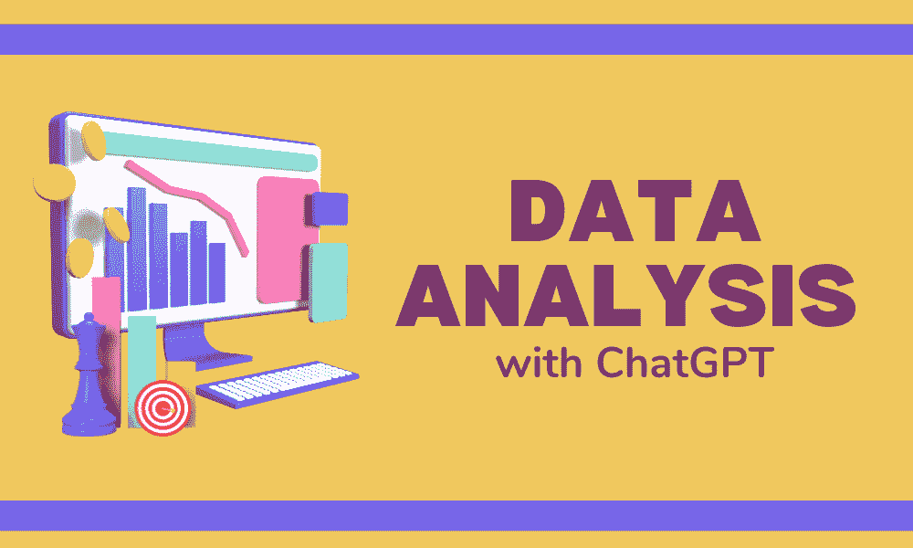
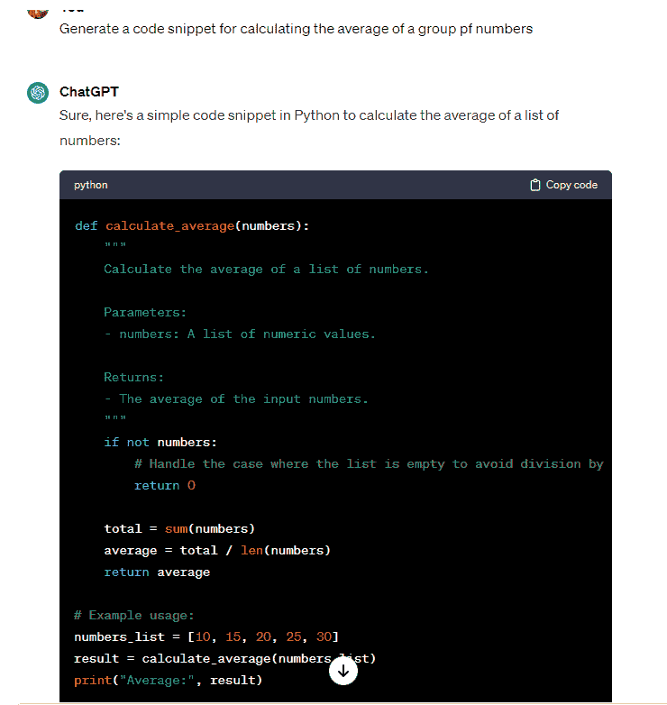
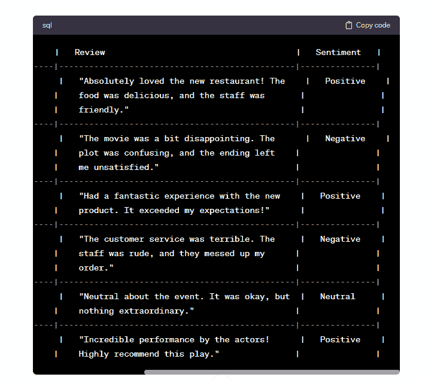

# 利用 ChatGPT 最大化数据分析效率

> 原文：[`www.kdnuggets.com/maximizing-efficiency-in-data-analysis-with-chatgpt`](https://www.kdnuggets.com/maximizing-efficiency-in-data-analysis-with-chatgpt)

编辑提供的图像

随着数据成为最有价值的商业资产，数据分析在组织决策中扮演着至关重要的角色。公司需要全面检查、转化和建模数据，以发现有用的信息并帮助决策。

* * *

## 我们的前三大课程推荐

 1\. [谷歌网络安全证书](https://www.kdnuggets.com/google-cybersecurity) - 快速进入网络安全职业生涯

 2\. [谷歌数据分析专业证书](https://www.kdnuggets.com/google-data-analytics) - 提升你的数据分析水平

 3\. [谷歌 IT 支持专业证书](https://www.kdnuggets.com/google-itsupport) - 支持你的组织 IT 需求

* * *

随着组织必须处理越来越多的数据，分析数据变得越来越具挑战性。在这种情况下，ChatGPT 能够参与数据分析过程是一项宝贵的资产。

ChatGPT 能够理解和生成类似人类的文本，帮助你查询数据集、生成代码片段以及解释结果。因此，当组织将这个先进的语言模型整合到数据分析过程中时，它简化了工作流程并提高了效率。

本文探讨了将 ChatGPT 无缝融入数据分析工作流的过程、挑战和案例研究。让我们简要了解 ChatGPT 的定义和功能。

# 什么是 ChatGPT 以及它能做什么？

在过去一年中，ChatGPT 已经成为科技界及其他领域的家喻户晓的名字。它是基于 OpenAI 的 GPT-3.5 架构开发的语言模型。在这里，GPT 代表“生成预训练变换器”。基本上，这是一个人工智能模型，可以理解人类提供的输入，并生成类似人类的文本作为回应。

ChatGPT 可以执行多种任务。其中一些包括：

+   理解人类使用的自然语言

+   理解讨论的上下文

+   生成连贯而多样的响应以应对各种提示

+   从一种语言翻译成另一种语言

+   基于其训练知识资源回答问题

+   生成代码片段和解释

+   基于提示写故事和诗歌

几乎所有职业的人都可以利用 ChatGPT 的这些功能来简化个人和职业生活。

# 数据分析的效率重要性

## 实时决策

在任何需要即时决策的商业环境中，高效的数据分析是必需的。它使组织能够快速提取有意义的数据洞察，从而确保及时和明智的决策。

## 资源优化

所有商业资源都很宝贵，包括人力和时间。高效的数据分析可以简化分析过程，从而明智地利用你的宝贵资源。

## 超越竞争对手

通过分析数据，公司可以获得可操作的洞察，从而帮助他们在竞争中保持领先。

## 提高生产力

如果数据分析过程变得高效，它减少了分析师生成洞察所需的时间和精力。这不仅提高了他们的生产力，还使他们能够专注于更复杂和战略性的任务。

## 提高准确性

高效的数据分析方法对于数据验证和质量检查非常有用。因此，你可以获得准确的结果，减少由于分析过程效率低下而可能出现的错误。

# ChatGPT 在数据分析中的相关特性

## 高级数据分析

这是 ChatGPT-4 的独特功能。这允许用户直接将数据上传到平台以编写和测试代码。如果你没有访问权限，这里是如何[免费获取付费 ChatGPT 计划](https://www.analyticsvidhya.com/blog/2023/12/chatgpt-4-for-free/)的方法。

## 解决问题

如果你在数据分析过程中遇到障碍，ChatGPT 可以为与数据、算法或分析方法相关的问题建议故障排除解决方案。

## 理解自然语言

由于 ChatGPT 能理解自然语言文本，用户可以使用普通语言与这个模型互动。实际上，这是最受欢迎的 ChatGPT 特性之一。

## 解释概念

ChatGPT 可以用易于理解的语言解释数据分析概念、统计方法和机器学习技术。希望学习数据分析基础的用户可以利用它。

## 头脑风暴创意

即使是在数据分析策略的头脑风暴会议中，ChatGPT 也可以协助制定假设、实验设计或处理复杂数据问题的方法。

## 协助工具使用

ChatGPT 还可以指导你使用不同的数据分析工具或平台。它是解释工具功能的有用资源。

## 帮助文档编写

ChatGPT 可以帮助解释方法、记录代码以及撰写数据分析项目的文档。

## 数据解释

ChatGPT 能够解释分析数据的结果。它可以告诉你统计发现和机器学习预测的含义。

# 使用 AI 和 NLP 在数据分析中的优势

+   从非结构化数据源自动提取洞察

+   增强的自然语言交互用于查询和报告

+   提高数据处理和分析的效率和速度

+   情感分析和基于上下文的数据解释

+   多语言数据分析的语言翻译

+   通过 AI 建议强化决策过程

+   支持大数据集的自动文档处理

+   趋势分析和模式识别

# 如何将 ChatGPT 集成到数据分析工作流中

以下是如何将 ChatGPT 融入你的数据分析工作流。这可能涉及也可能不涉及将其集成到数据分析工具中。

## 确定具体的使用案例

根据你的行业和组织需求，你需要定义你希望使用 ChatGPT 的情况。这可能是自然语言查询、代码辅助、数据解释或协作沟通。仅选择 ChatGPT 能够增值的领域。

## 选择集成点

如果你想将 ChatGPT 融入你的数据分析工作流，请确定它最有益的地方。你可以在数据探索阶段、编写代码时或输出数据解释时纳入它。

## 选择互动方式

然后，你需要选择用户如何与 ChatGPT 互动。你可以选择将其集成到数据分析工具中，或通过网页界面使用它。此外，你还可以通过 ChatGPT API 来使用它。实现 API 可以通过进行 API 调用来完成。关于如何发起 API 请求和处理响应的详细 OpenAI 文档是可用的。

## 用户培训和指南

完成这些后，你必须教会用户如何与 ChatGPT 互动，以进行有效的数据分析。创建一个指南，说明其局限性和获取准确响应的最佳实践。处理敏感数据时还应有严格的安全和隐私规定。这将确保与 ChatGPT 的互动符合数据隐私法规。

## 评估与改进

你应定期评估 ChatGPT 在数据分析工作流中的表现。始终寻找优化其效果的方法，以最大限度地发挥它的作用。你还可以收集用户反馈，以了解用户可能面临的任何挑战。

# ChatGPT 在数据分析中的使用案例

## 代码辅助

你可以使用 ChatGPT 来获得编码任务的帮助。例如，你可以要求它生成一个特定数据分析任务的代码片段，ChatGPT 会做到这一点。

## 自然语言查询

ChatGPT 可以用来处理数据分析中的自然语言查询。你可以要求它总结数据集或根据标准筛选数据。

## 结果解释

ChatGPT 的一个关键使用案例是结果解释。要求 ChatGPT 进行[统计分析](https://geekflare.com/statistical-analysis-explained/)或将见解转化为模式将节省你的时间和精力。

## 探索性数据分析（EDA）

使用 ChatGPT 进行探索性数据分析意味着获得理解数据和制定假设的帮助。它可以为你提供有关数据转换和关键变量检查的指导。

## 情感分析

你可以让 ChatGPT 分析数据集中客户的情感。例如，你可以提供用户反馈，它会告诉你反馈是积极的、消极的还是中立的。

# 如何克服将 ChatGPT 集成到数据分析中的挑战

如果你计划将 ChatGPT 集成到数据分析中，明智的做法是了解可能遇到的挑战及其解决方法。

## 可靠性

ChatGPT 不能保证提供 100%准确的数据。这是将该语言模型应用于数据分析过程中的最大挑战。为避免这一点，你需要通过与已知数据交叉验证 ChatGPT 提供的信息的准确性，或通过用户反馈循环来验证信息。

## 理解上下文

如果你向 ChatGPT 提供复杂或高度专业化的上下文进行数据分析，它可能会难以理解。因此，在与 ChatGPT 互动时，你必须提供尽可能多的上下文，并且使用更简单、更明确的语言。

## 管理模糊性

在数据分析过程中，ChatGPT 可能需要处理模糊的查询或复杂的要求。用户可以通过使查询更加具体或添加更多细节来解决这个问题。

## 数据隐私和安全

如果你希望 ChatGPT 分析数据，可能需要与模型分享敏感和私密的原始数据。为了克服这一点，你必须使用数据匿名化技术来掩盖敏感数据。

# 最终想法

可以理解的是，人工智能（AI）通过自动化复杂任务和从大量数据集中提取有价值的见解来提高数据分析效率。随着这项技术的不断发展，ChatGPT 可以对数据分析产生突破性的影响。

该模型的自然语言处理功能可以生成代码片段、与数据互动并提供上下文见解。未来，预计 ChatGPT 将拥有领域特定的知识，使其能够与各种行业的数据进行更细致的互动。

对于数据分析，它能够提供针对特定分析任务的定制解决方案。用户可以与数据分析平台协作，促进更具动态性的问题解决方法。可以肯定的是，ChatGPT 将发挥其在数据分析普及化方面的作用，使更多用户能够访问和使用数据分析。

****[Vijay Singh Khatri](https://www.linkedin.com/in/vijay-singh-khatri/)**** 计算机科学学士，专注于编程和市场营销。我非常喜欢撰写技术文章和创造新产品。

### 更多主题

+   [提高数据效率和速度的 5 个 Python 提示](https://www.kdnuggets.com/5-python-tips-for-data-efficiency-and-speed)

+   [如何计算算法效率](https://www.kdnuggets.com/2022/09/calculate-algorithm-efficiency.html)

+   [效率决定生物神经元与…的差异](https://www.kdnuggets.com/2022/11/efficiency-spells-difference-biological-neurons-artificial-counterparts.html)

+   [提升数学效率：驾驭 Numpy 数组操作](https://www.kdnuggets.com/elevate-math-efficiency-navigating-numpy-array-operations)

+   [3 种基于研究的先进提示技术，用于提高 LLM 效率…](https://www.kdnuggets.com/3-research-driven-advanced-prompting-techniques-for-llm-efficiency-and-speed-optimization)

+   [计算深度学习模型的计算效率…](https://www.kdnuggets.com/2023/06/calculate-computational-efficiency-deep-learning-models-flops-macs.html)
