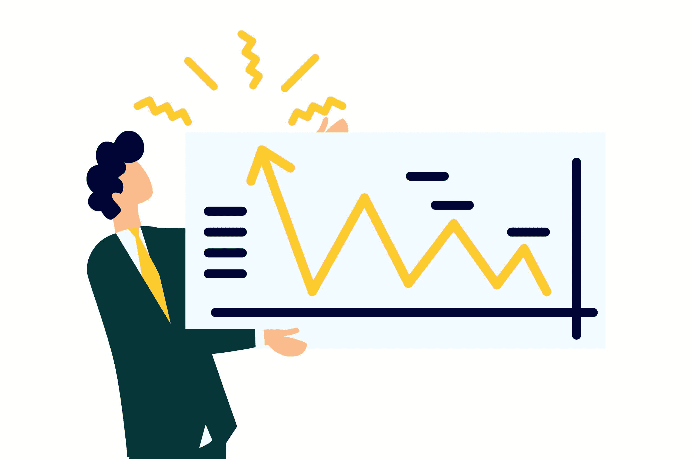

# 掌握季节性和提升业务成果的终极指南

> 原文：[`www.kdnuggets.com/2023/08/media-mix-modeling-ultimate-guide-mastering-seasonality-boosting-business-results.html`](https://www.kdnuggets.com/2023/08/media-mix-modeling-ultimate-guide-mastering-seasonality-boosting-business-results.html)

图片由 [upklyak](https://www.freepik.com/free-vector/man-holding-big-poster-with-graph-growth_11297000.htm#query=forecasting%20market&position=5&from_view=search&track=ais) 提供，来自 Freepik

企业每年在广告上花费数十亿以提高产品的知名度和消费者的兴趣，从而推动更多的购买。为了接触更广泛的受众，企业会推出有针对性的广告或活动，以吸引新客户。广告通过多种媒体进行广播，包括电视、广播、杂志、在线、社交媒体，甚至在商店中进行，以覆盖广泛的受众。由于选择众多以及必须最大化投资回报（ROI）的压力，有效分配广告资源成为一个重大挑战。在这种情况下，媒体组合建模对企业优化广告支出和最大化 ROI 变得至关重要。通过估算在某些媒体渠道上应该花费多少资金以实现特定目标（如增加销售额或品牌知名度），媒体组合建模成为企业的有用工具。这使得企业能够比较各种渠道的表现，识别改进的机会，并合理分配资源。数据驱动的洞察使企业能够调整其营销方法，提高支出的价值，并加速实现业务目标的过程。媒体组合建模是一种统计分析技术，通过分析历史广告数据（包括支出、广告展示量或点击量、产品销售、新客户获得等）来理解不同媒体渠道对业务结果的影响。这使得企业能够优化广告预算组合，提升其 ROI。

* * *

## 我们的三大课程推荐

 1\. [谷歌网络安全证书](https://www.kdnuggets.com/google-cybersecurity) - 快速进入网络安全职业轨道

 2\. [谷歌数据分析专业证书](https://www.kdnuggets.com/google-data-analytics) - 提升您的数据分析技能

 3\. [谷歌 IT 支持专业证书](https://www.kdnuggets.com/google-itsupport) - 支持您的组织 IT 部门

* * *

除了媒体渠道的影响，媒体混合建模还考虑了外部因素，例如业务是否进行过任何促销活动、假期或任何可能影响销售的特殊事件。这是为了避免对媒体渠道绩效的影响进行任何形式的高估。

但企业需要解决并纳入其媒体混合模型中的一个关键因素是季节性。

# 什么是季节性，为什么它对媒体广告如此重要

简单来说，我们可以将季节性定义为时间序列数据的一种特征，其中我们可以观察到每年都会重复的可预测且规律的行为。因此，我们可以说任何可预测并且每年都会重复的行为就是季节性行为。

那么，季节性与周期性效应有何不同？周期性效应是指可以跨越不同时间段的效应。它们可能持续时间长于或短于一年，例如由于水管故障导致某地区水过滤设备销售的增加。这种效应并不规律或可预测，也可能不会每年重复。而流感季节导致流感药物销售的增加可以被称为季节性，因为它每年从 12 月到 2 月重复，并且可以预测。

那么季节性为何对媒体广告如此重要？季节性主要在两个方面影响媒体混合建模。首先，观察到媒体消费模式的变化；其次，广告效果的变化。正如我们上面讨论的，媒体混合建模如何帮助营销人员了解各种媒体渠道对销售或其他关键绩效指标（如新客户获取）的影响。将季节性纳入这些模型使广告主能够更准确地反映全年广告绩效的变化。例如，在节假日期间，各种媒体渠道可能会观察到观众增加或参与度提高，这使得它们在接触各自目标受众时更加成功。当广告主认识到并考虑季节性时，他们能够最大化媒体分配计划的效果。他们能够调整广告预算、活动和渠道选择，以便与季节性趋势和消费者需求保持一致。这确保了营销工作在最有可能产生最大影响的时间集中，从而优化广告投资回报。

# 时间序列数据中的季节性表现是什么样的？

我们可以通过使用季节性因素或虚拟变量将季节性纳入媒体组合模型中，以表示特定的季节性事件，例如节假日。这些因素捕捉了不同时间段对媒体响应的影响，并帮助调整模型的预测。这些变量捕捉了不同时间段对媒体响应的影响，并有助于模型的预测。

在 Python 中，我们有一个名为[seasonal_decompose](https://www.statsmodels.org/dev/generated/statsmodels.tsa.seasonal.seasonal_decompose.html)的 Statsmodel 库，它可以帮助我们生成季节性变量。该库将时间序列分为三个组成部分，即趋势、季节性和残差。季节性可以用两种模型表示：加法模型或乘法模型。

为了简化，我们假设我们使用的是加法模型。当时间序列的方差在不同值之间没有变化时，可以使用加法模型。在数学上，我们可以将加法模型表示为趋势、季节性和残差的各个组成部分相加。

图 1：8 个月的收入季节性分解

## 趋势因素

趋势成分描述了时间序列在较长时间内发生的变化，并且更具系统性。它反映了序列的根本增加或减少，并提供了对长期收集的数据的整体趋势及其幅度的指示。这有助于确定数据的基本模式以及数据的方向性。在图 1 中，我们可以看到 8 个月的收入季节性分解，如果我们查看趋势，会发现每年的夏季收入有所下降。这一见解对广告商至关重要，因为他们可以据此调整策略或支出模式。

## 季节性因素

季节性因素指的是在较短时间内（通常是一年内）发生的重复模式。这是外部影响如天气、节假日或其他文化事件所导致的频繁波动的表现。季节性特征的反复出现的峰值和谷值反映了数据中可以预期的规律。在上图的图 1 中，我们可以看到每隔一个月就有一个峰值，这可以帮助企业识别对收入产生影响的外部因素。

## 残差因素

随机和无法解释的变化无法归因于趋势或季节性，称为残差成分，也称为误差或噪声成分。它考虑了在趋势和季节性成分考虑后仍然存在的任何波动或异常。残差成分表示数据中不可预测且缺乏系统性模式的部分。

## 季节性分析面临的挑战

1.  多重季节性：在某些时间序列数据中，可以观察到每日、每周以及每月的多重季节性模式，这些模式用简单的季节分解方法难以捕捉，可能需要更复杂的处理过程。

1.  数据稀疏：如果我们在一段时间内没有均匀分布的数据，即采样频率较低或数据点非常少，则可能影响季节性估计。因此，建议至少有 2 年的每日或每周数据集，以获得更高质量的季节性估计。

1.  非平稳性：如果时间序列数据具有变化的方差，这将影响季节性估计。

    特定季节中的数据点有限或稀疏可能会妨碍季节效应的准确估计，特别是在处理较短的时间序列或采样频率较低的数据时。

1.  不规则性：数据中常常由于一些外部因素存在异常值，这可能会扭曲季节性分析。建议在进行季节性分析之前进行数据筛选，例如异常值检测和去除。

最后，我们看到季节性如何影响媒体组合建模，并推动战略业务决策。通过在媒体组合模型中纳入季节性，营销人员可以根据消费者行为和市场动态的波动来优化他们的广告策略和预算分配。了解季节性模式使公司能够瞄准正确的受众，选择最佳的媒体渠道，并在最佳时机进行广告活动以达到最大的效果。通过利用季节性分析信息，公司可以提高广告活动的效率和效果，增加客户参与度，创造销售机会，并最终提高投资回报率。季节性使公司能够调整和量身定制其营销策略，以适应不断变化的消费者需求和偏好，从而在动荡的环境中获得竞争优势。

**[Mayukh Maitra](https://www.linkedin.com/in/mayukh-maitra-72525528/)** 是沃尔玛的数据科学家，专注于媒体组合建模领域，拥有超过 5 年的行业经验。从构建基于马尔科夫过程的医疗结果研究模型到执行基于遗传算法的媒体组合建模，我不仅在改善人们的生活方面有所贡献，还通过有意义的洞察力将企业提升到一个新的水平。在加入沃尔玛之前，我曾在 GroupM 担任数据科学经理，专注于广告技术领域，在 Axtria 担任决策科学高级助理，工作于健康经济学和结果研究领域，并在 ZS Associates 担任技术分析师。除了我的专业角色，我还参与了多个同行评审会议的评审和技术委员会，并有机会评审多个技术奖项和黑客马拉松。

### 更多相关话题

+   [终极收藏：50 门免费课程助你掌握数据科学](https://www.kdnuggets.com/ultimate-collection-of-50-free-courses-for-mastering-data-science)

+   [你终极的 Chat GPT 和其他缩写指南](https://www.kdnuggets.com/2023/06/ultimate-guide-chat-gpt-abbreviations.html)

+   [提升机器学习算法：概述](https://www.kdnuggets.com/2022/07/boosting-machine-learning-algorithms-overview.html)

+   [终极指南：NLP 中的不同词嵌入技术](https://www.kdnuggets.com/2021/11/guide-word-embedding-techniques-nlp.html)

+   [在一年内掌握数据科学：终极指南，经济实惠的自学方式](https://www.kdnuggets.com/master-data-science-in-a-year-the-ultimate-guide-to-affordable-self-paced-learning)

+   [终极指南：如何接近 LLMs](https://www.kdnuggets.com/the-ultimate-guide-to-approach-llms)
