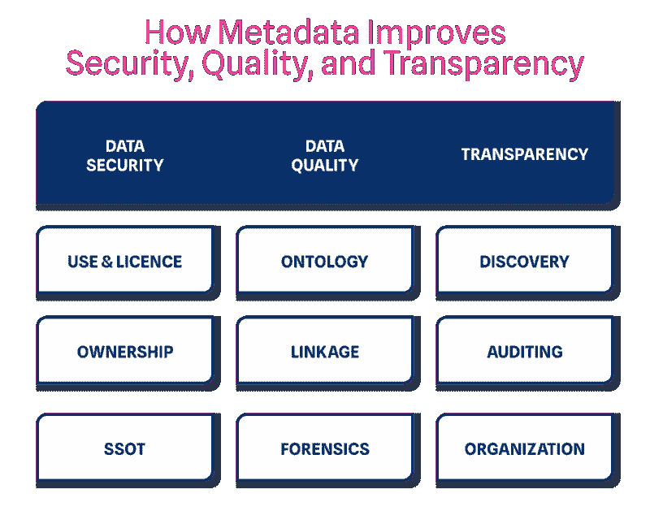

# 元数据如何改善安全性、质量和透明度

> 原文：[`www.kdnuggets.com/2022/04/metadata-improves-security-quality-transparency.html`](https://www.kdnuggets.com/2022/04/metadata-improves-security-quality-transparency.html)

Spotify 如何与像 Apple 这样的巨头抗衡？一个字：数据。通过机器学习和 AI，Spotify 通过提供更个性化和定制化的体验为用户创造价值。让我们快速了解一下用于增强其平台的聚合信息层：

+   Spotify 使用自然语言处理（NLP）扫描关于你正在听的音乐的讨论论坛，然后将你的偏好与其他讨论相似的音乐匹配；

+   音乐的组成被分析以了解音调、声音、响度、音质（即大调或小调）以及其他用于推荐类似歌曲和艺术家的因素；

+   当然，Spotify 会在听音乐时测量行为，追踪重复播放或跳过歌曲，建立偏好，从而改进推荐。

这里的核心数据是音乐——歌曲的基本组成部分，如标题、艺术家和时长。选择一首歌来听定下了基线（也许你喜欢它的低音线）。其他一切都可以视为元数据：关于如何听歌、歌曲的构成以及其他类似的音乐的附加元素。

* * *

## 我们的前 3 名课程推荐

 1\. [Google Cybersecurity Certificate](https://www.kdnuggets.com/google-cybersecurity) - 快速进入网络安全职业道路。

 2\. [Google Data Analytics Professional Certificate](https://www.kdnuggets.com/google-data-analytics) - 提升你的数据分析技能

 3\. [Google IT Support Professional Certificate](https://www.kdnuggets.com/google-itsupport) - 支持组织的 IT 需求

* * *

在这里，元数据是 Spotify 算法的驱动力，它被不断收集和应用，以提供智能推荐，保持你不断听歌。

# 什么是元数据？

简单来说，在技术行业中，“meta”指的是底层定义或描述。更直接地说，元数据提供了关于数据的上下文，超出你在行和列中看到的内容。

这个定义相当广泛，但主要是因为它几乎可以用于任何目的——它可以详细告诉你每一列标题的含义，谁上传了数据及何时，整个数据集的列数和行数，原始数据来源，甚至仓储和居留要求。

# 元数据如何组织？

有 3 种主要的元数据类型相互作用：行政性、描述性和结构性。每种类型在解释相应数据方面发挥不同的作用。

结构化元数据 – 提供数据元素组织方式的见解。这便于快速和轻松的导航，如目录或页码。结构化元数据允许将类似数据分组，记录唯一数据集之间的关系。

管理性元数据 – 提供有关数据的技术信息。它涵盖数据的来源、数据类型和访问或使用许可等方面。

描述性元数据 – 添加有关所有者、数据创建/发布时间以及数据包含内容的信息。其基本目的是简化识别，并提供数据的快照。

这些类型的元数据的组合使组织能够高效地在大量数据中导航，使其在需要时容易找到所需的信息。

# 元数据为何重要？

[53%的分析消费者](https://dresneradvisory.com/press-releases/dresner-advisory-services-publishes-2021-data-catalog-market-study)在定位和访问数据内容时遇到困难。随着数据量的增加，组织了解其拥有的数据、数据位置和使用方式变得越来越重要。

元数据的作用不仅限于描述数据。元数据可以使数据发现变得更加容易，并帮助增加对数据集的理解。例如，以图书馆书籍为例。如果文本是主要数据，则书籍封面可能包含书籍的简要总结和其他人的评论。重要的是，图书馆还可能附加数据，为书籍提供类别、类型和唯一标识符，以便于组织和检索。

元数据还可以通过确保组织在数据集级别跟踪使用情况、共享和许可权限，来协助遵守监管要求。通过附加使数据使用方式、目的以及可以或不可以共享对象的元数据，您可以将安全性和合规性内建于数据本身。

# 数据目录平台中的元数据管理

通过管理您的元数据，您实际上是在创建数据资产的百科全书。元数据管理是数据管理的一个子集，而数据管理本身属于数据治理的范畴。

因此，关注元数据管理的主要原因与实施数据治理策略的原因相同：提高数据安全性、数据质量和整体透明度。

**提高数据安全性：**

+   元数据将使用限制和许可直接与数据绑定

+   揭示数据所有权和维护者，以便明确角色

+   将与数据集相关的信息整合和编纂，以确保不会丢失

**提高数据质量：**

+   设计/实施组织范围的本体论

+   实体解析/记录关联变得更加简单

+   对于随时间变化的洞察

**提高透明度：**

+   增加了组织内部和跨团队的可发现性

+   创建可审计的使用、访问和更新记录

+   分享信息而不泄露敏感数据

精细的元数据管理不仅是将这些丰富信息与数据集本身连接起来，而是以一种易于访问、执行和管理的方式来处理。

# 元数据在数据目录中的好处是什么？

使用 ThinkData Works 的特定工具和功能，你可以解锁源于元数据的宝贵收益：

**自定义元数据** – 向数据集添加任何元数据的能力，包括关联/相关的数据集、上传使用协议、成本与许可以及数据字典

**可配置的属性定义** – 数据目录允许你在数据集中输入模式描述，将元数据绑定到属性

**数据集版本控制/修订** – 每个数据集结构随着模式的变化而产生的版本，以及每次数据更新时跟踪的修订。这样，用户可以在更新其模型和仪表板时跟踪数据的稳定版本

**数据健康监控** – 一个用于报告和警报配置的仪表板，根据数据随时间变化的情况，包括“宏观”信息（如行和列计数）或“微观”信息（如值类型或值范围）

**访问审计** – 具体的使用统计信息和描述用户行为、API 调用及对数据进行或进行的数据操作的信息。

# 灵活管理，严格治理

元数据管理是健全数据治理的关键部分 – 是有效数据战略中最重要的部分之一。我们知道每个组织都有独特的需求，因此一个好的元数据解决方案应当强大且可执行，同时足够灵活以便按照每家公司量身定制的数据管理方式。

通过提供全面的元数据管理，ThinkData Works 使我们的客户能够在强大、安全的基础上构建数据驱动的解决方案。

你认为你的业务是否需要一个数据目录来查找、理解和使用可信的数据以推动业务成果？ [联系我们](https://www.thinkdataworks.com/contact) 以解锁数据的价值。

**[Tim Lysecki](https://www.linkedin.com/in/timlysecki/)** 是 ThinkData Works 的产品营销经理，他负责塑造公司的市场战略，指导媒体报道公司和产品，并扩展客户名单。在业余时间，他还是一位热衷于创作歌曲、表演和摄影的人。

### 更多相关内容

+   [数据质量维度：用伟大的期望确保你的数据质量](https://www.kdnuggets.com/2023/03/data-quality-dimensions-assuring-data-quality-great-expectations.html)

+   [生产 ML 的元数据存储！](https://www.kdnuggets.com/2022/05/layer-metadata-store-production-ml.html)

+   [机器学习元数据存储](https://www.kdnuggets.com/2022/08/machine-learning-metadata-store.html)

+   [世界需要更多的网络安全分析师！](https://www.kdnuggets.com/the-world-needs-more-cyber-security-analysts)

+   [10 种最常见的数据质量问题及解决方法](https://www.kdnuggets.com/2022/11/10-common-data-quality-issues-fix.html)

+   [数据质量：好、坏与丑](https://www.kdnuggets.com/2022/01/data-quality-good-bad-ugly.html)
