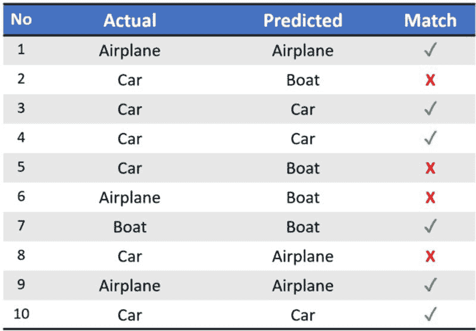
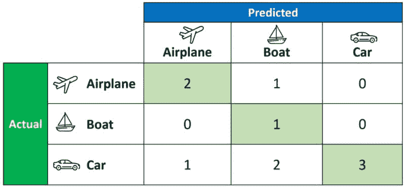
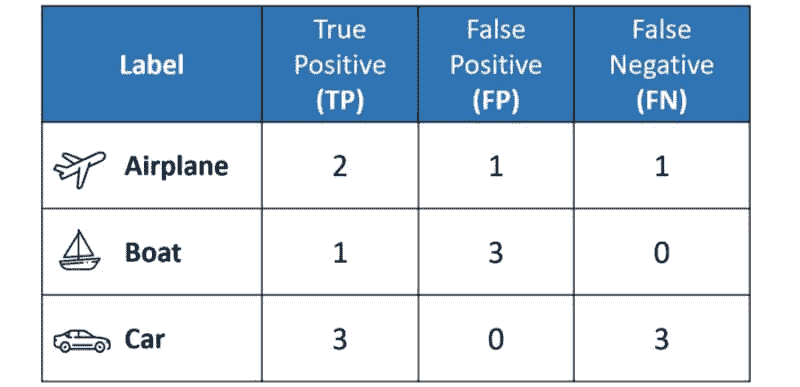
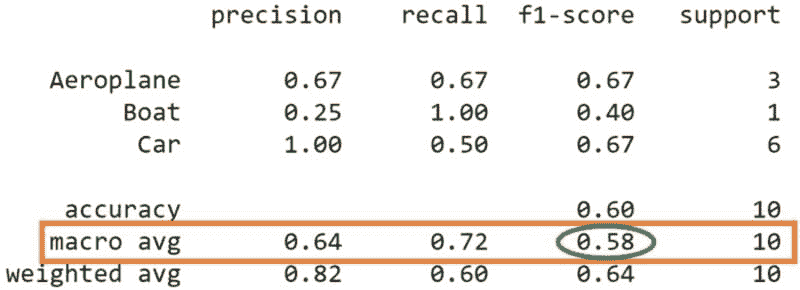
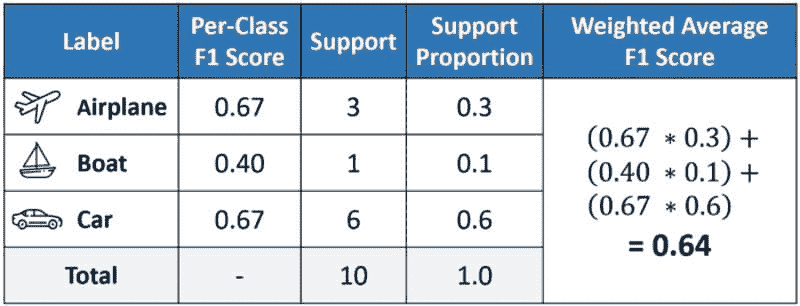
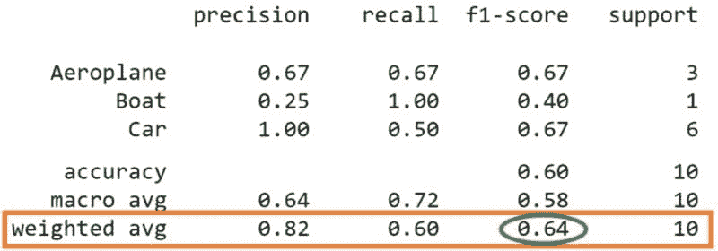
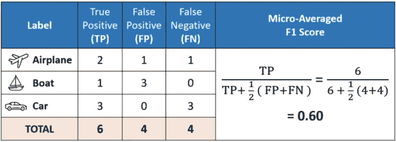

# F1 分数的微观、宏观和加权平均值，清晰解释

> 原文：[`www.kdnuggets.com/2023/01/micro-macro-weighted-averages-f1-score-clearly-explained.html`](https://www.kdnuggets.com/2023/01/micro-macro-weighted-averages-f1-score-clearly-explained.html)

作者图片和[Freepik](https://www.freepik.com/vectors/people)

F1 分数（也称 F 度量）是评估分类模型性能的常用指标。

* * *

## 我们的前三大课程推荐

 1\. [谷歌网络安全证书](https://www.kdnuggets.com/google-cybersecurity) - 快速进入网络安全职业生涯。

 2\. [谷歌数据分析专业证书](https://www.kdnuggets.com/google-data-analytics) - 提升你的数据分析技能

 3\. [谷歌 IT 支持专业证书](https://www.kdnuggets.com/google-itsupport) - 支持你的组织 IT

* * *

在多类别分类的情况下，我们采用**平均**方法来计算 F1 分数，从而在分类报告中得到一**组不同的平均分数**（宏观、加权、微观）。

本文讨论了这些平均值的含义，**如何**计算它们，以及**选择**哪个来进行报告。

# （1）基础知识回顾（可选）

*注意：如果你已经对精确率、召回率和 F1 分数的概念很熟悉，可以跳过这一部分。*

## 精确率

**通俗定义：** 在我做出的所有正例预测中，有多少是真正的正例？

**计算：** 真正例数（TP）除以真正例数（TP）**和**假阳性（FP）的总数。

精确率的公式 | 作者图片

## 召回率

**通俗定义：** 在所有实际的正例中，我正确预测为正例的有多少？

**计算：** 真正例数（TP）除以真正例数（TP）**和**假阴性（FN）的总数。

召回率的公式 | 作者图片

如果你比较精确率和召回率的公式，你会发现它们看起来很相似。唯一的不同是分母的第二项，对于**精确率**是假阳性，对于**召回率**是假阴性。

## F1 分数

为了全面评估模型性能，我们应该检查**精确率**和召回率。F1 分数作为一个有用的指标，考虑了这两者。

**定义**：精确率和召回率的调和均值，用于更平衡地总结模型性能。

**计算：**

F1 分数的方程 | 图片由作者提供

如果我们用真正例（TP）、假正例（FP）和假负例（FN）来表示，我们会得到这个方程：

F1 分数的另一种方程 | 图片由作者提供

# (2) 设置动机示例

为了说明 F1 分数的平均概念，我们将在本教程中使用以下示例。

想象一下，我们已经在一个包含**三**类图像的**多类**数据集上训练了一个**图像分类模型**：**飞机**、**船**和**汽车**。

图片由 [macrovector](https://www.freepik.com/vectors/car) 提供 — [freepik.com](https://www.freepik.com/)

我们使用这个模型来**预测****十**个测试集图像的类别。以下是**原始预测**：

我们的演示分类器的样本预测 | 图片由作者提供

运行`sklearn.metrics.classification_report`后，我们得到以下分类报告：

[分类报告](https://scikit-learn.org/stable/modules/generated/sklearn.metrics.classification_report.html)来自 scikit-learn 包 | 图片由作者提供

讨论的重点是带有**每类**分数（即每个类别的分数）和**平均**分数的列（橙色）。

从上面可以看出，数据集是**不平衡的**（十个测试集实例中只有一个是“船”）。因此，**正确匹配的比例**（即准确率）在评估模型性能时将无效。

相反，让我们查看**混淆矩阵**以全面理解模型预测。

混淆矩阵 | 图片由作者提供

上面的混淆矩阵使我们能够计算真正例（**TP**）、假正例（**FP**）和假负例（**FN**）的关键值，如下所示。

从混淆矩阵中计算的 TP、FP 和 FN 值 | 图片由作者提供

上表为我们计算每个三类中的**每类**的**精确度**、**召回率**和 F1 分数奠定了基础。

重要的是要记住，在**多类分类中，我们计算每个类别的 F1 分数，采用一对其余（OvR）**的方法，而不是像二分类那样计算一个整体的 F1 分数。

在这种**OvR**方法中，我们分别为每个类别确定指标，就好像每个类别都有一个不同的分类器。以下是每个类别的指标（显示了 F1 分数的计算）：

然而，与其有多个每类 F1 分数，不如**平均**它们以获得一个**单一数字**来描述总体性能。

现在，让我们讨论**平均**方法，这些方法导致了分类报告中的**三种不同的平均 F1 分数**。

# (3) 宏观平均

**宏观平均**可能是所有平均方法中最简单的。

宏观平均 F1 分数（或宏观 F1 分数）是通过所有每个类别 F1 分数的算术平均（即**未加权**平均）计算得出的。

此方法对所有类别一视同仁，无论其**支持度**值如何。

宏观 F1 分数计算 | 图片来源于作者

我们计算得到的**0.58**与我们的分类报告中的宏观平均 F1 分数相匹配。

# (4) 加权平均

**加权平均** F1 分数是通过计算所有类别的 F1 分数的平均值来得到的，**同时考虑每个类别的支持度**。

> **支持度**指的是数据集中该类别的实际出现次数。例如，**船**的支持度值为 1 意味着只有一个实际标签为船的观察。

“权重”本质上是指每个类别的支持度相对于所有支持度值总和的比例。

加权 F1 分数计算 | 图片来源于作者

使用加权平均，输出的平均值将考虑到每个类别按该类别示例数加权的贡献。

计算得到的**0.64**与我们分类报告中的加权平均 F1 分数一致。

# (5) 微观平均

微观平均通过计算真实正例（**TP**）、假阴性（**FN**）和假正例（**FP**）的**总和**来计算**全局平均**F1 分数。

我们首先将所有类别的 TP、FP 和 FN 值相加，然后将这些值代入 F1 方程，得到我们的微观 F1 分数。

微观 F1 分数计算 | 图片来源于作者

在分类报告中，你可能会想知道为什么我们的微观 F1 分数**0.60**显示为“准确率”，以及为什么没有**‘微观平均’**的行。

这是因为微观平均本质上计算的是**正确分类**观察结果在所有观察结果中的**比例**。如果我们考虑这一点，这一定义就是我们用来计算整体**准确率**的标准。

此外，如果我们对精确率和召回率进行微观平均，我们将得到相同的**0.60**值。

所有微观平均指标的计算 | 作者提供的图像

这些结果意味着，在每个观察结果只有**单一标签**的多类别分类情况下，**微观-F1**、**微观精确率**、**微观召回率**和**准确率**共享**相同**的值（即，本示例中的**0.60**）。

这也解释了为什么分类报告**只需要显示一个准确率值**，因为微观-F1、微观精确率和微观召回率也有相同的值。

> **微观-F1** = 准确率 = 微观精确率 = 微观召回率

# (6) 我应该选择哪种平均方式？

一般而言，如果你在处理一个类别不平衡的数据集，其中所有类别同样重要，使用**宏观**平均将是一个不错的选择，因为它对所有类别一视同仁。

这意味着，对于我们涉及飞机、船只和汽车分类的示例，我们将使用宏观-F1 分数。

如果你有一个不平衡的数据集，但希望对数据集中样本更多的类别赋予更大的贡献，那么**加权**平均是首选。

这是因为，在加权平均中，每个类别对 F1 平均值的贡献是根据其大小加权的。

假设你有一个平衡的数据集，并且希望得到一个易于理解的整体性能指标，不论类别如何，那么你可以选择准确率，这本质上是我们的**微观**F1 分数。

# 在你离开之前

我欢迎你**加入我的数据科学学习之旅！** 关注我的[Medium](https://kennethleungty.medium.com/)页面，并查看我的[GitHub](https://github.com/kennethleungty)以获取更多令人兴奋的数据科学内容。同时，祝你在解释 F1 分数时玩得愉快！

**[Kenneth Leung](https://www.linkedin.com/in/kennethleungty/)** 是波士顿咨询集团（BCG）的数据科学家、技术作者和药剂师。

[原文](https://towardsdatascience.com/micro-macro-weighted-averages-of-f1-score-clearly-explained-b603420b292f)。经允许转载。

### 更多相关内容

+   [7 个免费的 Kaggle 微课程，适合数据科学初学者](https://www.kdnuggets.com/7-free-kaggle-micro-courses-for-data-science-beginners)

+   [数据库关键术语解释](https://www.kdnuggets.com/2016/07/database-key-terms-explained.html)

+   [描述性统计关键术语解析](https://www.kdnuggets.com/2017/05/descriptive-statistics-key-terms-explained.html)

+   [决策树算法解析](https://www.kdnuggets.com/2020/01/decision-tree-algorithm-explained.html)

+   [键值数据库解析](https://www.kdnuggets.com/2021/04/nosql-explained-understanding-key-value-databases.html)

+   [高斯朴素贝叶斯解析](https://www.kdnuggets.com/2023/03/gaussian-naive-bayes-explained.html)
