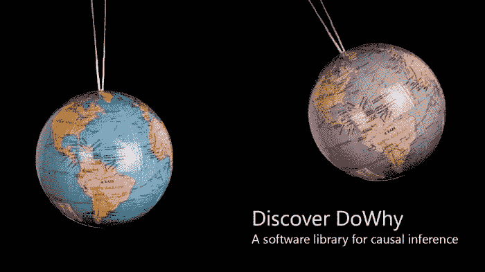
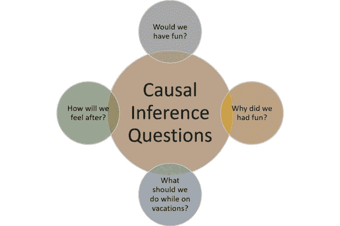
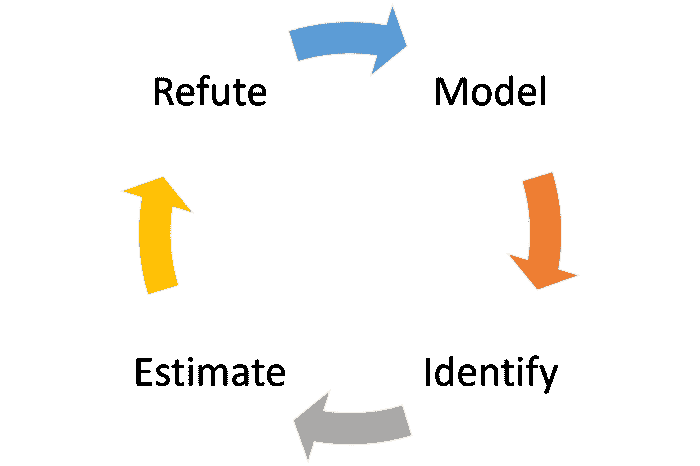
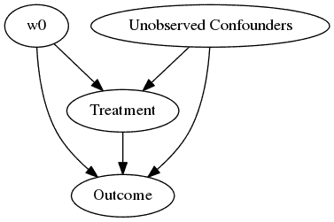
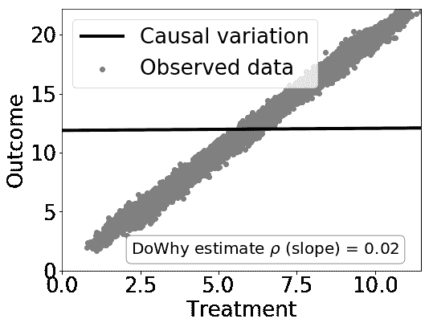

# 微软的 DoWhy 是一个酷炫的因果推断框架

> 原文：[`www.kdnuggets.com/2020/08/microsoft-dowhy-framework-causal-inference.html`](https://www.kdnuggets.com/2020/08/microsoft-dowhy-framework-causal-inference.html)

评论

来源: [`www.microsoft.com/en-us/research/blog/dowhy-a-library-for-causal-inference/`](https://www.microsoft.com/en-us/research/blog/dowhy-a-library-for-causal-inference/)

> 我最近开始了一份新的关注人工智能教育的通讯。TheSequence 是一份无废话（即无炒作、无新闻等）的 AI 专注通讯，阅读时间为 5 分钟。目标是让你了解机器学习项目、研究论文和概念。请通过下面的订阅尝试一下：


人类大脑具有将原因与特定事件关联的卓越能力。从选举结果到物体掉落在地板上，我们不断地将事件链联系起来，以产生特定的效果。神经心理学将这种认知能力称为因果推理。计算机科学和经济学研究一种特定形式的因果推理，称为因果推断，它专注于探索两个观察变量之间的关系。多年来，机器学习已经产生了许多因果推断的方法，但它们在主流应用中仍然大多难以使用。最近，微软研究院[开源了 DoWhy](https://github.com/Microsoft/dowhy)，这是一个用于因果思维和分析的框架。

因果推断面临的挑战不是它是一门新学科，恰恰相反，而是当前的方法仅代表因果推理的一个非常小且简单的版本。大多数试图连接原因的模型，如线性回归，依赖于对数据进行某些假设的经验分析。纯粹的因果推断依赖于反事实分析，这更接近于人类做决定的方式。想象一个场景，你和家人一起去一个未知的目的地度假。在度假前后，你正与一些反事实问题进行挣扎：



回答这些问题是因果推断的重点。与监督学习不同，因果推断依赖于对未观察量的估计。这通常被称为因果推断的“根本问题”，意味着模型永远不能通过留出的测试集进行纯粹客观的评估。在我们的假期例子中，你可以观察到度假与不度假的效果，但永远不能同时观察到。这一挑战迫使因果推断对数据生成过程做出关键假设。传统的因果推断机器学习框架试图绕过“根本问题”，这导致数据科学家和开发人员感到非常沮丧。

### 介绍 DoWhy

> [*Microsoft 的 DoWhy*](https://github.com/Microsoft/dowhy)* 是一个基于 Python 的因果推断和分析库，旨在简化因果推理在机器学习应用中的采用。受 Judea Pearl 的因果推断 do-calculus 启发，DoWhy 将几种因果推断方法结合在一个简单的编程模型中，从而去除了许多传统方法的复杂性。与其前辈相比，DoWhy 对因果推断模型的实现做出了三项关键贡献。*

1.  提供了一种有原则的方法，将给定问题建模为因果图，以便所有假设都明确。

1.  提供了一个统一的接口，支持许多流行的因果推断方法，结合了图模型和潜在结果这两个主要框架。

1.  自动测试假设的有效性（如果可能）并评估估计对违反假设的鲁棒性。

从概念上讲，DoWhy 的创建遵循了两个指导原则：明确因果假设和测试估计对这些假设违反的鲁棒性。换句话说，DoWhy 将因果效应的识别与其相关性的估计分开，这使得推断非常复杂的因果关系成为可能。

为了实现其目标，DoWhy 将任何因果推断问题建模为一个包含四个基本步骤的工作流程：建模、识别、估计和反驳。



1.  **建模：** DoWhy 使用因果关系图来建模每个问题。当前版本的 DoWhy 支持两种图输入格式：[gml](http://www.fim.uni-passau.de/index.php?id=17297&L=1)（推荐）和 [dot](http://www.graphviz.org/documentation/)。图中可能包含变量之间因果关系的先验知识，但 DoWhy 不做任何直接假设。

1.  **识别：** 使用输入图，DoWhy 基于图模型找到识别所需因果效应的所有可能方法。它使用基于图的标准和 do-calculus 来找到潜在的方法，从而找到可以识别因果效应的表达式。

1.  **估计：** DoWhy 使用匹配或工具变量等统计方法来估计因果效应。当前版本的 DoWhy 支持基于倾向评分分层或倾向评分匹配的估计方法，这些方法专注于估计治疗分配，以及专注于估计响应面回归技术。

1.  **验证：** 最后，DoWhy 使用不同的稳健性方法来验证因果效应的有效性。

### 使用 DoWhy

开发人员可以通过以下命令安装 Python 模块来开始使用 DoWhy：

```py
python setup.py install
```

像其他机器学习程序一样，DoWhy 应用的第一步是加载数据集。在这个例子中，假设我们试图推断不同医疗治疗与结果之间的相关性，如下数据集所示。

```py
Treatment    Outcome        w0
0   2.964978   5.858518 -3.173399
1   3.696709   7.945649 -1.936995
2   2.125228   4.076005 -3.975566
3   6.635687  13.471594  0.772480
4   9.600072  19.577649  3.922406
```

DoWhy 依赖 pandas 数据框来捕获输入数据：

```py
rvar **=** 1 **if** np**.**random**.**uniform() **>**0.5 **else** 0 
data_dict **=** dowhy**.**datasets**.**xy_dataset(10000, effect**=**rvar, sd_error**=**0.2) 
df **=** data_dict['df']
print(df[["Treatment", "Outcome", "w0"]]**.**head())
```

此时，我们仅需大约四个步骤来推断变量之间的因果关系。这四个步骤对应 DoWhy 的四个操作：建模、估计、推断和反驳。我们可以从将问题建模为因果图开始：

```py
model**=** CausalModel(
        data**=**df,
        treatment**=**data_dict["treatment_name"],
        outcome**=**data_dict["outcome_name"],
        common_causes**=**data_dict["common_causes_names"],
        instruments**=**data_dict["instrument_names"])
model**.**view_model(layout**=**"dot")
**from** IPython.display **import** Image, display
display(Image(filename**=**"causal_model.png"))
```



来源：[`microsoft.github.io/dowhy/`](https://microsoft.github.io/dowhy/)

下一步是识别图中的因果关系：

```py
identified_estimand **=** model**.**identify_effect()
```

现在我们可以估计因果效应，并确定估计是否正确。这个例子使用线性回归来简化说明：

```py
estimate **=** model**.**estimate_effect(identified_estimand,
        method_name**=**"backdoor.linear_regression")
*# Plot Slope of line between treamtent and outcome =causal effect*
dowhy**.**plotter**.**plot_causal_effect(estimate, df[data_dict["treatment_name"]], df[data_dict["outcome_name"]])
```



来源：[`microsoft.github.io/dowhy/`](https://microsoft.github.io/dowhy/)

最后，我们可以使用不同的技术来反驳因果估计器：

```py
res_random**=**model**.**refute_estimate(identified_estimand, estimate, method_name**=**"random_common_cause")
```

DoWhy 是一个非常简单且有用的框架，用于实现因果推断模型。当前版本可以作为独立库使用，也可以集成到流行的深度学习框架中，如 TensorFlow 或 PyTorch。将多种因果推断方法结合在一个框架下，再加上四步简单编程模型，使得 DoWhy 对于处理因果推断问题的数据科学家来说极其简单易用。

[原文](https://medium.com/dataseries/microsofts-dowhy-is-a-cool-framework-for-causal-inference-d14013657f35)。转载已获许可。

**相关：**

+   Facebook 使用贝叶斯优化在机器学习模型中进行更好的实验

+   通过遗忘学习：深度神经网络与詹妮弗·安妮斯顿神经元

+   Netflix 的 Polynote 是一个新的开源框架，用于构建更好的数据科学笔记本

* * *

## 我们的三大课程推荐

 1\. [谷歌网络安全证书](https://www.kdnuggets.com/google-cybersecurity) - 快速进入网络安全职业生涯

 2\. [谷歌数据分析专业证书](https://www.kdnuggets.com/google-data-analytics) - 提升你的数据分析能力

 3\. [谷歌 IT 支持专业证书](https://www.kdnuggets.com/google-itsupport) - 支持你在 IT 领域的组织

* * *

### 更多相关话题

+   [通过特征/训练/推理管道统一批处理和机器学习系统](https://www.kdnuggets.com/2023/09/hopsworks-unify-batch-ml-systems-feature-training-inference-pipelines)

+   [AI/ML 模型的风险管理框架](https://www.kdnuggets.com/2022/03/risk-management-framework-aiml-models.html)

+   [Django 框架中的社交用户认证](https://www.kdnuggets.com/2023/01/social-user-authentication-django-framework.html)

+   [适用于所有用途的唯一提示框架](https://www.kdnuggets.com/the-only-prompting-framework-for-every-use)

+   [免费的 Microsoft Excel 初学者课程](https://www.kdnuggets.com/2022/09/free-microsoft-excel-beginners-course.html)

+   [Visual ChatGPT: 微软结合 ChatGPT 和 VFMs](https://www.kdnuggets.com/2023/03/visual-chatgpt-microsoft-combine-chatgpt-vfms.html)
