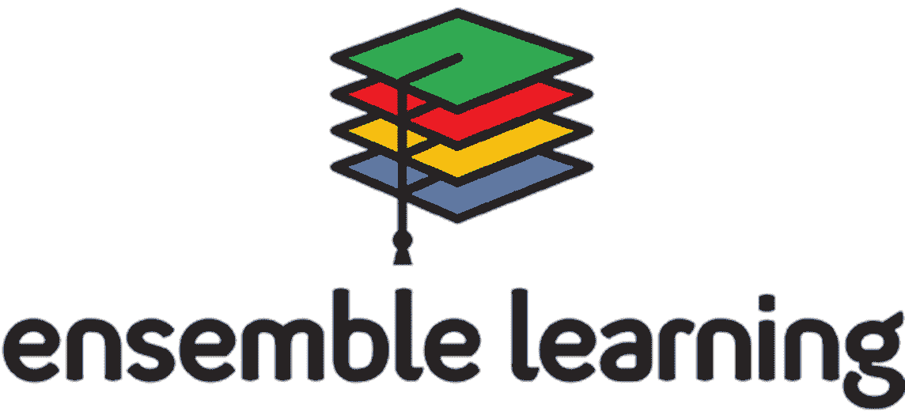
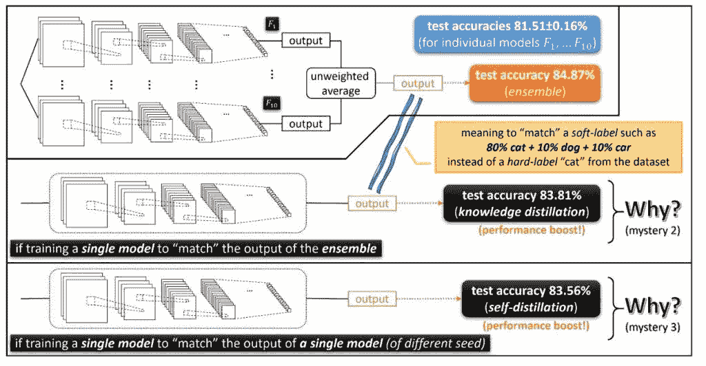
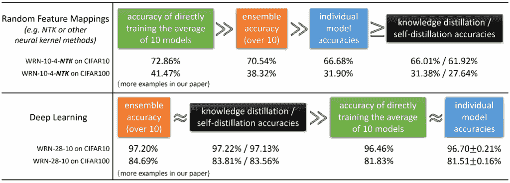

# 微软探索集成学习的三大关键谜团

> 原文：[`www.kdnuggets.com/2021/02/microsoft-explores-three-key-mysteries-ensemble-learning.html`](https://www.kdnuggets.com/2021/02/microsoft-explores-three-key-mysteries-ensemble-learning.html)

评论

来源: [`www.quora.com/What-is-ensemble-learning`](https://www.quora.com/What-is-ensemble-learning)

> * * *
> 
> ## 我们的前三个课程推荐
> ## 
>  1\. [Google 网络安全证书](https://www.kdnuggets.com/google-cybersecurity) - 快速进入网络安全职业生涯。
> 
>  2\. [Google 数据分析专业证书](https://www.kdnuggets.com/google-data-analytics) - 提升你的数据分析技能
> 
>  3\. [Google IT 支持专业证书](https://www.kdnuggets.com/google-itsupport) - 支持你的组织进行 IT 维护
> 
> * * *
> 
> 我最近启动了一个新的新闻通讯，专注于人工智能教育，**已经有超过 50,000 名订阅者**。TheSequence 是一个没有废话（即没有炒作、没有新闻等）的 AI 专注型新闻通讯，阅读时间为 5 分钟。目标是让你及时了解机器学习项目、研究论文和概念。请通过下面的订阅尝试一下：

**集成学习** 是提升深度学习模型性能的最古老且较少被理解的技术之一。集成学习的理论非常简单：独立训练的神经网络组的性能应该在长期内超越组中的最佳者。此外，我们还知道，通过一种称为**知识蒸馏**的技术，可以将模型集成的性能转移到单一模型上。集成学习的世界非常令人兴奋，只是我们还没有完全理解。最近，微软研究院发布了一篇开创性的论文，试图通过理解**该领域的三大根本谜团**来揭示集成的魔力。

微软研究院致力于理解以下两个关于集成学习的理论问题：

1.  *1)* *当我们简单地对几个独立训练的神经网络进行平均时，集成如何提升深度学习的测试性能？*

1.  *2)* *如何将如此优越的集成测试性能，通过训练单个模型以匹配集成输出在相同的训练数据集上，之后“提炼”成具有相同架构的单一神经网络？*

对这些理论问题的答案涉及到微软研究院有点戏剧性地称之为集成学习三大谜团的内容：

### 谜团 1: 集成

集成学习的第一个神秘问题与性能提升有关。*给定一组神经网络 N1, N2…NM，一个简单地对输出进行平均的集成很可能会产生显著的性能提升。然而，当训练 (N1 + N2 +…Nm)/M 时，这种性能却没有实现。令人困惑……*

来源: [`www.microsoft.com/en-us/research/blog/three-mysteries-in-deep-learning-ensemble-knowledge-distillation-and-self-distillation/`](https://www.microsoft.com/en-us/research/blog/three-mysteries-in-deep-learning-ensemble-knowledge-distillation-and-self-distillation/)

### 神秘 2: 知识蒸馏

集成模型性能高，但运行成本极高且速度慢。知识蒸馏是一种可以训练单个模型以匹配集成性能的技术。知识蒸馏方法的成功引出了集成的第二个神秘问题。*为什么匹配集成的输出会比匹配真实标签产生更好的测试准确率？*

### 神秘 3: 自我蒸馏

集成的第三个神秘问题与第二个密切相关，但更加扑朔迷离。知识蒸馏表明，一个较小的模型可以匹配较大集成的性能。一个称为自我蒸馏的现象更加令人困惑。自我蒸馏基于对单个模型进行知识蒸馏，这也能提高性能！*基本上，自我蒸馏是基于使用自身作为教师来训练相同的模型。为什么这种方法会产生性能提升仍然是一个谜。*

来源: [`www.microsoft.com/en-us/research/blog/three-mysteries-in-deep-learning-ensemble-knowledge-distillation-and-self-distillation/`](https://www.microsoft.com/en-us/research/blog/three-mysteries-in-deep-learning-ensemble-knowledge-distillation-and-self-distillation/)

### 一些答案

微软研究院进行了各种实验，以理解上述集成学习的一些神秘现象。初步工作产生了一些有趣的结果。

### 1) 深度学习集成与特征映射

最著名的集成学习形式是所谓的随机特征映射，其中模型在随机特征数量下进行训练。这种技术在线性模型中效果很好，并且被很好地理解，因此可以作为分析深度学习集成性能的基准。微软研究院的初步实验结果显示，深度学习集成的行为与特征映射非常相似。然而，知识蒸馏的效果却不完全相同。

来源: [`www.microsoft.com/en-us/research/blog/three-mysteries-in-deep-learning-ensemble-knowledge-distillation-and-self-distillation/`](https://www.microsoft.com/en-us/research/blog/three-mysteries-in-deep-learning-ensemble-knowledge-distillation-and-self-distillation/)

### 2) 多视角数据集对集成模型的有效性至关重要

微软研究的一项最具启发性的结果是基于数据的性质。多视角数据集是基于一个结构，其中数据的每个类别都有多个视角特征。例如，通过查看车灯、车轮或窗户，可以将汽车图像分类为汽车。微软研究显示，具有多视角结构的数据集更有可能提升集成模型的性能，而没有这种结构的数据集则没有相同的效果。

来源: [`www.microsoft.com/en-us/research/blog/three-mysteries-in-deep-learning-ensemble-knowledge-distillation-and-self-distillation/`](https://www.microsoft.com/en-us/research/blog/three-mysteries-in-deep-learning-ensemble-knowledge-distillation-and-self-distillation/)

微软研究院的论文是近年来深度学习集成领域最先进的工作之一。论文涵盖了许多其他发现，但这个总结应该能给你一个关于主要贡献的非常具体的概念。

[原文](https://medium.com/dataseries/microsoft-explores-three-key-mysteries-of-ensemble-learning-88dc4df831bd)。经许可转载。

**相关：**

+   XGBoost：它是什么，以及何时使用它

+   微软利用 Transformer 网络回答有关图像的问题，训练最小化

+   从头实现 AdaBoost 算法

### 更多相关话题

+   [托马斯·米勒博士探讨了西北大学的数据科学在线研究生项目](https://www.kdnuggets.com/2024/05/nwu/thomas-miller-phd-explores-northwestern-universitys-online-graduate-programs-in-data-science)

+   [带示例的集成学习](https://www.kdnuggets.com/2022/10/ensemble-learning-examples.html)

+   [集成学习技术：Python 中随机森林的详细讲解](https://www.kdnuggets.com/ensemble-learning-techniques-a-walkthrough-with-random-forests-in-python)

+   [每个数据科学家都应该知道的三种 R 库（即使你使用 Python）](https://www.kdnuggets.com/2021/12/three-r-libraries-every-data-scientist-know-even-python.html)

+   [什么时候使用集成技术是一个好的选择？](https://www.kdnuggets.com/2022/07/would-ensemble-techniques-good-choice.html)

+   [使用 Python 自动化 Microsoft Excel 和 Word](https://www.kdnuggets.com/2021/08/automate-microsoft-excel-word-python.html)
