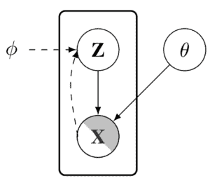
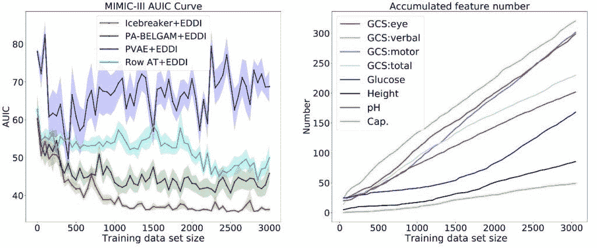

# 微软推出 Icebreaker，以应对机器学习中的著名冰启动挑战

> 原文：[`www.kdnuggets.com/2019/12/microsoft-introduces-icebreaker-ice-start-challenge-machine-learning.html`](https://www.kdnuggets.com/2019/12/microsoft-introduces-icebreaker-ice-start-challenge-machine-learning.html)

评论

训练数据的获取和标记仍然是主流机器学习解决方案面临的主要挑战之一。在机器学习研究社区内，已经出现了若干努力，例如弱监督学习或单次学习，以解决这个问题。微软研究院最近孵化了一个名为 Minimum Data AI 的团队，致力于开发无需大量训练数据集即可运行的机器学习模型的不同解决方案。最近，[该团队发布了一篇论文，揭示了 Icebreaker](https://papers.nips.cc/paper/9621-icebreaker-element-wise-efficient-information-acquisition-with-a-bayesian-deep-latent-gaussian-model)，这是一个“明智的训练数据获取”框架，允许部署能够在少量或没有训练数据的情况下运行的机器学习模型。

当前机器学习研究和技术的演变优先考虑了监督模型，这些模型需要在生成任何相关知识之前对世界有相当多的了解。在现实世界中，高质量训练数据集的获取和维护相当具有挑战性，有时甚至是不可能的。在机器学习理论中，我们将这种困境称为冰（冷）启动问题。

### 了解你不知道的：机器学习中的冰启动挑战

冰启动问题/困境指的是使机器学习模型有效所需的训练数据量。从技术上讲，大多数机器学习代理需要从大量训练数据集开始，并在随后的训练过程中定期减少其规模，直到模型达到所需的准确度水平。冰启动挑战指的是模型在没有训练数据集的情况下有效运行的能力。

解决冰启动问题的办法可以用流行的短语“知道你不知道什么”来描述。在生活中的许多情况下，理解当前上下文中的缺失知识被证明与现有知识同样重要或更为重要。统计学爱好者常常引用二战的一个著名轶事来说明这一困境。

第二次世界大战期间，五角大楼召集了国家最著名的数学家团队，以开发能够协助盟军的统计模型。人才真是惊人。后来将创立哈佛统计系的弗雷德里克·莫斯特勒也在其中。决策理论的先驱、后来的贝叶斯统计大力倡导者莱昂纳德·吉米·萨维奇也在其中。麻省理工学院的数学家、控制论创始人诺伯特·维纳以及未来诺贝尔经济学奖得主米尔顿·弗里德曼也是小组成员之一。小组的第一个任务之一是估算应为美国飞机增加多少额外的保护，以便在与德国空军的战斗中幸存下来。作为优秀的统计学家，该小组收集了返回基地的飞机所遭受的损伤数据。

对于每架飞机，数学家们计算了不同部位（如门、机翼、引擎等）的弹孔数量。随后，小组提出了关于哪些区域需要额外保护的建议。不出所料，大多数建议集中在弹孔较多的区域，假设这些区域是德国飞机攻击的重点。然而，小组中有一个例外，一位名叫[亚伯拉罕·瓦尔德](https://en.wikipedia.org/wiki/Abraham_Wald?source=post_page---------------------------)的年轻统计学家建议将额外的保护集中在未显示任何损伤的区域。为什么？非常简单，这位年轻的数学家认为，输入数据集（飞机）只包括那些在与德国人作战中幸存下来的飞机。虽然这些飞机的损伤很严重，但并不足以使它们无法返回基地。因此，他得出结论，未返回的飞机可能在其他区域受到了影响。非常聪明，对吧？

本课教会我们的一个重要观点是，在给定的背景中，理解缺失的数据与理解现有数据同样重要。将这一点推广到机器学习模型中，*解决冰山问题的关键在于拥有一个可扩展的模型，该模型知道自己不知道什么，即量化认知不确定性。这些知识可以用于指导训练数据的获取。从直观上讲，不熟悉但信息量大的特征对模型训练更为有用。*

### 冰山问题

Microsoft Icebreaker 是一种新颖的解决方案，用于应对冰启动挑战的一部分。从概念上讲，Icebreaker 依赖于深度生成模型，减少训练机器学习模型所需的数据量和成本。从架构的角度来看，Icebreaker 采用了两个组件。第一个组件是深度生成模型（PA-BELGAM），如上图的上半部分所示，它具有一种新颖的推理算法，可以明确量化认识上的不确定性。第二个组件是一组新的逐元素训练数据选择目标，用于数据采集，如下图所示。

Icebreaker 的核心是 PA-BELGAM 模型。该模型基于一种变分自编码器版本，能够处理缺失的元素和解码器权重。与使用标准深度神经网络作为解码器以将数据从潜在表示映射出来不同，Icebreaker 使用贝叶斯神经网络，并在解码器权重上设置了先验分布。

Microsoft 在不同大小的数据集上评估了 Icebreaker。该模型相比于最先进的模型表现出相关的改进，如下图所示。左侧的图表显示 Icebreaker 比几个基准模型表现更好，在训练数据较少的情况下取得了更好的测试准确率。右侧的图表显示了随着数据集总大小的增长，八个特征的数据点数量。

Microsoft Icebreaker 是一个创新的模型，可以实现低数据或无数据的机器学习模型部署。通过利用新颖的统计方法，Icebreaker 能够在不需要大型数据集的情况下选择适合给定模型的特征。[微软研究院开源了 Icebreaker 的早期版本](https://github.com/microsoft/Icebreaker)，该版本与研究论文相辅相成。

[原文](https://towardsdatascience.com/microsoft-introduces-icebreaker-to-address-the-famous-ice-start-challenges-in-machine-learning-10ee0363ede3)。经许可转载。

**相关：**

+   用户生成数据标记的崛起

+   这个微软神经网络可以用最少的训练回答关于风景图片的问题

+   Facebook 静悄悄地开源了一些令人惊叹的 PyTorch 深度学习能力

* * *

## 我们的前三大课程推荐

 1\. [谷歌网络安全证书](https://www.kdnuggets.com/google-cybersecurity) - 快速进入网络安全职业生涯。

 2\. [Google 数据分析专业证书](https://www.kdnuggets.com/google-data-analytics) - 提升你的数据分析技能

 3\. [Google IT 支持专业证书](https://www.kdnuggets.com/google-itsupport) - 支持你的组织 IT 需求

* * *

### 更多相关话题

+   [如何使用 Python 跟踪 IP 地址的位置](https://www.kdnuggets.com/2023/01/track-location-ip-address-python.html)

+   [为什么单独使用 LLM 无法满足你公司的预测需求](https://www.kdnuggets.com/2024/01/pecan-llms-used-alone-cant-address-companys-predictive-needs)

+   [数据治理能解决 AI 疲劳吗？](https://www.kdnuggets.com/can-data-governance-address-ai-fatigue)

+   [社区感知测量创新挑战](https://www.kdnuggets.com/2023/05/nij-innovations-measuring-community-perceptions-challenge.html)

+   [LSTM 再度崛起：扩展 LSTM 模型挑战 Transformer 的优势…](https://www.kdnuggets.com/lstms-rise-again-extended-lstm-models-challenge-the-transformer-superiority)

+   [使用 Python 自动化 Microsoft Excel 和 Word](https://www.kdnuggets.com/2021/08/automate-microsoft-excel-word-python.html)
