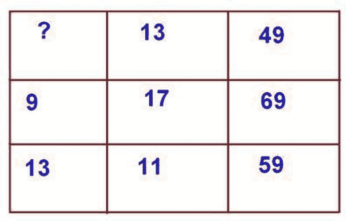
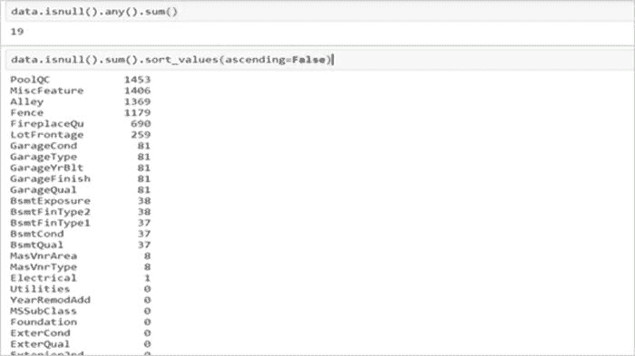
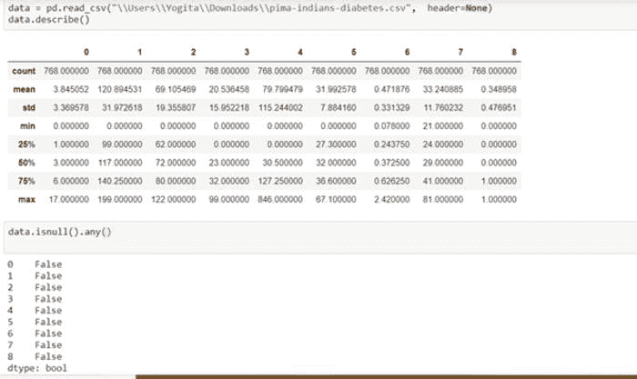
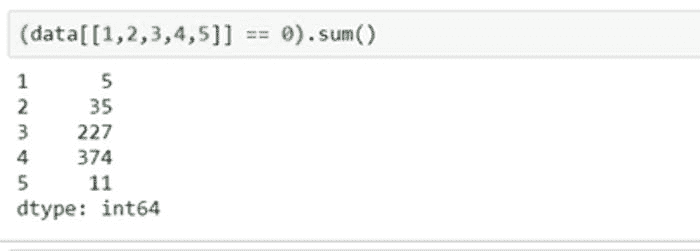

# 如何处理数据集中的缺失值

> 原文：[`www.kdnuggets.com/2020/06/missing-values-dataset.html`](https://www.kdnuggets.com/2020/06/missing-values-dataset.html)

评论

**作者 [Yogita Kinha](http://www.linkedin.com/in/yogita-kinha)，顾问和博客作者**

* * *

## 我们的前 3 个课程推荐

 1\. [谷歌网络安全证书](https://www.kdnuggets.com/google-cybersecurity) - 快速进入网络安全职业生涯。

 2\. [谷歌数据分析专业证书](https://www.kdnuggets.com/google-data-analytics) - 提升你的数据分析技能

 3\. [谷歌 IT 支持专业证书](https://www.kdnuggets.com/google-itsupport) - 支持你的组织进行 IT 工作

* * *

在上一篇[博客](https://www.edvancer.in/data-cleaning)中，我们讨论了数据清理过程在数据科学项目中的重要性以及将原始数据集转换为可用形式的方法。在这里，我们将一步一步讲解如何识别和处理数据中的缺失值。

现实世界的数据中肯定会有缺失值。这可能是由于数据输入错误或数据收集问题等多种原因。无论原因是什么，处理缺失数据是重要的，因为任何基于具有非随机缺失值的数据集的统计结果可能会有偏差。此外，许多机器学习算法不支持缺失值的数据。

### **如何识别缺失值？**

我们可以使用 pandas 函数检查数据集中的空值，如下所示：

但是，有时识别缺失值可能并不那么简单。需要使用领域知识并查看数据描述来理解变量。例如，在下面的数据集中，isnull() 不显示任何空值。

在这个例子中，有些列的最小值为零。在某些列中，零值没有意义，并表示无效或缺失的值。

经过仔细分析特征，发现以下列具有无效的零最小值：

1.  血浆葡萄糖浓度

1.  舒张血压

1.  三头肌皮肤褶皱厚度

1.  2 小时血清胰岛素

1.  体重指数

通过检查这些列中的零值数量，可以明显看出第 1、2 和 5 列有少量零值，而第 3 和 4 列有更多零值。

每列中的缺失值可能需要不同的策略。我们可以将这些零值标记为 NaN，以突出缺失值，以便进一步处理。

### **缺失数据的快速分类**

缺失数据有三种类型：

**MCAR:** 完全随机缺失。它是随机性的最高级别。这意味着任何特征中的缺失值不依赖于任何其他特征的值。这是处理缺失数据时最理想的情况。

**MAR:** 随机缺失。这意味着任何特征中的缺失值依赖于其他特征的值。

**MNAR:** 非随机缺失。非随机缺失的数据是一个更严重的问题，在这种情况下，可能需要进一步检查数据收集过程，并尝试了解信息缺失的原因。例如，如果调查中大多数人没有回答某个问题，他们为什么会这样？问题是否不清楚？

### **如何处理缺失值？**

现在我们已经识别了数据中的缺失值，接下来我们应检查缺失值的程度，以决定进一步的处理措施。

**忽略缺失值**

+   个别案例或观察中的缺失数据低于 10% 通常可以忽略，除非缺失数据是 MAR 或 MNAR。

+   完整案例的数量，即没有缺失数据的观察值，必须足够用于所选的分析技术，如果不考虑不完整的案例。

**删除缺失值**

**删除变量**

+   如果数据是 MCAR 或 MAR，并且某个特征的缺失值数量非常高，那么该特征应排除在分析之外。如果某个特征或样本的缺失数据超过 5%，则最好将该特征或样本排除在外。

+   如果案例或观察值的目标变量存在缺失值，建议删除依赖变量，以避免与独立变量之间关系的任何人为增加。

**案例删除**

在这种方法中，删除一个或多个特征存在缺失值的案例。如果存在缺失值的案例数量较少，最好将其删除。尽管这是一种简单的方法，但可能会导致样本量显著减少。此外，数据可能并不总是完全随机缺失，这可能导致参数估计的偏差。

**插补**

插补是通过一些统计方法替代缺失数据的过程。插补的好处在于它通过用基于其他可用信息的估计值替代缺失数据，从而保留所有案例。但应谨慎使用插补方法，因为大多数方法会引入大量偏差并减少数据集的方差。

**均值/众数/中位数插补**

如果某列或特征中的缺失值是数值型的，可以用该变量完整情况的均值来插补。如果特征被怀疑有异常值，均值可以用中位数替代。对于分类特征，缺失值可以用列中的众数替代。该方法的主要缺点是减少了插补变量的方差。该方法还减少了插补变量与其他变量之间的相关性，因为插补值只是估计值，不会与其他值自然相关。

**回归方法**

缺失值的变量被视为因变量，而具有完整案例的变量被作为预测变量或自变量。自变量用于拟合因变量观察值的线性方程。然后使用这个方程来预测缺失数据点的值。

该方法的缺点是，通过选择，识别出的自变量与因变量之间会有较高的相关性。这会导致对缺失值的拟合过于准确，从而减少对该值的预测不确定性。此外，这假设关系是线性的，而现实中可能并非如此。

**K-最近邻插补 (KNN)**

该方法使用 k-最近邻算法来估计并替代缺失数据。k-邻居是通过某种距离度量选择的，它们的平均值被用作插补估计。这可以用于估计定性属性（k 最近邻中的最频繁值）和定量属性（k 最近邻的均值）。

应尝试不同的 k 值以及不同的距离度量来找到最佳匹配。距离度量可以根据数据的属性进行选择。例如，如果输入变量在类型上相似（例如，所有测量的宽度和高度），则欧几里得距离是一个很好的距离度量。如果输入变量在类型上不相似（如年龄、性别、身高等），则曼哈顿距离是一个很好的度量。

使用 KNN 的优点在于它实现简单。但它受制于维度诅咒。它在变量较少时表现良好，但当变量数量较多时，计算效率变低。

**多重插补**

多重插补是一种迭代方法，其中通过使用观察数据的分布来估计缺失数据点的多个值。该方法的优点在于它反映了对真实值的不确定性，并返回无偏估计。

MI 包括以下三个基本步骤：

1.  插补：缺失的数据用估计值填补，创建一个完整的数据集。这个插补过程重复 m 次，生成 m 个数据集。

1.  分析：每个*m*完整的数据集都使用感兴趣的统计方法（例如线性回归）进行分析。

1.  汇总：从每个分析的数据集中获得的参数估计（例如系数和标准误差）然后被平均以得到一个单一的点估计。

Python 的 Scikit-learn 提供了方法——impute.SimpleImputer 用于单变量插补，impute.IterativeImputer 用于多变量插补。

R 中的 MICE 包支持多重插补功能。Python 虽然不直接支持多重插补，但可以通过在样本后验为 True 时，使用不同随机种子重复应用 IterativeImputer 来进行多重插补。

总之，处理缺失数据对于数据科学项目至关重要。然而，在处理缺失数据时，数据分布不应改变。任何缺失数据处理方法应满足以下规则：

1.  无偏估计——任何缺失数据处理方法不应改变数据分布。

1.  属性之间的关系应保留。

希望您喜欢阅读这篇博客！！

请分享您的反馈和您希望了解的话题。

**参考文献：**

+   [`machinelearningmastery.com/handle-missing-data-python/`](https://machinelearningmastery.com/handle-missing-data-python/) [`en.wikipedia.org/wiki/Imputation_(statistics)`](https://en.wikipedia.org/wiki/Imputation_(statistics)) [`stats.idre.ucla.edu/stata/seminars/mi_in_stata_pt1_new/`](https://stats.idre.ucla.edu/stata/seminars/mi_in_stata_pt1_new/)

+   [`pdfs.semanticscholar.org/e4f8/1aa5b67132ccf875cfb61946892024996413.pdf`](https://pdfs.semanticscholar.org/e4f8/1aa5b67132ccf875cfb61946892024996413.pdf)

*原文发表在*[*https://www.edvancer.in*](https://www.edvancer.in/data-cleaning-missing-values-treatment)*上，日期为 2019 年 7 月 2 日。*

**简介：[Yogita Kinha](http://www.linkedin.com/in/yogita-kinha)** 是一位熟练的专业人士，拥有 R、Python、机器学习和统计计算及图形的程序环境经验，具备 Hadoop 生态系统的实操经验，以及在软件测试领域的测试和报告经验。

[原文](https://medium.com/limitedio/how-to-deal-with-missing-values-in-your-dataset-988696b1f450)。经许可转载。

**相关内容：**

+   数据转换：标准化与归一化

+   在 Scikit-Learn 中简化混合特征类型预处理的管道

+   Scikit-learn 0.23 中的 5 个重要新特性

### 更多相关内容

+   [使用 SQL 处理时间序列中的缺失值](https://www.kdnuggets.com/2022/09/handling-missing-values-timeseries-sql.html)

+   [如何利用插值技术处理 Pandas 中的缺失数据](https://www.kdnuggets.com/how-to-deal-with-missing-data-using-interpolation-techniques-in-pandas)

+   [机器学习并不像你的大脑 第四部分：神经元的…](https://www.kdnuggets.com/2022/06/machine-learning-like-brain-part-4-neuron-limited-ability-represent-precise-values.html)

+   [使用 SHAP 值来提升机器学习模型的可解释性](https://www.kdnuggets.com/2023/08/shap-values-model-interpretability-machine-learning.html)

+   [如何处理机器学习中的分类数据](https://www.kdnuggets.com/2021/05/deal-with-categorical-data-machine-learning.html)

+   [处理机器学习中数据不足的 5 种方法](https://www.kdnuggets.com/2019/06/5-ways-lack-data-machine-learning.html)
