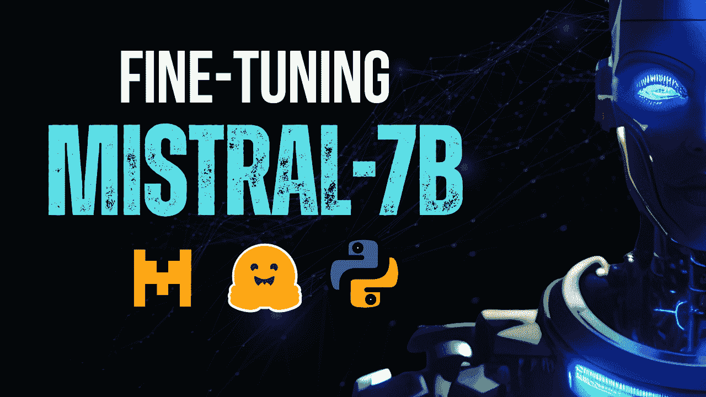
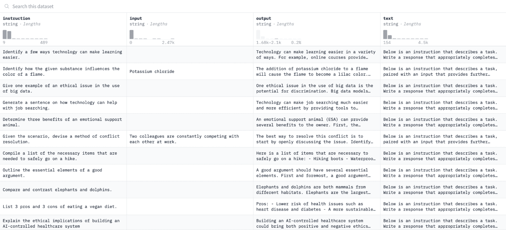
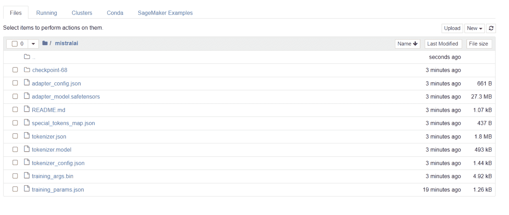

# Mistral 7B-V0.2: 用 Hugging Face 微调 Mistral 的新开源 LLM

> 原文：[`www.kdnuggets.com/mistral-7b-v02-fine-tuning-mistral-new-open-source-llm-with-hugging-face`](https://www.kdnuggets.com/mistral-7b-v02-fine-tuning-mistral-new-open-source-llm-with-hugging-face)



图片来源：作者

Mistral AI，全球领先的 AI 研究公司之一，最近发布了[**Mistral 7B v0.2**](https://anakin.ai/blog/mistral-7b-v0-2-base-model/)的基础模型。

* * *

## 我们的前三个课程推荐

 1\. [Google 网络安全证书](https://www.kdnuggets.com/google-cybersecurity) - 快速开启网络安全职业生涯。

 2\. [Google 数据分析专业证书](https://www.kdnuggets.com/google-data-analytics) - 提升你的数据分析技能

 3\. [Google IT 支持专业证书](https://www.kdnuggets.com/google-itsupport) - 支持你所在的组织的 IT

* * *

这个开源语言模型在 2024 年 3 月 23 日的公司黑客松活动中首次揭晓。

Mistral 7B 模型具有 73 亿个参数，使其极为强大。它们在几乎所有基准测试中都优于 Llama 2 13B 和 Llama 1 34B。 最新的 V0.2 模型引入了 32k 上下文窗口等改进，增强了处理和生成文本的能力。

此外，最近公布的版本是指令调优变体的基础模型，“Mistral-7B-Instruct-V0.2”，该版本早在去年发布。

在本教程中，我将展示如何在 Hugging Face 上访问和微调这个语言模型。

# 理解 Hugging Face 的 AutoTrain 功能

我们将使用 Hugging Face 的 AutoTrain 功能对 Mistral 7B-v0.2 基础模型进行微调。

[Hugging Face](https://huggingface.co/) 以使机器学习模型的使用变得更加民主化而闻名，让普通用户能够开发先进的 AI 解决方案。

AutoTrain 是 Hugging Face 的一项功能，它自动化了模型训练过程，使其变得易于访问和高效。

它帮助用户选择最佳参数和训练技术进行模型微调，这一任务通常令人畏惧且耗时。

# 用 AutoTrain 微调 Mistral-7B 模型

以下是微调你的 Mistral-7B 模型的 5 个步骤：

## 1\. 设置环境

你必须首先创建一个 Hugging Face 帐户，然后创建一个模型库。

为了实现这一点，只需按照此[链接](https://huggingface.co/docs/hub/en/repositories-getting-started)中提供的步骤操作，然后返回本教程。

我们将在 Python 中训练模型。选择一个笔记本环境进行训练时，你可以使用 [Kaggle Notebooks](https://www.kaggle.com/docs/notebooks) 或 [Google Colab](https://colab.google/)，这两者都提供免费的 GPU 访问。

如果训练过程花费的时间过长，你可能需要切换到像 AWS Sagemaker 或 Azure ML 这样的云平台。

最后，在开始跟随本教程编写代码之前，请执行以下 pip 安装：

```py
!pip install -U autotrain-advanced
!pip install datasets transformers
```

## 2\. 准备你的数据集

在本教程中，我们将使用 Hugging Face 上的 [Alpaca 数据集](https://huggingface.co/datasets/tatsu-lab/alpaca/viewer/default/train?p=520)，其样例如下：



我们将对模型进行微调，使用指令和输出对，并在评估过程中评估其对给定指令的响应能力。

要访问和准备此数据集，请运行以下代码行：

```py
import pandas as pd
from datasets import load_dataset

# Load and preprocess dataset
def preprocess_dataset(dataset_name, split_ratio='train[:10%]', input_col='input', output_col='output'):
   dataset = load_dataset(dataset_name, split=split_ratio)
   df = pd.DataFrame(dataset)
   chat_df = df[df[input_col] == ''].reset_index(drop=True)
   return chat_df

# Formatting according to AutoTrain requirements
def format_interaction(row):
   formatted_text = f"[Begin] {row['instruction']} [End] {row['output']} [Close]"
   return formatted_text

# Process and save the dataset
if __name__ == "__main__":
   dataset_name = "tatsu-lab/alpaca"
   processed_data = preprocess_dataset(dataset_name)
   processed_data['formatted_text'] = processed_data.apply(format_interaction, axis=1)

   save_path = 'formatted_data/training_dataset'
   os.makedirs(save_path, exist_ok=True)
   file_path = os.path.join(save_path, 'formatted_train.csv')
   processed_data[['formatted_text']].to_csv(file_path, index=False)
   print("Dataset formatted and saved.")
```

第一个函数将使用“datasets”库加载 Alpaca 数据集，并对其进行清理，以确保不包含任何空指令。第二个函数将你的数据结构化为 AutoTrain 可以理解的格式。

在运行上述代码后，数据集将被加载、格式化并保存在指定路径。当你打开格式化后的数据集时，你应该会看到一个标记为“formatted_text”的单列。

## 3\. 设置你的训练环境

现在你已经成功准备了数据集，我们来设置你的模型训练环境。

为此，你必须定义以下参数：

```py
project_name = 'mistralai'
model_name = 'alpindale/Mistral-7B-v0.2-hf'
push_to_hub = True
hf_token = 'your_token_here'
repo_id = 'your_repo_here.'
```

下面是上述规格的详细说明：

+   你可以指定任何 *project_name*。这将是你所有项目和训练文件存储的地方。

+   *model_name* 参数是你希望微调的模型。在这种情况下，我指定了 Hugging Face 上的 **Mistral-7B v0.2 基础模型** 的路径。

+   *hf_token* 变量必须设置为你的 Hugging Face 令牌，该令牌可以通过访问 [此链接](https://huggingface.co/settings/tokens) 获得。

+   你的 *repo_id* 必须设置为你在本教程第一步中创建的 Hugging Face 模型库。例如，我的仓库 ID 是 *NatasshaS/Model2*。

## 4\. 配置模型参数

在微调我们的模型之前，我们必须定义训练参数，这些参数控制模型行为的各个方面，如训练时长和正则化。

这些参数影响关键方面，比如模型训练的时间长度、如何从数据中学习，以及如何避免过拟合。

你可以为你的模型设置以下参数：

```py
use_fp16 = True
use_peft = True
use_int4 = True
learning_rate = 1e-4
num_epochs = 3
batch_size = 4 
block_size = 512 
warmup_ratio = 0.05
weight_decay = 0.005
lora_r = 8
lora_alpha = 16
lora_dropout = 0.01
```

## 5\. 设置环境变量

现在我们通过设置一些环境变量来准备我们的训练环境。

这一步骤确保 AutoTrain 功能使用期望的设置来微调模型，例如我们的项目名称和训练偏好：

```py
os.environ["PROJECT_NAME"] = project_name
os.environ["MODEL_NAME"] = model_name
os.environ["LEARNING_RATE"] = str(learning_rate)
os.environ["NUM_EPOCHS"] = str(num_epochs)
os.environ["BATCH_SIZE"] = str(batch_size)
os.environ["BLOCK_SIZE"] = str(block_size)
os.environ["WARMUP_RATIO"] = str(warmup_ratio)
os.environ["WEIGHT_DECAY"] = str(weight_decay)
os.environ["USE_FP16"] = str(use_fp16)
os.environ["LORA_R"] = str(lora_r)
os.environ["LORA_ALPHA"] = str(lora_alpha)
os.environ["LORA_DROPOUT"] = str(lora_dropout)
```

## 6\. 启动模型训练

最后，让我们使用*autotrain*命令开始训练模型。此步骤包括指定你的模型、数据集和训练配置，如下所示：

```py
!autotrain llm \
 --train \
 --model "${MODEL_NAME}" \
 --project-name "${PROJECT_NAME}" \
 --data-path "formatted_data/training_dataset/" \
 --text-column "formatted_text" \
 --lr "${LEARNING_RATE}" \
 --batch-size "${BATCH_SIZE}" \
 --epochs "${NUM_EPOCHS}" \
 --block-size "${BLOCK_SIZE}" \
 --warmup-ratio "${WARMUP_RATIO}" \
 --lora-r "${LORA_R}" \
 --lora-alpha "${LORA_ALPHA}" \
 --lora-dropout "${LORA_DROPOUT}" \
 --weight-decay "${WEIGHT_DECAY}" \
 $( [[ "$USE_FP16" == "True" ]] && echo "--mixed-precision fp16" ) \
 $( [[ "$USE_PEFT" == "True" ]] && echo "--use-peft" ) \
 $( [[ "$USE_INT4" == "True" ]] && echo "--quantization int4" ) \
 $( [[ "$PUSH_TO_HUB" == "True" ]] && echo "--push-to-hub --token ${HF_TOKEN} --repo-id ${REPO_ID}" )
```

确保将*data-path*更改为你的训练数据集所在的位置。

## 7\. 评估模型

一旦你的模型完成训练，你应该会在你的目录中看到一个与项目名称相同的文件夹出现。

对我来说，这个文件夹被命名为“*mistralai，”* 如下图所示：



在这个文件夹中，你可以找到包含模型权重、超参数和架构细节的文件。

现在我们来检查这个微调后的模型是否能够准确回答数据集中的问题。为此，我们首先需要运行以下代码行，从数据集中生成 5 个样本输入和输出：

```py
# Print out 5 sample inputs and outputs from our dataset
for i, example in enumerate(dataset):
   if i >= 5: 
       break
   print(f"Instruction: {example['instruction']}")
   print(f"Output: {example['output']}\n---")
```

你应该看到一个类似于以下内容的响应，展示了 5 个样本数据点：

```py
Instruction: Give three tips for staying healthy.
Output: 1.Eat a balanced diet and make sure to include plenty of fruits and vegetables.
2\. Exercise regularly to keep your body active and strong.
3\. Get enough sleep and maintain a consistent sleep schedule.
---
Instruction: What are the three primary colors?
Output: The three primary colors are red, blue, and yellow.
---
Instruction: Describe the structure of an atom.
Output: An atom is made up of a nucleus, which contains protons and neutrons, surrounded by electrons that travel in orbits around the nucleus. The protons and neutrons have a positive charge, while the electrons have a negative charge, resulting in an overall neutral atom. The number of each particle determines the atomic number and the type of atom.
---
Instruction: How can we reduce air pollution?
Output: There are a number of ways to reduce air pollution, such as shifting to renewable energy sources, encouraging the use of public transportation, prohibiting the burning of fossil fuels, implementing policies to reduce emissions from industrial sources, and implementing vehicle emissions standards. Additionally, individuals can do their part to reduce air pollution by reducing car use, avoiding burning materials such as wood, and changing to energy efficient appliances.
---
Instruction: Describe a time when you had to make a difficult decision.
Output: I had to make a difficult decision when I was working as a project manager at a construction company. I was in charge of a project that needed to be completed by a certain date in order to meet the client's expectations. However, due to unexpected delays, we were not able to meet the deadline and so I had to make a difficult decision. I decided to extend the deadline, but I had to stretch the team's resources even further and increase the budget. Although it was a risky decision, I ultimately decided to go ahead with it to ensure that the project was completed on time and that the client's expectations were met. The project was eventually successfully completed and this was seen as a testament to my leadership and decision-making abilities.
```

我们将把上述指令之一输入到模型中，检查它是否生成准确的输出。以下是一个向模型提供指令并从中获取响应的函数：

```py
# Function to provide an instruction
def ask(model, tokenizer, question, max_length=128):
   inputs = tokenizer.encode(question, return_tensors='pt')
   outputs = model.generate(inputs, max_length=max_length, num_return_sequences=1)
   answer = tokenizer.decode(outputs[0], skip_special_tokens=True)
   return answer
```

最后，按照下面的显示，输入一个问题到这个函数中：

```py
question = "Describe a time when you had to make a difficult decision."
answer = ask(model, tokenizer, question)
print(answer)
```

你的模型应生成与训练数据集中相应输出完全一致的响应，如下所示：

```py
Describe a time when you had to make a difficult decision.

What did you do? How did it turn out?

[/INST] I remember a time when I had to make a difficult decision about
my career. I had been working in the same job for several years and had
grown tired of it. I knew that I needed to make a change, but I was unsure of what to do. I weighed my options carefully and eventually decided to take a leap of faith and start my own business. It was a risky move, but it paid off in the end. I am now the owner of a successful business and
```

请注意，由于我们指定的令牌数量，响应可能看起来不完整或被截断。请随意调整“max_length”值，以允许更长的响应。

# 微调 Mistral-7B V0.2 - 下一步

如果你已经走到这一步，恭喜你！

你已经成功微调了一个最先进的语言模型，利用了 Mistral 7B v-0.2 的强大功能以及 Hugging Face 的能力。

但旅程并不会就此结束。

作为下一步，我建议尝试不同的数据集或调整某些训练参数以优化模型性能。对更大规模的模型进行微调将提升其效用，因此可以尝试使用更大的数据集或不同格式的文件，如 PDF 和文本文件。

在处理组织中的真实数据时，这种经验变得极为宝贵，因为这些数据通常是混乱且无结构的。

[](https://linktr.ee/natasshaselvaraj)**[Natassha Selvaraj](https://linktr.ee/natasshaselvaraj)** 是一位自学成才的数据科学家，对写作充满热情。Natassha 写作内容涉及所有数据科学相关主题，真正是所有数据话题的专家。你可以通过[LinkedIn](https://www.linkedin.com/in/natassha-selvaraj-33430717a/)与她联系，或查看她的[YouTube 频道](https://www.youtube.com/@natassha_ds)。

### 更多相关话题

+   [如何使用 Hugging Face AutoTrain 微调 Mistral AI 7B LLM](https://www.kdnuggets.com/how-to-finetune-mistral-ai-7b-llm-with-hugging-face-autotrain)

+   [RAG 与微调：哪种工具最适合提升你的 LLM 应用？](https://www.kdnuggets.com/rag-vs-finetuning-which-is-the-best-tool-to-boost-your-llm-application)

+   [Web LLM：将 LLM 聊天机器人带到浏览器](https://www.kdnuggets.com/2023/05/webllm-bring-llm-chatbots-browser.html)

+   [十大机器学习演示：Hugging Face Spaces 版](https://www.kdnuggets.com/2022/05/top-10-machine-learning-demos-hugging-face-spaces-edition.html)

+   [一个开发 Hugging Face 以进行客户数据建模的社区](https://www.kdnuggets.com/2022/08/objectiv-community-developing-hugging-face-customer-data-modeling.html)

+   [使用 Hugging Face 和 Gradio 在 5 分钟内构建 AI 聊天机器人](https://www.kdnuggets.com/2023/06/build-ai-chatbot-5-minutes-hugging-face-gradio.html)
