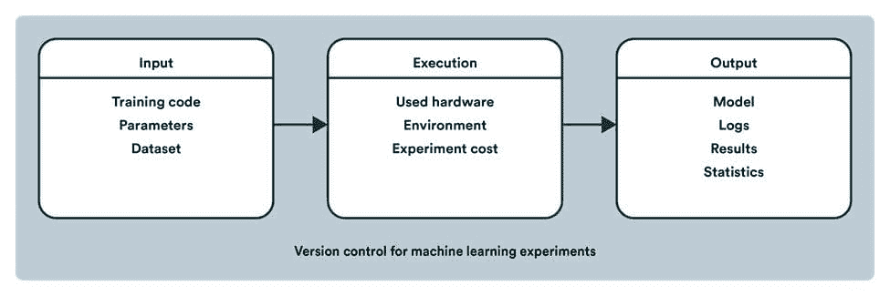
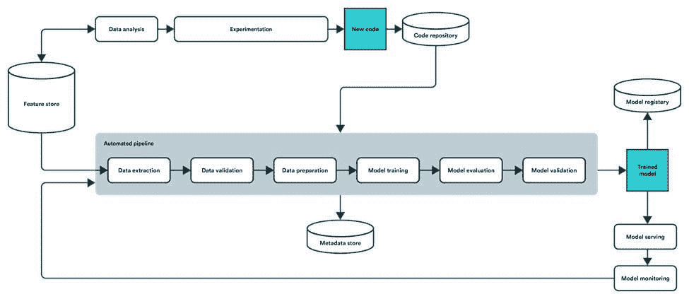

# MLOps 正在改变机器学习模型的开发方式

> 原文：[`www.kdnuggets.com/2020/12/mlops-changing-machine-learning-developed.html`](https://www.kdnuggets.com/2020/12/mlops-changing-machine-learning-developed.html)

评论

**由 [Henrik Skogstrom](https://www.linkedin.com/in/skogstrom/)，Valohai 增长负责人**。

*照片由 [Kelly Sikkema](https://unsplash.com/@kellysikkema?utm_source=unsplash&utm_medium=referral&utm_content=creditCopyText) 提供，来自 [Unsplash](https://unsplash.com/s/photos/idea?utm_source=unsplash&utm_medium=referral&utm_content=creditCopyText)。*

MLOps 指的是 [机器学习操作](https://ml-ops.org/)。它是一种旨在使生产中的机器学习变得高效且无缝的实践。尽管 MLOps 这一术语相对新兴，但它与 DevOps 有相似之处，即它不是单一的技术，而是如何以正确的方式做事的共享理解。

[MLOps 引入的共享原则](https://valohai.com/mlops/) 鼓励数据科学家将机器学习视为一个持续的过程，而不是单独的科学实验，用于开发、启动和维护现实世界中的机器学习能力。机器学习应当是协作的、可再现的、持续的，并经过测试。

MLOps 的实际实施涉及采纳某些最佳实践，并建立支持这些最佳实践的基础设施。让我们来看三种 MLOps 改变机器学习开发方式的方式：对版本控制的影响、如何建立保护措施，以及对机器学习管道的关注。

### 1. 版本控制不仅仅是代码

在组织中利用机器学习时，版本控制应是首要任务。然而，这一概念不仅仅适用于驱动模型的代码。

机器学习版本控制应涵盖训练算法时使用的代码、底层数据和参数。这个过程对于确保可扩展性和 [再现性](https://www.wired.com/story/artificial-intelligence-confronts-reproducibility-crisis/) 至关重要。

*机器学习的版本控制不仅限于传统软件中的代码。[再现性检查表](https://www.cs.mcgill.ca/~jpineau/ReproducibilityChecklist.pdf) 是 MLOps 设置应该能够记录的一个良好起点。*

首先，让我们讨论代码中的版本控制，因为大多数数据科学家对此比较熟悉。无论是用于系统集成的实现代码，还是允许您开发机器学习算法的建模代码，都应有清晰的更改文档。这一领域通常由 Git 等工具很好地覆盖。

版本控制也应该应用于用于训练模型的数据。场景和用户不断变化和适应，因此你的数据也不可能总是相同。

这种持续变化意味着我们必须不断重新训练模型，并验证它们是否仍能与新数据保持准确。因此，需要适当的版本控制以维持可复现性。

我们用来构建模型的数据不仅会不断演变，元数据也会如此。元数据指的是关于基础数据和模型训练的信息——它告诉我们模型训练过程的情况。数据是否按预期使用？模型达到了什么样的准确度？

即使基础数据没有变化，元数据也可能会发生变化。元数据需要严格的版本控制，因为你需要有一个基准，以便在之后训练模型时参考。

最后，模型本身必须有适当的版本控制。作为数据科学家，你的目标是不断提高机器学习模型的准确性和可靠性，因此，演变中的算法需要有自己的版本控制。这通常被称为模型注册。

MLOps 实践鼓励对上述所有组件进行版本控制作为标准实践，大多数 MLOps 平台使其易于实现。通过适当的版本控制，你可以确保随时可复现，这对于治理和知识共享至关重要。

### 2.   将保护措施构建到代码中

在将保护措施构建到机器学习过程时，它们应该在代码中——而不是在你的脑海中！

力求避免手动或不一致的过程。所有收集数据、数据测试和模型部署的程序都应该写入代码中——而不是过程文档——以便你可以确信模型的每次迭代都将遵循所需的标准。

例如，训练机器学习模型的方式很重要——非常重要。因此，模型训练中的任何小变化都可能导致预测结果中的问题和不一致。这种风险就是为什么将这些保护措施直接构建到代码中至关重要的原因。

*数据测试通常以临时的方式进行，但它应该是程序化的。*

应该在机器学习管道中编写代码，以保护[训练数据应该是什么样的（训练前测试）和训练后的模型应该如何表现（训练后测试）](https://www.jeremyjordan.me/testing-ml/)。这包括设置预期预测的参数——这将让你安心，确保生产模型遵循你制定的所有规则。

实施 MLOps 平台的一个好处是所有这些步骤都是自文档化和可重用的——至少在代码自文档化的程度上。保护措施可以很容易地用于其他机器学习用例，并且可以应用相同的标准，例如模型准确性。

### 3.   管道是产品——而不是模型

应该认识到的第三个 MLOps 概念是，机器学习管道是产品——而不是模型本身。这个认识通常由一个成熟度模型来表征，即组织从[手动过程过渡到自动化管道](https://cloud.google.com/solutions/machine-learning/mlops-continuous-delivery-and-automation-pipelines-in-machine-learning)。

*[机器学习管道](https://valohai.com/machine-learning-pipeline/)的最终目标是实现一个自愈的机器学习系统。*

机器学习模型对克服业务挑战和满足组织的即时需求很重要。然而，有必要[认识到模型只是暂时的，和生产它的系统不同](https://www.analyticsinsight.net/forget-the-models-you-need-a-machine-learning-pipeline/)。

支持模型的基础数据将快速变化，模型也会漂移。这意味着，最终模型将不得不被重新训练和调整，以便在新环境中提供准确的结果。

结果是，产生准确有效的机器学习模型的管道应该是数据科学家专注于创建的产品。那么，机器学习管道到底是什么？

没有 MLOps 和建立好的机器学习管道，更新模型将会非常耗时且困难。与其临时完成这些任务并只在问题出现时解决，不如建立一个管道来解决这个问题。它为模型的更新和更改提供了清晰的框架和治理。

机器学习管道包括收集和预处理数据、训练机器学习模型、将其投入生产以及不断监控，以便在准确性下降时重新触发训练。一个构建良好的管道帮助你在组织内扩展这一过程，从而最大化生产模型的使用，并确保这些能力始终保持最佳状态。

一个完善的机器学习管道还允许你对模型在业务中的实现和使用进行控制。它还改善了部门间的沟通，并使其他人能够审查管道——而不是手动工作流程——以确定是否需要进行更改。同样，它减少了生产瓶颈，使你能够充分利用你的数据科学能力。

总结来说，有三个基本的 MLOps 概念是每个人都应该理解的。

+   版本控制在整个机器学习过程中都是必要的。这不仅包括代码，还包括数据、参数和元数据。

+   应设置自动工作的保护措施——不要通过依赖手动或不一致的过程来冒险影响机器学习模型的结果。

+   最后，管道是产品，而不是机器学习模型。一个成熟的管道是支持生产 ML 长期运行的唯一方式。

**个人简介：**[亨里克·斯科格斯特罗姆](http://www.valohai.com) 领导[Valohai MLOps 平台](https://valohai.com/mlops/)的采用，并广泛撰写有关生产中机器学习最佳实践的文章。在加入 Valohai 之前，亨里克曾在 Quest Analytics 担任产品经理，致力于改善美国的医疗保健可及性。Valohai 于 2017 年推出，是 MLOps 的先驱，帮助 Twitter、LEGO 集团和 JFrog 等公司更快地将模型投入生产。

**相关内容：**

+   [MLOps – “为什么需要它？” 和 “它是什么”？](https://www.kdnuggets.com/2020/12/mlops-why-required-what-is.html)

+   [数据科学与 DevOps 的交汇：MLOps 与 Jupyter、Git 和 Kubernetes](https://www.kdnuggets.com/2020/08/data-science-meets-devops-mlops-jupyter-git-kubernetes.html)

+   [端到端机器学习平台的概览](https://www.kdnuggets.com/2020/07/tour-end-to-end-machine-learning-platforms.html)

* * *

## 我们的前三个课程推荐

 1\. [谷歌网络安全证书](https://www.kdnuggets.com/google-cybersecurity) - 快速进入网络安全职业。

 2\. [谷歌数据分析专业证书](https://www.kdnuggets.com/google-data-analytics) - 提升您的数据分析技能

 3\. [谷歌 IT 支持专业证书](https://www.kdnuggets.com/google-itsupport) - 支持您的组织的 IT

* * *

### 更多相关话题

+   [如何在不断变化的世界中成长为数据科学家](https://www.kdnuggets.com/2022/01/grow-data-scientist-everchanging-world.html)

+   [Python f-Strings 魔法：每个编码者需要知道的 5 个改变游戏规则的技巧](https://www.kdnuggets.com/python-fstrings-magic-5-gamechanging-tricks-every-coder-needs-to-know)

+   [ChatGPT 如何改变编程的面貌](https://www.kdnuggets.com/how-chatgpt-is-changing-the-face-of-programming)

+   [工作的未来：AI 如何改变职业格局](https://www.kdnuggets.com/2023/04/future-work-ai-changing-job-landscape.html)

+   [IT 员工扩充：AI 如何改变软件开发行业](https://www.kdnuggets.com/2023/05/staff-augmentation-ai-changing-software-development-industry.html)

+   [机器学习中的设计模式及其在 MLOps 中的应用](https://www.kdnuggets.com/2022/02/design-patterns-machine-learning-mlops.html)
