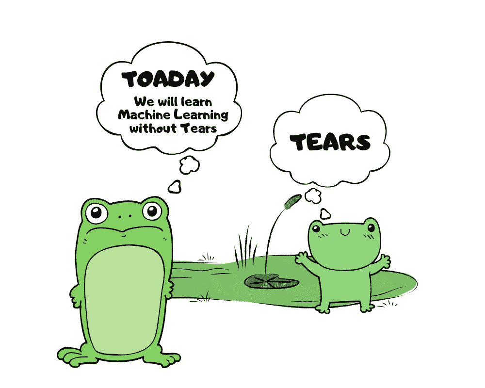
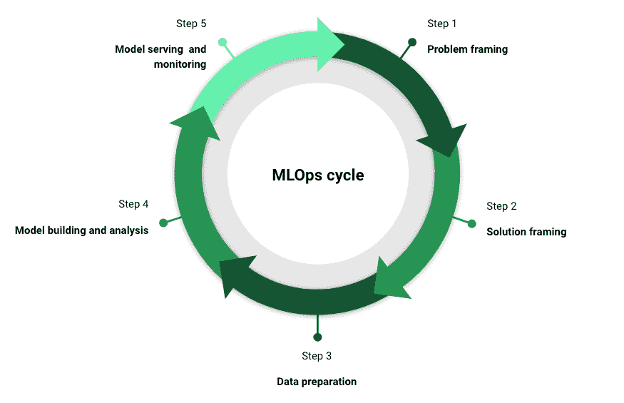

# 如何像老板一样进行 MLOps: 无泪的机器学习指南

> 原文：[`www.kdnuggets.com/2023/06/mlops-like-boss-guide-machine-learning-without-tears.html`](https://www.kdnuggets.com/2023/06/mlops-like-boss-guide-machine-learning-without-tears.html)

编辑图片

> MLOps 市场在 2019 年的估计规模为 232 亿美元，预计到 2025 年将达到 1260 亿美元，这得益于其迅速的普及。

# 介绍

许多数据科学项目无法看到光明。MLOps 是一个从数据阶段到部署阶段的过程，确保机器学习模型的成功。在这篇文章中，你将学习到 MLOps 的关键阶段（从数据科学家的角度）以及一些常见的陷阱。

# MLOps 的动机

MLOps 是一个专注于将数据科学模型运作化的实践。通常，在大多数企业中，数据科学家负责创建建模数据集、数据预处理、特征工程，最后构建模型。然后，模型被“抛”给工程团队以进行 API/端点的部署。科学和工程往往在各自的孤岛中进行，这导致了部署延迟或最坏情况下的错误部署。

MLOps 解决了 ***准确且快速*** 地 ***部署*** 企业级 ML 模型的挑战。

数据科学领域的“*说起来容易做起来难*”的对应说法可能是“*建起来容易，部署难*”。

MLOps 可以是解决企业在将机器学习模型投入生产过程中面临困难的灵丹妙药。对于我们数据科学家来说，发现 ~90% 的 ML 模型未能投入生产并不令人惊讶。MLOps 为数据科学和工程团队带来了规范和流程，以确保他们紧密且持续地合作。 ***这种合作对确保成功的模型部署至关重要。***

# MLOps 概述

对于熟悉 DevOps 的人来说，MLOps 对机器学习应用的作用类似于 DevOps 对软件应用的作用。

MLOps 根据询问对象的不同有多种形式。然而，有五个关键阶段对于成功的 MLOps 策略至关重要。附带说明的是，每个阶段中都需要一个重要的元素，那就是与利益相关者的沟通。

## 问题框架

彻底了解业务问题。这是成功部署和使用模型的关键步骤之一。在这个阶段，与所有利益相关者进行沟通，以获得项目的支持。这可能包括工程、产品、合规等。

## 解决方案框架

只有在明确了问题陈述之后，才考虑“如何”。是否需要机器学习来解决这个业务问题？起初，作为数据科学家，我建议远离机器学习可能会让人感到奇怪。这仅仅是因为*“权力越大，责任越大”*。在这种情况下，责任是确保机器学习模型被谨慎地构建、部署和监控，以确保它满足并*持续满足*业务需求。这个阶段还应与利益相关者讨论时间表和资源。

## 数据准备

一旦你决定走机器学习的路线，就开始考虑“数据”。这个阶段包括数据收集、数据清理、数据转换、特征工程和标记（对于监督学习）。这里需要记住的格言是“*垃圾进，垃圾出*”。这个步骤通常是过程中最繁琐的，也是确保模型成功的关键。确保***验证数据***和特征多次，以确保它们与业务问题对齐。记录你在创建数据集时做出的所有假设。例如：一个特征的离群值*真的*是离群值吗？

## 模型构建和分析

在这个阶段，建立并评估多个模型，选择最能解决当前问题的模型架构。选择的优化指标应反映业务需求。如今，有众多机器学习库可以加速这一过程。记得记录和跟踪你的实验，以确保你的机器学习流程的***可重复性***。

## 模型服务和监控

一旦我们从上一阶段获得了模型对象，就需要考虑如何让它对最终用户“可用”。***需要最小化响应延迟，同时最大化吞吐量。*** 服务模型的一些流行选项包括 - REST API 端点、作为云上的 Docker 容器或边缘设备上的容器。一旦我们部署了模型对象，我们还不能庆祝，因为它们本质上非常动态。例如，生产中的数据可能会漂移导致模型衰退，或者模型可能会遭受对抗性攻击。我们需要为机器学习应用程序建立一个强大的监控基础设施。这里需要监控两件事：

+   部署环境的健康状况（例如：负载、使用情况、延迟）

+   模型本身的健康状况（例如：性能指标、输出分布）。

在这个阶段，还需要确定监控过程的频率。你打算每天、每周还是每月监控你的机器学习应用程序？

**现在，你已经构建、部署并监控了一个强大的机器学习应用程序。但遗憾的是，进程不会停止，因为上述步骤需要不断迭代。**

成功数据科学项目的 MLOps 周期 | 图片由作者提供

# 金融科技案例研究

为了将上述五个阶段付诸实践，我们假设在本节中你是一个***在金融科技公司负责部署欺诈模型以检测欺诈交易的数据科学家***。

在这种情况下，从深入了解你尝试检测的欺诈类型（第一方还是第三方？）开始。如何将交易识别为欺诈或非欺诈？它们是由最终用户报告的，还是你需要使用启发式方法来识别欺诈？谁会使用这个模型？它会被实时使用还是以批处理模式使用？上述问题的答案对于解决这个业务问题至关重要。

接下来，考虑一下什么解决方案最能解决这个问题。你是否需要机器学习来处理这个问题，还是可以从一个简单的启发式方法开始解决欺诈？所有的欺诈行为是否都来自一小部分 IP 地址？

如果你决定构建一个机器学习模型（假设为监督学习），你将需要标签和特征。你将如何处理缺失的变量？那异常值呢？欺诈标签的观察窗口是多久？即用户报告欺诈交易需要多长时间？是否有数据仓库可以用来构建特征？**确保在继续之前验证数据和特征。** 这也是与利益相关者讨论项目方向的好时机。

一旦你拥有了所需的数据，构建模型并进行必要的分析。确保模型指标与业务使用对齐。（例如：这个用例可能是前十分位的召回率）。所选择的模型算法是否满足延迟要求？

最后，与工程团队协调，部署和服务模型。由于欺诈检测是一个非常动态的环境，欺诈者努力超越系统，监控非常关键。对数据和模型有监控计划。像 PSI（人口稳定性指数）这样的措施常用于跟踪数据漂移。你将多久重新训练一次模型？

*现在，你可以通过机器学习成功地减少欺诈交易，从而创造业务价值（如有需要！）。*

# 结论

希望在阅读完这篇文章后，你能看到在你的公司实施 MLOps 的好处。总结来说，MLOps 确保数据科学团队：

+   *解决*正确的业务问题

+   *使用*正确的工具来解决问题

+   *利用*代表问题的数据集

+   *构建*最优的机器学习模型

+   最后，*部署和监控*模型以确保**持续**成功

然而，要注意常见的陷阱，以确保你的数据科学项目不会成为数据科学墓地中的一块墓碑！ 应记住，数据科学应用是一个活的、呼吸的事物。 数据和模型需要持续监控。 AI 治理应从一开始就考虑，而不是事后的想法。

牢记这些原则，我相信你可以利用机器学习真正创造商业价值（如果需要的话！）。

## MLOps 参考文献

+   [面向生产的机器学习工程（MLOps）](https://www.coursera.org/specializations/machine-learning-engineering-for-production-mlops)

+   [MLOps 的温和介绍](https://towardsdatascience.com/a-gentle-introduction-to-mlops-7d64a3e890ff)

+   [数据科学家的 MLOps 实践](https://towardsdatascience.com/mlops-practices-for-data-scientists-dbb01be45dd8)

+   [MLOps：即将崛起的明星](https://towardsdatascience.com/mlops-the-upcoming-shining-star-dcf9444c493)

**[Natesh Babu Arunachalam](https://www.linkedin.com/in/nateshbabu/)** 是 Mastercard 的数据科学领导者，目前专注于使用开放银行数据构建创新的 AI 应用程序。

* * *

## 我们的前三个课程推荐

 1\. [谷歌网络安全证书](https://www.kdnuggets.com/google-cybersecurity) - 快速进入网络安全职业生涯。

 2\. [谷歌数据分析专业证书](https://www.kdnuggets.com/google-data-analytics) - 提升你的数据分析技能

 3\. [谷歌 IT 支持专业证书](https://www.kdnuggets.com/google-itsupport) - 支持你的组织的 IT 需求。

* * *

### 了解更多关于这个话题的信息

+   [如何在没有工作经验的情况下获得你的第一份数据科学工作](https://www.kdnuggets.com/2021/02/first-job-data-science-without-work-experience.html)

+   [在不标记的情况下在图像中找到图片](https://www.kdnuggets.com/2022/09/find-picture-image-without-marking.html)

+   [不使用复杂正则表达式语法的 Python 字符串匹配](https://www.kdnuggets.com/2023/02/python-string-matching-without-complex-regex-syntax.html)

+   [像专业人士一样测试：Python Mock 库的逐步指南](https://www.kdnuggets.com/testing-like-a-pro-a-step-by-step-guide-to-pythons-mock-library)

+   [机器学习不像你的大脑 第一部分：神经元很慢，…](https://www.kdnuggets.com/2022/04/machine-learning-like-brain-part-one-neurons-slow-slow-slow.html)

+   [机器学习不像你的大脑 第二部分：感知机与神经元](https://www.kdnuggets.com/2022/05/machine-learning-like-brain-part-two-perceptrons-neurons.html)
