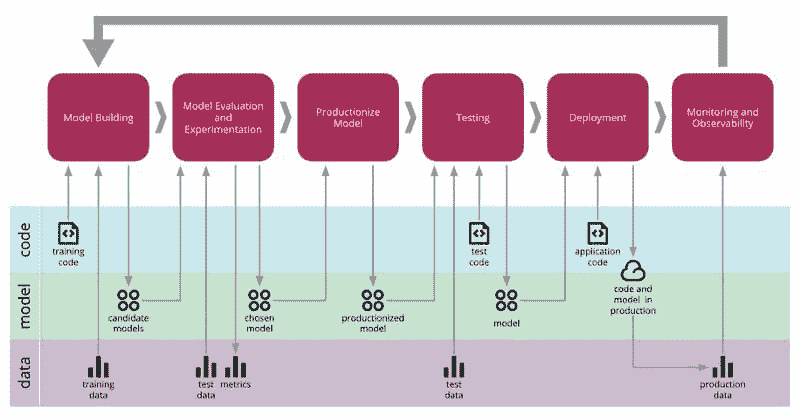
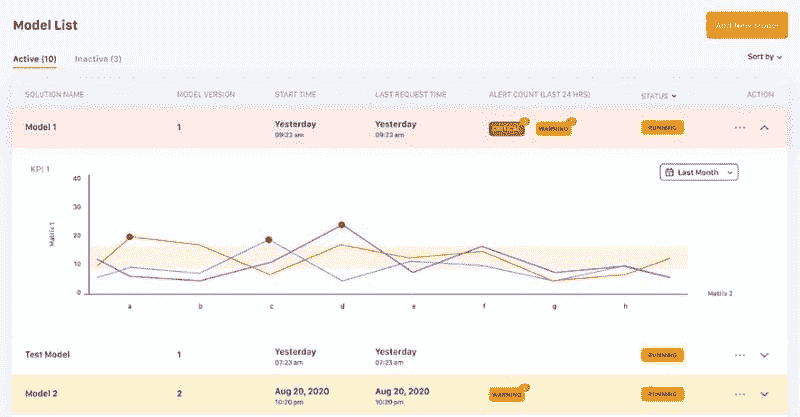
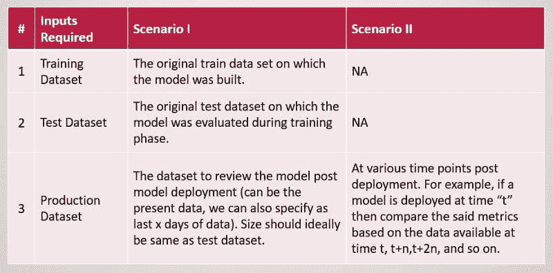
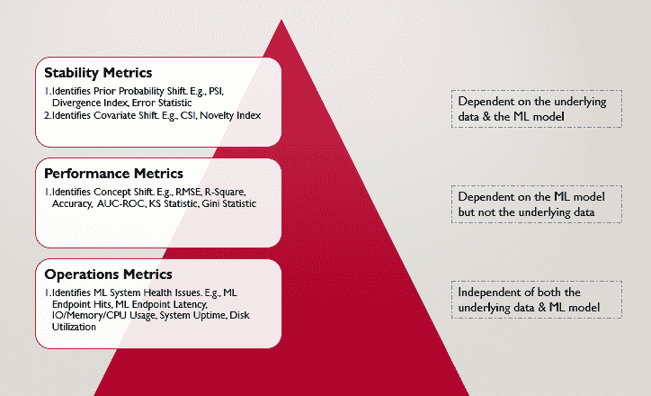

# MLOps：模型监控 101

> 原文：[`www.kdnuggets.com/2021/01/mlops-model-monitoring-101.html`](https://www.kdnuggets.com/2021/01/mlops-model-monitoring-101.html)

评论

**作者 [Pronojit Saha](https://www.linkedin.com/in/pronojitsaha/) 和 [Dr. Arnab Bose](https://www.linkedin.com/in/arnab-bose-phd-6369531/)，Abzooba**

*图 1：机器学习工作流（图片来源于 [martinfowler.com](https://martinfowler.com/articles/cd4ml.html)，2019）*

* * *

## 我们的前三个课程推荐

 1\. [Google 网络安全证书](https://www.kdnuggets.com/google-cybersecurity) - 快速进入网络安全职业道路。

 2\. [Google 数据分析专业证书](https://www.kdnuggets.com/google-data-analytics) - 提升你的数据分析技能

 3\. [Google IT 支持专业证书](https://www.kdnuggets.com/google-itsupport) - 支持你的组织的 IT 需求

* * *

### **背景**

机器学习模型正在驱动一些对企业至关重要的决策。因此，这些模型在部署到生产环境中后，必须确保它们在最新数据的背景下仍然具有相关性。如果数据发生偏差，例如生产中的数据分布可能与训练时的数据不同，模型可能会失去上下文。此外，生产数据中的某个特征可能变得不可用，或者模型可能不再相关，因为现实世界环境可能发生了变化（例如 Covid19），或者更简单地说，用户行为可能发生了变化。因此，监控模型行为的变化以及推理中使用的最新数据的特征至关重要。这确保了模型在训练阶段承诺的性能保持相关和/或真实。

如下图 2 所示，这是一个模型监控框架的实例。其目标是跟踪模型在各种指标上的表现，详细内容将在接下来的部分中讨论。但首先，让我们理解模型监控框架的动机。

*图 2：模型监控框架示意图（图片由作者提供）*

### **动机**

反馈循环在生活和商业的各个方面都扮演着重要角色。反馈循环很简单易懂：你生产一些东西，测量生产信息，并利用这些信息来改善生产。这是一个持续的监控和改进的循环。任何具有可测量信息和改进空间的事物都可以纳入反馈循环，机器学习模型自然也能从中受益。

一个典型的机器学习工作流包括数据摄取、预处理、模型构建与评估，最后是部署。然而，这个过程缺少一个关键方面，即反馈。因此，“模型监控”框架的主要动机是创建一个在部署后返回模型构建阶段的**重要反馈循环**（如图 1 所示）。这有助于机器学习模型不断自我改进，通过**决定是更新模型还是继续使用现有模型**。为了做出这个决定，框架应该在下面描述的两种可能场景下跟踪和报告各种模型指标（详情见“指标”部分）。

1.  **场景 I：** 训练数据可用，框架在训练数据和生产（推理）数据上计算所述模型指标，并进行比较以做出决定。

1.  **场景 II：** 训练数据不可用，框架仅基于部署后可用的数据计算所述模型指标。

下表列出了模型监控框架在两种场景下生成所述指标所需的输入。

根据适用的场景，下一节中突出显示的指标被计算出来，以决定生产中的模型是否需要更新或其他干预。

### **指标**

如下图 3 所示，提出了一种模型监控指标堆栈。它根据指标对数据和/或机器学习模型的依赖性定义了三种广泛的指标类型。一个理想的监控框架应包含所有三个类别中的一到两个指标，但如果存在权衡，则可以从基础开始构建，即从操作指标开始，然后随着模型的成熟逐步增加。此外，操作指标应实时监控，或至少每天监控，而稳定性和性能指标可以在每周或更长时间框架内进行监控，具体取决于领域和业务场景。

*图 3：模型监控指标堆栈（作者提供）*

**1\. 稳定性指标** — 这些指标帮助我们捕捉两种类型的数据分布变化：

a) **先验概率变化** — 捕捉**预测输出和/或因变量**在训练数据和生产数据（场景 I）之间，或生产数据的不同时间段（场景 II）之间的分布变化。这些指标的示例包括人口稳定性指数（PSI）、发散指数（概念漂移）、错误统计（详细信息和定义将在本系列下一篇文章中跟进）

b) **协变量漂移** — 捕捉训练数据和生产数据（情景 I）或生产数据的不同时间段（情景 II）之间的每个**自变量**的分布漂移，如适用。这些指标的示例包括特征稳定性指数（CSI）和新颖性指数（详细信息和定义将在本系列的下一篇文章中介绍）

**2. 性能指标**— 这些指标帮助我们检测数据中的**概念漂移**，即识别自变量与因变量之间的关系是否发生了变化（例如，COVID 之后用户在节日期间的购买方式可能发生了变化）。它们通过检查现有部署模型在与训练时（情景 I）或在部署后的先前时间段（情景 II）相比时的表现好坏来实现。因此，可以决定是否重新调整部署模型。这些指标的示例包括，

a) **项目指标** 如 RMSE、R-Square 等用于回归，准确率、AUC-ROC 等用于分类。

b) **Gini 和 KS - 统计量**：衡量预测概率/类别分离程度的统计度量（仅适用于分类模型）

**3. 操作指标**— 这些指标帮助我们从使用的角度判断部署模型的表现。它们独立于模型类型、数据，并且不需要像上述两个指标那样的输入。这些指标的示例包括，

*a. 过去调用 ML API 端点的次数*

*b. 调用 ML API 端点的延迟*

*c. 预测时的 IO/内存/CPU 使用*

*d. 系统正常运行时间*

*e. 磁盘利用率*

### **结论**

在 MLOps 领域，模型监控已成为成熟 ML 系统的必备部分。实施这样的框架对于确保 ML 系统的一致性和稳健性至关重要，因为没有它，ML 系统可能会失去终端用户的“信任”，这可能是致命的。因此，在任何 ML 用例实施的整体解决方案架构中包含和规划这一点是极其重要的。

在系列博客的下一篇中，我们将详细介绍两个最重要的模型监控指标，即稳定性和性能指标，并将讨论如何利用这些指标构建我们的模型监控框架。

**参考文献**

1.  D. Sato, A. Wider, C. Windheuser, [机器学习的持续交付](https://martinfowler.com/articles/cd4ml.html#IntroductionAndDefinition) (2019), martinflower.com

1.  M. Stewart, [理解数据集漂移](https://towardsdatascience.com/understanding-dataset-shift-f2a5a262a766) (2019), towardsdatascience.com

[**Pronojit Saha**](https://www.linkedin.com/in/pronojitsaha/) 是一位 AI 从业者，拥有丰富的商业问题解决经验，擅长架构设计并构建端到端的机器学习驱动的产品和解决方案，通过领导和促进跨职能团队来实现。他目前是 Abzooba 的高级分析实践负责人，除了项目执行外，他还通过培养人才、建立思想领导力和推动可扩展的流程来领导和发展实践。Pronojit 曾在零售、医疗保健和工业 4.0 领域工作。他的专长是时间序列分析和自然语言处理，并将这些技能与其他 AI 方法应用于价格优化、再入院预测、预测性维护、基于方面的情感分析、实体识别、主题建模等用例。

[**Dr. Arnab Bose**](https://www.linkedin.com/in/arnab-bose-phd-6369531/) 是 Abzooba 的首席科学官，同时也是芝加哥大学的兼职教员，教授机器学习和预测分析、机器学习操作、时间序列分析与预测以及健康分析等课程，属于分析学硕士项目。他是具有 20 年预测分析行业经验的资深人士，喜欢利用结构化和非结构化数据来预测和影响医疗保健、零售、金融和运输领域的行为结果。他当前的关注领域包括利用机器学习进行健康风险分层和慢性疾病管理，以及机器学习模型的生产部署和监控。

**相关：**

+   MLOps – “为什么需要它？”和“它是什么”？

+   使用 MLflow 在 Databricks 上进行模型实验、跟踪和注册

+   数据科学与 Devops 相遇：使用 Jupyter、Git 和 Kubernetes 进行 MLOps

### 更多相关内容

+   [用 AI 对抗 AI：深度伪造应用的欺诈监测](https://www.kdnuggets.com/2023/05/fighting-ai-ai-fraud-monitoring-deepfake-applications.html)

+   [使用 MLOps 管理生产中的模型漂移](https://www.kdnuggets.com/2023/05/managing-model-drift-production-mlops.html)

+   [使用 Python 监控 MLOps 流水线中的模型性能](https://www.kdnuggets.com/2023/05/monitor-model-performance-mlops-pipeline-python.html)

+   [数据科学家的线性编程 101](https://www.kdnuggets.com/2023/02/linear-programming-101-data-scientists.html)

+   [LangChain 101：构建你自己的 GPT 驱动应用](https://www.kdnuggets.com/2023/04/langchain-101-build-gptpowered-applications.html)

+   [提示工程 101：掌握有效的 LLM 沟通](https://www.kdnuggets.com/prompt-engineering-101-mastering-effective-llm-communication)
