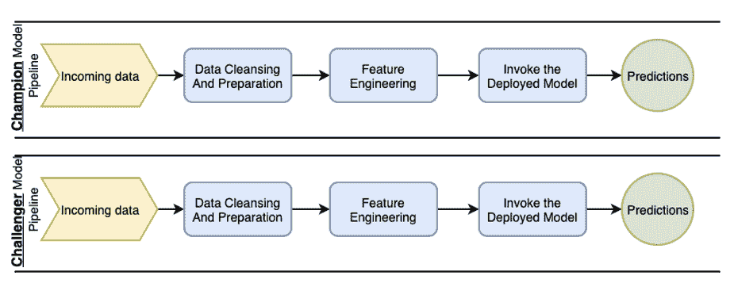
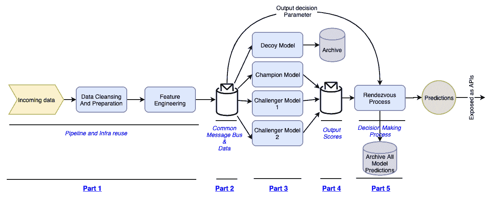

# 机器学习中的模型漂移 – 如何在大数据中处理它

> 原文：[`www.kdnuggets.com/2021/08/model-drift-machine-learning-big-data.html`](https://www.kdnuggets.com/2021/08/model-drift-machine-learning-big-data.html)

评论

**由 [Sai Geetha](https://www.saigeetha.in/about) 编写，她是大数据工程和数据科学领域的专家**。

* * *

## 我们的前 3 个课程推荐

 1\. [Google 网络安全证书](https://www.kdnuggets.com/google-cybersecurity) - 快速进入网络安全职业。

 2\. [Google 数据分析专业证书](https://www.kdnuggets.com/google-data-analytics) - 提升你的数据分析技能

 3\. [Google IT 支持专业证书](https://www.kdnuggets.com/google-itsupport) - 支持你的组织的 IT

* * *

**Ted Dunning 和 Ellen Friedman 在他们的《*机器学习物流*》一书中提出的 Rendezvous 架构** 是我在处理一个特定架构问题时找到的一个绝妙解决方案。我在寻找一种经过验证的设计模式或架构模式，帮助我以可维护和可支持的方式运行 Challenger 和 Champion 模型。在大数据世界中，rendezvous 架构显著更有用，因为你处理的是大量数据和大型数据管道。

在机器学习中，同时运行 Challenger 模型和 Champion 模型的能力是一个非常真实的需求，因为模型性能可能随着时间漂移，而你希望不断改进模型的性能，使其始终变得更好。

在我深入探讨这种架构之前，我想澄清一些我在上文中使用的术语。什么是 Champion 模型？什么是 Challenger 模型？什么是模型漂移，为什么会发生？然后，我们可以看看 rendezvous 架构本身以及它解决了哪些问题。

## 模型漂移

一旦你将模型投入生产，假设它会始终表现良好是一个错误。事实上，有人说 - "**当你把模型投入生产的那一刻起，它就开始退化**。" (*注意，ML 中的“**性能**”通常指的是统计性能——无论是准确度、精确度、召回率、敏感性、特异性还是适用于你用例的其他指标*)。

为什么会发生这种情况？模型是在一些过去的数据上训练的。它对具有相同特征的数据表现出色。然而，随着时间的推移，实际数据的特征可能不断变化，而模型对此毫无察觉。这会导致模型漂移，即模型性能退化。

例如，你训练了一个模型来检测垃圾邮件与正常邮件。模型部署后表现良好。随着时间的推移，垃圾邮件的类型不断变化，因此预测的准确性下降。这被称为**模型漂移**。

模型漂移可能是由于**概念漂移**或**数据漂移**。今天不讨论这些，了解模型性能不会保持恒定就足够了。因此，我们需要持续监控模型的性能。通常情况下，最好是更频繁地用更新的数据重新训练模型，或者根据性能下降的阈值进行训练。

有时，即使重新训练模型也不能进一步提高性能。这意味着你可能需要理解问题特征的变化，并用更合适的模型经历整个数据分析、特征创建和模型构建过程。

如果你可以使用挑战者模型，即使我们当前有一个模型在生产中，这个周期可以缩短。这是一个机器学习的持续改进过程，并且是非常必要的。

## 冠军-挑战者模型

通常，生产中的模型称为**冠军**模型。任何在较小试验中表现良好并准备投入生产的其他模型称为**挑战者**模型。这些挑战者模型被提出是因为我们假设它们有可能比冠军模型表现更好。但是我们如何证明这一点呢？

冠军模型通常会在所有输入数据上运行以提供预测。然而，挑战者模型在什么数据上运行呢？

挑战者模型可以通过两种方式进行测试。理想情况下，是在所有数据上与冠军模型并行运行挑战者模型，并比较结果。这将真正证明挑战者模型是否能够表现得更好。然而，这在大数据世界中似乎是不可行的，因此挑战者模型总是会在输入数据的一个子集上进行试验。一旦表现良好，它会逐渐推广到更多的数据上，几乎像是 alpha-beta 测试。

正如你可能知道的，在 alpha-beta 测试中，一小部分用户或输入数据（在这种情况下）会通过新的测试或挑战者流程，而其余的全部通过原始冠军流程。这种 alpha-beta 测试对某些应用程序是有效的，但在机器学习的世界中并不特别令人印象深刻。你无法在相同的数据上比较模型，因此很难自信地说哪个模型在所有数据上更好。一旦推广到所有数据上，可能会出现意外情况，模型漂移可能会比预期更早发生。

一个典型的 alpha-beta 流程如下：

数据根据某些标准（如产品类别）在两个管道之间分配。随着对 Challenger 模型性能的信心增加，这种数据分配会不断增加，逐渐倾向于 Challenger。

从数据科学家的角度来看，这并不理想。理想的是能够与 Champion 模型并行运行**所有数据**的 Challenger 模型。正如我之前所说，这非常昂贵。

考虑最坏的情况。如果你希望它们并行运行，你必须设置两个数据管道，这两个管道独立地运行所有步骤。

它可能看起来是这样的：

这具有巨大的工程意义，因此也会影响市场时间。随着时间推移，这种成本可能变得非常高。

主要影响之一是不断重复建立这些管道所需的时间和精力，而不确定 Challenger 模型是否会按预期表现。CI/CD 过程、部署、监控、认证机制等，都是需要考虑的一部分。此外，另一个成本是必须双倍配置的基础设施。

如果这些管道是大数据管道，这一点就更为重要。很快，你会意识到这不是一个可扩展的模型。我们确实需要看看如何摆脱并行管道，甚至摆脱 alpha-beta 测试方法。

作为推论，最佳情况是能够重复使用大量的数据管道。这个想法是最小化开发和重新部署到生产环境中的工作量。这也将确保基础设施使用的优化。这是一种思考如何优化的方式。

更理想的是能够直接**插入 Challenger 模型，**其余的管道就像什么都没有改变一样运行。难道这不是很棒吗？这正是**Rendezvous 架构**所实现的。

## Rendezvous 架构

书中所描述的 Rendezvous 架构倾向于处理小规模数据的 ML。我已经对其进行了调整，以满足大数据世界及相关管道的需求，如下图所示：*(书籍和另一篇文章的引用见参考部分)*

现在让我逐部分解释这个架构。

**第一部分：**

这包括接收传入数据、清洗数据、准备数据和创建所需特征的标准数据管道。每个要部署的模型应该只有一个管道。准备好的数据应该保持一个标准接口，该接口具有该领域可能需要的所有特征，而与手头的模型无关。(*我理解这并非总是可能，可能需要随着时间的推移进行逐步调整。但我们可以在需要时单独处理这一部分。*)

**第二部分：**

这是一个类似 Kafka 的消息基础设施，通过引入异步性发挥作用。作为特征准备好的数据会被发布到消息总线上。现在，每个模型都监听这个消息总线并触发自身，用准备好的数据执行。这个消息总线使得这里的即插即用架构成为可能。

**第三部分：**

这是所有模型逐一部署的部分。可以部署一个新的 Challenger 模型并使其监听消息总线，随着数据流入，它可以执行。可以在这里部署任意数量的模型，而不仅仅是一个 Challenger 模型！此外，基础设施要求仅仅是额外模型的运行。无论是预模型管道还是后模型管道都不需要单独开发或部署。

如图所示，只要数据科学家认为这些 Challenger 模型足够成熟以便与真实数据进行测试，就可以有多个 Challenger 模型。

还有一个特殊的模型叫做诱饵模型。为了确保每个模型过程不被持久化负担所困扰，准备好的数据还会被所谓的**诱饵模型**读取，该模型的唯一任务是读取准备好的数据并进行持久化。这有助于审计目的、追踪和调试。

**第四部分：**

所有这些模型再次将它们的预测或分数输出到另一个消息总线上，从而避免了彼此之间的依赖。此外，这在确保模型的可插拔性而不干扰管道中的其他部分方面也发挥了重要作用。

从那里，Rendezvous 过程会获取分数并决定需要做什么，如第五部分所述。

**第五部分：**

这里引入了**Rendezvous 过程**的新概念，它有两个重要的子过程。一个即时子过程负责从接收到的众多分数中为消费者提供正确的输出，另一个过程则是将所有模型的输出持久化，以便进行进一步的比较和分析。

所以，我们在这里实现了两件事：

1.  最佳输出提供给消费者。

1.  所有数据都经过了所有模型，因此它们在相似情况下的性能是完全可比的。

它如何决定发送哪个模型的输出？这可以基于多个标准，比如数据的一个子集应始终来自 Challenger，另一个子集应始终来自 Champion。这几乎像是实现 alpha-beta 测试。然而，优势在于，尽管对消费者来说这听起来像是 alpha-beta 测试，但对于数据科学家而言，所有数据都经过了两个模型，因此他们可以比较两个输出，了解哪个表现更好。

另一种标准可能是输出应基于模型性能。在这种情况下，汇合过程会等待所有模型完成并发布到消息总线。然后，它会寻找最佳性能指标，并将其作为结果发送出去。

是的，另一个标准可以是时间或延迟。如果我们需要在例如 5 秒内获得结果，过程会等待模型返回的所有结果，最多 5 秒，只比较这些结果，并返回最佳数据。即使另一个模型在第 6 秒返回，可能表现更好，但也会被忽略，因为它不符合延迟标准。

但这个过程如何知道遵循哪些标准来处理哪些数据或模型呢？这可以作为第二部分输入数据的一部分传入消息总线。请注意，汇合过程也在监听这些消息，并了解如何处理与输入对应的输出。也可能有其他聪明的方式，但这是提出的其中一种方法。

## 结论

通过引入异步性和消息总线，引入了一种解耦的层次，带来了将模型插入到原本僵化的数据管道中的能力。

通过引入汇合过程，选择不同模型输出、持久化这些输出、比较它们的能力都被引入了。因此，现在引入或支持任何数量的新模型来处理相同的数据集似乎不再是艰巨的任务。

**总结**

汇合架构在各个层面提供了极大的灵活性。

1.  可以使用多种标准来决定从预测过程中发送什么评分、输出或预测。这些标准可能基于延迟、模型性能或简单的时间。

1.  它提供了通过汇合过程动态定义和更改这些标准的能力。你可以通过在这里引入规则引擎将其提升到另一个层次。

1.  它提供了使所有数据通过所有管道或仅选择一个子集通过多个管道的能力。例如，如果你有需要预测的杂货和一般商品，杂货可以通过它们自己的冠军和挑战者模型，而一般商品，通常是销售较慢的，可以有自己的管道。

1.  它还提供了同时运行多个模型的能力，而不需要重新开发或重新部署大部分的大数据管道。除了节省工作量和时间外，还优化了基础设施成本。

### 参考文献

1.  [机器学习物流](https://learning.oreilly.com/library/view/machine-learning-logistics/9781491997628/) by Ted Dunning; Ellen Friedman - 第三章“机器学习的汇合架构”

1.  一篇来自 [towardsdatascience.com](http://towardsdatascience.com/) 的文章，标题为"[生产中的数据科学约会架构](https://towardsdatascience.com/rendezvous-architecture-for-data-science-in-production-79c4d48f12b)"，作者：Jan Teichmann

[原文](https://www.saigeetha.in/post/machine-learning-rendezvous-architecture)。经授权转载。

**简介：** [Sai Geetha](https://www.linkedin.com/in/saigeethamn/) ([@saigeethamn](https://twitter.com/saigeethamn)) 是一名建筑师，具有制定战略路线图和基于企业需求及领先技术进行创新的经验。她是一位大数据专家，具备数据科学知识，能够弥合这两个领域之间的差距，并为您企业中的任何大型数据项目带来成功。

**相关：**

+   [告别大数据，迎接海量数据！](https://www.kdnuggets.com/2020/10/sqream-massive-data.html)

+   [模型重训练的终极指南](https://www.kdnuggets.com/2019/12/ultimate-guide-model-retraining.html)

+   [人工智能和大数据的隐秘风险](https://www.kdnuggets.com/2019/09/risk-ai-big-data.html)

### 更多相关内容

+   [使用 Eurybia 检测数据漂移以确保生产机器学习模型质量](https://www.kdnuggets.com/2022/07/detecting-data-drift-ensuring-production-ml-model-quality-eurybia.html)

+   [使用 MLOps 管理生产中的模型漂移](https://www.kdnuggets.com/2023/05/managing-model-drift-production-mlops.html)

+   [KDnuggets 新闻，8 月 31 日：完整的数据科学学习路线图…](https://www.kdnuggets.com/2022/n35.html)

+   [处理不平衡数据的 7 种技术](https://www.kdnuggets.com/2017/06/7-techniques-handle-imbalanced-data.html)

+   [如何使用 Scikit-learn 的 Imputer 模块处理缺失数据](https://www.kdnuggets.com/how-to-handle-missing-data-with-scikit-learns-imputer-module)

+   [在 NumPy 中使用掩码数组处理缺失数据](https://www.kdnuggets.com/masked-arrays-in-numpy-to-handle-missing-data)
