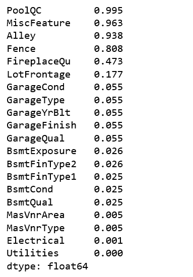
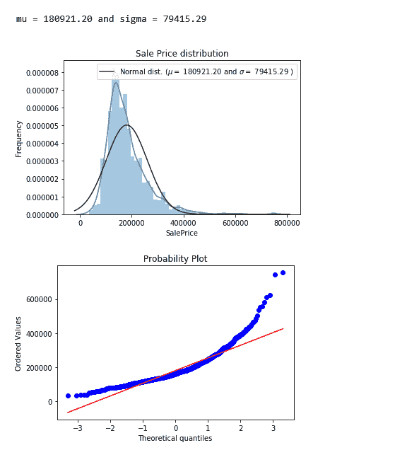
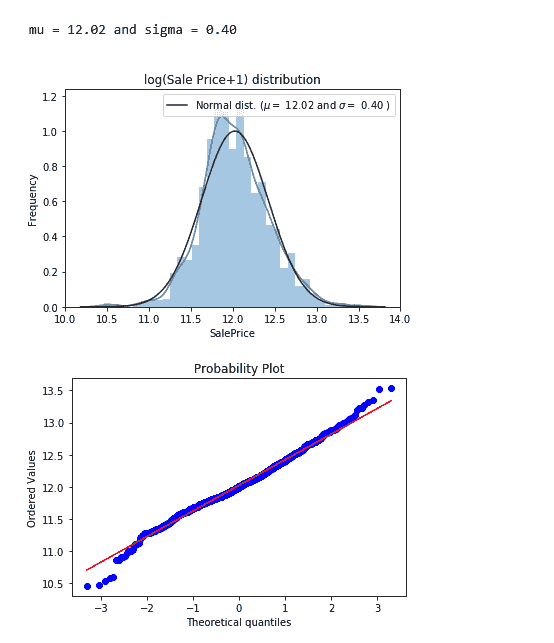
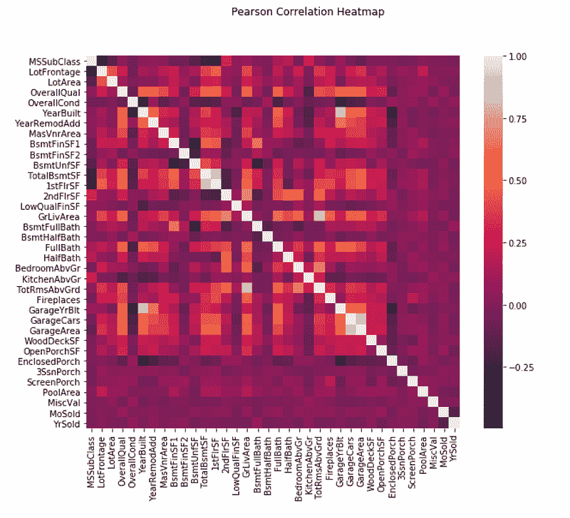
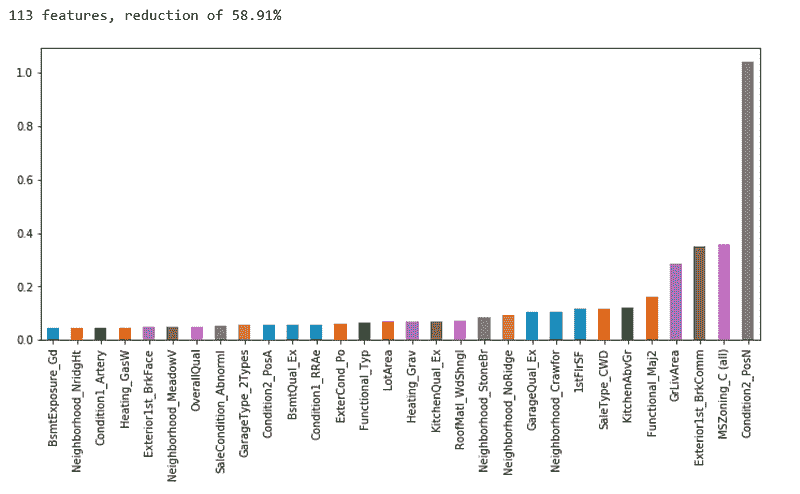
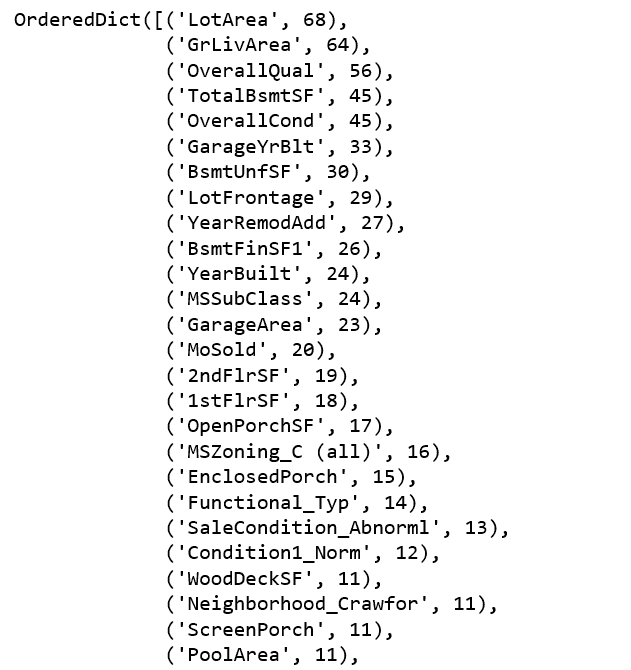

# 使用正则化线性模型和 XGBoost 建模价格

> 原文：[`www.kdnuggets.com/2019/05/modeling-price-regularized-linear-model-xgboost.html`](https://www.kdnuggets.com/2019/05/modeling-price-regularized-linear-model-xgboost.html)

 评论

**由 [Susan Li](https://www.linkedin.com/in/susanli/)，高级数据科学家**

我们想要对房价进行建模，我们知道价格取决于房子的地点、房子的面积、建造年份、翻修年份、卧室数量、车库数量等。因此，这些因素会影响价格的模式——优质位置通常会导致更高的价格。然而，同一区域内具有相同面积的所有房子并不具有完全相同的价格。价格的变动是噪声。我们在价格建模中的目标是建模模式并忽略噪声。相同的概念也适用于酒店房间价格建模。

* * *

## 我们的前 3 个课程推荐

 1\. [谷歌网络安全证书](https://www.kdnuggets.com/google-cybersecurity) - 快速进入网络安全职业生涯。

 2\. [谷歌数据分析专业证书](https://www.kdnuggets.com/google-data-analytics) - 提升你的数据分析技能

 3\. [谷歌 IT 支持专业证书](https://www.kdnuggets.com/google-itsupport) - 支持你的组织进行 IT 工作

* * *

因此，首先我们将对房价数据实施正则化技术。

### 数据

可以在 [这里](https://www.kaggle.com/c/house-prices-advanced-regression-techniques/data) 找到一个优秀的房价数据集。

```py
import warnings
def ignore_warn(*args, **kwargs):
    pass
warnings.warn = ignore_warn
import numpy as np 
import pandas as pd 
%matplotlib inline
import matplotlib.pyplot as plt 
import seaborn as sns
from scipy import stats
from scipy.stats import norm, skew
from sklearn import preprocessing
from sklearn.metrics import r2_score
from sklearn.metrics import mean_squared_error
from sklearn.model_selection import train_test_split
from sklearn.linear_model import ElasticNetCV, ElasticNet
from xgboost import XGBRegressor, plot_importance 
from sklearn.model_selection import RandomizedSearchCV
from sklearn.model_selection import StratifiedKFold
pd.set_option('display.float_format', lambda x: '{:.3f}'.format(x))
df = pd.read_csv('house_train.csv')
df.shape
```


图 1

```py
(df.isnull().sum() / len(df)).sort_values(ascending=False)[:20]
```



图 2

好消息是我们有很多特征可以使用（81 个），坏消息是 19 个特征有缺失值，其中 4 个特征缺失值超过 80%。对于任何特征，如果缺失 80% 的值，那么它可能并不重要，因此，我决定移除这 4 个特征。

```py
df.drop(['PoolQC', 'MiscFeature', 'Alley', 'Fence', 'Id'], axis=1, inplace=True)
```

### 探索功能

**目标特征分布**

```py
sns.distplot(df['SalePrice'] , fit=norm);

# Get the fitted parameters used by the function
(mu, sigma) = norm.fit(df['SalePrice'])
print( '\n mu = {:.2f} and sigma = {:.2f}\n'.format(mu, sigma))

# Now plot the distribution
plt.legend(['Normal dist. ($\mu=$ {:.2f} and $\sigma=$ {:.2f} )'.format(mu, sigma)],
            loc='best')
plt.ylabel('Frequency')
plt.title('Sale Price distribution')

# Get also the QQ-plot
fig = plt.figure()
res = stats.probplot(df['SalePrice'], plot=plt)
plt.show();
```



图 3

目标特征 - SalePrice 是右偏的。由于线性模型喜欢正态分布的数据，我们将对 SalePrice 进行转换，使其更接近正态分布。

```py
sns.distplot(np.log1p(df['SalePrice']) , fit=norm);

# Get the fitted parameters used by the function
(mu, sigma) = norm.fit(np.log1p(df['SalePrice']))
print( '\n mu = {:.2f} and sigma = {:.2f}\n'.format(mu, sigma))

# Now plot the distribution
plt.legend(['Normal dist. ($\mu=$ {:.2f} and $\sigma=$ {:.2f} )'.format(mu, sigma)],
            loc='best')
plt.ylabel('Frequency')
plt.title('log(Sale Price+1) distribution')

# Get also the QQ-plot
fig = plt.figure()
res = stats.probplot(np.log1p(df['SalePrice']), plot=plt)
plt.show();
```



图 4

****数值特征之间的相关性****

```py
pd.set_option('precision',2)
plt.figure(figsize=(10, 8))
sns.heatmap(df.drop(['SalePrice'],axis=1).corr(), square=True)
plt.suptitle("Pearson Correlation Heatmap")
plt.show();
```



图 5

一些特征之间存在强相关性。例如，GarageYrBlt 和 YearBuilt，TotRmsAbvGrd 和 GrLivArea，GarageArea 和 GarageCars 之间存在强相关性。它们实际上表达的东西多多少少是一样的。我将让 [***ElasticNetCV***](https://scikit-learn.org/stable/modules/generated/sklearn.linear_model.ElasticNetCV.html) 帮助减少冗余。

****SalePrice 与其他数值特征之间的相关性****

```py
corr_with_sale_price = df.corr()["SalePrice"].sort_values(ascending=False)
plt.figure(figsize=(14,6))
corr_with_sale_price.drop("SalePrice").plot.bar()
plt.show();
```


图 6

SalePrice 与 OverallQual 的相关性最大（约 0.8）。GrLivArea 的相关性超过 0.7，GarageCars 的相关性超过 0.6。让我们更详细地了解这 4 个特征。

```py
sns.pairplot(df[['SalePrice', 'OverallQual', 'GrLivArea', 'GarageCars']])
plt.show();
```


图 7

### 特征工程

+   对分布高度偏斜（偏斜度 > 0.75）的特征进行对数变换

+   哑编码分类特征

+   用列的均值填充 NaN。

+   训练集和测试集分割。

feature_engineering_price.py

### **ElasticNet**

+   **Ridge** 和 **Lasso** 回归是正则化线性回归模型。

+   **ElasticNet** 本质上是 **Lasso/Ridge** 的混合体，涉及最小化一个包含 **L1**（Lasso）和 **L2**（Ridge）范数的目标函数。

+   **ElasticNet** 在多个特征彼此相关时很有用。

+   类 **ElasticNetCV** 可以通过交叉验证设置参数 `alpha` (α) 和 `l1_ratio` (ρ)。

+   **ElasticNetCV**：通过交叉验证选择最佳模型的 **ElasticNet** 模型。

让我们看看 **ElasticNetCV** 将为我们选择什么。

ElasticNetCV.py


图 8

0 < 最优 l1_ratio < 1，表示惩罚是 L1 和 L2 的组合，即 **Lasso** 和 **Ridge** 的组合。

**模型评估**

ElasticNetCV_evaluation.py


图 9

这里的 **RMSE** 实际上是 **RMSLE**（均方根对数误差）。因为我们对实际值进行了对数变换。这里有一个 [很好的文章解释 RMSE 和 RMSLE 之间的区别](https://www.quora.com/What-is-the-difference-between-an-RMSE-and-RMSLE-logarithmic-error-and-does-a-high-RMSE-imply-low-RMSLE)。

**特征重要性**

```py
feature_importance = pd.Series(index = X_train.columns, data = np.abs(cv_model.coef_))

n_selected_features = (feature_importance>0).sum()
print('{0:d} features, reduction of {1:2.2f}%'.format(
    n_selected_features,(1-n_selected_features/len(feature_importance))*100))

feature_importance.sort_values().tail(30).plot(kind = 'bar', figsize = (12,5));
```



图 10

减少 58.91% 的特征看起来很有成效。ElasticNetCV 选择的前 4 个重要特征是 **Condition2_PosN**、**MSZoning_C(all)**、**Exterior1st_BrkComm** 和 **GrLivArea**。我们将看看这些特征与 Xgboost 选择的特征的比较。

### Xgboost

第一个 Xgboost 模型，我们从默认参数开始。

xgb_model1.py


图 11

它已经远远好于 ElasticNetCV 选择的模型！

第二个 Xgboost 模型，我们逐渐添加一些参数，以期提高模型的准确性。

xgb_model2.py


图 12

又有了改进！

第三个 Xgboost 模型中，我们加入了学习率，希望能得到更准确的模型。

xgb_model3.py


图 13

不幸的是，没有改进。我得出结论 xgb_model2 是最佳模型。

**特征重要性**

```py
from collections import OrderedDict
OrderedDict(sorted(xgb_model2.get_booster().get_fscore().items(), key=lambda t: t[1], reverse=True))
```



图 14

Xgboost 选出的前 4 个最重要特征是**LotArea**、**GrLivArea**、**OverallQual**和**TotalBsmtSF**。

只有一个特征**GrLivArea**被 ElasticNetCV 和 Xgboost 都选中了。

现在我们将选择一些相关特征，再次拟合 Xgboost。

xgb_model5.py


图 15

又有了小改进！

[Jupyter notebook](https://github.com/susanli2016/Machine-Learning-with-Python/blob/master/Modeling%20House%20Price%20with%20Regularized%20Linear%20Model%20%26%20Xgboost.ipynb) 可以在[Github](https://github.com/susanli2016/Machine-Learning-with-Python/blob/master/Modeling%20House%20Price%20with%20Regularized%20Linear%20Model%20%26%20Xgboost.ipynb)上找到。祝你一周愉快！

**简介: [Susan Li](https://www.linkedin.com/in/susanli/)** 正在通过一篇文章一次性改变世界。她是位于加拿大多伦多的高级数据科学家。

[原始文章](https://towardsdatascience.com/modeling-price-with-regularized-linear-model-xgboost-55e59eae4482)。经许可转载。

**相关:**

+   [揭开 XGBoost 背后的数学](https://www.kdnuggets.com/2018/08/unveiling-mathematics-behind-xgboost.html)

+   使用 Scikit-Learn 进行多分类文本分类

+   简单神经网络和 LSTM 的时间序列预测介绍

### 更多相关内容

+   [如何加速 XGBoost 模型训练](https://www.kdnuggets.com/2021/12/speed-xgboost-model-training.html)

+   [XGBoost 的假设是什么？](https://www.kdnuggets.com/2022/08/assumptions-xgboost.html)

+   [调整 XGBoost 超参数](https://www.kdnuggets.com/2022/08/tuning-xgboost-hyperparameters.html)

+   [利用 XGBoost 进行时间序列预测](https://www.kdnuggets.com/2023/08/leveraging-xgboost-timeseries-forecasting.html)

+   [GBM 与 XGBoost 的区别是什么？](https://www.kdnuggets.com/wtf-is-the-difference-between-gbm-and-xgboost)

+   [线性回归模型选择：平衡简洁性与复杂性](https://www.kdnuggets.com/2023/02/linear-regression-model-selection-balancing-simplicity-complexity.html)
