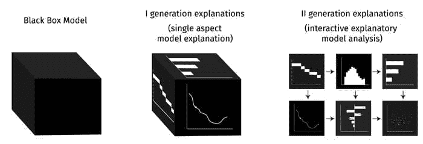
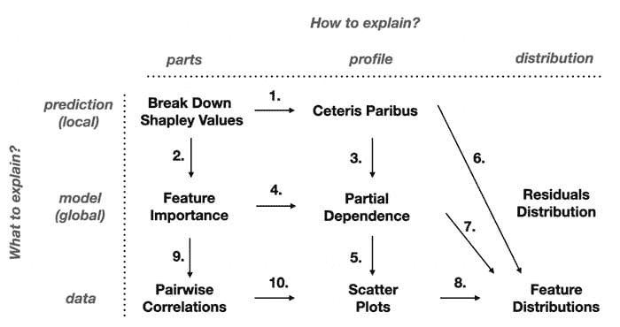
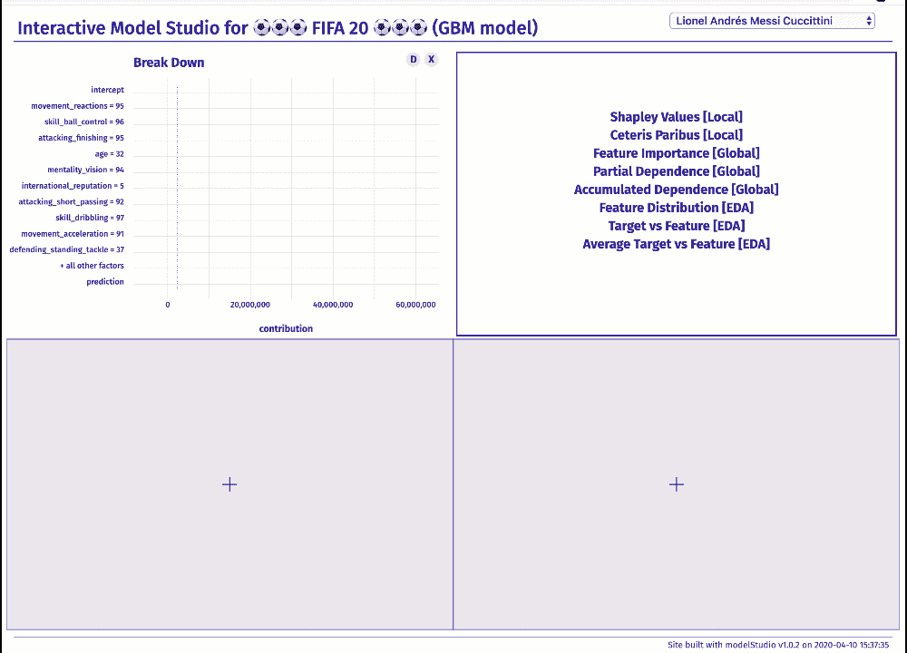

# modelStudio 和 交互式解释性模型分析的语法

> 原文：[`www.kdnuggets.com/2020/06/modelstudio-grammar-interactive-explanatory-model-analysis.html`](https://www.kdnuggets.com/2020/06/modelstudio-grammar-interactive-explanatory-model-analysis.html)

评论

**由 [Przemyslaw Biecek](https://medium.com/@ModelOriented)，Model Oriented**

新版本的 [modelStudio](https://github.com/ModelOriented/modelStudio) 最近在 CRAN 上发布。

[modelStudio](https://github.com/ModelOriented/modelStudio) 是一个 R 包，它自动化了 ML 模型的探索并允许进行互动检查。它以模型无关的方式工作，因此与大多数 ML 框架兼容（例如 [mlr/mlr3, xgboost, caret, h2o, scikit-learn, lightGBM, keras/tensorflow](https://modelstudio.drwhy.ai/articles/ms-r-python-examples.html)）。

最近，我们在 arXiv 上上传了一篇介绍该工具主要原理的文章：[交互式解释性模型分析的语法](https://arxiv.org/abs/2005.00497)。以下是一些亮点。

第一代模型解释旨在探索模型行为的个别方面。第二代模型解释则旨在将个别方面整合成一个生动且多线程的定制化故事，满足不同利益相关者的需求。

**局部和全局层级的模型解释相互补充。** 随着越来越多的声音认为单一的模型探索方法无法满足不同利益相关者的所有需求（参见例如 [Arya et al 2019](https://arxiv.org/abs/2001.09734) 或 [Sokol et al 2020](https://arxiv.org/abs/2001.09734)）。在 [这篇](https://arxiv.org/abs/2005.00497) 文章中，我们展示了如何将常见的 XAI 方法结合成更大的模块，彼此互补。这些结构可以满足更广泛的用户需求。下图展示了这种方面的并列如何从不同的角度展示模型，并帮助更好地理解模型的行为。

来源：[`www.theblindelephant.com/the_blind_elephant_fable.html`](http://www.theblindelephant.com/the_blind_elephant_fable.html)

正如盲人与大象的故事所示，我们无法仅用单一的方法解释复杂的模型，因为这种方法只能提供一种视角。

单独的解释容易导致误解，这不可避免地会导致错误的推理。如果没有多方面的互动解释，就不会有对模型的理解和信任。

互动模型解释分析的语法。它展示了模型探索的各种方法如何相互丰富。流行技术的名称列在单元格中。列和行覆盖了分类法。图中的边缘指示哪些方法可以互补。

**预测模型的解释是一个过程，而不是一张图表。** 我们还认为，每一个解释都会引发新的问题。因此，一个好的 XAI 系统应该允许对模型不同方面进行交互式探索。为了实现这一点，我们引入了解释的分类法，并提出了生成复杂模型探索过程的语法。

**modelStudio 实现了 IEMA 的原则。** [modelStudio](https://github.com/ModelOriented/modelStudio) 框架的创建旨在允许这种迭代探索，并提供快速反馈，因为模型调试通常要求高且繁琐。

基于 FIFA 数据集预测玩家价值的 gbm 模型示例探索。更多信息请访问 [`pbiecek.github.io/explainFIFA20/`](https://pbiecek.github.io/explainFIFA20/)

eXplainable 人工智能（XAI）的主题最近引起了广泛关注。然而，文献中主要集中于列出其更好采用的要求或仅解释模型单一方面的非常技术性贡献。在本文中，我们提出了**第三种方式**。首先，我们认为解释模型的单一方面是不完整的。其次，我们提出了一种解释方法的分类法，重点关注机器学习模型生命周期中不同利益相关者的需求。第三，我们描述了交互式 XAI 是一个将解释与互补模型方面的分析序列相关联的过程。

这无疑只是朝着更好地理解模型探索过程迈出的第一步。**如果你对这个过程有任何建议和意见，我们将非常乐意听取。**

感谢 Hubert Baniecki。

**个人简介： [Przemyslaw Biecek](https://medium.com/@ModelOriented)** 对预测建模中的创新非常感兴趣。涉及 eXplainable AI、IML、AutoML、AutoEDA 和基于证据的机器学习的帖子。是 r-bloggers.com 的一部分。

[原文](https://medium.com/@ModelOriented/modelstudio-and-the-grammar-of-interactive-explanatory-model-analysis-5d274ab2d822)。已获许可转载。

**相关：**

+   解释“黑箱”机器学习模型：SHAP 的实际应用

+   用于解释大数据上的预测模型的证据反事实

+   用于二元分类器的简单且可解释的性能度量

* * *

## 我们的前三大课程推荐

 1\. [谷歌网络安全证书](https://www.kdnuggets.com/google-cybersecurity) - 快速进入网络安全职业道路。

 2\. [谷歌数据分析专业证书](https://www.kdnuggets.com/google-data-analytics) - 提升您的数据分析技能

 3\. [谷歌 IT 支持专业证书](https://www.kdnuggets.com/google-itsupport) - 支持您的组织进行 IT

* * *

### 相关主题

+   [使用 Pandas 制作美丽的互动可视化的最简单方法](https://www.kdnuggets.com/2021/12/easiest-way-make-beautiful-interactive-visualizations-pandas.html)

+   [Segment Anything 模型：图像分割的基础模型](https://www.kdnuggets.com/2023/07/segment-anything-model-foundation-model-image-segmentation.html)

+   [最先进的可解释预测和即时预测](https://www.kdnuggets.com/2021/12/sota-explainable-forecasting-and-nowcasting.html)

+   [无限可能：了解 JetBlue 如何使用蒙特卡洛方法和 Snowflake…](https://www.kdnuggets.com/2022/12/monte-carlo-jetblue-snowflake-build-trust-improve-model-accuracy.html)

+   [使用精调的 SciBERT NER 模型和 Neo4j 分析科学文章](https://www.kdnuggets.com/2021/12/analyzing-scientific-articles-finetuned-scibert-ner-model-neo4j.html)

+   [线性回归模型选择：平衡简单性与复杂性](https://www.kdnuggets.com/2023/02/linear-regression-model-selection-balancing-simplicity-complexity.html)
