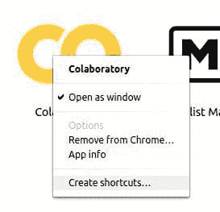

# 3 个额外的 Google Colab 环境管理技巧

> 原文：[`www.kdnuggets.com/2019/01/more-google-colab-environment-management-tips.html`](https://www.kdnuggets.com/2019/01/more-google-colab-environment-management-tips.html)

 评论

Google 的 Colab 在 2018 年初首次公开发布时受到了各种宣传。最初对它非常兴奋之后，我写了一篇简短的帖子，给新用户提供了一些提示，其中包括利用免费的 GPU 运行时、安装额外的第三方 Python 库，以及上传和使用数据文件到你的 Colab 环境。


像每一种新事物一样，Colab 的兴奋感在初期的狂热之后有所减退。然而，在重新翻阅书籍并需要一个可以在我的笔记本、工作站和 Chromebook 之间无缝访问和共享的稳定笔记本环境后，我决定再看一眼 Colab。事实证明这是一个好决定；在过去几个月里，我一直定期使用 Colab 进行*所有*与学习相关的编码。

本文是短小但希望有用的 Google Colab 环境管理技巧系列的第二篇，包括了我在管理自己的 Colab 编码环境过程中学到的另外 3 件事。我强调这是我用于*学习*的内容，没有关键任务项目，我主要使用 Colab，因为我可以在不同的机器之间无缝切换，同时仍然可以访问用于训练的 GPU（甚至 TPU）。

注意，某些这些只是普通的 Jupyter 技巧，所以别@我。

### **0\. 从浏览器中退出 Colab**

好吧，这实际上不算是 Colab 的技巧，但首先要将 Colab 从浏览器中移出。如果你像我一样，你的标签页情况不太理想。再添加 Colab 管理界面**和**一堆笔记本不会有所帮助，所以将 Colab 作为独立应用运行。这依赖于操作系统，但涉及到在你的 Chrome 浏览器中安装 Colab "应用"，并从应用上下文菜单中选择“以窗口打开”和“创建快捷方式...”，然后你需要找到该快捷方式并用它在自己的窗口中打开应用。



就这样；现在你可以从自己的图标中在独立窗口中打开 Colab，就像在帖子头图中一样。我知道，这其实不是重点，但仍然很有用。

### **1\. 将文件下载到本地计算机**

这是另一个简单的技巧，但足够重要以至于值得一提。用例：你创建了一个 Keras 模型并想要可视化该模型。你调用 `plot_model` 来创建一个 PNG 文件，但由于 Colab 虚拟机中的文件存储没有持久性，你想下载该图像。以下摘录可以完成这个操作：

```py

# plot model
plot_model(model, to_file='rnn-mnist.png', show_shapes=True)

# download model image file
from google.colab import files
files.download('rnn-mnist.png')
```

执行单元格，弹出对话框提示你选择下载位置。这将引导我们到……

### **1(b). 内联显示图像**

是的，这很基础，但我花了几次才记住我在用的基本上是一个普通的 Jupyter 环境在 Colab 中。所以，要将上述图像内联显示，使用：

```py

# display model image file inline
from IPython.display import Image, display
Image('rnn-mnist.png')
```

一个快速的直观修改将允许你像预期的那样内联各种其他文件。课程：记住你在使用的基本上是一个普通的 Jupyter notebook。好，继续讲 Colab 的内容。

### **2\. 访问你的 Google Drive 文件系统**

假设我想将那个模型图像文件保存到我的 Google Drive，而不是本地计算机。有[各种方法](https://colab.research.google.com/notebooks/io.ipynb)可以将文件进出 Google Drive。我发现这是将 CSV 数据从 Google Drive 中取出的最直接的方法。

```py

# save model image file to Google Drive
from google.colab import drive
drive.mount('/content/gdrive')
```


点击链接并输入授权代码后，你可以按照如下方式访问你的驱动器：

```py

!ls -la /content/gdrive/My\ Drive/Colab\ Notebooks/

```


当然，它不是永久性的，但也不费多少事，而且在我看来，比使用其他任何选项都更直接（并且也不那么不永久）。如果你使用像[AutoKey](https://github.com/autokey/autokey)这样的桌面自动化和文本扩展工具，那么常用的代码片段和命令会变得更加简单。

回到正题：现在你可以将文件保存到（或从）Google Drive。只要你对终端操作感到舒适，这很简单……反正你应该已经习惯了。你可以在文件所在位置处理数据文件，或者将其移动或复制到 Colab VM 根目录的上几级目录。不过，由于在丢弃实例后文件会从这里消失，我认为直接从文件系统中的 CSV 文件读取数据更有意义：

```py

# import pandas as pd
titanic_train = pd.read_csv('/content/gdrive/My Drive/Colab Notebooks/datasets/titanic/train_clean.csv')
```

### **3\. 使用存储在 Google Drive 中的自定义库和模块**

那么，如果你有自定义的 Python 库或模块想要导入到 Colab 项目中怎么办呢？

例如，我在 Colab 目录下有一个名为 'my_modules' 的文件夹，我将常用的 .py 文件存储在其中，以便在 Colab 中访问。我不想将它们存储在 GitHub 上，它们也不是我想要*整理*干净并与他人共享的文件。假设它们只是一些我自己习惯使用的辅助模块的集合，比如数据加载函数、数据清理函数等。

我将此类文件存储在一个与 Google Drive 版本同步的 Dropbox 文件夹中，这个文件夹名称相同。这样，我可以在 Colab 内部和外部都使用该文件。我可以直接在 Chrome 上访问 Google Drive 内容，也可以通过[ocamlfuse](https://github.com/astrada/google-drive-ocamlfuse)在 Ubuntu 上访问，并且可以利用上述 Google Drive 文件系统访问技巧。

这个代码片段很有用。假设我在 `my_modules` 目录下有一个名为 `naive_sharding.py` 的模块。由于它在多个目录级别下，这是我在 Colab 中将文件保持原位并导入的最简单方法：

```py

import sys
sys.path.insert(0, '/content/gdrive/My Drive/Colab Notebooks/my_modules')

import naive_sharding
```

就这样；`naive_sharding.py` 模块已经被导入，并且可以使用。

修改上述一些代码片段，你可以看到如何轻松地将模型权重进出 Colab 环境。因此，凭借上述简短的说明和发散性思维，你可以在 Google Colab 上完成相当多的工作，尽管许多反对者可能会让你相信不可能。鉴于无需设置，并且 Chromebook 访问也非常简单，我最近发现 Colab 是一个理想的编码工具。

别忘了阅读这里找到的前三个提示和技巧。

**相关内容**：

+   3 个必备的 Google Colaboratory 提示与技巧

+   数据科学笔记本使用最佳实践

+   如何在 Google Cloud 上设置免费的数据科学环境

* * *

## 我们的三大课程推荐

 1\. [Google 网络安全证书](https://www.kdnuggets.com/google-cybersecurity) - 快速进入网络安全职业生涯。

 2\. [Google 数据分析专业证书](https://www.kdnuggets.com/google-data-analytics) - 提升你的数据分析技能

 3\. [Google IT 支持专业证书](https://www.kdnuggets.com/google-itsupport) - 支持你组织的 IT

* * *

### 更多相关内容

+   [在 Google Colab 上运行 Redis](https://www.kdnuggets.com/2022/01/running-redis-google-colab.html)

+   [从 Google Colab 到 Ploomber 管道：使用 GPU 进行大规模机器学习](https://www.kdnuggets.com/2022/03/google-colab-ploomber-pipeline-ml-scale-gpus.html)

+   [在 Google Colab 上免费微调 LLAMAv2 与 QLora](https://www.kdnuggets.com/fine-tuning-llamav2-with-qlora-on-google-colab-for-free)

+   [在 Google Colab 上免费运行 Mixtral 8x7b](https://www.kdnuggets.com/running-mixtral-8x7b-on-google-colab-for-free)

+   [RAPIDS cuDF：在 Google Colab 上加速数据科学](https://www.kdnuggets.com/2023/01/rapids-cudf-accelerated-data-science-google-colab.html)

+   [将机器学习算法全面部署到…](https://www.kdnuggets.com/2021/12/deployment-machine-learning-algorithm-live-production-environment.html)
