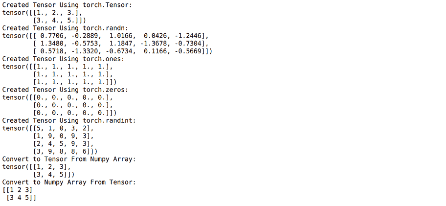
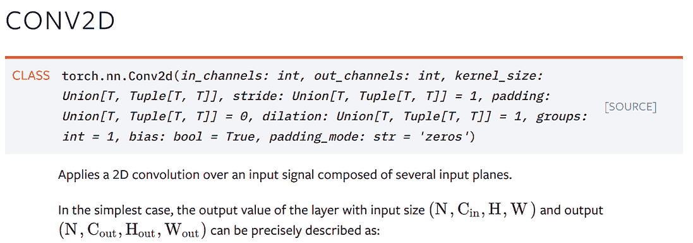
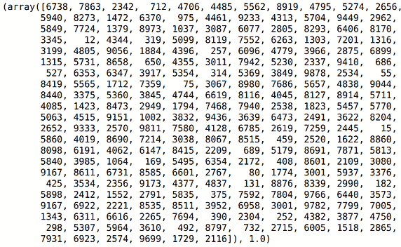
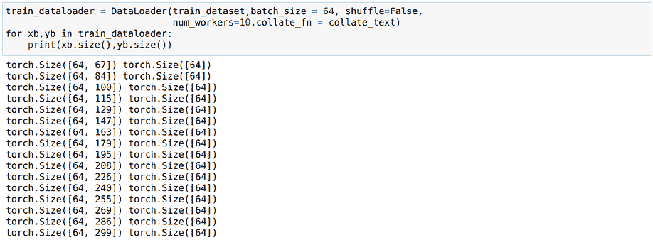
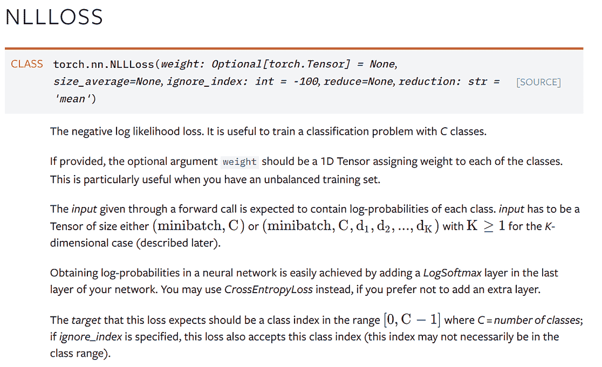
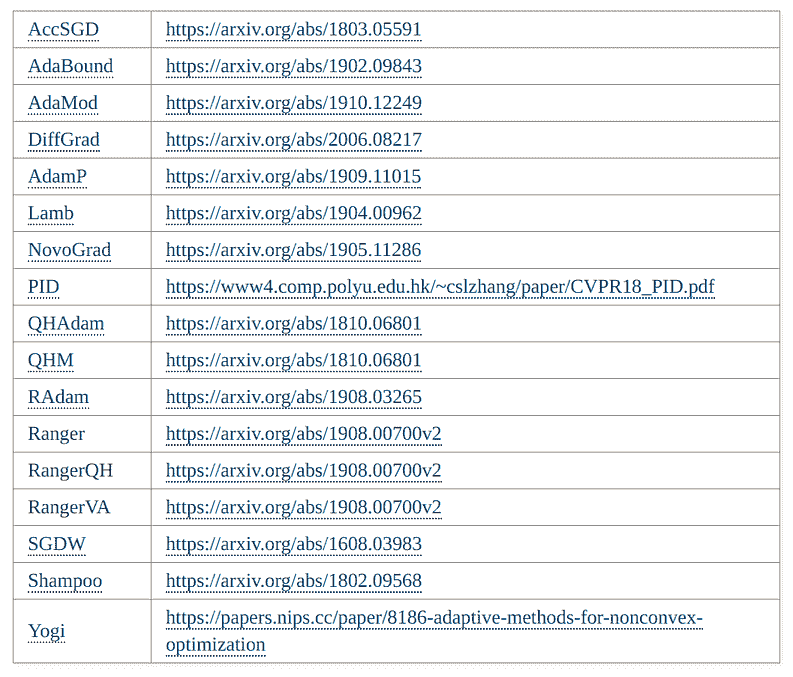

# 数据科学家的 PyTorch 最完整指南

> 原文：[`www.kdnuggets.com/2020/09/most-complete-guide-pytorch-data-scientists.html`](https://www.kdnuggets.com/2020/09/most-complete-guide-pytorch-data-scientists.html)

评论

***PyTorch*** 已经成为创建神经网络的事实标准之一，我非常喜欢它的接口。然而，对于初学者来说，掌握它还是有点困难的。

* * *

## 我们的前三名课程推荐

 1. [Google 网络安全证书](https://www.kdnuggets.com/google-cybersecurity) - 快速进入网络安全职业生涯。

 2. [Google 数据分析专业证书](https://www.kdnuggets.com/google-data-analytics) - 提升你的数据分析能力

 3. [Google IT 支持专业证书](https://www.kdnuggets.com/google-itsupport) - 支持你的组织的 IT

* * *

我记得几年前在经过一番广泛的实验之后才开始接触 PyTorch。说实话，花了我很长时间才掌握它，但我很高兴从 [Keras 转到 PyTorch](https://towardsdatascience.com/moving-from-keras-to-pytorch-f0d4fff4ce79)。*凭借其高度的自定义性和 Python 风格的语法，*PyTorch 使用起来非常愉快，我会推荐给任何想在深度学习中做些重型工作的朋友。

因此，在这本 PyTorch 指南中，***我将尝试缓解初学者在使用 PyTorch 时的一些困难***，并逐步讲解在使用 PyTorch 创建任何神经网络时所需的一些最重要的类和模块。

不过，这并不意味着这仅仅针对初学者，因为***我还将讨论*** ***PyTorch 提供的高度自定义性，并将讨论自定义层、数据集、数据加载器和损失函数***。

那么，让我们喝杯咖啡 ☕ ️ 开始吧。

### 张量

[张量](https://www.kdnuggets.com/2018/05/wtf-tensor.html) 是 PyTorch 中的基本构建块，简单来说，它们是 GPU 上的 NumPy 数组。在这一部分，我将列出一些我们在处理张量时最常用的操作。这绝不是张量操作的详尽列表，但了解张量是什么是非常有帮助的，然后再进入更激动人心的部分。

### 1. 创建张量

我们可以通过多种方式创建 PyTorch 张量。这包括从 NumPy 数组转换为张量。下面只是一些示例的小概要，你可以像在 NumPy 数组中做的那样，使用张量做很多其他事情，更多内容请参考 [这里](https://pytorch.org/docs/stable/tensors.html)。



### 2. 张量操作

再次强调，这些张量上可以执行很多操作。完整的函数列表可以在[这里](https://pytorch.org/docs/stable/torch.html?highlight=mm#math-operations)找到。


**注意：** PyTorch 变量是什么？在之前的 PyTorch 版本中，Tensor 和 Variables 是不同的，并提供不同的功能，但现在变量 API 已[弃用](https://pytorch.org/docs/stable/autograd.html#variable-deprecated)，所有变量的方法都与张量一起工作。因此，如果你不了解它们也没关系，因为它们不再需要；如果你了解它们，可以忘记它们。

### nn.Module

照片由[Fernand De Canne](https://unsplash.com/@fernanddecanne?utm_source=medium&utm_medium=referral)在[Unsplash](https://unsplash.com/?utm_source=medium&utm_medium=referral)提供

这里来到了有趣的部分，我们将讨论一些在创建深度学习项目时最常用的构造。nn.Module 允许你将深度学习模型创建为类。你可以从`nn.Module`继承，以类的形式定义任何模型。每个模型类必然包含一个`__init__`过程块和一个`forward`传递块。

+   在`__init__`部分，用户可以定义网络将要拥有的所有层，但尚未定义这些层如何相互连接。

+   在`forward`传递块中，用户定义了数据如何在网络中的一个层流向另一个层。

简单来说，我们定义的任何网络都将如下所示：

在这里，我们定义了一个非常简单的网络，它接受大小为 784 的输入，并将其按顺序通过两个线性层。但需要注意的是，在定义前向传播时，我们可以定义任何类型的计算，这使得 PyTorch 在研究中具有极高的自定义性。例如，在我们的疯狂实验模式中，我们可能会使用以下网络，其中我们任意地附加层。在这里，我们将第二个线性层的输出再返回到第一个线性层，并在将输入加到其中后（跳跃连接）再次返回（老实说，我不知道这会有什么效果）。

我们还可以检查神经网络前向传播是否有效。我通常通过首先创建一些随机输入，并将其传递到我创建的网络中来做到这一点。

```py
x = torch.randn((100,784))
model = myCrazyNeuralNet()
model(x).size()
--------------------------
torch.Size([100, 10])
```

### 关于层的说明

PyTorch 非常强大，你实际上可以使用`nn.Module`自己创建任何新的实验层。例如，与上面使用的预定义线性层`nn.Linear`相比，我们可以创建我们**自定义的线性层**。

你可以看到我们如何将权重张量包装在`nn.Parameter.`中。这是为了使张量被视为模型参数。来自 PyTorch 的[文档](https://pytorch.org/docs/stable/generated/torch.nn.parameter.Parameter.html#parameter)：

> 参数是 `[*Tensor*](https://pytorch.org/docs/stable/tensors.html#torch.Tensor)` 子类，这些子类在与 `*Module*` 一起使用时具有非常特殊的属性——当它们被分配为模块属性时，会自动添加到其参数列表中，并会出现在 `*parameters()*` 迭代器中。

正如你稍后会看到的，`model.parameters()` 迭代器将作为优化器的输入。不过，稍后会详细讲解。

现在，我们可以像使用其他层一样在任何 PyTorch 网络中使用这个自定义层。

不过，如果 Pytorch 没有提供许多常用的现成层，它也不会被如此广泛使用。这里有一些例子：`[nn.Linear](https://pytorch.org/docs/stable/generated/torch.nn.Linear.html#torch.nn.Linear)`、`[nn.Conv2d](https://pytorch.org/docs/stable/generated/torch.nn.Conv2d.html#torch.nn.Conv2d)`、`[nn.MaxPool2d](https://pytorch.org/docs/stable/generated/torch.nn.MaxPool2d.html#torch.nn.MaxPool2d)`、`[nn.ReLU](https://pytorch.org/docs/stable/generated/torch.nn.ReLU.html#torch.nn.ReLU)`、`[nn.BatchNorm2d](https://pytorch.org/docs/stable/generated/torch.nn.BatchNorm2d.html#torch.nn.BatchNorm2d)`、`[nn.Dropout](https://pytorch.org/docs/stable/generated/torch.nn.Dropout.html#torch.nn.Dropout)`、`[nn.Embedding](https://pytorch.org/docs/stable/generated/torch.nn.Embedding.html#torch.nn.Embedding)`、`[nn.GRU](https://pytorch.org/docs/stable/generated/torch.nn.GRU.html#torch.nn.GRU)/[nn.LSTM](https://pytorch.org/docs/stable/generated/torch.nn.LSTM.html#torch.nn.LSTM)`、`[nn.Softmax](https://pytorch.org/docs/stable/generated/torch.nn.Softmax.html#torch.nn.Softmax)`、`[nn.LogSoftmax](https://pytorch.org/docs/stable/generated/torch.nn.LogSoftmax.html#torch.nn.LogSoftmax)`、`[nn.MultiheadAttention](https://pytorch.org/docs/stable/generated/torch.nn.MultiheadAttention.html#torch.nn.MultiheadAttention)`、`[nn.TransformerEncoder](https://pytorch.org/docs/stable/generated/torch.nn.TransformerEncoder.html#torch.nn.TransformerEncoder)`、`[nn.TransformerDecoder](https://pytorch.org/docs/stable/generated/torch.nn.TransformerDecoder.html#torch.nn.TransformerDecoder)`

我已经链接了所有层的来源，你可以阅读所有相关内容，但为了展示我通常如何尝试理解一层并阅读文档，我将尝试查看一个非常简单的卷积层。



因此，一个 Conv2d 层需要输入一个高度为 H、宽度为 W、具有 `Cin` 通道的图像。现在，对于卷积网络中的第一层，`in_channels` 的数量将为 3（RGB），`out_channels` 的数量可以由用户定义。常用的 `kernel_size` 是 3x3，通常使用的 `stride` 是 1。

要检查我不太了解的新层，我通常会尝试查看该层的输入和输出，如下所示，其中我会先初始化该层：

```py
conv_layer = nn.Conv2d(in_channels = 3, out_channels = 64, kernel_size = (3,3), stride = 1, padding=1)
```

然后通过它传递一些随机输入。这里的 100 是批次大小。

```py
x = torch.randn((100,3,24,24))
conv_layer(x).size()
--------------------------------
torch.Size([100, 64, 24, 24])
```

所以，我们按要求从卷积操作中获得输出，并且我对如何在我设计的任何神经网络中使用这一层有足够的信息。

### 数据集和数据加载器

在训练或测试期间，我们如何将数据传递给神经网络？我们当然可以像上面那样传递张量，但 Pytorch 还提供了预构建的数据集，以便更方便地将数据传递给神经网络。你可以查看在[torchvision.datasets](https://pytorch.org/docs/stable/torchvision/datasets.html)和[torchtext.datasets](https://pytorch.org/text/datasets.html)提供的完整数据集列表。但是，为了给出一个具体的数据集示例，假设我们需要使用一个包含图像的文件夹将图像传递给图像神经网络，这些图像的结构如下：

```py
data
    train
        sailboat
        kayak
        .
        .
```

我们可以使用`torchvision.datasets.ImageFolder`数据集来获取一个示例图像，如下所示：


这个数据集有 847 张图像，我们可以使用索引来获取图像及其标签。现在我们可以通过 for 循环将图像一个一个地传递给任何图像神经网络：

```py
for i in range(0,len(train_dataset)):
    image ,label = train_dataset[i]
    pred = model(image)
```

***但这不是最优的。我们希望进行批量处理。*** 我们实际上可以编写一些代码来将图像和标签追加到一个批次中，然后将其传递给神经网络。但是 Pytorch 提供了一个实用的迭代器`torch.utils.data.DataLoader`来精确完成这项工作。现在我们可以简单地将我们的`train_dataset`包装在 Dataloader 中，这样我们将获得批次而不是单个样本。

```py
train_dataloader = **DataLoader**(train_dataset,batch_size = 64, shuffle=True, num_workers=10)
```

我们可以简单地使用批次进行迭代，如下所示：

```py
for image_batch, label_batch in train_dataloader:
    print(image_batch.size(),label_batch.size())
    break
------------------------------------------------------------------
torch.Size([64, 3, 224, 224]) torch.Size([64])
```

所以实际上，使用数据集和数据加载器的整个过程变成了：

你可以在我之前关于使用深度学习进行图像分类的博客文章中查看这个特定示例：[这里](https://towardsdatascience.com/end-to-end-pipeline-for-setting-up-multiclass-image-classification-for-data-scientists-2e051081d41c)。

这很好，Pytorch 确实提供了大量开箱即用的功能。但 Pytorch 的主要优势在于其巨大的自定义能力。如果 Pytorch 提供的数据集不符合我们的使用情况，我们还可以创建自己的自定义数据集。

### 理解自定义数据集

要编写我们的自定义数据集，我们可以利用 Pytorch 提供的抽象类`torch.utils.data.Dataset`。我们需要继承这个`Dataset`类，并定义两个方法来创建自定义数据集。

+   `__len__`：一个函数，返回数据集的大小。这个在大多数情况下都比较简单。

+   `__getitem__`：一个函数，输入一个索引`i`，并返回索引`i`处的样本。

例如，我们可以创建一个简单的自定义数据集，它从一个文件夹中返回图像和标签。请注意，大多数任务都发生在`__init__`部分，我们使用`glob.glob`来获取图像名称并进行一些常规预处理。

此外，请注意，我们在`__getitem__`方法中逐个打开图像，而不是在初始化时。这么做是因为我们不想将所有图像加载到内存中，只需加载所需的图像即可。

我们现在可以像以前一样使用这个数据集和`Dataloader`工具。它的工作原理与 PyTorch 提供的以前的数据集相同，但没有一些实用函数。

### 理解自定义 DataLoaders

**这一部分有点复杂，可以在浏览此帖时跳过，因为在很多情况下并不需要。** 但我在这里添加它以便完整。

假设你想为一个处理文本输入的网络提供批次，而该网络可以处理任意序列大小的输入，只要批次内的大小保持不变。例如，我们可以有一个 BiLSTM 网络，可以处理任何长度的序列。如果你现在还不理解其中使用的层没关系；只要知道它可以处理变长序列即可。

这个网络期望其输入形状为(`batch_size`, `seq_length`)，并且可以处理任何`seq_length`。我们可以通过将两个具有不同序列长度（10 和 25）的随机批次传递给模型来检查这一点。

```py
model = BiLSTM()
input_batch_1 = torch.randint(low = 0,high = 10000, size = (100,**10**))
input_batch_2 = torch.randint(low = 0,high = 10000, size = (100,**25**))
print(model(input_batch_1).size())
print(model(input_batch_2).size())
------------------------------------------------------------------
torch.Size([100, 1])
torch.Size([100, 1])
```

现在，我们希望将这个模型提供紧凑的批次，使得每个批次的序列长度根据批次中的最大序列长度来保持一致，以最小化填充。这还有一个附加的好处，就是使神经网络运行更快。事实上，这正是 Kaggle Quora Insincere 挑战赛获胜提交中使用的一种方法，因为运行时间至关重要。

那么，我们该怎么做呢？首先，让我们写一个非常简单的自定义数据集类。

此外，让我们生成一些随机数据，用于这个自定义数据集。

随机序列和标签的示例。序列中的每个整数对应于句子中的一个单词。

现在我们可以使用自定义数据集：

```py
train_dataset = CustomTextDataset(X,y)
```

如果我们现在尝试在这个数据集上使用`batch_size`>1 的 Dataloader，我们将遇到一个错误。这是为什么呢？

```py
train_dataloader = DataLoader(train_dataset,batch_size = 64, shuffle=False, num_workers=10)
for xb,yb in train_dataloader:
    print(xb.size(),yb.size())
```


这是因为序列长度不同，而我们的数据加载器期望所有序列具有相同的长度。请记住，在之前的图像示例中，我们使用转换将所有图像调整为 224 的大小，因此我们没有遇到这个错误。

***那么，我们该如何迭代这个数据集，以便每个批次具有相同长度的序列，但不同批次可能有不同的序列长度呢？***

我们可以在 DataLoader 中使用`collate_fn`参数，定义如何在特定批次中堆叠序列。要使用它，我们需要定义一个函数，该函数以批次为输入，并根据批次中的`max_sequence_length`返回（`x_batch`，`y_batch`）与填充后的序列长度。下面函数中使用的函数是简单的 NumPy 操作。此外，函数中有适当的注释，以便你理解发生了什么。

现在我们可以将这个`collate_fn`与我们的数据加载器一起使用：

```py
train_dataloader = DataLoader(train_dataset,batch_size = 64, shuffle=False, num_workers=10,**collate_fn** **=** **collate_text**)for xb,yb in train_dataloader:
    print(xb.size(),yb.size())
```

现在可以看到批次的序列长度不同了

由于我们提供了自定义的`collate_fn`，这次它会起作用。现在我们看到批次的序列长度不同。因此，我们可以使用可变输入大小来训练我们的 BiLSTM，正如我们希望的那样。

### 训练神经网络

我们知道如何使用`nn.Module`创建神经网络。那么如何训练它呢？任何需要训练的神经网络都会有一个训练循环，其形式如下：

在上面的代码中，我们运行了五个周期，在每个周期中：

1.  我们使用数据加载器迭代数据集。

1.  在每次迭代中，我们使用`model(x_batch)`进行前向传播。

1.  我们使用`loss_criterion`计算损失。

1.  我们使用`loss.backward()`调用反向传播损失。我们不需要担心梯度的计算，因为这个简单的调用会为我们完成所有工作。

1.  采取优化器步骤来通过`optimizer.step()`更改整个网络中的权重。这时，网络的权重会使用在`loss.backward()`调用中计算的梯度进行修改。

1.  我们通过验证数据加载器检查验证得分/指标。在进行验证之前，我们使用`model.eval()`将模型设置为评估模式。请注意，在评估模式下我们不会进行损失的反向传播。

到目前为止，我们已经讨论了如何使用`nn.Module`创建网络以及如何在 Pytorch 中使用自定义数据集和数据加载器。接下来我们来讨论损失函数和优化器的各种选项。

### 损失函数

Pytorch 为我们提供了各种[损失函数](https://pytorch.org/docs/stable/nn.html#loss-functions)，用于处理最常见的任务，如分类和回归。一些常用的例子有`[nn.CrossEntropyLoss](https://pytorch.org/docs/stable/generated/torch.nn.CrossEntropyLoss.html#torch.nn.CrossEntropyLoss)`、`[nn.NLLLoss](https://pytorch.org/docs/stable/generated/torch.nn.NLLLoss.html#torch.nn.NLLLoss)`、`[nn.KLDivLoss](https://pytorch.org/docs/stable/generated/torch.nn.KLDivLoss.html#torch.nn.KLDivLoss)`和`[nn.MSELoss](https://pytorch.org/docs/stable/generated/torch.nn.MSELoss.html#torch.nn.MSELoss)`。你可以阅读每个损失函数的文档，但为了说明如何使用这些损失函数，我将通过`[nn.NLLLoss](https://pytorch.org/docs/stable/generated/torch.nn.NLLLoss.html#torch.nn.NLLLoss)`的例子来讲解。



NLLLoss 的文档相当简洁。即，这个损失函数用于多类别分类，根据文档：

+   预期的输入需要是 (`batch_size` x `Num_Classes`) 的大小 —— 这些是我们创建的神经网络的预测结果。

+   我们需要输入中每个类别的对数概率 —— 为了从神经网络中获取对数概率，我们可以在网络的最后一层添加一个 `LogSoftmax` 层。

+   目标需要是一个类的张量，类编号在范围(0, C-1) 内，其中 C 是类别的数量。

因此，我们可以尝试在一个简单的分类网络中使用这个损失函数。请注意在最终线性层后面的 `LogSoftmax` 层。如果不想使用 `LogSoftmax` 层，你可以直接使用 `[nn.CrossEntropyLoss](https://pytorch.org/docs/stable/generated/torch.nn.CrossEntropyLoss.html#torch.nn.CrossEntropyLoss)`

让我们定义一个随机输入来测试我们的网络：

```py
# some random input:X = torch.randn(100,784)
y = torch.randint(low = 0,high = 10,size = (100,))
```

然后将其通过模型以获取预测结果：

```py
model = myClassificationNet()
preds = model(X)
```

现在我们可以得到损失值为：

```py
criterion = nn.NLLLoss()
loss = criterion(preds,y)
loss
------------------------------------------
tensor(2.4852, grad_fn=<NllLossBackward>)
```

### 自定义损失函数

定义自定义损失函数再次是件简单的事，只要你在损失函数中使用张量操作就可以了。例如，这里是 `customMseLoss`

```py
def customMseLoss(output,target):
    loss = torch.mean((output - target)**2)     
    **return** loss
```

你可以像以前一样使用这个自定义损失。但请注意，这次我们不使用 criterion 实例化损失，因为我们将其定义为一个函数。

```py
output = model(x)
loss = customMseLoss(output, target)
loss.backward()
```

如果需要，我们也可以将其编写为一个使用 `nn.Module` 的类，然后将其作为对象使用。这里是一个 NLLLoss 自定义示例：

### 优化器

一旦通过 `loss.backward()` 调用获取梯度，我们需要进行一次优化器步骤以改变整个网络中的权重。Pytorch 提供了多种现成的优化器，使用 `torch.optim` 模块。例如：`[torch.optim.Adadelta](https://pytorch.org/docs/stable/optim.html#torch.optim.Adadelta)`、`[torch.optim.Adagrad](https://pytorch.org/docs/stable/optim.html#torch.optim.Adagrad)`、`[torch.optim.RMSprop](https://pytorch.org/docs/stable/optim.html#torch.optim.RMSprop)` 和最广泛使用的 `[torch.optim.Adam](https://pytorch.org/docs/stable/optim.html#torch.optim.Adam)`。要使用 Pytorch 最常用的 Adam 优化器，我们可以简单地实例化它：

```py
optimizer **=** torch.optim.Adam(model.parameters(), lr=0.01, betas=(0.9, 0.999))
```

然后在训练模型时使用 `optimizer**.**zero_grad()` 和 `optimizer.step()`。

我没有讨论如何编写自定义优化器，因为这是一个不常见的用例，但如果你想要更多优化器，可以查看[pytorch-optimizer](https://pytorch-optimizer.readthedocs.io/en/latest/)库，它提供了许多在研究论文中使用的其他优化器。此外，如果你确实想创建自己的优化器，可以参考[PyTorch](https://github.com/pytorch/pytorch/tree/master/torch/optim)或[pytorch-optimizers](https://github.com/jettify/pytorch-optimizer/tree/master/torch_optimizer)中实现的优化器的源代码。

来自[pytorch-optimizer](https://github.com/jettify/pytorch-optimizer)库的其他优化器

### 使用 GPU/多个 GPU

到目前为止，我们所做的都是在 CPU 上。如果你想使用 GPU，可以使用`model.to('cuda')`将模型放到 GPU 上。或者，如果你想使用多个 GPU，可以使用`nn.DataParallel`。以下是一个检查机器中 GPU 数量并在需要时自动使用`DataParallel`进行并行训练的实用函数。

我们唯一需要改变的就是在训练时将数据加载到 GPU 中，如果我们有 GPU 的话。这就像在训练循环中添加几行代码一样简单。

### 结论

PyTorch 提供了极大的可定制性，且代码量很少。虽然一开始可能很难理解整个生态系统如何通过类来构建，但最终它就是简单的 Python。在这篇文章中，我尝试拆解了你使用 PyTorch 时可能需要的大部分部分，希望阅读后能让你多一些理解。

你可以在我的[GitHub](https://github.com/MLWhiz/data_science_blogs/tree/master/pytorch_guide)仓库中找到这篇文章的代码，我在这里保存了我所有博客的代码。

如果你想通过课程结构深入学习 Pytorch，可以查看 IBM 在 Coursera 上提供的[使用 PyTorch 的深度神经网络](https://www.coursera.org/learn/deep-neural-networks-with-pytorch?ranMID=40328&ranEAID=lVarvwc5BD0&ranSiteID=lVarvwc5BD0-Mh_whR0Q06RCh47zsaMVBQ&siteID=lVarvwc5BD0-Mh_whR0Q06RCh47zsaMVBQ&utm_content=2&utm_medium=partners&utm_source=linkshare&utm_campaign=lVarvwc5BD0)课程。此外，如果你想了解更多关于深度学习的内容，我推荐这个在[计算机视觉中的深度学习](https://www.coursera.org/specializations/aml?siteID=lVarvwc5BD0-AqkGMb7JzoCMW0Np1uLfCA&utm_content=2&utm_medium=partners&utm_source=linkshare&utm_campaign=lVarvwc5BD0)方面的优秀课程，它是[高级机器学习专项课程](https://www.coursera.org/specializations/aml?siteID=lVarvwc5BD0-AqkGMb7JzoCMW0Np1uLfCA&utm_content=2&utm_medium=partners&utm_source=linkshare&utm_campaign=lVarvwc5BD0)的一部分。

感谢阅读。我将来还会写更多适合初学者的文章。请关注我的 [**Medium**](https://medium.com/@rahul_agarwal?source=post_page---------------------------) 或订阅我的 [**博客**](http://eepurl.com/dbQnuX?source=post_page---------------------------) 以获取更新。像往常一样，我欢迎反馈和建设性的批评，可以通过 Twitter [**@mlwhiz**](https://twitter.com/MLWhiz?source=post_page---------------------------) 联系我。

此外，小小的免责声明——本文可能包含一些与相关资源相关的附属链接，因为分享知识从来不是坏事。

**简介：[Rahul Agarwal](https://www.linkedin.com/in/rahulagwl/)** 是 WalmartLabs 的高级统计分析师。关注他的 Twitter [@mlwhiz](https://twitter.com/MLWhiz)。

[原文](https://towardsdatascience.com/minimal-pytorch-subset-for-deep-learning-for-data-scientists-8ccbd1ccba6b)。经许可转载。

**相关内容：**

+   数据科学家的 6 条建议

+   特征提取指南

+   每个数据科学家必须知道的 5 种分类评估指标

### 更多相关内容

+   [完全免费的 PyTorch 深度学习课程](https://www.kdnuggets.com/2022/10/complete-free-pytorch-course-deep-learning.html)

+   [如何建立数据科学赋能团队：完整指南](https://www.kdnuggets.com/2022/10/build-data-science-enablement-team-complete-guide.html)

+   [Python 中的地理编码：完整指南](https://www.kdnuggets.com/2022/11/geocoding-python-complete-guide.html)

+   [决策树软件完整指南](https://www.kdnuggets.com/2022/08/complete-guide-decision-tree-software.html)

+   [使用 PyTorch 的迁移学习实用指南](https://www.kdnuggets.com/2023/06/practical-guide-transfer-learning-pytorch.html)

+   [PyTorch 初学者指南](https://www.kdnuggets.com/a-beginners-guide-to-pytorch)
