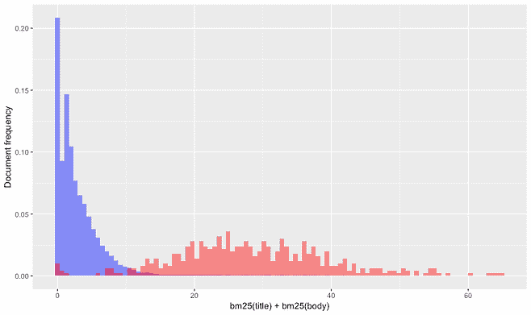
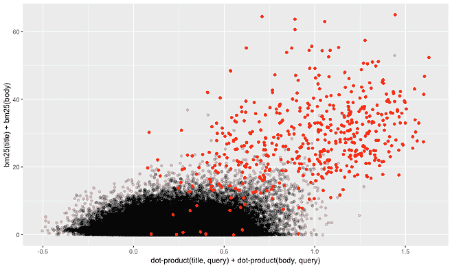

# 为什么你不应该使用 MS MARCO 来评估语义搜索

> 原文：[`www.kdnuggets.com/2020/04/ms-marco-evaluate-semantic-search.html`](https://www.kdnuggets.com/2020/04/ms-marco-evaluate-semantic-search.html)

评论

**作者：[Thiago Guerrera Martins](https://www.linkedin.com/in/thiago-g-martins/)，Verizon Media 首席数据科学家**

图片来源：[Free To Use Sounds](https://unsplash.com/@freetousesoundscom?utm_source=unsplash&utm_medium=referral&utm_content=creditCopyText) 在 [Unsplash](https://unsplash.com/s/photos/doing-it-wrong?utm_source=unsplash&utm_medium=referral&utm_content=creditCopyText)

* * *

## 我们的前 3 个课程推荐

 1\. [谷歌网络安全证书](https://www.kdnuggets.com/google-cybersecurity) - 快速进入网络安全职业生涯。

 2\. [谷歌数据分析专业证书](https://www.kdnuggets.com/google-data-analytics) - 提升你的数据分析技能

 3\. [谷歌 IT 支持专业证书](https://www.kdnuggets.com/google-itsupport) - 支持你的组织进行 IT 管理

* * *

[MS MARCO](https://microsoft.github.io/msmarco/)是微软发布的大规模数据集，旨在帮助推进与搜索相关的深度学习研究。当我们决定创建一个展示如何使用[Vespa](https://vespa.ai/)设置文本搜索应用的[tutorial](https://docs.vespa.ai/documentation/tutorials/text-search.html)时，它是我们的首选。这在社区中引起了很大关注，主要由于排行榜上的激烈竞争。此外，作为一个大型且具有挑战性的标注文档语料库，它在当时满足了所有要求。

我们在第一个基础搜索教程之后，跟进了一个[博客文章](https://medium.com/vespa/learning-to-rank-with-vespa-9928bbda98bf)和一个[tutorial](https://docs.vespa.ai/documentation/tutorials/text-search-ml.html)，介绍了如何在 Vespa 中使用 ML 来改进文本搜索应用。到目前为止，一切顺利。当我们撰写[第三个教程](https://docs.vespa.ai/documentation/tutorials/text-search-semantic.html)时，讨论如何使用（预训练的）语义嵌入和近似最近邻搜索来改进应用时，我们开始意识到，可能完整文本排名的 MS MARCO 数据集并不是最佳选择。

在更仔细地查看数据后，我们开始意识到数据集对术语匹配信号的偏见非常严重。这比我们预期的要多得多。

### 但我们知道它有偏见……

在讨论数据之前，我们必须说明我们预期数据集中会有偏见。根据[MS MARCO 数据集论文](https://arxiv.org/abs/1611.09268)，他们通过以下方式构建数据集：

1.  从 Bing 的搜索日志中抽样查询。

1.  过滤掉非问题查询。

1.  使用 Bing 从其大规模网络索引中检索每个问题的相关文档。

1.  自动提取这些文档中的相关段落

1.  人工编辑随后对包含有用和必要信息以回答问题的段落进行标注。

查看步骤 3 和 4（可能还有 5），发现数据集中的偏差并不令人惊讶。公平地说，我认为文献中已经认识到偏差是一个问题。令人惊讶的是我们观察到的偏差程度以及这可能如何影响涉及语义搜索的实验。

### 语义嵌入设置

我们的主要目标是展示如何通过使用术语匹配和语义信号来创建开箱即用的语义感知文本搜索应用程序。结合 Vespa 执行[近似最近邻搜索](https://docs.vespa.ai/documentation/tutorials/text-search-semantic.html#approximate-nearest-neighbor-ann-operator)的能力，用户可以在大规模下构建此类应用程序。

在接下来的结果中，我们使用了[BM25 分数](https://docs.vespa.ai/documentation/reference/bm25.html)作为我们的术语匹配信号，并使用[sentence BERT 模型](https://github.com/UKPLab/sentence-transformers#getting-started)生成嵌入以表示语义信号。使用更简单的术语匹配信号和其他语义模型如 Universal Sentence Encoder 也获得了类似的结果。更多细节和[代码](https://github.com/vespa-engine/sample-apps/tree/master/text-search)可以在[教程](https://docs.vespa.ai/documentation/tutorials/text-search-semantic.html)中找到。

### 结合信号

我们从仅涉及术语匹配信号的合理基准开始。接下来，当我们仅在应用中使用语义信号时，获得了令人鼓舞的结果，这只是为了检查设置的合理性并确认嵌入中确实包含相关信息。之后，显然的后续步骤是结合这两种信号。

Vespa 在这里提供了很多可能性，因为我们可以在匹配阶段和排名阶段结合术语匹配和语义信号。在匹配阶段，我们可以使用`nearestNeighbor`操作符来处理语义向量，并使用通常用于术语匹配的多种操作符，如常见的`AND`和`OR`语法来组合查询标记，或使用[有用的近似](https://docs.vespa.ai/documentation/using-wand-with-vespa.html)如`weakAND`。在排名阶段，我们可以使用众所周知的排名特征如 BM25 和[Vespa 张量评估框架](https://docs.vespa.ai/documentation/tensor-user-guide.html)来对输入信号如语义嵌入进行各种操作。

当我们开始尝试所有这些可能性时，我们开始怀疑 MS MARCO 数据集在这种实验中的有用性。主要的问题是，尽管语义信号在单独使用时表现尚可，但当考虑术语匹配信号时，这些改进会消失。

我们原本期望术语匹配和语义信号之间会有显著的交集，因为两者都应包含关于查询文档相关性的信息。*然而，语义信号需要补充术语匹配信号才能发挥价值，因为它们存储和计算的成本更高。这意味着它们应该匹配那些术语匹配信号无法匹配的相关文档。*

然而，就我们所见，这并不是情况。因此，我们决定更仔细地查看数据。

### 术语匹配偏差

为了更好地调查发生了什么，我们从 Vespa 收集了关于相关和随机文档的查询-文档数据。例如，下图显示了查询与标题嵌入之间和查询与正文嵌入之间点积和的经验分布。蓝色直方图显示了随机（因此可能与查询不相关）文档的分布。红色直方图显示了相同的信息，但现在以文档对查询的相关性为条件。

嵌入点积分数的经验分布。给定一组查询，蓝色代表随机（非相关）文档，红色代表相关文档。

正如预期的那样，我们在相关文档上平均得分更高。很好。现在，让我们看看 BM25 分数的类似图表。结果类似，但在这种情况下更为极端。相关文档的 BM25 分数要高得多，以至于几乎没有相关文档的信号足够低而被术语匹配信号排除。这意味着，在考虑术语匹配后，几乎没有相关文档留给语义信号进行匹配。即使语义嵌入信息丰富，这一点也是真实的。

BM25 分数的经验分布。给定一组查询，蓝色代表随机（非相关）文档，红色代表相关文档。

在这种情况下，我们所能期望的最好情况是相关文档的两个信号都呈正相关，显示出两者都携带了关于查询-文档相关性的信息。下面的散点图确实显示了，相关文档（红色）的 BM25 分数与嵌入分数之间的相关性远强于一般人群（黑色）的分数之间的相关性。

嵌入的点积得分与 BM25 得分的散点图。给定一组查询，黑色代表随机（不相关）文档，红色代表相关文档。

### 备注和结论

在这一点上，合理的观察是我们讨论的是预训练的嵌入，如果我们将嵌入微调到具体应用中，可能会获得更好的结果。这可能确实是这样，但需要考虑至少两个重要因素：成本和过拟合。资源/成本的考虑很重要，但更容易被识别。你要么有足够的资金来追求它，要么没有。如果有，你还需要检查所获得的改进是否值得成本。

在这种情况下，主要问题与过拟合有关。当使用诸如通用句子编码器和句子 BERT 等大型复杂模型时，避免过拟合并不容易。即使我们使用整个 MS MARCO 数据集，该数据集被认为是帮助推进 NLP 任务研究的重要发展之一，我们也只有大约 300 万个文档和 30 万个标记查询。这相对于如此大规模的模型并不算大。

另一个重要观察是，BERT 相关的架构在 [MSMARCO 排行榜](https://microsoft.github.io/msmarco/) 上占据了主导地位已有一段时间。安娜·罗杰斯 [写了一篇很好的文章](https://hackingsemantics.xyz/2019/leaderboards/) 讨论了当前使用排行榜来衡量 NLP 任务模型性能的一些挑战。主要的收获是，我们在解读这些结果时要小心，因为很难理解性能是来源于架构创新还是部署了过多资源（即过拟合）来解决任务。

尽管有这些评论，*这里最重要的一点是，如果我们想要调查语义向量（无论是预训练的还是未训练的）的力量和局限性，我们理想的优先考虑数据集应该是那些对术语匹配信号的偏见较少的数据集*。这可能是一个显而易见的结论，但目前我们不明显的是如何找到这些数据集，因为报告中的偏见可能存在于许多其他数据集中，由于类似的数据收集设计。

感谢 Lester Solbakken 和 Jon Bratseth。

**简介：[Thiago Guerrera Martins](https://www.linkedin.com/in/thiago-g-martins/)**（[**@Thiagogm**](https://twitter.com/thiagogm)）是 Verizon Media 的首席数据科学家，并在开源搜索引擎 [vespa.ai](https://vespa.ai/) 上工作。他拥有统计学博士学位。

[原文](https://towardsdatascience.com/why-you-should-not-use-ms-marco-to-evaluate-semantic-search-20affc993f0b)。经许可转载。

**相关信息：**

+   如何构建自己的反馈分析解决方案

+   一种简单且可解释的二分类器性能度量

+   使用 TensorFlow 和 Keras 进行分词和文本数据准备

### 更多相关话题

+   [一种（更）好的评估机器学习模型的方法](https://www.kdnuggets.com/2022/01/much-better-approach-evaluate-machine-learning-model.html)

+   [评估 LLMs 的更好方法](https://www.kdnuggets.com/a-better-way-to-evaluate-llms)

+   [为什么你不应该过度使用 Python 中的列表推导式](https://www.kdnuggets.com/why-you-should-not-overuse-list-comprehensions-in-python)

+   [语义向量搜索如何改变客户支持互动](https://www.kdnuggets.com/how-semantic-vector-search-transforms-customer-support-interactions)

+   [使用向量数据库进行语义搜索](https://www.kdnuggets.com/semantic-search-with-vector-databases)

+   [3 个理由为什么你应该使用线性回归模型而不是…](https://www.kdnuggets.com/2021/08/3-reasons-linear-regression-instead-neural-networks.html)
