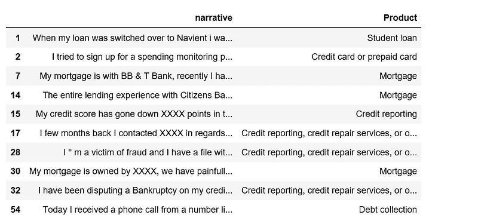

# 使用 Doc2Vec 和逻辑回归进行多类文本分类

> 原文：[`www.kdnuggets.com/2018/11/multi-class-text-classification-doc2vec-logistic-regression.html`](https://www.kdnuggets.com/2018/11/multi-class-text-classification-doc2vec-logistic-regression.html)

 评论

**作者 [Susan Li](https://www.linkedin.com/in/susanli/), 高级数据科学家**


图片来源：Pexels

[Doc2vec](https://cs.stanford.edu/~quocle/paragraph_vector.pdf) 是一种[NLP](https://en.wikipedia.org/wiki/Natural_language_processing)工具，用于将文档表示为向量，是[word2vec](https://en.wikipedia.org/wiki/Word2vec)方法的推广。

为了理解 doc2vec，建议先了解 word2vec 方法。然而，完整的数学细节超出了本文的范围。如果你对 word2vec 和 doc2vec 不熟悉，以下资源可以帮助你入门：

+   [词语和短语的分布式表示及其组合性](https://papers.nips.cc/paper/5021-distributed-representations-of-words-and-phrases-and-their-compositionality.pdf)

+   [句子和文档的分布式表示](https://cs.stanford.edu/~quocle/paragraph_vector.pdf)

+   [Doc2Vec 的温和介绍](https://medium.com/scaleabout/a-gentle-introduction-to-doc2vec-db3e8c0cce5e)

+   [IMDB 情感数据集上的 Gensim Doc2Vec 教程](https://github.com/RaRe-Technologies/gensim/blob/3c3506d51a2caf6b890de3b1b32a8b85f7566ca5/docs/notebooks/doc2vec-IMDB.ipynb)

+   [使用词嵌入进行文档分类教程](https://github.com/RaRe-Technologies/movie-plots-by-genre/blob/master/ipynb_with_output/Document%20classification%20with%20word%20embeddings%20tutorial%20-%20with%20output.ipynb)

使用相同的数据集进行[使用 Scikit-Learn 进行多类文本分类](https://towardsdatascience.com/multi-class-text-classification-with-scikit-learn-12f1e60e0a9f)，在本文中，我们将使用 doc2vec 技术通过[Gensim](https://radimrehurek.com/gensim/models/doc2vec.html)按产品对投诉叙述进行分类。让我们开始吧！

### 数据

目标是将消费者金融投诉分类到 12 个预定义的类别中。数据可以从[data.gov](https://catalog.data.gov/dataset/consumer-complaint-database)下载。

```py
import pandas as pd
import numpy as np
from tqdm import tqdm
tqdm.pandas(desc="progress-bar")
from gensim.models import Doc2Vec
from sklearn import utils
from sklearn.model_selection import train_test_split
import gensim
from sklearn.linear_model import LogisticRegression
from gensim.models.doc2vec import TaggedDocument
import re
import seaborn as sns
import matplotlib.pyplot as plt

df = pd.read_csv('Consumer_Complaints.csv')
df = df[['Consumer complaint narrative','Product']]
df = df[pd.notnull(df['Consumer complaint narrative'])]
df.rename(columns = {'Consumer complaint narrative':'narrative'}, inplace = True)
df.head(10)
```



图 1

在移除叙述列中的空值之后，我们需要重新索引数据框。

```py
df.shape
```

***(318718, 2)***

```py
df.index = range(318718)
df['narrative'].apply(lambda x: len(x.split(' '))).sum()
```

***63420212***

我们拥有超过 6300 万字的数据集，这相对来说是一个比较大的数据集。

### 探索

```py
cnt_pro = df['Product'].value_counts()

plt.figure(figsize=(12,4))
sns.barplot(cnt_pro.index, cnt_pro.values, alpha=0.8)
plt.ylabel('Number of Occurrences', fontsize=12)
plt.xlabel('Product', fontsize=12)
plt.xticks(rotation=90)
plt.show();
```


图 2

类别不平衡，然而，一个将所有预测都为“债务催收”的简单分类器只能达到超过 20%的准确率。

让我们看看一些投诉叙述及其相关的产品。

```py
def print_complaint(index):
    example = df[df.index == index][['narrative', 'Product']].values[0]
    if len(example) > 0:
        print(example[0])
        print('Product:', example[1])

print_complaint(12)
```


图 3

```py
print_complaint(20)
```


图 4

### 文本预处理

下面我们定义一个函数，将文本转换为小写，并去除标点符号/符号等。

```py
from bs4 import BeautifulSoup
def cleanText(text):
    text = BeautifulSoup(text, "lxml").text
    text = re.sub(r'\|\|\|', r' ', text) 
    text = re.sub(r'http\S+', r'<URL>', text)
    text = text.lower()
    text = text.replace('x', '')
    return text
df['narrative'] = df['narrative'].apply(cleanText)
```

以下步骤包括 70/30 的训练/测试拆分，移除停用词，并使用 [NLTK tokenizer](https://www.nltk.org/api/nltk.tokenize.html) 对文本进行分词。首次尝试时，我们为每个投诉叙述标记其产品。

```py
train, test = train_test_split(df, test_size=0.3, random_state=42)
```

```py
import nltk
from nltk.corpus import stopwords
def tokenize_text(text):
    tokens = []
    for sent in nltk.sent_tokenize(text):
        for word in nltk.word_tokenize(sent):
            if len(word) < 2:
                continue
            tokens.append(word.lower())
    return tokens

train_tagged = train.apply(
    lambda r: TaggedDocument(words=tokenize_text(r['narrative']), tags=[r.Product]), axis=1)
test_tagged = test.apply(
    lambda r: TaggedDocument(words=tokenize_text(r['narrative']), tags=[r.Product]), axis=1)
```

这就是一个训练条目的样子——一个被标记为“信用报告”的示例投诉叙述。

```py
train_tagged.values[30]
```


图 5

### 设置 Doc2Vec 训练与评估模型

首先，我们实例化一个 doc2vec 模型——分布式词袋（DBOW）。在 word2vec 架构中，两个算法名称是“连续词袋”（CBOW）和“跳字”（SG）；在 doc2vec 架构中，相应的算法是“分布式记忆”（DM）和“分布式词袋”（DBOW）。

**分布式词袋（DBOW）**

DBOW 是 doc2vec 模型，相当于 word2vec 中的 Skip-gram 模型。段落向量是通过在预测段落中词汇概率分布的任务上训练神经网络获得的，给定一个从段落中随机抽样的词。

我们将调整以下参数：

+   如果`dm=0`，使用分布式词袋（PV-DBOW）；如果`dm=1`，使用“分布式记忆”（PV-DM）。

+   300 维特征向量。

+   `min_count=2`，忽略所有总频率低于该值的词汇。

+   `negative=5`，指定应该抽取多少个“噪声词”。

+   `hs=0`，且负采样非零时，将使用负采样。

+   `sample=0`，配置随机下采样的高频词汇的阈值。

+   `workers=cores`，使用这些工作线程来训练模型（=使用多核机器加速训练）。

```py
import multiprocessing

cores = multiprocessing.cpu_count()
```

**构建词汇表**

```py
model_dbow = Doc2Vec(dm=0, vector_size=300, negative=5, hs=0, min_count=2, sample = 0, workers=cores)
model_dbow.build_vocab([x for x in tqdm(train_tagged.values)])
```


图 6

在 Gensim 中训练 doc2vec 模型非常简单，我们初始化模型并训练 30 个周期。

```py
%%time
for epoch in range(30):
    model_dbow.train(utils.shuffle([x for x in tqdm(train_tagged.values)]), total_examples=len(train_tagged.values), epochs=1)
    model_dbow.alpha -= 0.002
    model_dbow.min_alpha = model_dbow.alpha
```


图 7

**为分类器构建最终向量特征**

```py
def vec_for_learning(model, tagged_docs):
    sents = tagged_docs.values
    targets, regressors = zip(*[(doc.tags[0], model.infer_vector(doc.words, steps=20)) for doc in sents])
    return targets, regressorsdef vec_for_learning(model, tagged_docs):
    sents = tagged_docs.values
    targets, regressors = zip(*[(doc.tags[0], model.infer_vector(doc.words, steps=20)) for doc in sents])
    return targets, regressors
```

**训练逻辑回归分类器。**

```py
y_train, X_train = vec_for_learning(model_dbow, train_tagged)
y_test, X_test = vec_for_learning(model_dbow, test_tagged)

logreg = LogisticRegression(n_jobs=1, C=1e5)
logreg.fit(X_train, y_train)
y_pred = logreg.predict(X_test)

from sklearn.metrics import accuracy_score, f1_score

print('Testing accuracy %s' % accuracy_score(y_test, y_pred))
print('Testing F1 score: {}'.format(f1_score(y_test, y_pred, average='weighted')))
```

***测试准确率 0.6683609437751004***

***测试 F1 分数：0.651646431211616***

****分布式记忆（DM）****

分布式记忆（DM）作为一个记忆，记住当前上下文中缺少的内容——或作为段落的主题。虽然词向量表示的是词汇的概念，但文档向量旨在表示文档的概念。我们再次实例化一个 Doc2Vec 模型，词向量大小为 300，并对训练语料库进行 30 次迭代。

```py
model_dmm = Doc2Vec(dm=1, dm_mean=1, vector_size=300, window=10, negative=5, min_count=1, workers=5, alpha=0.065, min_alpha=0.065)
model_dmm.build_vocab([x for x in tqdm(train_tagged.values)])
```


图 8

```py
%%time
for epoch in range(30):
    model_dmm.train(utils.shuffle([x for x in tqdm(train_tagged.values)]), total_examples=len(train_tagged.values), epochs=1)
    model_dmm.alpha -= 0.002
    model_dmm.min_alpha = model_dmm.alpha
```


图 9

**训练逻辑回归分类器**

```py
y_train, X_train = vec_for_learning(model_dmm, train_tagged)
y_test, X_test = vec_for_learning(model_dmm, test_tagged)

logreg.fit(X_train, y_train)
y_pred = logreg.predict(X_test)

print('Testing accuracy %s' % accuracy_score(y_test, y_pred))
print('Testing F1 score: {}'.format(f1_score(y_test, y_pred, average='weighted')))
```

***测试准确率 0.47498326639892907***

***测试 F1 分数：0.4445833078167434***

**模型配对**

根据[Gensim doc2vec IMDB 情感数据集教程](https://github.com/RaRe-Technologies/gensim/blob/3c3506d51a2caf6b890de3b1b32a8b85f7566ca5/docs/notebooks/doc2vec-IMDB.ipynb)，将分布式词袋模型（DBOW）和分布式记忆（DM）的段落向量结合起来可以提高性能。我们将按照这个方法，将模型进行配对进行评估。

首先，我们删除临时训练数据以释放 RAM。

```py
model_dbow.delete_temporary_training_data(keep_doctags_vectors=True, keep_inference=True)
model_dmm.delete_temporary_training_data(keep_doctags_vectors=True, keep_inference=True)
```

连接两个模型。

```py
from gensim.test.test_doc2vec import ConcatenatedDoc2Vec
new_model = ConcatenatedDoc2Vec([model_dbow, model_dmm])
```

构建特征向量。

```py
def get_vectors(model, tagged_docs):
    sents = tagged_docs.values
    targets, regressors = zip(*[(doc.tags[0], model.infer_vector(doc.words, steps=20)) for doc in sents])
    return targets, regressors
```

训练逻辑回归模型

```py
y_train, X_train = get_vectors(new_model, train_tagged)
y_test, X_test = get_vectors(new_model, test_tagged)

logreg.fit(X_train, y_train)
y_pred = logreg.predict(X_test)

print('Testing accuracy %s' % accuracy_score(y_test, y_pred))
print('Testing F1 score: {}'.format(f1_score(y_test, y_pred, average='weighted')))
```

***测试准确率 0.6778572623828648***

***测试 F1 得分: 0.664561533967402***

结果提高了 1%。

对于这篇文章，我使用训练集来训练 doc2vec。然而，在[Gensim 的教程](https://github.com/RaRe-Technologies/gensim/blob/develop/docs/notebooks/doc2vec-IMDB.ipynb)中，使用了整个数据集进行训练。我尝试了这种方法，使用整个数据集训练 doc2vec 分类器，用于我们的消费者投诉分类，我能够获得 70%的准确率。你可以在这里找到那个[笔记本](https://github.com/susanli2016/NLP-with-Python/blob/master/Doc2Vec%20Consumer%20Complaint.ipynb)，它是一种稍有不同的方法。

上述分析的[Jupyter 笔记本](https://github.com/susanli2016/NLP-with-Python/blob/master/Doc2Vec%20Consumer%20Complaint_3.ipynb)可以在[Github](https://github.com/susanli2016/NLP-with-Python/blob/master/Doc2Vec%20Consumer%20Complaint_3.ipynb)上找到。我期待听到任何问题。

**简介: [Susan Li](https://www.linkedin.com/in/susanli/)** 正在通过一篇文章改变世界。她是位于加拿大多伦多的高级数据科学家。

[原文](https://towardsdatascience.com/multi-class-text-classification-with-doc2vec-logistic-regression-9da9947b43f4)。转载已获许可。

**相关内容:**

+   使用 SpaCy 进行文本分类的机器学习

+   使用 LSA、PLSA、LDA 和 lda2Vec 进行主题建模

+   使用 Scikit-Learn 进行多类别文本分类

* * *

## 我们的前 3 名课程推荐

 1\. [Google 网络安全证书](https://www.kdnuggets.com/google-cybersecurity) - 快速进入网络安全职业生涯。

 2\. [Google 数据分析专业证书](https://www.kdnuggets.com/google-data-analytics) - 提升你的数据分析能力

 3\. [Google IT 支持专业证书](https://www.kdnuggets.com/google-itsupport) - 支持你的组织的 IT 需求

* * *

### 更多相关内容

+   [逻辑回归分类](https://www.kdnuggets.com/2022/04/logistic-regression-classification.html)

+   [分类指标指南：逻辑回归与…](https://www.kdnuggets.com/2022/10/classification-metrics-walkthrough-logistic-regression-accuracy-precision-recall-roc.html)

+   [线性回归与逻辑回归的比较](https://www.kdnuggets.com/2022/11/comparing-linear-logistic-regression.html)

+   [逻辑回归概述](https://www.kdnuggets.com/2022/02/overview-logistic-regression.html)

+   [线性回归与逻辑回归：简明解释](https://www.kdnuggets.com/2022/03/linear-logistic-regression-succinct-explanation.html)

+   [KDnuggets 新闻 22:n12，3 月 23 日：最佳数据科学书籍…](https://www.kdnuggets.com/2022/n12.html)
