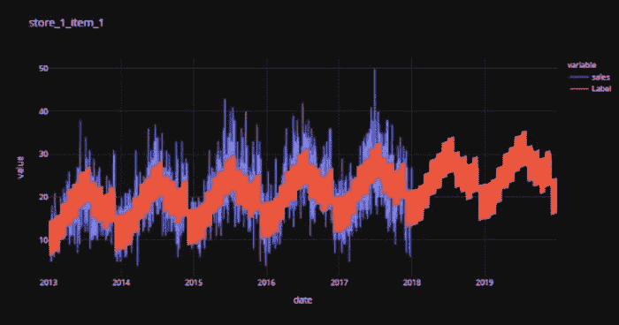
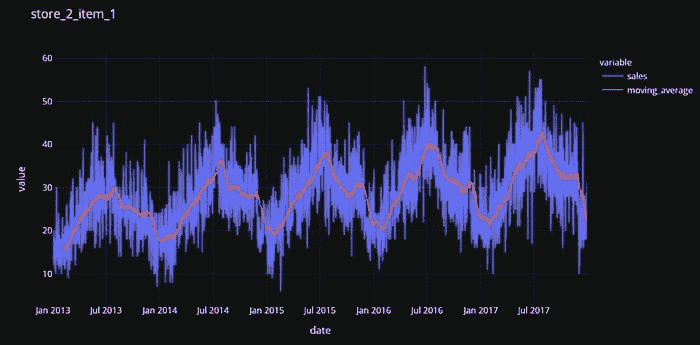
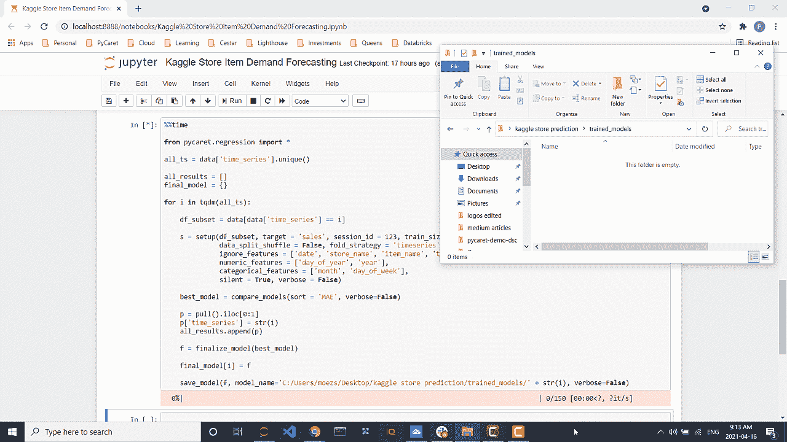
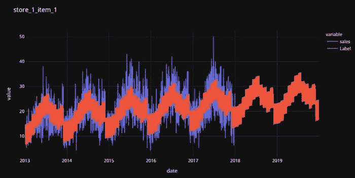

# 使用 PyCaret 进行多时间序列预测

> 原文：[`www.kdnuggets.com/2021/04/multiple-time-series-forecasting-pycaret.html`](https://www.kdnuggets.com/2021/04/multiple-time-series-forecasting-pycaret.html)

评论

**由 [Moez Ali](https://www.linkedin.com/in/profile-moez/)，PyCaret 创始人及作者**



PyCaret — 一个开源、低代码的 Python 机器学习库

### PyCaret

PyCaret 是一个开源、低代码的机器学习库和端到端模型管理工具，内置于 Python 中，用于自动化机器学习工作流程。它因易用性、简洁性和快速高效地构建和部署端到端机器学习原型的能力而极受欢迎。

PyCaret 是一个替代的低代码库，可以用少量代码替代数百行代码。这使得实验周期变得指数级加快和高效。

PyCaret 是**简单**和**易用**的。在 PyCaret 中执行的所有操作都按顺序存储在一个**管道**中，该管道完全自动化以**部署**。无论是填补缺失值、一键编码、转换分类数据、特征工程，还是超参数调优，PyCaret 都会自动化处理。

本教程假设你已有一定的 PyCaret 知识和经验。如果你以前没用过，也没关系——你可以通过以下教程快速入门：

+   [PyCaret 2.2 已发布——有什么新变化](https://towardsdatascience.com/pycaret-2-2-is-here-whats-new-ad7612ca63b)

+   [宣布 PyCaret 2.0](https://towardsdatascience.com/announcing-pycaret-2-0-39c11014540e)

+   [你不知道的 PyCaret 五件事](https://towardsdatascience.com/5-things-you-dont-know-about-pycaret-528db0436eec)

### **回顾**

在我之前的 [教程](https://towardsdatascience.com/time-series-forecasting-with-pycaret-regression-module-237b703a0c63) 中，我演示了如何通过 [PyCaret 回归模块](https://pycaret.readthedocs.io/en/latest/api/regression.html) 使用 PyCaret 进行时间序列数据预测。如果你还没读过，可以先阅读 [使用 PyCaret 回归模块进行时间序列预测](https://towardsdatascience.com/time-series-forecasting-with-pycaret-regression-module-237b703a0c63) 这篇教程，因为本教程建立在之前教程的一些重要概念之上。

### 安装 PyCaret

安装 PyCaret 非常简单，只需几分钟。我们强烈建议使用虚拟环境，以避免与其他库的潜在冲突。

PyCaret 的默认安装是 PyCaret 的精简版，只安装了硬性依赖项，详细信息请见 [这里](https://github.com/pycaret/pycaret/blob/master/requirements.txt)。

```py
**# install slim version (default)** pip install pycaret**# install the full version**
pip install pycaret[full]
```

当你安装 PyCaret 的完整版时，所有可选的依赖项也会被安装，详细信息请见 [这里](https://github.com/pycaret/pycaret/blob/master/requirements-optional.txt)。

### ???? PyCaret 回归模块

PyCaret **回归模块** 是一个监督机器学习模块，用于估计**因变量**（通常称为“结果变量”或“目标”）与一个或多个**自变量**（通常称为“特征”或“预测变量”）之间的关系。

回归的目标是预测连续值，例如销售金额、数量、温度、客户数量等。PyCaret 中的所有模块提供了许多[预处理](https://www.pycaret.org/preprocessing)功能，通过[setup](https://www.pycaret.org/setup)函数准备数据以进行建模。它拥有超过 25 种现成的算法和[若干图表](https://www.pycaret.org/plot-model)来分析训练模型的性能。

### ???? 数据集

在本教程中，我将展示多时间序列数据预测的端到端实现，包括训练过程以及预测未来值。

我使用了来自 Kaggle 的[商店商品需求预测挑战](https://www.kaggle.com/c/demand-forecasting-kernels-only)数据集。该数据集包含 10 个不同的商店，每个商店有 50 个项目，即总共有 500 个日常时间序列数据，跨度为五年（2013–2017）。


示例数据集

### ???? 加载和准备数据

```py
**# read the csv file** import pandas as pd
data = pd.read_csv('train.csv')
data['date'] = pd.to_datetime(data['date'])**# combine store and item column as time_series**
data['store'] = ['store_' + str(i) for i in data['store']]
data['item'] = ['item_' + str(i) for i in data['item']]
data['time_series'] = data[['store', 'item']].apply(lambda x: '_'.join(x), axis=1)
data.drop(['store', 'item'], axis=1, inplace=True)**# extract features from date**
data['month'] = [i.month for i in data['date']]
data['year'] = [i.year for i in data['date']]
data['day_of_week'] = [i.dayofweek for i in data['date']]
data['day_of_year'] = [i.dayofyear for i in data['date']]data.head()
```


从数据中采样行

```py
**# check the unique time_series**
data['time_series'].nunique()
>>> 500
```

### ???? 可视化时间序列

```py
**# plot multiple time series with moving avgs in a loop**import plotly.express as pxfor i in data['time_series'].unique():
    subset = data[data['time_series'] == i]
    subset['moving_average'] = subset['sales'].rolling(30).mean()
    fig = px.line(subset, x="date", y=["sales","moving_average"], title = i, template = 'plotly_dark')
    fig.show()
```


store_1_item_1 时间序列和 30 天移动平均



store_2_item_1 时间序列和 30 天移动平均

### ???? 开始训练过程

现在我们已经准备好数据，让我们开始训练循环。注意在所有函数中使用`verbose = False`，以避免在训练过程中在控制台打印结果。

以下代码是对我们在数据准备步骤中创建的`time_series`列进行循环。总共有 150 个时间序列（10 个商店 x 50 个项目）。

下方第 10 行是对`time_series`变量进行数据过滤。循环的第一部分初始化了`setup`函数，然后使用`compare_models`查找最佳模型。第 24–26 行捕获结果，并将最佳模型的性能指标附加到名为`all_results`的列表中。代码的最后部分使用`finalize_model`函数在整个数据集上重新训练最佳模型，包括测试集中剩余的 5%，并将整个管道（包括模型）保存为一个 pickle 文件。

[`gist.github.com/moezali1/f258195ba1c677654abffb0d1acb2cc0`](https://gist.github.com/moezali1/f258195ba1c677654abffb0d1acb2cc0)

我们现在可以从`all_results`列表创建一个数据框。它将显示每个时间序列选择的最佳模型。

```py
concat_results = pd.concat(all_results,axis=0)
concat_results.head()
```


从 concat_results 中采样行

### 训练过程 ????



训练过程

### ???? 使用训练模型生成预测

现在我们已经训练了模型，让我们用它们来生成预测，但首先，我们需要创建评分的数据集（X 变量）。

```py
**# create a date range from 2013 to 2019**
all_dates = pd.date_range(start='2013-01-01', end = '2019-12-31', freq = 'D')**# create empty dataframe**
score_df = pd.DataFrame()**# add columns to dataset**
score_df['date'] = all_dates
score_df['month'] = [i.month for i in score_df['date']]
score_df['year'] = [i.year for i in score_df['date']]
score_df['day_of_week'] = [i.dayofweek for i in score_df['date']]
score_df['day_of_year'] = [i.dayofyear for i in score_df['date']]score_df.head()
```


从 score_df 数据集提取样本行

现在让我们创建一个循环来加载训练好的管道，并使用 `predict_model` 函数生成预测标签。

```py
from pycaret.regression import load_model, predict_modelall_score_df = []for i in tqdm(data['time_series'].unique()):
    l = load_model('trained_models/' + str(i), verbose=False)
    p = predict_model(l, data=score_df)
    p['time_series'] = i
    all_score_df.append(p)concat_df = pd.concat(all_score_df, axis=0)
concat_df.head()
```


从 concat_df 中提取样本行

我们现在将 `data` 和 `concat_df` 合并。

```py
final_df = pd.merge(concat_df, data, how = 'left', left_on=['date', 'time_series'], right_on = ['date', 'time_series'])
final_df.head()
```


从 final_df 中提取样本行

我们现在可以创建一个循环来查看所有图表。

```py
for i in final_df['time_series'].unique()[:5]:
    sub_df = final_df[final_df['time_series'] == i]

    import plotly.express as px
    fig = px.line(sub_df, x="date", y=['sales', 'Label'], title=i, template = 'plotly_dark')
    fig.show()
```



store_1_item_1 实际销售和预测标签


store_2_item_1 实际销售和预测标签

我希望你会欣赏 PyCaret 的易用性和简洁性。通过不到 50 行代码和一小时的实验，我已经训练了超过 10,000 个模型（25 个估计器 x 500 个时间序列），并将 500 个最佳模型投入生产以生成预测。

### 敬请期待！

下周我将写一篇关于使用 [PyCaret 异常检测模块](https://pycaret.readthedocs.io/en/latest/api/anomaly.html) 进行无监督时间序列异常检测的教程。请关注我的 [Medium](https://medium.com/@moez-62905)、[LinkedIn](https://www.linkedin.com/in/profile-moez/) 和 [Twitter](https://twitter.com/moezpycaretorg1) 以获取更多更新。

使用这个轻量级的 Python 工作流自动化库，你可以实现无限的目标。如果你觉得这有用，请不要忘记在我们的 GitHub 仓库上给我们 ⭐️。

想了解更多关于 PyCaret 的信息，请关注我们的 [LinkedIn](https://www.linkedin.com/company/pycaret/) 和 [Youtube](https://www.youtube.com/channel/UCxA1YTYJ9BEeo50lxyI_B3g)。

加入我们的 Slack 频道。邀请链接 [在此](https://join.slack.com/t/pycaret/shared_invite/zt-p7aaexnl-EqdTfZ9U~mF0CwNcltffHg)。

### 你可能还对以下内容感兴趣：

[使用 PyCaret 2.0 在 Power BI 中构建你自己的 AutoML](https://towardsdatascience.com/build-your-own-automl-in-power-bi-using-pycaret-8291b64181d)

[使用 Docker 在 Azure 上部署机器学习管道](https://towardsdatascience.com/deploy-machine-learning-pipeline-on-cloud-using-docker-container-bec64458dc01)

[在 Google Kubernetes Engine 上部署机器学习管道](https://towardsdatascience.com/deploy-machine-learning-model-on-google-kubernetes-engine-94daac85108b)

[在 AWS Fargate 上部署机器学习管道](https://towardsdatascience.com/deploy-machine-learning-pipeline-on-aws-fargate-eb6e1c50507)

[构建并部署你的第一个机器学习 Web 应用](https://towardsdatascience.com/build-and-deploy-your-first-machine-learning-web-app-e020db344a99)

[使用 AWS Fargate 无服务器部署 PyCaret 和 Streamlit 应用](https://towardsdatascience.com/deploy-pycaret-and-streamlit-app-using-aws-fargate-serverless-infrastructure-8b7d7c0584c2)

[使用 PyCaret 和 Streamlit 构建并部署机器学习 web 应用](https://towardsdatascience.com/build-and-deploy-machine-learning-web-app-using-pycaret-and-streamlit-28883a569104)

[在 GKE 上部署使用 Streamlit 和 PyCaret 构建的机器学习应用](https://towardsdatascience.com/deploy-machine-learning-app-built-using-streamlit-and-pycaret-on-google-kubernetes-engine-fd7e393d99cb)

### 重要链接

[文档](https://pycaret.readthedocs.io/en/latest/installation.html)

[博客](https://medium.com/@moez_62905)

[GitHub](https://www.github.com/pycaret/pycaret)

[StackOverflow](https://stackoverflow.com/questions/tagged/pycaret)

[安装 PyCaret](https://pycaret.readthedocs.io/en/latest/installation.html) [笔记本教程](https://pycaret.readthedocs.io/en/latest/tutorials.html) [参与 PyCaret](https://pycaret.readthedocs.io/en/latest/contribute.html)

### 想了解特定模块？

点击下面的链接查看文档和工作示例。

[分类](https://pycaret.readthedocs.io/en/latest/api/classification.html) [回归](https://pycaret.readthedocs.io/en/latest/api/regression.html)

[聚类](https://pycaret.readthedocs.io/en/latest/api/clustering.html)

[异常检测](https://pycaret.readthedocs.io/en/latest/api/anomaly.html)

[自然语言处理](https://pycaret.readthedocs.io/en/latest/api/nlp.html) [关联规则挖掘](https://pycaret.readthedocs.io/en/latest/api/arules.html)

**个人简介：[Moez Ali](https://www.linkedin.com/in/profile-moez/)** 是数据科学家，同时是 PyCaret 的创始人和作者。

[原文](https://towardsdatascience.com/multiple-time-series-forecasting-with-pycaret-bc0a779a22fe)。经授权转载。

**相关：**

+   使用 PyCaret 回归模块进行时间序列预测

+   使用 PyCaret 进行自动化异常检测

+   使用 Docker 容器将机器学习管道部署到云端

* * *

## 我们的前三大课程推荐

 1\. [Google 网络安全证书](https://www.kdnuggets.com/google-cybersecurity) - 快速进入网络安全职业生涯。

 2\. [Google 数据分析专业证书](https://www.kdnuggets.com/google-data-analytics) - 提升你的数据分析技能

 3\. [Google IT 支持专业证书](https://www.kdnuggets.com/google-itsupport) - 支持你的组织的 IT

* * *

### 更多相关话题

+   [使用 Ploomber、Arima、Python 和 Slurm 进行时间序列预测](https://www.kdnuggets.com/2022/03/time-series-forecasting-ploomber-arima-python-slurm.html)

+   [使用 statsmodels 和 Prophet 进行时间序列预测](https://www.kdnuggets.com/2023/03/time-series-forecasting-statsmodels-prophet.html)

+   [利用 XGBoost 进行时间序列预测](https://www.kdnuggets.com/2023/08/leveraging-xgboost-timeseries-forecasting.html)

+   [如何在 Python 中管理多重继承](https://www.kdnuggets.com/2022/03/manage-multiple-inheritance-python.html)

+   [使用 PyCaret 进行二分类介绍](https://www.kdnuggets.com/2021/12/introduction-binary-classification-pycaret.html)

+   [使用 PyCaret 在 Python 中进行聚类介绍](https://www.kdnuggets.com/2021/12/introduction-clustering-python-pycaret.html)
