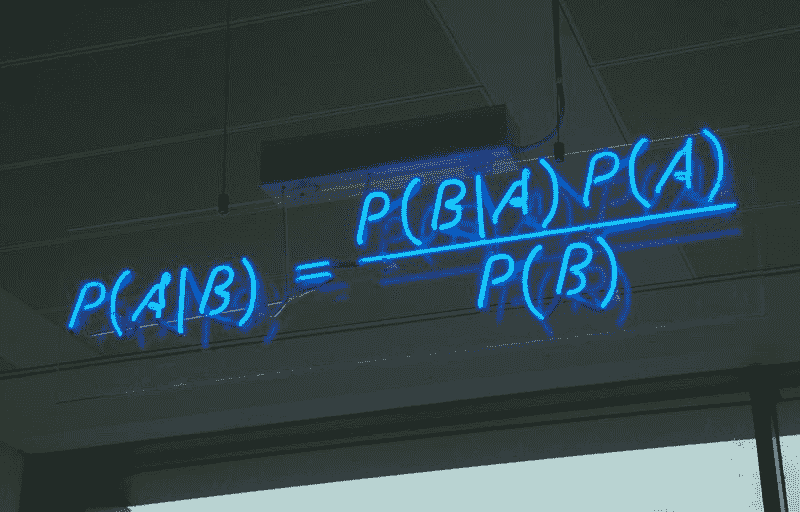
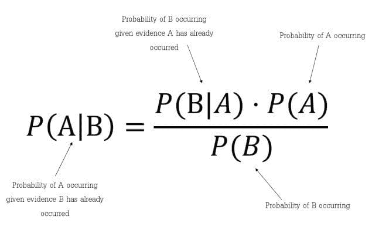
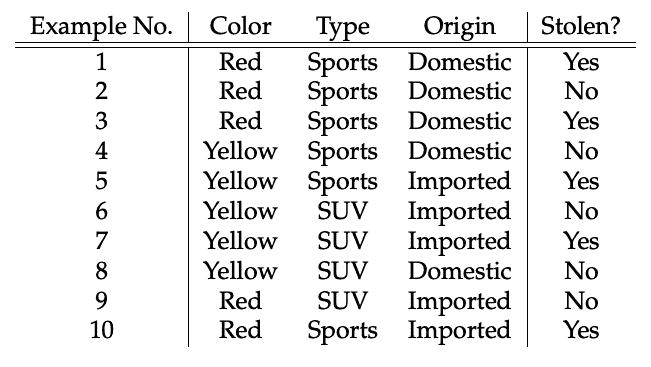
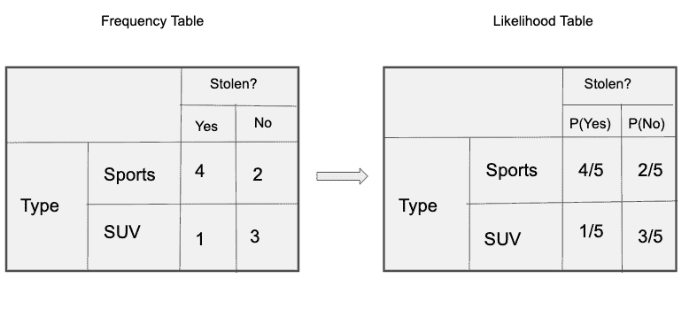
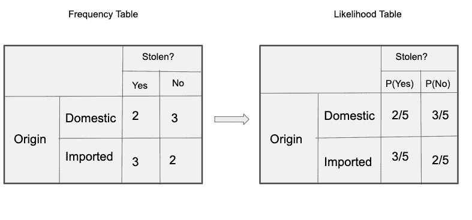
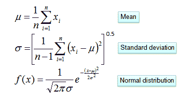
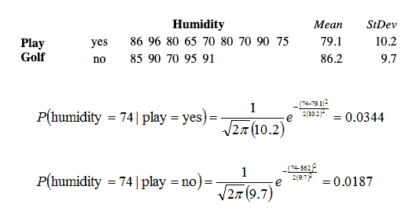

# 朴素贝叶斯算法：您需要了解的一切

> 原文：[`www.kdnuggets.com/2020/06/naive-bayes-algorithm-everything.html`](https://www.kdnuggets.com/2020/06/naive-bayes-algorithm-everything.html)



[图片来源](https://blogs.oracle.com/datascience/introduction-to-bayesian-inference)

# 朴素贝叶斯算法简介

最简单的解决方案通常是最有效的，[朴素贝叶斯](https://www.kdnuggets.com/2020/06/naive-bayes-algorithm-everything.html)就是一个很好的例子。尽管近年来机器学习取得了进展，但它不仅简单，而且快速、准确和可靠。

* * *

## 我们的前三个课程推荐

 1\. [谷歌网络安全证书](https://www.kdnuggets.com/google-cybersecurity) - 快速进入网络安全职业生涯。

 2\. [谷歌数据分析专业证书](https://www.kdnuggets.com/google-data-analytics) - 提升您的数据分析水平

 3\. [谷歌 IT 支持专业证书](https://www.kdnuggets.com/google-itsupport) - 支持您的组织 IT

* * *

它已经成功用于许多目的，但在自然语言处理（NLP）问题上特别有效。

朴素贝叶斯是一种基于**贝叶斯定理**的概率机器学习算法，广泛应用于各种分类任务。在本文中，我们将深入理解朴素贝叶斯算法及其所有基本概念，以便彻底理解。

# 贝叶斯定理

贝叶斯定理是用于计算条件概率的简单数学公式。

**条件概率**是指在另一个事件（通过假设、推测、断言或证据）发生的情况下，事件发生的概率的度量。

公式是：—



这告诉我们：**P(A|B)**，即在**B 发生**的情况下，**A 发生的概率**，也称为后验概率。当我们知道**A 发生**的情况下**B 发生的概率**，写作**P(B|A)**，以及**A**单独发生的概率**P(A)**和**B**单独发生的概率**P(B)**。

> 简单来说，贝叶斯定理是一种在知道某些其他概率的情况下找出概率的方法。

## 朴素贝叶斯所做的假设

朴素贝叶斯的基本假设是每个特征都做出一个：

+   独立

+   相等

对结果的贡献。

让我们通过一个例子来获得更好的直观理解。考虑一个具有属性颜色、类型、来源的汽车盗窃问题，目标“被盗”可以是“是”或“否”。

# 朴素贝叶斯示例

数据集表示如下。



关于我们的数据集，算法所做的假设的概念可以理解为：

+   我们假设没有一对特征是相关的。例如，颜色为‘红色’与汽车的类型或来源无关。因此，特征被假设为**独立的**。

+   其次，每个特征被赋予相同的影响（或重要性）。例如，仅知道颜色和类型无法完美预测结果。因此，没有任何属性是不相关的，假设它们对结果的贡献是**相等的**。

**注意：** Naïve Bayes 进行的假设在实际情况中通常不正确。独立假设从未正确，但在实践中往往有效。**因此称为‘Naïve’。**

在我们的数据集中，**我们需要根据汽车的特征来分类汽车是否被盗**。列表示这些特征，而行表示单独的条目。如果我们取数据集的第一行，可以观察到，如果颜色是红色，类型是运动型，来源是国内的，则汽车被盗。因此，我们要分类一个红色的国内 SUV 是否被盗。请注意，我们的数据集中没有红色国内 SUV 的示例。

根据此示例，贝叶斯定理可以重写为：


变量 **y** 是类变量（被盗？），表示在给定条件下汽车是否被盗。变量 **X** 表示参数/特征。

**X** 给出如下，


这里 `x1, x2…, xn` 表示特征，即它们可以映射到颜色、类型和来源。通过替代 **X** 并使用链式法则展开，我们得到，


现在，你可以通过查看数据集来获得每个值并将其代入方程中。对于数据集中的所有条目，分母不变，它保持静态。因此，可以去掉分母，并引入比例。


在我们的案例中，类变量(**y**)只有两个结果，即是或否。可能有多变量分类的情况。因此，我们需要找到具有最大概率的类变量(**y**)。


使用上述函数，我们可以在给定预测变量/特征的情况下获得类别。

后验概率 **P(y|X)** 可以通过首先为每个属性创建一个**频率表**来计算。然后，将频率表转换为**可能性表**，最后使用 Naïve Bayesian 方程计算每个类别的后验概率。具有最高后验概率的类别是预测的结果。以下是所有三个预测变量的频率和可能性表。


“颜色”的频率和可能性表



‘类型’的频率和可能性表



‘来源’的频率和可能性表

所以在我们的例子中，我们有 3 个预测变量**X**。


根据上述讨论的方程，我们可以计算后验概率 P(Yes | X)为：


和，P( No | X ):


由于 0.144 > 0.048，这意味着给定特征 RED SUV 和 Domestic，我们的例子被分类为“NO”，即车辆未被盗。

# 零频率问题

朴素贝叶斯的一个缺点是，如果一个类别标签和某个属性值一起没有出现，那么基于频率的概率估计将为零。当所有概率相乘时，这将得到零。

在贝叶斯环境中克服‘零频率问题’的一种方法是，当一个属性值未与每个类别值一起出现时，将每个属性值-类别组合的计数加一。

例如，假设你的训练数据如下：


????(TimeZone=????????|Spam=????????????)=10/10=1

????(TimeZone=????????|Spam=????????????)=0/10=0

然后，在使用这个表计算概率时，你应该对每个值加一：


????(TimeZone=????????|Spam=????????????)=11/12

????(TimeZone=????????|Spam=????????????)=1/12

这就是我们如何避免得到零概率的方法。


[图片来源](https://medium.com/@sanjeethboddi/naive-bayes-algorithm-from-scratch-715d7cc0de53)

# 朴素贝叶斯分类器的类型

## **1\. 多项式朴素贝叶斯分类器**

特征向量表示某些事件由**多项分布**生成的频率。这是通常用于文档分类的事件模型。

## **2\. 伯努利朴素贝叶斯分类器**：

在多变量伯努利事件模型中，特征是独立的布尔值（离散变量）描述输入。与多项式模型类似，这个模型在文档分类任务中很受欢迎，其中使用的是二元术语出现（即一个词是否出现在文档中）特征，而不是术语频率（即词在文档中的频率）。

## **3\. 高斯朴素贝叶斯分类器：**

在高斯朴素贝叶斯中，与每个特征相关的连续值假设符合**高斯分布 (**[正态分布](https://en.wikipedia.org/wiki/Normal_distribution)**)**。当绘制时，它给出一个钟形曲线，该曲线关于特征值的均值对称，如下所示：


特征的可能性假设为高斯分布，因此，条件概率由下式给出：


现在，如果某些特征包含数值而不是类别，即高斯分布，会怎样呢？

一种选择是在创建频率表之前将数值转换为其分类对应项。另一种选择，如上所示，可以使用数值变量的分布来很好地估计频率。例如，一种常见的方法是假设数值变量服从正态或高斯分布。

正态分布的概率密度函数由两个参数（均值和标准差）定义。



[图片来源](https://www.saedsayad.com/naive_bayesian.htm)

考虑高尔夫球的问题，这里唯一的预测变量是`湿度`，`是否打高尔夫？`是目标。使用上述公式，如果我们知道均值和标准差，就可以计算后验概率。



# 案例研究：从头开始使用 Python 构建朴素贝叶斯分类器

当前任何主要网站面临的一个问题是如何处理恶意和分裂性内容。Quora 希望解决这个问题，使其平台成为用户可以安全分享知识的地方。

[Quora](https://www.quora.com/) 是一个使人们可以相互学习的平台。在 Quora 上，人们可以提问，并与其他提供独特见解和高质量回答的人联系。一个关键挑战是筛除虚伪的问题——那些建立在虚假前提上的问题，或者那些意图陈述观点而不是寻求有用回答的问题。

目标是开发一个朴素贝叶斯分类模型，以识别和标记虚伪的问题。

数据集可以从[这里](https://www.kaggle.com/c/quora-insincere-questions-classification/data)下载。下载训练和测试数据后，加载并检查它。

```py
**import** numpy **as** np
**import** pandas **as** pd
**import** os
train **=** pd.read_csv('./drive/My Drive/train.csv')
print(train.head())test **=** pd.read_csv('./drive/My Drive/test.csv')
```


训练数据集

让我们看看真实的问题是什么样的。


真实问题

我们来看看虚伪的问题是什么样的。


虚伪问题

## **文本预处理**

下一步是对文本进行预处理，然后将数据集拆分为训练集和测试集。预处理步骤包括：移除数字、移除字符串中的标点符号、移除停用词、词干提取和词形还原。

## **构建朴素贝叶斯分类器**

结合所有预处理技术，并创建一个包含训练数据中每个词及其计数的字典。

1.  计算文本中每个词的概率，并过滤掉概率低于阈值概率的词。概率低于阈值的词是不相关的。

1.  然后对字典中的每个词，计算该词出现在不诚实问题中的概率以及它在不诚实问题中的概率。接着计算条件概率以用于朴素贝叶斯分类器。

1.  使用条件概率进行预测。

# 结论

朴素贝叶斯算法通常用于情感分析、垃圾邮件过滤、推荐系统等。它们实现起来快速简便，但最大缺点是要求预测变量必须独立。

**感谢阅读！**

**[Nagesh Singh Chauhan](https://www.linkedin.com/in/nagesh-singh-chauhan-6936bb13b/)** 是 CirrusLabs 的一名大数据开发工程师。他在电信、分析、销售、数据科学等多个领域有超过 4 年的工作经验，专注于多个大数据组件。

[原文](https://levelup.gitconnected.com/na%C3%AFve-bayes-algorithm-everything-you-need-to-know-9bf3104b78e5)。经授权转载。

### 更多相关主题

+   [KDnuggets 新闻，4 月 13 日：数据科学家应该知道的 Python 库…](https://www.kdnuggets.com/2022/n15.html)

+   [高斯朴素贝叶斯算法解释](https://www.kdnuggets.com/2023/03/gaussian-naive-bayes-explained.html)

+   [关于张量你需要知道的一切](https://www.kdnuggets.com/2022/05/everything-need-know-tensors.html)

+   [关于数据湖屋你需要知道的一切](https://www.kdnuggets.com/2022/09/everything-need-know-data-lakehouses.html)

+   [关于 MLOps 的一切：KDnuggets 技术简报](https://www.kdnuggets.com/tech-brief-everything-you-need-to-know-about-mlops)

+   [ChatGPT: 你需要知道的一切](https://www.kdnuggets.com/2023/01/chatgpt-everything-need-know.html)
