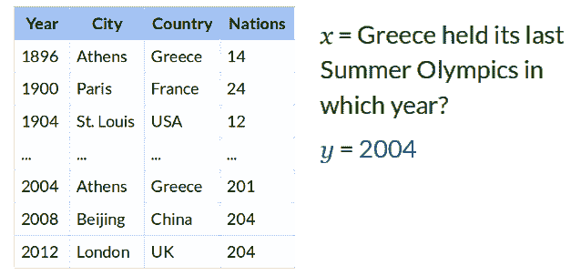
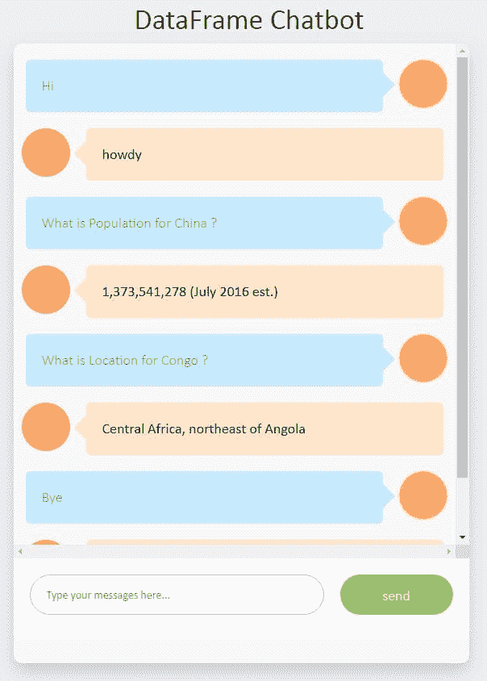

# 自然语言界面到数据表

> 原文：[`www.kdnuggets.com/2019/06/natural-language-interface-datatable.html`](https://www.kdnuggets.com/2019/06/natural-language-interface-datatable.html)

 评论

**由 [Yogesh Kulkarni](https://www.linkedin.com/in/yogeshkulkarni), Yati.io**

大量结构化数据以关系数据库中的表格形式存储。以一个表格作为简化的例子，即使要访问各个单元格中的值，也需要编写逻辑或在电子表格软件中打开并手动查找。如果可以仅通过自然语言（如英语）查询字段，岂不是更好吗？

例如，如果你有一个像**图 1**中那样的表格，那么在聊天机器人中发送一个“2008 年哪个城市举办了奥运会？”的查询会更好，你会得到“北京”这样的答案。这比编写程序或手动搜索一个庞大的表格要用户友好得多。



图 1：维基表格问题（来源：斯坦福 NLP 组研究博客）

上述例子确实是为数据集或数据库提供自然语言界面的巨大可能性的非常简单版本。自然语言理解（NLU）是关键技术，它会解析自然语言查询（如英语），‘理解’它，然后发出数据格式特定的查询以获取所需的答案。本文演示了如何使用 Rasa NLU 框架实现这一点。

[Rasa](https://rasa.com/) 是一个开源聊天机器人框架。它分为两个部分，‘NLU’用于理解用户文本中的意图和实体，而‘Core’则用于对话管理。Rasa 框架的一个显著特点是其功能基于机器/深度学习，并且是在本地训练的。无需将你的数据（即用户文本）发送到某些托管服务进行 NLU 或对话管理。

### 示例聊天机器人

比如，你希望构建一个通用知识聊天机器人，用于查询世界各国的信息。查询如“中华人民共和国的总人口是多少？”，“印度的面积是多少？”等。

[世界概况手册](https://www.cia.gov/library/publications/the-world-factbook/) 是一个关于各国数据的极好来源。信息以国家网页的形式排列，包含“地理”、“经济”等部分。要查找中国的人口，首先需要在下拉列表中滚动到中国，找到“人民与社会”部分，然后你会看到中国的人口为“1,384,688,986（2018 年 7 月估计）”。在这种情况下，聊天机器人会更有效。

### 数据收集

首要步骤是将分散在各种网页上的数据整合到一个表格中。这个[文章](https://github.com/yogeshhk/DataFrameChatbot)很好地解释了网络抓取的过程。输出是一个以国家为行、以各个字段为列的表格。

现在我们需要构建一个自然语言接口来访问这个表的字段或单元格。对于像“China 的总人口是多少？”这样的查询，我们需要获取位于“Country==China”行和名为“Population”的列交叉处的单元格中的值。简单来说，从自然语言查询中，我们需要提取两个实体，“Population 作为列”和“China 作为行”（在“Country”列中）。这里使用 Rasa NLU 进行实体提取。

### 实体提取

实体提取是一个在句子中找到映射到预定义实体类型的单词/标记的过程。命名实体识别（NER）是提取实体的监督方法，使用如条件随机场（CRF）等算法。

要训练 RASA NLU 的 NER，我们需要提供带有注释实体的样本句子的训练数据。**图 2**中展示了样本训练文件。


这里“savings”和“yen”分别是“source account”和“currency”实体类型的实际值。

为给定的表构建这种训练数据，将再次是一个手动的、繁琐的过程。通过对表的行和列进行迭代，注释过程可以自动化。不需要提供所有列或行的示例，因为学到的是抽象模式，而不是单元格中的硬编码实际值。

生成训练文件的代码示例如下：

```py
        n_sample_countries = 5
        n_sample_columns = 5
        self.all_columns = [col for col in list(self.df.columns) if col != self.primarycolumnname]
        sample_sentences = []
        for c in self.primary_key_values_list[:n_sample_countries]:
            for col in self.all_columns[:n_sample_columns]:
                sentenceformat1 = "What is " + col + " for " + c + " ?"
                sentenceformat2 = "For  " + c + ", what is the " + col + " ?"
                sample_sentences.append(sentenceformat1)
                sample_sentences.append(sentenceformat2)

```

尽管上述仅显示了两种句子格式，但可以添加更多变体。自动生成的 NLU 训练文件如下：

```py
## intent:query
- What is Area for Afghanistan ?
- For  Afghanistan, what is the Area ?
- What is Background for Akrotiri ?
- For  Akrotiri, what is the Background ?
- What is Location for Akrotiri ?
- For  Akrotiri, what is the Location ?
- What is Map references for Akrotiri ?
- For  Akrotiri, what is the Map references ?
:
:

```

使用训练数据训练 NER 模型。当用户查询出现时，模型能够提取“行”和“列”名称。有了这两个信息，就可以在给定的表中定位值。值返回给用户。

以下是样本对话工作流：

聊天机器人的源代码可以在“[DataFrame Chatbot](https://github.com/yogeshhk/DataFrameChatbot)”找到。

### 限制与未来展望

展示的聊天机器人示例非常简化。它可以通过以下功能进一步增强：

+   跨多个表的查询。

+   查询带有聚合和关系的，例如“哪些国家人口超过 1 亿且人均 GDP 低于$1000？”。

+   部分/完整 SQL 支持，即将自然语言查询转换为等效的 SQL 查询。

### 结论

本文演示了如何构建一个聊天机器人，以用户友好的方式与数据表进行交互。它在那些提供这种表格数据的领域有多种应用。

**简介：[Yogesh Kulkarni](https://www.linkedin.com/in/yogeshkulkarni)** 是 Yati.io 的数据科学讲师兼研究员。

**相关内容：**

+   使用 Python 和 NLTK 构建你的第一个聊天机器人

+   TNLP –  构建一个问答模型

+   使用深度学习从职位描述中提取知识

* * *

## 我们的前三大课程推荐

 1\. [谷歌网络安全证书](https://www.kdnuggets.com/google-cybersecurity) - 快速进入网络安全职业轨道。

 2\. [谷歌数据分析专业证书](https://www.kdnuggets.com/google-data-analytics) - 提升你的数据分析技能

 3\. [谷歌 IT 支持专业证书](https://www.kdnuggets.com/google-itsupport) - 支持组织的 IT 工作

* * *

### 更多相关话题

+   [ChatGPT CLI：将你的命令行界面转变为 ChatGPT](https://www.kdnuggets.com/2023/07/chatgpt-cli-transform-commandline-interface-chatgpt.html)

+   [介绍 DataCamp 的 AI 驱动聊天界面：DataLab](https://www.kdnuggets.com/introducing-datacamps-ai-powered-chat-interface-datalab)

+   [自然语言处理中的 N-gram 语言建模](https://www.kdnuggets.com/2022/06/ngram-language-modeling-natural-language-processing.html)

+   [自然语言处理关键术语解释](https://www.kdnuggets.com/2017/02/natural-language-processing-key-terms-explained.html)

+   [自然语言处理任务的数据表示](https://www.kdnuggets.com/2018/11/data-representation-natural-language-processing.html)

+   [用于图像识别和自然语言处理的迁移学习](https://www.kdnuggets.com/2022/01/transfer-learning-image-recognition-natural-language-processing.html)
