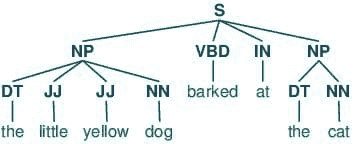
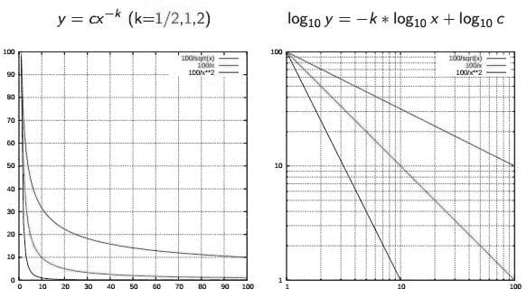

# 自然语言处理关键术语，解释如下

> 原文：[`www.kdnuggets.com/2017/02/natural-language-processing-key-terms-explained.html`](https://www.kdnuggets.com/2017/02/natural-language-processing-key-terms-explained.html)


照片由 [Towfiqu barbhuiya](https://unsplash.com/es/@towfiqu999999?utm_source=unsplash&utm_medium=referral&utm_content=creditCopyText) 提供，来自 [Unsplash](https://unsplash.com/?utm_source=unsplash&utm_medium=referral&utm_content=creditCopyText)

在计算语言学和人工智能的交汇处，我们找到了自然语言处理。广义上，自然语言处理（NLP）是一个研究人类语言以及说这些语言的人如何与技术互动的学科。NLP 是一个跨学科的话题，历史上一直是人工智能研究人员和语言学家平等的领域；显然，那些从语言学方面接近这个学科的人必须了解技术，而那些从技术领域进入这个学科的人需要学习语言学概念。

* * *

## 我们的前 3 个课程推荐

 1\. [谷歌网络安全证书](https://www.kdnuggets.com/google-cybersecurity) - 快速进入网络安全职业生涯。

 2\. [谷歌数据分析专业证书](https://www.kdnuggets.com/google-data-analytics) - 提升你的数据分析技能

 3\. [谷歌 IT 支持专业证书](https://www.kdnuggets.com/google-itsupport) - 支持你所在组织的 IT 需求

* * *

本文旨在为第二组术语提供入门级的介绍，我们将以不含废话的方式来定义一些关键的 NLP 术语。虽然阅读完本文后你不会成为语言学专家，但我们希望你能够更好地理解一些 NLP 相关的讨论，并对如何进一步学习这些话题获得一些视角。

下面是 18 个精选的自然语言处理术语，简明定义。

# 1\. 自然语言处理（NLP）

自然语言处理（NLP）关注自然人类语言与计算设备之间的互动。NLP 是计算语言学的一个主要方面，也涉及计算机科学和人工智能的领域。

# 2\. 分词

分词，通常是 NLP 过程中的早期步骤，这一步骤将较长的文本字符串拆分成更小的部分或**标记**。较大的文本块可以被分词成句子，句子可以被分词成单词，等等。文本在适当分词后，通常会进行进一步处理。

# 3\. 标准化

在进一步处理之前，文本需要规范化。规范化通常指一系列相关任务，旨在使所有文本处于相同的水平：将所有文本转换为相同的大小写（大写或小写），删除标点符号，扩展缩写，将数字转换为其单词等。规范化使所有单词处于平等基础上，并允许处理过程均匀进行。

# 4. 词干提取

词干提取是去除单词中词缀（后缀、前缀、插入词缀、环绕词缀）的过程，以获取单词词干。

running → run

# 5. 词形还原

词形还原与词干提取相关，但不同之处在于词形还原能够基于单词的[词元](https://en.wikipedia.org/wiki/Lemma_(morphology))捕捉规范形式。

例如，将单词“better”进行词干提取会失败，无法返回其引文形式（词元的另一种说法）；然而，词形还原则会得到如下结果：

better → good

应该很容易理解，为什么实现词干提取器的难度会比实现词形还原要小。

# 6. 语料库

在语言学和自然语言处理（NLP）中，语料库（字面上是拉丁语中的*身体*）指的是文本集合。这些集合可以由单一语言的文本组成，也可以跨越多种语言——多语言语料库（语料库的复数形式）可能有多种用途。语料库也可以由主题文本（历史的、圣经的等）组成。语料库通常仅用于统计语言分析和假设检验。

# 7. 停用词

停用词是那些在进一步处理文本之前被过滤掉的单词，因为这些单词对整体意义贡献很小，通常它们是语言中最常见的单词。例如，“the”、“and”和“a”虽然在特定段落中都是必需的单词，但通常对理解内容的贡献不大。作为一个简单的例子，如果去掉停用词，以下[全字母句](https://en.wikipedia.org/wiki/Pangram)依然容易辨识：

~~The~~ 快速的棕色狐狸跳过了~~the~~ 懒狗。

# 8. 词性标注（POS）

词性标注包括为句子的分词部分分配类别标签。最常见的词性标注是识别单词作为名词、动词、形容词等。



# 9. 统计语言建模

统计语言建模是构建统计语言模型的过程，旨在提供自然语言的估计。对于一系列输入单词，模型会为整个序列分配一个概率，这有助于估计各种可能序列的可能性。这对于生成文本的 NLP 应用特别有用。

# 10. 词袋模型

词袋模型是一种特定的表示模型，用于简化文本选择的内容。词袋模型省略了语法和词序，但关注于文本中词的出现次数。文本选择的最终表示为词袋 (**bag** 指的是[多重集](https://en.wikipedia.org/wiki/Multiset)的集合论概念，与简单集合不同)。

词袋表示的实际存储机制可以有所不同，但以下是使用字典的简单示例以便直观理解。示例文本：

“哦，好，好，”约翰说。

“那里，那里，”詹姆斯说。“那里，那里。”

生成的词袋表示为字典：

```py
 {
      'well': 3,
      'said': 2,
      'john': 1,
      'there': 4,
      'james': 1
   } 
```

# 11\. n-grams

n-grams 是另一种用于简化文本选择内容的表示模型。与无序的词袋模型不同，n-grams 模型关注于保留文本选择中的连续 *N* 项序列。

上述示例的第二句话（“那里，那里，”詹姆斯说。“那里，那里。”）的三元组（3-gram）模型示例如下所示：

```py
 [
      "there there said",
      "there said james",
      "said james there",
      "james there there",
   ] 
```

# 12\. 正则表达式

正则表达式，通常缩写为 *regexp* 或 *regex*，是一种简洁描述文本模式的可靠方法。正则表达式本身表示为一个特殊的文本字符串，用于在文本选择上开发搜索模式。正则表达式可以看作是扩展的规则集合，超出了 **?** 和 ***** 的通配符字符。尽管经常被认为学习起来令人沮丧，正则表达式却是非常强大的文本搜索工具。

# 13\. Zipf 定律

Zipf 定律用于描述文档集合中词频之间的关系。如果按频率排序文档集合中的词，并且用 *y* 描述第 *x* 个词出现的次数，Zipf 的观察可以简洁地表示为 *y = cx^(-1/2)*（项频率与项排名成反比）。更一般地，[维基百科说](https://en.wikipedia.org/wiki/Zipf's_law)：

> Zipf 定律表明，给定一些自然语言的语料库，任何词的频率与其在频率表中的排名成反比。因此，最频繁的词出现的频率大约是第二频繁词的两倍，第三频繁词的三倍，等等。



来源：[维基百科](https://en.wikipedia.org/wiki/Zipf%27s_law)

# 14\. 相似性度量

有许多相似性度量可以应用于 NLP。我们在测量什么的相似性？通常是字符串。

+   **莱文斯坦** - 使一对字符串相等所需删除、插入或替换的字符数

+   **贾卡德** - 2 个集合之间重叠的度量；在 NLP 的情况下，通常文档是词的集合

+   **史密斯-沃特曼** - 类似于 Levenshtein，但对替换、插入和删除分配了成本。

# 15\. 语法分析

也被称为**语法分析**，语法分析的任务是将字符串视为符号，并确保它们符合既定的语法规则。这一步必须在任何进一步尝试从文本中提取洞见的分析之前进行——无论是语义分析、情感分析等——将其视为超越符号的东西。

# 16\. 语义分析

也称为**意义生成**，语义分析关注于确定文本选择的含义（无论是字符还是词序列）。在读取和解析（语法分析）输入的文本选择后，可以对该文本选择进行意义解释。简单来说，语法分析关注的是文本选择由哪些词组成，而语义分析想知道这些词集合实际**意味着什么**。语义分析的主题既广泛又深奥，研究人员可以使用各种工具和技术。

# 17\. 情感分析

情感分析是评估和确定文本选择中捕捉到的情感的过程，其中情感定义为感觉或情绪。这种情感可以是简单的积极（快乐）、消极（悲伤或愤怒）或中立，或者可以是沿着某个尺度的更精确的测量，其中中立在中间，积极和消极在两个方向上递增。

# 18\. 信息检索

信息检索是基于特定查询，从文本中访问和检索最相关信息的过程，使用基于上下文的索引或元数据。最著名的信息检索实例之一是 Google 搜索。

**[Matthew Mayo](https://www.linkedin.com/in/mattmayo13/)** ([**@mattmayo13**](https://twitter.com/mattmayo13)) 是一名数据科学家和 KDnuggets 的主编，这是一个开创性的在线数据科学和机器学习资源。他的兴趣包括自然语言处理、算法设计与优化、无监督学习、神经网络以及机器学习的自动化方法。Matthew 拥有计算机科学硕士学位和数据挖掘研究生文凭。你可以通过 editor1 at kdnuggets[dot]com 联系他。

### 了解更多相关内容

+   [自然语言处理中的 N-gram 语言建模](https://www.kdnuggets.com/2022/06/ngram-language-modeling-natural-language-processing.html)

+   [数据库关键术语解析](https://www.kdnuggets.com/2016/07/database-key-terms-explained.html)

+   [描述性统计关键术语解析](https://www.kdnuggets.com/2017/05/descriptive-statistics-key-terms-explained.html)

+   [机器学习关键术语解析](https://www.kdnuggets.com/2016/05/machine-learning-key-terms-explained.html)

+   [深度学习关键术语解析](https://www.kdnuggets.com/2016/10/deep-learning-key-terms-explained.html)

+   [生成式人工智能关键术语解释](https://www.kdnuggets.com/generative-ai-key-terms-explained)
