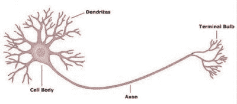
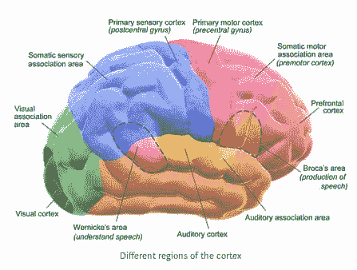
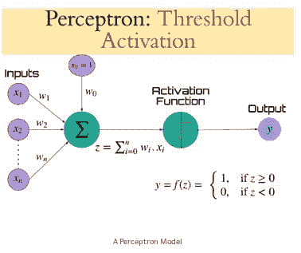
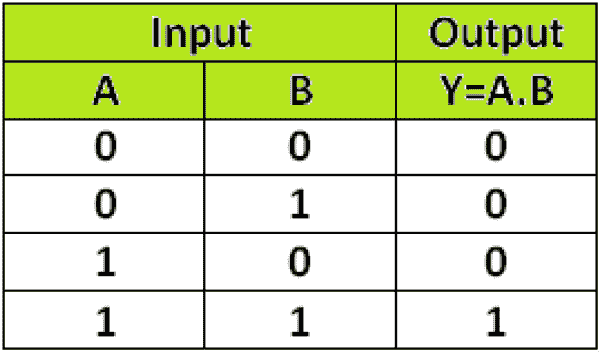
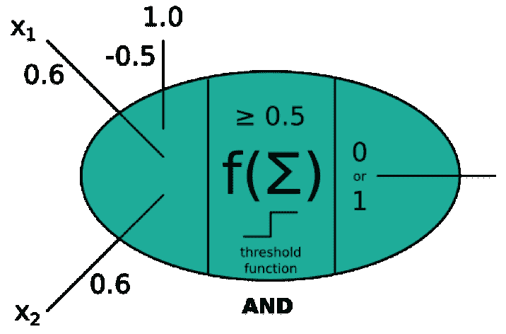
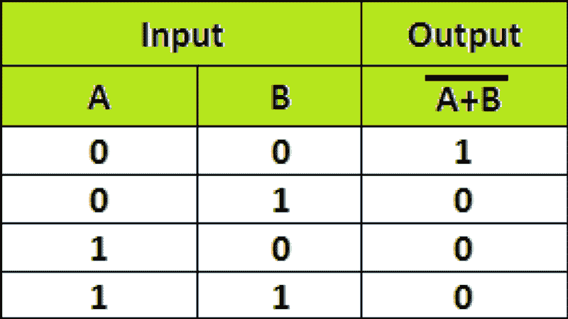
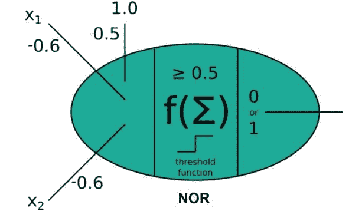

# 使用 Numpy 进行绝对初学者的神经网络：简介

> 原文：[`www.kdnuggets.com/2019/03/neural-networks-numpy-absolute-beginners-introduction.html`](https://www.kdnuggets.com/2019/03/neural-networks-numpy-absolute-beginners-introduction.html)

 评论

**由[Suraj Donthi](https://www.surajdonthi.com/)，计算机视觉顾问及 DataCamp 课程讲师**

人工智能已成为当今最热门的领域之一，我们大多数希望进入这一领域的人都从神经网络开始!!

但是，当面对神经网络中的数学密集概念时，我们最终只会学习一些框架，如 Tensorflow、Pytorch 等，用于实现深度学习模型。

此外，仅仅学习这些框架而不理解其基础概念就像在玩一个黑箱。

无论你是想在行业还是学术界工作，你都将涉及到模型的工作、调整和使用，这要求你对这些概念有清晰的理解。行业和学术界都期望你对这些概念，包括数学，有充分的了解。

在这一系列教程中，我将通过逐步讲解让神经网络变得非常简单易懂。此外，你需要的数学知识将是高中水平。

让我们从人工神经网络的起源开始，并获得一些关于其演变的灵感。

### 关于神经网络如何发展的简要历史

必须指出的是，大多数在 1950–2000 年间开发的神经网络算法，及其现存算法，都高度受到我们大脑、神经元的工作方式、其结构以及它们如何学习和传递数据的启发。最著名的作品包括感知机（1958 年）和新认知网络（1980 年）。这些论文在解开大脑代码方面极为重要。它们试图数学化地构建我们大脑中的神经网络模型。

一切都在 1986 年由人工智能教父 Geoffrey Hinton 公式化反向传播算法之后发生了变化（没错，你学习的内容已有 30 多年历史！）。

### 一个生物神经元

 上图展示了一个生物神经元。它有*树突*接收来自其他神经元的信息。接收到的信息会传递到神经元的*细胞体或细胞核*。*细胞核*是处理信息的地方，并通过*轴突*将信息传递给下一个神经元层。

我们的大脑包含大约 1000 亿个这样的神经元，它们通过电化学信号进行通信。每个神经元都连接到数百甚至数千个其他神经元，这些神经元不断地传递和接收信号。

但我们的脑袋是如何仅通过发送电化学信号来处理如此多的信息的？神经元如何理解哪个信号是重要的，哪个不是？神经元如何知道要传递什么信息？

电化学信号由强信号和弱信号组成。强信号决定了哪些信息是重要的。因此，只有强信号或它们的组合通过核（神经元的 CPU）传递，并通过轴突传输到下一组神经元。

那么，为什么有些信号强而有些信号弱呢？

通过数百万年的进化，神经元已经变得对某些类型的信号敏感。当神经元遇到特定模式时，它们会被触发（激活），从而向其他神经元发送强信号，因此信息得以传递。

我们大多数人也知道，大脑的不同区域在执行诸如视觉、听觉、创造性思维等不同动作时会被激活（或接收）。这是因为大脑中特定区域的神经元被训练以更好地处理某种信息，因此只有在特定信息传递时才会被激活。下图帮助我们更好地理解大脑的不同接收区域。

如果是这样的话… 神经元能否对不同的模式变得敏感（即，如果它们真的基于某些模式变得敏感）？

通过神经可塑性研究已显示，大脑的不同区域可以被重新连接以执行完全不同的任务。例如，负责触觉的神经元可以被重新连接以对嗅觉变得敏感。查看下面这个精彩的 TEDx 视频，以了解更多关于神经可塑性的内容。

TEDx 视频关于神经可塑性 [[Source]](https://www.youtube.com/watch?v=xzbHtIrb14s)

那么，神经元如何变得敏感呢？

不幸的是，神经科学家们仍在努力弄清楚这一点！！

但幸运的是，人工智能的奠基人 Geff 发明了反向传播，完成了对我们人工神经元的相同任务，即使它们对某些模式变得敏感。

在下一部分中，我们将探讨感知机的工作原理，并获得数学直觉。

### 感知机/人工神经元



从图中可以观察到，感知机是生物神经元的反映。与权重(*wᵢ*)结合的输入类似于树突。这些值被求和并通过激活函数（如图中所示的阈值函数）传递。这类似于核。最后，激活值传递到下一个神经元/感知机，这类似于轴突。

潜在的权重（*wᵢ*）与每个输入（*xᵢ*）相乘，表示各自输入信号的重要性（强度）。因此，权重值越大，特征就越重要。

从这个架构中你可以推断出，权重是感知器中学习到的内容，以便得到所需的结果。一个额外的偏置（*b*，这里是 *w₀*）也是学习到的。

因此，当输入有多个（假设为 *n*）时，方程可以推广为：


最终，求和的输出（假设为 *z*）被送入 *阈值激活函数*，该函数输出

### 一个例子



让我们考虑将感知器作为*逻辑门*来获得更多直观的理解。

让我们选择一个 *AND Gate*。该门的真值表如下所示：

*AND Gate* 的感知器可以如图所示。很明显，感知器有两个输入（这里是 *x₁ = A* 和 *x₂ = B*）。



我们可以看到，对于输入 *x₁, x₂* 和 *x₀* = 1，将它们的权重设置为


分别设置权重并保持 *阈值函数* 作为激活函数，我们可以得到 *AND Gate*。

现在，让我们动手实践，将这些内容编码并进行测试吧！

```py
def and_perceptron(x1, x2):

    w0 = -0.5
    w1 = 0.6
    w2 = 0.6

    z = w0 + w1 * x1 + w2 * x2

    thresh = lambda x: 1 if x>= 0.5 else 0

    r = thresh(z)
    print(r)
```

```py
>>>and_perceptron(1, 1)
```

```py
1
```

类似地，*NOR Gate* 的真值表是，



*NOR Gate* 的感知器将如下所示：



你可以将权重设置为


以便你能得到一个 *NOR Gate*。

你可以继续将其实现为代码，如下所示：

```py
def nor_perceptron(x1, x2):

    w0 = 0.5
    w1 = -0.6
    w2 = -0.6

    z = w0 + w1 * x1 + w2 * x2

    thresh = lambda x: 1 if x>= 0.5 else 0

    r = thresh(z)
    print(r)
```

```py
>>>nor_perceptron(1, 1)
```

```py
0
```

### 实际上你在计算的内容是…

如果你分析一下你在上述示例中所做的事情，你会发现你实际上是在调整权重值以获得所需的输出。

让我们考虑 *NOR Gate* 示例，并将其分解为非常细小的步骤以获得更好的理解。

通常你会首先设置一些权重值并观察结果，比如


然后输出将如下面的表格所示：


那么，你如何调整权重值以获得正确的输出呢？

根据直觉，你可以很容易地观察到，*w₀* 必须增加，而 *w₁* 和 *w₀* 必须减少或变为负值，以获得实际输出。但如果你深入分析这种直觉，你会发现你实际上是在找到实际输出和预测输出之间的差异，并最终将其反映到权重上……

这是一个非常重要的概念，你将深入挖掘，并将成为形成*梯度下降*和*反向传播*背后理念的核心。

### 你学到了什么？

+   神经元必须对模式变得敏感才能识别它。

+   因此，同样地，在我们的感知器/人工神经元中，**需要学习的是权重**。

在后续文章中，你将充分理解权重是如何被训练以识别模式的，以及存在的不同技术。

正如你稍后会看到的，神经网络与生物神经网络的结构非常相似。

虽然在本文的第一部分我们只学习了几个小概念（尽管非常重要），但它们将成为实现神经网络的坚实基础。此外，我保持这篇文章简短而精炼，以免一次性提供过多信息，有助于更好地吸收！

在下一个教程中，你将详细学习 **线性回归**（也可以称为具有线性激活函数的感知器），并进行实现。**帮助学习权重的梯度下降算法**将被详细描述和实现。最后，你将能够**利用线性回归预测事件的结果**。所以，前往下一篇文章进行实现吧！

你可以在这里查看文章的下一部分：

[**使用 Numpy 的神经网络绝对初学者 — 第二部分：线性回归**](https://medium.com/@surajdonthi95/neural-networks-with-numpy-for-absolute-beginners-part-2-linear-regression-e53c0c7dea3a)

**简历**： [Suraj Donthi](https://www.surajdonthi.com/) 是一位计算机视觉顾问、作者、机器学习和深度学习培训师。

[原文](https://towardsdatascience.com/neural-networks-with-numpy-for-absolute-beginners-introduction-c1394639edb2). 经许可转载。

**相关：**

+   神经网络 – 直观理解

+   反向传播算法揭秘

+   掌握学习率以加速深度学习

* * *

## 我们的前三大课程推荐

 1\. [谷歌网络安全证书](https://www.kdnuggets.com/google-cybersecurity) - 快速入门网络安全职业。

 2\. [谷歌数据分析专业证书](https://www.kdnuggets.com/google-data-analytics) - 提升你的数据分析技能

 3\. [谷歌 IT 支持专业证书](https://www.kdnuggets.com/google-itsupport) - 支持您的组织的 IT 工作

* * *

### 更多相关内容

+   [MLOps 的基础知识](https://www.kdnuggets.com/2022/09/absolute-basics-mlops.html)

+   [神经网络之前可以尝试的 10 件简单事情](https://www.kdnuggets.com/2021/12/10-simple-things-try-neural-networks.html)

+   [可解释的神经网络与 PyTorch](https://www.kdnuggets.com/2022/01/interpretable-neural-networks-pytorch.html)

+   [深度神经网络不会引领我们走向 AGI](https://www.kdnuggets.com/2021/12/deep-neural-networks-not-toward-agi.html)

+   [可解释的前瞻性和即时性预测的最前沿深度学习](https://www.kdnuggets.com/2021/12/sota-explainable-forecasting-and-nowcasting.html)

+   [卷积神经网络（CNNs）进行图像分类](https://www.kdnuggets.com/2022/05/image-classification-convolutional-neural-networks-cnns.html)
