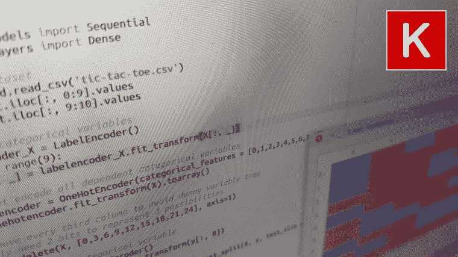
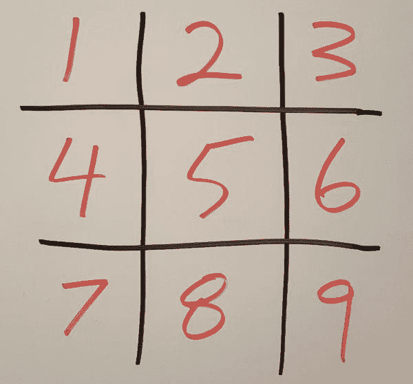
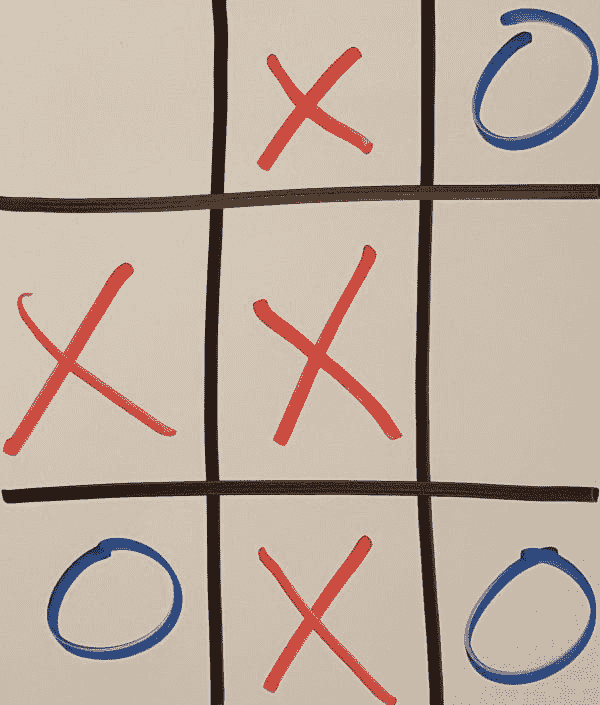
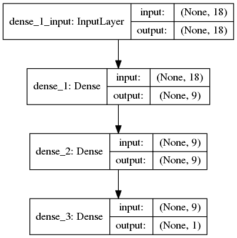

# Keras 教程：使用神经网络识别井字棋获胜者

> 原文：[`www.kdnuggets.com/2017/09/neural-networks-tic-tac-toe-keras.html`](https://www.kdnuggets.com/2017/09/neural-networks-tic-tac-toe-keras.html)



"[井字棋残局](https://archive.ics.uci.edu/ml/datasets/Tic-Tac-Toe+Endgame)" 是我几年前用来构建神经网络的第一个数据集。当时我并不真正知道自己在做什么，因此效果并不是很好。由于最近我花了很多时间在 Keras 上，我想再次尝试这个数据集，以演示如何使用 Keras 构建一个简单的神经网络。

* * *

## 我们的前 3 个课程推荐

 1\. [谷歌网络安全证书](https://www.kdnuggets.com/google-cybersecurity) - 快速进入网络安全职业生涯。

 2\. [谷歌数据分析专业证书](https://www.kdnuggets.com/google-data-analytics) - 提升你的数据分析技能

 3\. [谷歌 IT 支持专业证书](https://www.kdnuggets.com/google-itsupport) - 支持你的组织 IT

* * *

### 数据

该数据集，[可在此处获得](https://archive.ics.uci.edu/ml/datasets/Tic-Tac-Toe+Endgame)，是一个包含 958 种可能的井字棋残局板配置的集合，其中 9 个变量代表井字棋板上的 9 个方格，第十个类别变量指明描述的棋盘配置是否是玩家 X 的胜利（positive）或非胜利（negative）结局。简而言之，某个 X 和 O 的组合是否意味着 X 获胜？顺便提一下，[井字棋的可能玩法有 255,168 种](https://www.jesperjuul.net/ludologist/2003/12/28/255168-ways-of-playing-tic-tac-toe/)。

这里是数据的更正式描述：

```py` ``` 1\. 左上方格：{x,o,b}  2\. 上中方格：{x,o,b}  3\. 右上方格：{x,o,b}  4\. 左中方格：{x,o,b}  5\. 中中方格：{x,o,b}  6\. 右中方格：{x,o,b}  7\. 左下方格：{x,o,b}  8\. 下中方格：{x,o,b}  9\. 右下方格：{x,o,b}  10\. 类别：{positive,negative} ```py ````

如图所示，每个方格可以被标记为 X、O 或在游戏结束时留空（b）。变量到实际方格的映射见图 1。记住，结果是基于 X 是否获胜来决定的。图 2 展示了一个示例棋盘残局布局，随后是其数据集表示。



**图 1.** 变量到实际井字棋板位置的映射。



**图 2.** 示例棋盘残局布局。

```py` ```   b,x,o,x,x,b,o,x,o,positive ```py ````

### 准备工作

为了使用数据集构建神经网络，需要一些数据准备和转换。以下是这些步骤的概述，以及在代码中进一步的注释。

+   **将分类变量编码为数字** - 每个方格在原始数据集中表示为单一变量。然而，这对于我们的目的来说不可接受，因为神经网络需要具有连续值的变量。我们必须首先将 {x, o, b} 转换为 {0, 1, 2}。这将使用 Scikit-learn 的 [LabelEncoder 类](http://scikit-learn.org/stable/modules/generated/sklearn.preprocessing.LabelEncoder.html) 和 [预处理模块](http://scikit-learn.org/stable/modules/classes.html#module-sklearn.preprocessing) 来完成。

+   **对所有独立的分类变量进行独热编码** - 一旦分类变量被编码为数字，就需要进一步处理。由于这些变量是无序的（例如，X 不大于 O），这些变量必须表示为一系列位等效值。这可以通过独热编码来实现。由于每个方格有 3 种可能性，因此编码需要 2 位。这将通过 Scikit-learn 的 [OneHotEncoder 类](http://scikit-learn.org/stable/modules/generated/sklearn.preprocessing.OneHotEncoder.html) 来完成。

+   **删除每第三列以避免虚拟变量陷阱** - 由于 Scikit-learn 的独热编码过程为每个变量创建了与可能选项数量相等的列（根据数据集），因此需要删除一列以避免所谓的虚拟变量陷阱。这是为了避免冗余数据可能导致的结果偏差。在我们的情况下，每个方格有 3 个可能选项（27 列），可以用 2 列“位”来表示（我留给你确认），因此我们从新形成的数据集中删除每第三列（剩下 18 列）。

+   **编码目标分类变量** - 与独立变量类似，目标分类变量也必须从 {positive, negative} 更改为 {0, 1}。

+   **训练/测试集划分** - 这一点应该是可以理解的。我们将测试集设置为数据集的 20%。我们将使用 Scikit-learn 的 [训练/测试集划分功能](http://scikit-learn.org/stable/modules/generated/sklearn.model_selection.train_test_split.html) 来实现。

### 网络

接下来，我们需要构建神经网络，这将使用 [Keras](https://keras.io/) 完成。请记住，我们处理后的数据集有 18 个变量用作输入，我们进行的是二元分类预测作为输出。

+   **输入神经元** - 我们有 18 个独立变量，因此我们需要 18 个输入神经元。

+   **隐藏层** - 确定每个隐藏层神经元数量的一个简单（或许过于简单）——也可能完全无意义——起点是经验法则：将独立变量的数量和输出变量的数量相加，然后除以 2。如果我们决定向下取整，这将给我们 9。那么隐藏层的数量呢？最好的办法是从少量（隐藏层）开始，逐渐增加，直到网络准确率不再提高。我们将创建一个包含 2 个隐藏层的网络。

+   **激活函数** - 隐藏层和输出层神经元需要激活函数。一般规则规定：隐藏层神经元默认使用 ReLU 函数，而二分类输出层神经元使用 sigmoid 函数。我们将遵循惯例。

+   **优化器** - 我们将在网络中使用[Adam 优化器](https://medium.com/@nishantnikhil/adam-optimizer-notes-ddac4fd7218)。

+   **损失函数** - 我们将在网络中使用[交叉熵损失函数](http://neuralnetworksanddeeplearning.com/chap3.html#the_cross-entropy_cost_function)。

+   **权重初始化** - 我们将随机设置网络层神经元的初始随机权重。

以下是我们网络的*最终*外观。



**图 3。** 网络层的可视化。

### 代码

这是执行上述所有操作的代码。

### 结果

训练网络的最大准确率达到了 98.69%。在未见过的测试集中，神经网络正确预测了 186 个实例中的 180 个类别。

通过更改训练/测试划分的随机状态（这会改变用于测试最终网络的特定 20%的数据集实例），我们能够将其提高到 186 个实例中的 184 个。然而，这不一定是一个真正的指标改进。一个独立的验证集可能会对此有所启示……如果我们有的话。

通过使用不同的优化器（与 Adam 相对），以及更改隐藏层的数量和每个隐藏层的神经元数量，训练后的网络没有在损失、准确率或正确分类的测试实例方面超出上述报告的结果。

我希望这能为你构建 Keras 神经网络提供一个有用的介绍。下一个教程将介绍卷积神经网络的构建。

**相关**：

+   使用 R 和 Keras 进行深度学习

+   理解深度学习的 7 个步骤

+   深度网络架构的直观指南

### 更多相关内容

+   [使用 TensorFlow 和 Keras 构建和训练你的第一个神经网络](https://www.kdnuggets.com/2023/05/building-training-first-neural-network-tensorflow-keras.html)

+   [如何使用 Python 和机器学习预测足球比赛赢家](https://www.kdnuggets.com/2023/01/python-machine-learning-predict-football-match-winners.html)

+   [在神经网络之前可以尝试的 10 个简单方法](https://www.kdnuggets.com/2021/12/10-simple-things-try-neural-networks.html)

+   [使用 PyTorch 的可解释神经网络](https://www.kdnuggets.com/2022/01/interpretable-neural-networks-pytorch.html)

+   [深度神经网络不会引领我们走向 AGI](https://www.kdnuggets.com/2021/12/deep-neural-networks-not-toward-agi.html)

+   [最先进的深度学习中的可解释预测和实时预测](https://www.kdnuggets.com/2021/12/sota-explainable-forecasting-and-nowcasting.html)
