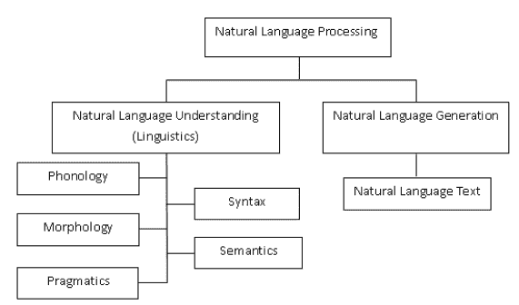
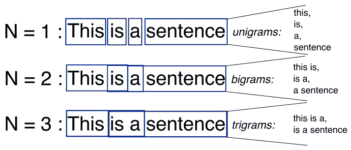

# 自然语言处理中的 N-gram 语言建模

> 原文：[`www.kdnuggets.com/2022/06/ngram-language-modeling-natural-language-processing.html`](https://www.kdnuggets.com/2022/06/ngram-language-modeling-natural-language-processing.html)

# 介绍

* * *

## 我们的前三个课程推荐

 1\. [谷歌网络安全证书](https://www.kdnuggets.com/google-cybersecurity) - 快速进入网络安全职业生涯

 2\. [谷歌数据分析专业证书](https://www.kdnuggets.com/google-data-analytics) - 提升您的数据分析技能

 3\. [谷歌 IT 支持专业证书](https://www.kdnuggets.com/google-itsupport) - 支持您的组织进行 IT 管理

* * *

语言建模用于确定单词序列的概率。这种建模有大量应用，如语音识别、垃圾邮件过滤等[1]。

# 自然语言处理（NLP）

自然语言处理（NLP）是[人工智能](https://algoscale.com/artificial-intelligence-solution-providers/)（AI）与语言学的融合。它用于使计算机理解用人类语言书写的单词或陈述。NLP 的开发旨在使与计算机的工作和沟通变得更简单、更令人满意。由于所有计算机用户无法完全掌握机器的特定语言，NLP 在那些没有时间学习新机器语言的用户中表现更好。我们可以将语言定义为一组规则或符号。符号组合用于传达信息，它们受规则集合的支配。NLP 被分为两个部分：自然语言理解和自然语言生成，这涉及理解和生成文本的任务。NLP 的分类如图 1 所示[2]。



图 1 NLP 的分类

# 语言建模的方法

语言建模的分类如下：

**统计语言建模**：在这种建模中，开发了概率模型。这个概率模型预测序列中的下一个单词。例如 N-gram 语言建模。该建模可用于消歧输入。它们可以用于选择可能的解决方案。这种建模依赖于概率理论。概率是预测某事发生的可能性。

**神经语言建模**：神经语言建模比经典方法在独立模型以及当模型融入更大模型中，如语音识别和机器翻译等挑战性任务中，均能取得更好的结果。执行神经语言建模的一种方法是通过词嵌入[1]。

# NLP 中的 N-gram 建模

N-gram 是在自然语言处理建模中用于表示 N 个词序列的模型。以建模的语句为例：“我喜欢阅读历史书籍和观看纪录片”。在一元模型（unigram）中，序列由一个词构成。对于上述语句，在一元模型中可以是“I”、“love”、“history”、“books”、“and”、“watching”、“documentaries”。在二元模型（bi-gram）中，序列由两个词构成，即“I love”、“love reading”或“history books”。在三元模型（tri-gram）中，序列由三个词构成，即“I love reading”、“history books”或“and watching documentaries”[3]。N-gram 模型的示意图（N=1,2,3）见下图 Figure 2 [5]。



图 2 一元、二元和三元模型

对于 N-1 个词，N-gram 模型预测可以跟随序列的最常出现的词。该模型是一种概率语言模型，基于文本集合进行训练。该模型在应用中非常有用，例如语音识别和机器翻译。简单的模型有一些局限性，可以通过平滑、插值和回退进行改进。因此，N-gram 语言模型的目标是找到词序列的概率分布。考虑以下句子：“There was heavy rain”和“There was heavy flood”。通过经验可以说，第一个句子更好。N-gram 语言模型会指出“heavy rain”出现的频率高于“heavy flood”。因此，第一个句子更可能出现，并会被该模型选择。在一元模型中，模型通常依赖于词的频率，而不考虑之前的词。在二元模型中，仅考虑前一个词来预测当前词。在三元模型中，考虑两个前一个词。在 N-gram 语言模型中计算以下概率：

```py
P (“There was heavy rain”) = P (“There”, “was”, “heavy”, “rain”) = P (“There”) P (“was” |“There”) P (“heavy”| “There was”) P (“rain” |“There was heavy”).
```

由于计算条件概率并不实际，但通过使用“*Markov Assumptions*”，可以近似为二元模型[4]：

```py
P (“There was heavy rain”) ~ P (“There”) P (“was” |“'There”) P (“heavy” |“was”) P (“rain” |“heavy”)
```

# N-gram 模型在自然语言处理中的应用

在语音识别中，输入可能会受到噪声的干扰。这种噪声可能导致错误的语音到文本的转换。N-gram 语言模型通过使用概率知识来纠正噪声。同样，这种模型也用于机器翻译，以生成目标语言中更自然的语句。在拼写错误纠正方面，字典有时会无用。例如，“in about fifteen minutes”中的“minuets”在字典中是一个有效的词，但在短语中是不正确的。N-gram 语言模型可以纠正这种类型的错误。

N-gram 语言模型通常应用于词级别。它也用于字符级别进行词干提取，即分离根词和后缀。通过查看 N-gram 模型，可以对语言进行分类或区分美国和英国的拼写。许多应用程序从 N-gram 模型中受益，包括词性标注、自然语言生成、词语相似性和情感提取[4]。

# N-gram 模型在 NLP 中的局限性

N-gram 语言模型也存在一些局限性。存在词汇外问题。这些词在测试时出现但在训练时未出现。一种解决方案是使用固定词汇表，然后将训练中的词汇外词转换为伪词。当应用于情感分析时，二元模型优于单元模型，但特征数量翻倍。因此，将 N-gram 模型扩展到更大的数据集或提高阶数需要更好的特征选择方法。N-gram 模型对长距离上下文的捕捉较差。研究显示，每 6-gram 之后，性能提升有限。

## 参考文献

1.  (N-Gram 语言建模与 NLTK, 2021 年 5 月 30 日)

1.  (Diksha Khurana, Aditya Koli, Kiran Khatter, Sukhdev Singh, 2017 年 8 月)

1.  (Mohdsanadzakirizvi, 2019 年 8 月 8 日)

1.  (N-Gram 模型, 3 月 29 日)

1.  (N-Gram)

**[Neeraj Agarwal](https://www.linkedin.com/in/neeagl/)** 是 [Algoscale](https://www.linkedin.com/company/algoscale) 的创始人，这是一家涵盖数据工程、应用人工智能、数据科学和产品工程的数据咨询公司。他在该领域有超过 9 年的经验，帮助了从初创公司到财富 100 强公司的广泛组织摄取和存储大量原始数据，从而将其转化为可操作的见解，以便做出更好的决策和更快的商业价值。

### 相关主题

+   [自然语言处理关键术语解释](https://www.kdnuggets.com/2017/02/natural-language-processing-key-terms-explained.html)

+   [自然语言处理任务的数据表示](https://www.kdnuggets.com/2018/11/data-representation-natural-language-processing.html)

+   [图像识别和自然语言处理的迁移学习](https://www.kdnuggets.com/2022/01/transfer-learning-image-recognition-natural-language-processing.html)

+   [如何开始使用 PyTorch 进行自然语言处理](https://www.kdnuggets.com/2022/04/start-natural-language-processing-pytorch.html)

+   [自然语言处理的温和介绍](https://www.kdnuggets.com/2022/06/gentle-introduction-natural-language-processing.html)

+   [使用 spaCy 进行自然语言处理](https://www.kdnuggets.com/2023/01/natural-language-processing-spacy.html)
