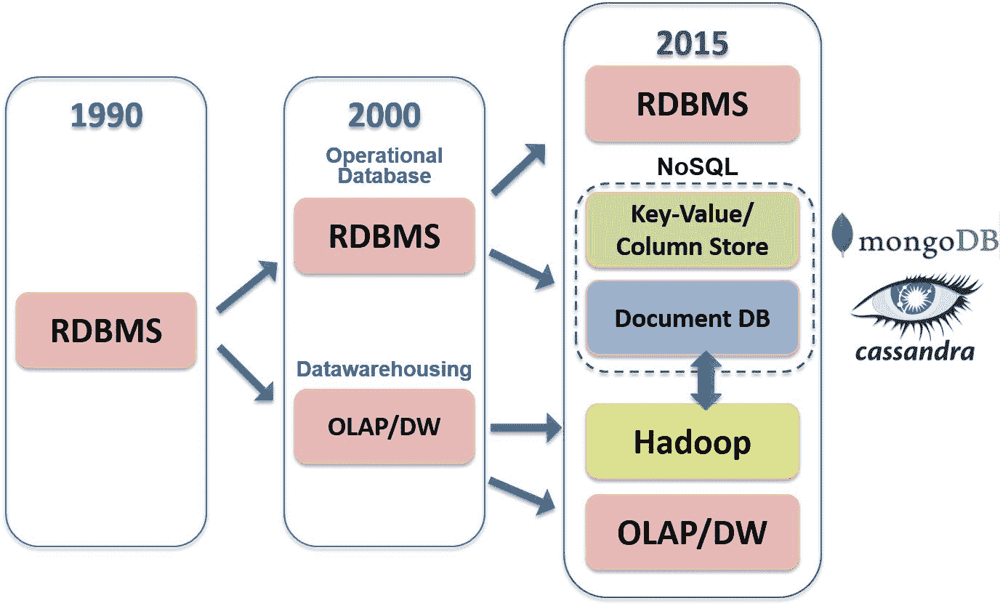

# NoSQL 初学者

> 原文：[`www.kdnuggets.com/2020/12/nosql-beginners.html`](https://www.kdnuggets.com/2020/12/nosql-beginners.html)

评论

### 什么是 NoSQL？

NoSQL 实际上是对 SQL 刚性结构的回应。最初创建于 1970 年代初期，NoSQL 直到 2000 年代末才真正起飞，那时亚马逊和谷歌都投入了大量的研究和开发。自那时以来，它成为现代世界的重要组成部分，许多全球的大型网站都使用某种形式的 NoSQL。

那么 NoSQL 到底是什么？本质上，它是一种创建数据库的理念，*不* 需要模式，也*不* 以关系模型存储数据。实际上，NoSQL 有多种 [NoSQL 数据库](https://hostingdata.co.uk/nosql-database/) 可供选择，每种都有自己的专业化和使用案例。因此，NoSQL 在填补细分市场方面极其多样，你几乎可以肯定找到适合你需求的 NoSQL 数据模型。

* * *

## 我们的三大课程推荐

 1\. [Google 网络安全证书](https://www.kdnuggets.com/google-cybersecurity) - 快速进入网络安全职业生涯。

 2\. [Google 数据分析专业证书](https://www.kdnuggets.com/google-data-analytics) - 提升你的数据分析技能

 3\. [Google IT 支持专业证书](https://www.kdnuggets.com/google-itsupport) - 支持组织的 IT 需求

* * *

### SQL 与 NoSQL 的区别

虽然 SQL *是* 一种特定的数据库和语言，但 NoSQL 不是，但这并不意味着我们不能探讨两者之间的一般理念和区别。

### 可扩展性

对于 SQL，唯一真正的扩展方式是垂直升级。这意味着你需要购买比现有设备更高端、更昂贵的设备，以获得更好的性能。 [使用 NoSQL 扩展](https://www.infoworld.com/article/2609739/scaling-and-querying-large-nosql-databases.html) 是通过水平扩展完成的，所以你只需再加入一个分片，基本就完成了。

这意味着 NoSQL 对于未来可能增长的应用程序来说绝对是很棒的，其中硬件可能成为一个重要障碍。

### 模式

SQL 从根本上构建，以*避免* 数据重复。这*最终* 意味着任何 SQL 项目都需要一位专家设计师在实施之前花费很长时间在模式上。这个步骤不仅在长期内对维护 [数据质量](https://www.mssqltips.com/sqlservertip/6210/sql-server-best-practices-for-data-quality/) 很重要，而且也可能相当昂贵。

另一方面，由于 NoSQL 不要求使用模式，你可以避免初始设计阶段的费用和时间。此外，缺乏模式意味着大多数 NoSQL 数据库具有极大的灵活性，允许你更改甚至混合数据类型和模型。这使得数据库的管理和处理变得更加容易。

### 性能

使用 SQL 查询数据通常需要跨多个表进行。使用 NoSQL 时，所有数据都包含在一个表中，因此查询要容易得多。这也导致了 [NoSQL 更擅长](https://softwareengineering.stackexchange.com/questions/175542/why-is-nosql-faster-than-sql) 处理高性能任务。例如，Amazon DB 每秒可以处理数百万个查询，这对像 Amazon 这样的全球商店非常有用。

### 支持

关于 NoSQL 的唯一真正的大缺点是，它没有 SQL 那么成熟。请记住，SQL 有几十年的发展历程，这种成熟度体现在信息检索的便捷性上。同样，找到 SQL 专家要比找到 NoSQL 专家容易得多。

最后，由于 NoSQL 不是单一的数据库或语言，而是数十种数据模型，这种细粒度进一步分化了任何潜在的专业知识，使 NoSQL 成为一个专业化的领域。因此，信息和支持的依赖主要会集中在较小的社区中。

### NoSQL 数据库的类型

虽然有超过半打的 NoSQL 数据模型可供选择，但我们将在这里介绍四种主要模型，这些模型对 理解 NoSQL 数据库 至关重要。

**文档存储**

这种数据模型允许你将信息存储为任何类型的数据。这与 SQL 相对立，后者严重依赖 XML 和 JSON，本质上将二者结合起来，这可能使任何查询变得低效（或效率较低）。由于 NoSQL 不使用模式，因此无需进行关系数据存储，也无需将二者结合起来。

事实上，如果你愿意，还可以选择一个特定于 XML 的 NoSQL 数据模型。

**图形**

图形或网络数据模型围绕数据之间的关系这一概念构建。在这种数据模型中，信息以关系和节点的形式存储，节点保存数据，关系描述任何一组节点之间的关系。

正如名称所示，如果你一直在关注的话，这是一种展示图表信息的优秀数据模型。从不同数据集的快速可视化能力，尤其是彼此之间的关系，能够提供大量洞察，无需翻阅几百页的数据。

**键值存储**

正如其名称所示，这种数据模型使用键和指针来存储信息。由于键和值都可以是你想要的任何数据，键值存储数据模型非常灵活。它的目的是为了检索、存储和管理数组，适合高容量应用。

实际上，Amazon DB 是一种键值存储数据模型，这种数据模型类型是由 Amazon 自己首创的。键值存储也是一个通用类别，其中还存在其他数据模型，一些图数据模型本质上也像键值存储。

**面向列的**

与 SQL 传统上按行存储数据不同，面向列的数据模型按列存储数据。这些列被分组到家庭中，每个家庭可以包含几乎无限数量的列。写入和读取也按列进行，因此整个系统非常高效，旨在实现快速搜索与访问以及数据聚合。

尽管如此，它在复杂查询方面并不是很好。

### 结论

需要记住的一点是，NoSQL 不是为了替代 SQL，而是为了补充 SQL。NoSQL 本身主要使用专门的数据库 来填补 SQL 的不足，虽然你完全可以选择不使用 SQL，但 NoSQL 并不*排除*使用 SQL。有时你可能会同时使用 SQL 和 NoSQL。

**简历： [亚历克斯·威廉姆斯](https://hostingdata.co.uk/author/alex-williams/)** 是一位经验丰富的全栈开发者，也是 [Hosting Data UK](https://hostingdata.co.uk/) 的所有者。亚历克斯在伦敦大学毕业，主修信息技术，之后作为开发者领导了来自世界各地客户的各种项目，工作近 10 年。最近，亚历克斯转为独立 IT 顾问并开设了自己的博客。在博客中，他探讨了网页开发、数据管理、数字营销以及为刚起步的在线企业主提供解决方案。

**相关：**

+   如何获得最受欢迎的数据科学技能

+   在 Azure Databricks 上使用 Spark、Python 或 SQL

+   5 个棘手的 SQL 查询解决方案

### 更多相关主题

+   [停止学习数据科学以寻找目标，并寻找目标去…](https://www.kdnuggets.com/2021/12/stop-learning-data-science-find-purpose.html)

+   [一个 90 亿美元的 AI 失败案例，审视](https://www.kdnuggets.com/2021/12/9b-ai-failure-examined.html)

+   [学习数据科学统计的顶级资源](https://www.kdnuggets.com/2021/12/springboard-top-resources-learn-data-science-statistics.html)

+   [成功数据科学家的 5 个特征](https://www.kdnuggets.com/2021/12/5-characteristics-successful-data-scientist.html)

+   [是什么让 Python 成为初创企业的理想编程语言](https://www.kdnuggets.com/2021/12/makes-python-ideal-programming-language-startups.html)

+   [每个数据科学家都应该了解的三个 R 库（即使你使用 Python）](https://www.kdnuggets.com/2021/12/three-r-libraries-every-data-scientist-know-even-python.html)
