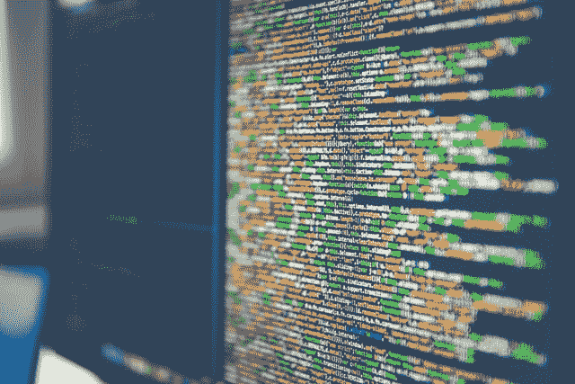
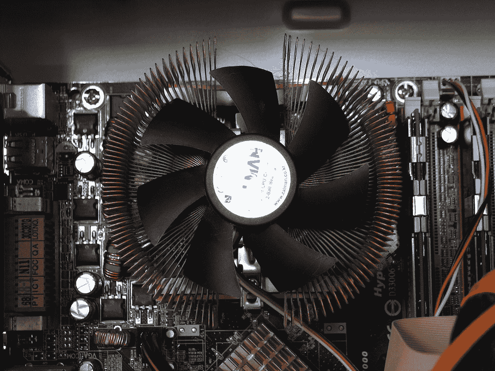
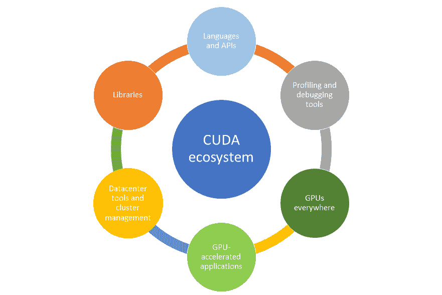
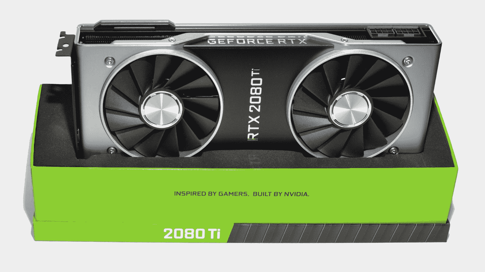

# 如何使用 NVIDIA GPU 加速库

> 原文：[`www.kdnuggets.com/2021/07/nvidia-gpu-accelerated-libraries.html`](https://www.kdnuggets.com/2021/07/nvidia-gpu-accelerated-libraries.html)

评论

### 如何使用 NVIDIA GPU 加速库进行 AI

如果你正在进行 AI 项目，那么是时候利用 [NVIDIA GPU](https://www.sabrepc.com/NVIDIA-GPU-Solutions) 加速库了，如果你还没有这样做的话。直到 2000 年代末，AI 项目才通过 GPU 训练的[神经网络](https://www.sabrepc.com/blog/Deep-Learning-and-AI/6-types-of-neural-networks-to-know-about)变得可行，从而大幅加速了这一过程。从那时起，NVIDIA 便开始制造一些最佳的深度学习 GPU，使得 GPU 加速库成为 AI 项目的热门选择。

如果你想知道如何利用 NVIDIA GPU 加速库进行 AI 项目，这个指南将帮助解答问题，并让你走上正确的道路。

### 为什么要使用 NVIDIA GPU 加速库进行 AI？

*关于 NVIDIA CUDA-X 库的演示，[图片来源](https://www.hardwarezone.com.sg/feature-how-cuda-x-ai-and-supporting-hardware-will-power-data-science-new-pillar-discovery)*

说到 AI 或更广泛的机器学习，使用 GPU 加速库是一个很好的选择。GPU 具有显著更多的核心和大量的内存带宽，这使得 GPU 能够以高速进行并行处理——这是大多数机器学习项目的必需条件。

使用 GPU 进行 AI 和深度学习已经成为解析极其复杂的数学矩阵的常规方法。NVIDIA GPU 的并行处理能力使它们能够轻松分解这些矩阵。利用 GPU 加速库进行下一次 AI 项目将*最终*是最快和最有效的解决方案。

**最终，虽然 CPU *****可以***** 用于操作深度学习项目中的神经网络，但它们根本无法超越 GPU 加速库。**

### 哪款 NVIDIA GPU 最适合 AI？

*计算机屏幕上的编码，[图片来源](https://unsplash.com/photos/Skf7HxARcoc)*

简单来说，最佳的图形渲染 GPU 通常也是 AI 项目的最佳选择。然而，GPU 需要足够强大。GPU 的处理能力越强，神经网络的解析能力也就越强。

实际上，在选择一个 [NVIDIA GPU](https://www.sabrepc.com/Video-Cards?filters=manufacturer::NVIDIA)时，有几个因素需要考虑：

+   **兼容性**

+   **热设计功耗（TDP）值**

+   **内存**

+   **CUDA**

### 兼容性

尽管这是一个基本因素，但它可能是最重要的因素之一。如果你的 GPU 与 PC 配置不**兼容**，那么一切都毫无意义。务必仔细检查，确保你购买的 GPU 符合 PC 的要求。

### TDP（热设计功耗）值

*用于冷却计算机的风扇，[图片来源](https://commons.wikimedia.org/wiki/File:Silent_PC-CPU_fan.JPG)*

GPU 在处理大量数据时可能会变热。制造商标示的**TDP 值**将告诉你安全范围是什么。在许多情况下，需要一个[冷却系统](https://www.sabrepc.com/Processor-Accessories)来降低热量并提高性能。

### 内存

神经网络可能包含大量需要处理和存储的数据（即使只是暂时存储）。你需要一个具有良好**内存**容量的 GPU，以确保尽可能平稳地运行。

### CUDA

*CUDA 生态系统图，[图片来源](https://developer.nvidia.com/blog/cuda-refresher-the-gpu-computing-ecosystem/)*

**[CUDA](https://developer.nvidia.com/cuda-zone)** 是 NVIDIA 设计的并行计算平台。它是机器学习、深度学习和 AI 的行业标准。**CUDA** 核心越多，处理能力越强。

### 使用哪些 GPU 进行人工智能（AI）？

### [NVIDIA GeForce RTX 2080 Ti Founders Edition](https://www.sabrepc.com/900-1G150-2530-000-NVIDIA-S1847353)

*GeForce RTX 2080 Ti Founders Edition 在盒子里，[图片来源](https://www.pcgamer.com/nvidia-geforce-rtx-2080-ti-founders-edition-review/)*

为了给你一个选择 NVIDIA GPU 的参考，我们强烈推荐[GeForce RTX 2080 Ti Founders Edition](https://www.sabrepc.com/900-1G150-2530-000-NVIDIA-S1847353)。这款 GPU 在每个基准测试中都表现超凡！尽管它不是 NVIDIA 最新的 GPU，并且只有[RTX 3080 Ti](https://www.sabrepc.com/ZT-A30810F-10P-ZOTAC-S136215957)的一半 CUDA 核心，但价格显著较低，使其成为一个很好的入门级 GPU。然而，如果你能负担得起更新的 GPU 并且它适合你的 PC 配置，那就毫不犹豫选择较新的型号吧！

[Tom's Guide](https://www.tomsguide.com/news/nvidia-Rrtx-3080-vs-rtx-2080-ti) 对 RTX 2080 Ti 和 RTX 3080 Ti 进行了很好的比较。

就**兼容性**而言，它比一些其他 GPU 稍微宽一点、长一点，而且**TDP 值**为 260 W，比标准 GPU 稍高。

它拥有 11BG 的充足**内存**和 616 GB/s 的**内存带宽**，**CUDA** 拥有高达 *4352 个核心*。在[RTX 2080 Ti Founders Edition](https://www.sabrepc.com/900-1G150-2530-000-NVIDIA-S1847353) GPU 中，包含了大量的并行处理能力。

### NVIDIA GPU 加速库有哪些不同类型？

*各种 Python 库，[图片来源](https://towardsdatascience.com/best-python-libraries-for-machine-learning-and-deep-learning-b0bd40c7e8c)*

NVIDIA 发布了**CUDA-X**，这与上面提到的**CUDA**相同，但性能大幅提升。通过**CUDA-X**访问的 GPU 加速库从高性能计算（HPC）到人工智能及其间的所有内容。

### 6 个 NVIDIA GPU 加速库用于人工智能与深度学习

NVIDIA 在谈论他们的 GPU 加速库时说得最好：

*NVIDIA® CUDA-X，基于 NVIDIA CUDA®，是一个库、工具和技术的集合，提供比 CPU 单核替代方案显著更高的性能——跨越多个应用领域，从人工智能（AI）到高性能计算（HPC）……**库提供了高度优化的算法和函数，你可以将其融入到你新的或现有的应用程序中……许多 GPU 加速库被设计为非常容易替代现有的 CPU 库，最大限度地减少对现有代码的影响。***

这里有**六个** NVIDIA GPU 加速库，你可以将它们融入到你的深度学习或人工智能项目中。

### [数学库](https://developer.nvidia.com/cuda-math-library)

当你使用高性能计算进行复杂或密集的数学运算时，利用 GPU 加速库可以极为有用。这些**数学库**可以用于将基础、中级和复杂的算法和方程式构建到你的项目中，这对化学、医学影像、流体动力学、地震勘探以及许多其他常见应用场景都很有用。

以下是当前的数学库列表：

+   [cuBLAS](https://developer.nvidia.com/cublas): GPU 加速的基础线性代数（BLAS）库

+   [cuFFT](https://developer.nvidia.com/cufft): 用于快速傅里叶变换的 GPU 加速库

+   [CUDA 数学库](https://developer.nvidia.com/cuda-math-library): GPU 加速的标准数学函数库

+   [cuRAND](https://developer.nvidia.com/curand): GPU 加速的随机数生成（RNG）

+   [cuSOLVER](https://developer.nvidia.com/cusolver): GPU 加速的稠密和稀疏直接解算器

+   [cuSPARSE](https://developer.nvidia.com/cusparse): GPU 加速的稀疏矩阵 BLAS

+   cuTENSOR: GPU 加速的张量线性代数库

+   [AmgX](https://developer.nvidia.com/amgx): 用于模拟和隐式非结构化方法的 GPU 加速线性解算器

**如何使用 NVIDIA 数学库？**

这个标准数学计算和函数的集合很容易通过使用“#include math.h”添加到你的源代码中，安装也非常简单。NVIDIA 提供了一个很棒的[快速入门指南](https://docs.nvidia.com/cuda/cuda-quick-start-guide/index.html)来帮助你入门。

### [并行算法库](https://developer.nvidia.com/gpu-accelerated-libraries#parallel-alg)

**并行算法库** 是用于生成图表和研究数据点间关系的高效算法。这些库非常适合各种可观测科学、物流以及任何需要对大量数据点得出结论的项目。

**如何使用 NVIDIA 并行算法库**

如果你在 C++ 操作中研究数据点间的关系，那么 NVIDIA **并行算法库** 是你数据结构需求的完美、高效解决方案。

目前提供的并行算法库如下：

+   [Thrust](https://developer.nvidia.com/thrust)：Thrust 是一个强大的并行算法库，通过高质量和灵活的 GPU 编程及编程接口，显著提高开发者的生产力。

NVIDIA 提供了一个 [快速入门指南](http://docs.nvidia.com/cuda/thrust/index.html)，帮助你开始使用 Thrust 提供的 **并行算法** 序列。

### [图像和视频库](https://developer.nvidia.com/gpu-accelerated-libraries#signal)

如果你在进行深度学习或 AI 项目，处理视觉数据，那么 **图像和视频库** 将是你项目的重要组成部分。这些库用于解码图像和视频，以便进行处理、重新编码，并由各种程序（包括神经网络）使用。

目前提供的图像和视频库如下：

+   [nvJPEG](https://developer.nvidia.com/nvjpeg)：高性能 GPU 加速的 JPEG 解码库。

+   [NVIDIA 性能原语](https://developer.nvidia.com/npp)：提供 GPU 加速的图像、视频和信号处理功能。

+   [NVIDIA 视频编解码 SDK](https://developer.nvidia.com/nvidia-video-codec-sdk)：一整套用于 Windows 和 Linux 的硬件加速视频编码和解码的 API、示例和文档。

+   [NVIDIA 光流 SDK](https://developer.nvidia.com/opticalflow-sdk)：暴露了 NVIDIA Turing™ GPU 在计算图像之间像素相对运动方面的最新硬件能力。

**如何使用 NVIDIA 图像和视频库**

为了充分利用 **CUDA** 的 GPU 处理能力，NVIDIA 提供了众多库供选择。这些库可以满足你所有的图像和视频解码、编码及处理需求。

要深入了解 **图像和视频库**，你可以探索 [nvJPEG 文档](https://docs.nvidia.com/cuda/nvjpeg/index.html) 开始使用。

### [通信库](https://developer.nvidia.com/gpu-accelerated-libraries#comm)

这些库可能具有一些较为小众的用途，但**通信库**是 GPU 加速库所能做的一个很好的例子。它们优化了多个 GPU 之间的通信能力，大幅提升了其他 NVIDIA 库的速度、性能和效率。

下面是当前可用的通信库：

+   [NVSHMEM](https://developer.nvidia.com/nvshmem)：GPU 内存的 OpenSHMEM 标准，具有改进 GPU 性能的扩展。

+   [NCCL](https://developer.nvidia.com/nccl)：开源库，用于快速的多 GPU、多节点通信，最大化带宽同时保持低延迟。

**如何使用 NVIDIA 通信库**

如果你正在使用多个 GPU，那么这些库将优化所有 GPU 和多节点通信的功能。

如果你想深入了解这些**通信库**，可以查看此[NVSHMEM 文档](https://docs.nvidia.com/hpc-sdk/nvshmem/index.html)。

### [深度学习库](https://developer.nvidia.com/gpu-accelerated-libraries#deep-learning)

现在，对于这篇文章来说，**深度学习库**是讨论的最重要的库。这些库利用**CUDA**实现最佳使用和性能，同时还利用 GPU 的一些专门组件。这样可以在并行处理和运行时之间实现最佳灵活性。

大多数用于 AI 项目的**深度学习库**将使用多个其他库来执行神经网络中所需的所有功能。

下面是当前可用的深度学习库：

+   [NVIDIA cuDNN](https://developer.nvidia.com/cudnn)：用于深度神经网络的 GPU 加速原语库。

+   [NVIDIA TensorRT™](https://developer.nvidia.com/tensorrt)：高性能的深度学习推理优化器和生产部署运行时。

+   [NVIDIA Jarvis](https://developer.nvidia.com/nvidia-jarvis)：用于开发引人入胜且具有上下文感知的 AI 驱动对话应用的平台。

+   [NVIDIA DeepStream SDK](https://developer.nvidia.com/deepstream-sdk)：用于 AI 视频理解和多传感器处理的实时流式分析工具包。

+   [NVIDIA DALI](https://developer.nvidia.com/DALI)：便携式的开源库，用于解码和增强图像及视频，以加速深度学习应用。

**如何使用 NVIDIA 深度学习库**

从实时流式分析到优化，这些 GPU 加速库针对**深度学习**的设计旨在利用**CUDA**和你 GPU 硬件的细节，以实现最佳的神经网络性能。

查看此[NVIDIA DALI 文档](https://docs.nvidia.com/deeplearning/dali/user-guide/docs/index.html)以熟悉这些**深度学习库**的可能交付内容。

### [合作伙伴库](https://developer.nvidia.com/gpu-accelerated-libraries#partner-libraries)

这些是 NVIDIA 纳入了**CUDA**和**CUDA-X**的开源库，以扩展 NVIDIA GPU 加速库的有用性和适应性。**合作伙伴库**为您提供更多选项和能力，以从深度学习或人工智能项目中获得最佳结果。

以下是当前可用的合作伙伴库：

+   [OpenCV](https://developer.nvidia.com/opencv)：用于计算机视觉、图像处理和机器学习的 GPU 加速开源库，现在支持实时操作。

+   [FFmpeg](https://developer.nvidia.com/ffmpeg)：一个开源多媒体框架，提供用于音频和视频处理的插件库。

+   [ArrayFire](https://developer.nvidia.com/arrayfire)：用于矩阵、信号和图像处理的 GPU 加速开源库。

+   [MAGMA](https://developer.nvidia.com/magma)：由 Magma 提供的针对异构架构的 GPU 加速线性代数例程。

+   [IMSL Fortran 数值库](https://developer.nvidia.com/imsl-fortran-numerical-library)：由 RogueWave 提供的 GPU 加速开源 Fortran 库，具有数学、信号和图像处理、统计功能。

+   [Gunrock](https://gunrock.github.io/docs/)：专为 GPU 设计的图处理库。

+   [CHOLMOD](https://developer.nvidia.com/cholmod)：用于稀疏直接求解器的 GPU 加速函数，包含在 SuiteSparse 线性代数包中，由教授编写。

+   [Triton Ocean SDK](https://developer.nvidia.com/triton-ocean-sdk)：由 Triton 提供的海洋、游戏中的水体、模拟和训练应用的实时视觉模拟。

+   [CUVIlib](https://cuvilib.com/)：用于加速医疗、工业和国防领域图像应用的原语。

**如何使用 NVIDIA 合作伙伴库**

这些**合作伙伴库**提供了开源项目的灵活性，并结合了**CUDA**的强大功能，为您的项目提供最佳选择。

可用的**合作伙伴库**列表不断扩展，请务必查看不断增长的列表[这里](https://developer.nvidia.com/gpu-accelerated-libraries#partner-libraries)，找到适合您特定项目和需求的最佳合作伙伴库！

### 在其他文章中获取更多有用的见解

哪些 GPU 加速库最适合您的深度学习、机器学习、人工智能或其他项目？是否有我们遗漏的内容您希望我们涵盖？我们希望帮助您做出最佳决策，请与我们联系！

您可以在[SabrePC 博客](https://www.sabrepc.com/blog)上找到其他文章。请关注即将发布的更多有用文章。如果您有任何问题或希望建议我们关注其他主题，请随时[联系我们](https://www.sabrepc.com/Contact-Us)。

[原文](https://www.sabrepc.com/blog/Deep-Learning-and-AI/how-to-use-nvidia-gpu-accelerated-libraries)。经许可转载。

**相关：**

+   通过 Saturn Cloud 使用 Pandas 在 GPU 上超充 Python

+   作为数据科学家管理你的可重用 Python 代码

+   告别大数据。你好，海量数据！

* * *

## 我们的前 3 个课程推荐

 1\. [Google 网络安全证书](https://www.kdnuggets.com/google-cybersecurity) - 快速进入网络安全职业生涯。

 2\. [Google 数据分析专业证书](https://www.kdnuggets.com/google-data-analytics) - 提升你的数据分析技能

 3\. [Google IT 支持专业证书](https://www.kdnuggets.com/google-itsupport) - 支持你的组织 IT 需求

* * *

### 进一步了解此话题

+   [掌握 GPU：初学者的 GPU 加速数据框指南](https://www.kdnuggets.com/2023/07/mastering-gpus-beginners-guide-gpu-accelerated-dataframes-python.html)

+   [构建 GPU 机器 vs. 使用 GPU 云](https://www.kdnuggets.com/building-a-gpu-machine-vs-using-the-gpu-cloud)

+   [宣布博客写作比赛，获胜者将获得 NVIDIA GPU！](https://www.kdnuggets.com/2022/11/blog-writing-contest-nvidia-gpu.html)

+   [RAPIDS cuDF 在 Google Colab 上加速数据科学](https://www.kdnuggets.com/2023/01/rapids-cudf-accelerated-data-science-google-colab.html)

+   [使用 RAPIDS cuDF 利用 GPU 进行特征工程](https://www.kdnuggets.com/2023/06/rapids-cudf-leverage-gpu-feature-engineering.html)

+   [生成式 AI 游乐场：Camel-5b 和 Open LLaMA 3B 的 LLMs…](https://www.kdnuggets.com/2024/02/intel-generative-ai-playground-llms-with-camel-5b-and-open-llama-3b)
