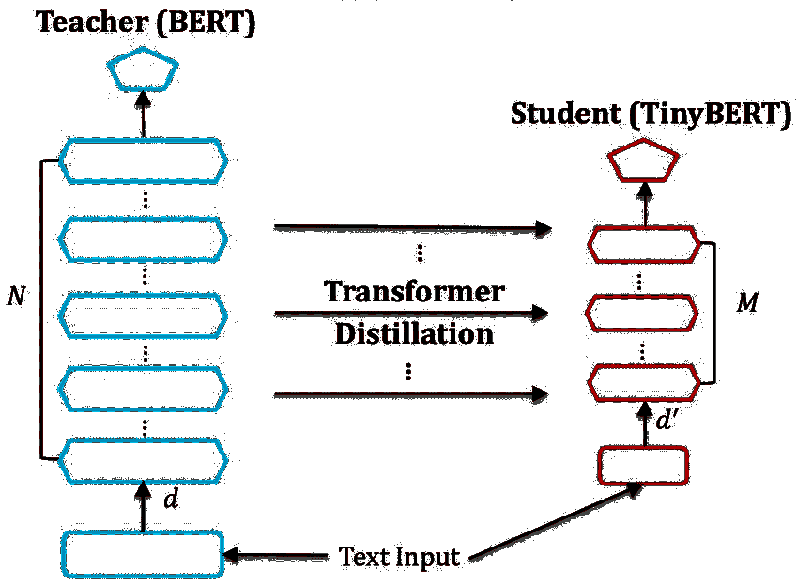

# oBERT: 复合稀疏化为 NLP 提供更快、更准确的模型

> 原文：[`www.kdnuggets.com/2022/05/obert-compound-sparsification-delivers-faster-accurate-models-nlp.html`](https://www.kdnuggets.com/2022/05/obert-compound-sparsification-delivers-faster-accurate-models-nlp.html)

比较了在 SQuAD 数据集上，The Optimal BERT Surgeon (oBERT) 与其他方法的推理性能加速。oBERT 的性能是在 c5.12xlarge AWS 实例上使用 DeepSparse Engine 测量的。

现代世界由通过文本进行的持续沟通构成。想想消息应用、社交网络、文档和协作工具，或者书籍。这种沟通为希望利用这些数据改善用户体验的公司生成了大量可操作的数据。例如，下面这个视频展示了用户如何使用 NLP 神经网络 – [BERT](https://arxiv.org/abs/1810.04805) 在 Twitter 上跟踪加密货币的总体情感。通过许多创新贡献，BERT 显著提升了 NLP 任务的最先进水平，如文本分类、标记分类和问答。然而，它是以非常“过度参数化”的方式实现的。其 500MB 的模型大小和慢速推理限制了许多高效的部署场景，尤其是在边缘设备上。而云部署变得相当昂贵，速度也很快。

BERT 的低效特性并未被忽视。许多研究人员致力于降低其成本和规模。当前最活跃的研究之一是模型压缩技术，如更小的架构（结构化剪枝）、蒸馏、量化和非结构化剪枝。几个更具影响力的论文包括：

+   [DistilBERT](https://arxiv.org/abs/1910.01108) 使用了 [知识蒸馏](https://en.wikipedia.org/wiki/Knowledge_distillation) 将知识从 BERT 基础模型转移到一个 6 层版本。

+   [TinyBERT](https://arxiv.org/abs/1909.10351) 实现了一个更复杂的蒸馏设置，以更好地将知识从基线模型转移到一个 4 层版本。

+   [彩票票假说](https://arxiv.org/abs/1803.03635) 在 BERT 模型的预训练过程中应用了 [幅度剪枝](https://towardsdatascience.com/pruning-neural-networks-1bb3ab5791f9)，以创建一个在微调任务中泛化良好的稀疏架构。

+   [运动剪枝](https://arxiv.org/abs/2005.07683)结合了幅度和梯度信息，以在使用蒸馏进行微调时移除冗余参数。

DistilBERT 训练示意图 

TinyBERT 训练示意图

# BERT 是高度过参数化的

我们在最近的论文中展示了 BERT 的高度过度参数化，[*The Optimal BERT Surgeon*](https://arxiv.org/pdf/2203.07259.pdf)。**网络的 90%可以在对模型和其准确性影响最小的情况下移除**！

真的，90%？是的！我们在 Neural Magic 的研究团队与 IST Austria 合作，通过实施二阶剪枝算法 Optimal BERT Surgeon，将之前最佳的 70%稀疏度提高到了 90%。该算法使用泰勒展开来近似每个权重对损失函数的影响——这意味着我们确切知道网络中哪些权重是多余的，可以安全移除。当将此技术与蒸馏训练结合时，我们能够实现 90%的稀疏度，同时恢复 99%的基准准确性！

相对于当前最先进的无结构剪枝方法在 12 层 BERT-base-uncased 模型和问答 SQuAD v1.1 数据集上的性能概述。

但是，BERT 的结构化剪枝版本是否也过度参数化了呢？为了解答这个问题，我们移除了最多 3/4 的层来创建我们的 6 层和 3 层稀疏版本。我们首先用蒸馏技术重新训练了这些压缩模型，然后应用了 Optimal BERT Surgeon 剪枝。通过这样做，我们发现这些已经压缩的模型中 80%的权重可以进一步移除而不影响准确性。例如，我们的 3 层模型在保留 95%准确性的同时移除了 BERT 中的 1.1 亿个参数中的 8100 万个，从而创建了我们的**Optimal BERT Surgeon 模型（oBERT）**。

鉴于我们引入的 oBERT 模型的高稀疏度，我们使用了[DeepSparse](https://github.com/neuralmagic/deepsparse) [Engine](https://github.com/neuralmagic/deepsparse)来测量推理性能——这是一种自由提供的、稀疏感知的推理引擎，旨在提高稀疏神经网络在普通 CPU 上的性能，比如笔记本电脑中的 CPU。下图显示了经过剪枝的 12 层模型和 3 层模型的加速结果，前者优于 DistilBERT，后者优于 TinyBERT。结合 DeepSparse Engine 和 oBERT，高准确度的 NLP CPU 部署现在的时间为几毫秒（几=个位数）。

# 更好的算法使得深度学习在任何地方都能高效运作

在应用结构化剪枝和 Optimal BERT Surgeon 剪枝技术后，我们结合了量化感知训练，以利用 DeepSparse Engine 对 X86 CPU 的稀疏量化支持。将量化和我们的稀疏模型与[4 块剪枝](https://arxiv.org/pdf/2203.07259.pdf)及 DeepSparse [VNNI 支持](https://www.intel.com/content/dam/www/public/us/en/documents/product-overviews/dl-boost-product-overview.pdf)结合，最终得到了一个量化的、80%稀疏的 12 层模型，达到了 99%的恢复目标。这些技术的结合被称为“[复合稀疏化](https://neuralmagic.com/blog/pruning-hugging-face-bert-compound-sparsification/)”。

oBERT 在 CPU 和 GPU 上以批处理大小 1、序列长度 128 进行的延迟推理比较。

结果是 BERT 模型在现成的 CPU 上达到了 GPU 级别的性能。使用稀疏量化的 oBERT 12 层模型时，4 核 Intel MacBook 的性能现在优于 T4 GPU，而 8 核服务器在对延迟敏感的应用中表现优于 V100。使用 3 层和 6 层模型会进一步加速，但准确率稍低。

**“4 核 Intel MacBook 的性能现在比 T4 GPU 更强，而 8 核服务器在对延迟敏感的应用中表现优于 V100。”**

# 让复合稀疏化为你服务

Twitter 自然语言处理视频对比了从 oBERT 到未经优化的基线模型的性能改进。

结合研究社区的精神并促进持续贡献，创建 oBERT 模型的源代码已通过[SparseML](https://github.com/neuralmagic/sparseml)开源，模型也可以在[SparseZoo](https://sparsezoo.neuralmagic.com/?domain=nlp&sub_domain=masked_language_modeling&page=1&dataset=wikipedia_bookcorpus)上免费获取。此外，DeepSparse Twitter 加密示例在[DeepSparse 仓库](https://github.com/neuralmagic/deepsparse/tree/main/examples/twitter-nlp)中开源。试试它来高效跟踪加密趋势或其他趋势！最后，我们还推出了简单的[用例演示](https://neuralmagic.com/use-cases/#nlp)，以突出应用这些研究到数据中所需的基本流程。

**[Mark Kurtz](https://www.linkedin.com/in/markkurtzjr/)** ([@markurtz_](https://twitter.com/markurtz_)) 是 Neural Magic 的机器学习总监，并且是一位经验丰富的软件和机器学习领导者。Mark 精通工程和机器学习的全栈，并对模型优化和高效推理充满热情。

* * *

## 我们的前三大课程推荐

 1\. [谷歌网络安全证书](https://www.kdnuggets.com/google-cybersecurity) - 快速进入网络安全职业生涯。

 2\. [谷歌数据分析专业证书](https://www.kdnuggets.com/google-data-analytics) - 提升你的数据分析水平

 3\. [谷歌 IT 支持专业证书](https://www.kdnuggets.com/google-itsupport) - 支持你的组织在 IT 领域

* * *

### 更多相关话题

+   [使用 LIME 解释 NLP 模型](https://www.kdnuggets.com/2022/01/explain-nlp-models-lime.html)

+   [使用 AI 和分析引擎更快地准备时间序列数据](https://www.kdnuggets.com/2021/12/piexchange-faster-way-prepare-timeseries-data-ai-analytics-engine.html)

+   [通过参与比赛以 4 倍速度学习机器学习](https://www.kdnuggets.com/2022/01/learn-machine-learning-4x-faster-participating-competitions.html)

+   [通过 DataCamp 的分析师接管更快成为数据驱动](https://www.kdnuggets.com/2022/10/datacamp-data-driven-faster-analyst-takeover.html)

+   [如何优化 SQL 查询以加快数据检索速度](https://www.kdnuggets.com/2023/06/optimize-sql-queries-faster-data-retrieval.html)

+   [7 种 ChatGPT 使你编码更好更快的方法](https://www.kdnuggets.com/2023/06/7-ways-chatgpt-makes-code-better-faster.html)
