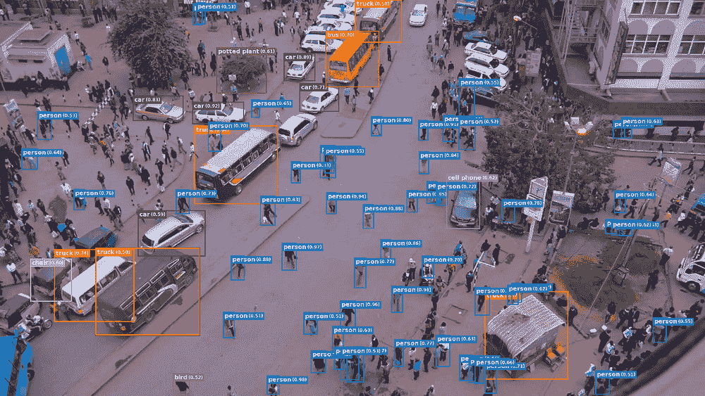
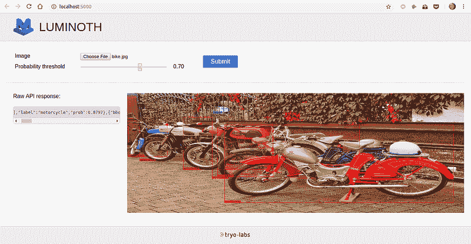

# 使用 Luminoth 进行对象检测

> 原文：[`www.kdnuggets.com/2019/03/object-detection-luminoth.html`](https://www.kdnuggets.com/2019/03/object-detection-luminoth.html)

 评论


在这篇文章中，我们将探讨如何使用 [Luminoth](https://github.com/tryolabs/luminoth) 库来检测图片或视频中的对象。Luminoth 是一个开源的 [计算机视觉](https://heartbeat.fritz.ai/the-5-computer-vision-techniques-that-will-change-how-you-see-the-world-1ee19334354b) 库，使用 Python 构建，基于 [TensorFlow](https://www.tensorflow.org/) 和 [Sonnet](https://github.com/deepmind/sonnet)。这个库由 [Tryolabs](https://medium.com/@tryolabs)开发。你可以在这里了解更多关于 Luminoth 及其其他项目的信息：

* * *

## 我们的前三个课程推荐

 1\. [谷歌网络安全证书](https://www.kdnuggets.com/google-cybersecurity) - 快速进入网络安全职业轨道。

 2\. [谷歌数据分析专业证书](https://www.kdnuggets.com/google-data-analytics) - 提升你的数据分析技能

 3\. [谷歌 IT 支持专业证书](https://www.kdnuggets.com/google-itsupport) - 支持你在 IT 领域的组织

* * *

[**Tryolabs | 机器学习与数据科学咨询**](https://tryolabs.com/)

*Tryolabs 是一个机器学习和数据科学咨询公司，帮助公司构建和实施定制的解决方案…*](https://tryolabs.com/)

Sonnet 是一个基于 TensorFlow 的神经网络库。Luminoth 是一个相对较新的库，处于 alpha 质量发布阶段。我们将展示如何使用 Luminoth 检测图像中的对象，如下图所示。



**安装**

我们可以通过快速的 pip 安装命令安装 Luminoth：

```py
pip3 install luminoth
```

Luminoth 提供了我们可以使用的预训练检查点。然而，也可以调整我们自己的数据集并进行训练。让我们深入了解一下。

这个库的美妙之处在于它使对象检测的工作变得简单。让我们通过这个图像来进行一个简单的示例。


[来源](https://pixabay.com/en/motorcycles-motorcycle-moped-1711872/)

为了做到这一点，我们首先需要启动终端。预测图像中的对象相对简单。然而，在我们开始做预测之前，我们需要下载一个检查点，以便我们能有一致的起点。Luminoth 提供了一个`lumi`命令，我们将用它来完成大部分操作。

管理检查点可以通过`lumi checkpoint`命令完成，该命令将下载预训练模型，我们将使用这些模型进行预测。这是一个巨大的优势——训练图像识别模型需要很长时间和大量计算能力。然而，也可以使用云基础设施（Google Cloud、AWS 等）进行自己的训练。

```py
lumi checkpoint refresh
```

现在我们来查看已下载的检查点。这可以通过`lumi checkpoint list`命令完成。

```py
lumi checkpoint list
```


我们可以清楚地看到我们有两个检查点：

1.  **Faster R-CNN w/COCO**—一个基于 Faster R-CNN 模型训练的物体检测模型。使用 COCO 数据集。

1.  **SSD w/Pascal VOC**—一个基于单次多框检测器（SSD）模型训练的物体检测模型。使用 Pascal 数据集。

现在我们将使用 Luminoth 的命令行界面来预测上面展示的图像中的物体。

```py
lumi predict bike.jpg
```

该命令以 JSON 格式输出预测结果。


你我都能同意，这个输出至少在视觉上并不令人满意。幸运的是，Luminoth 的团队提供了一种将图像中的物体作为标签输出的方式。

为此，我们首先创建一个名为`predictions`的目录，用于存放 JSON 输出和预测图像。记住我们仍在终端中操作。

```py
mkdir predictions
```

完成后，我们可以运行将进行预测并返回带标签物体的图像的命令。

```py
lumi predict bike.jpg -f predictions/objects.json -d predictions/
```

这个命令可能需要几分钟时间来运行。完成后，我们将在预测文件夹中看到下面的输出。


我们可以看到，它预测图像中的物体是摩托车，准确率高达 100%。它还能够预测到栅栏后面的汽车。很酷，对吧？

Luminoth 还允许我们使用特定的检查点运行预测。我们可以使用`Fast`检查点并进行测试。我们可以通过其 ID 或别名来实现。

```py
lumicheckpoint info fast
```

或

```py
lumicheckpoint info aad6912e94d9
```


让我们使用这个检查点来预测摩托车图像中的物体。

```py
lumi predict bike.jpg --checkpoint fast -f predictions/objects.json -d predictions/
```

我们将得到一个提示，下载本地检查点，当下载完成后，预测将会发生。我们看到它能够预测摩托车，但无法识别栅栏后面的汽车。


Luminoth 允许我们在网页界面上进行这些预测。要打开网页界面，请运行以下命令。

```py
lumi server web
```

然后访问[`localhost:5000/`](http://localhost:5000/)以访问网页界面。

我们只需在计算机上浏览一张图像，然后点击提交按钮。我们可以调整概率阈值。提高阈值会减少预测的图像数量，但概率更高，降低阈值则会增加预测的图像数量，但概率较低。



我们还可以利用这个库在视频中检测对象。这一过程将根据计算机的处理能力花费一段时间。

```py
lumi predict traffic.mp4 -f predictions/objects.json -d predictions/
```

**结论**

市面上有很多计算机视觉工具。Luminoth 的独特之处在于其易于实现。它还提供了可以直接使用的训练模型。要了解更多关于此库的信息，请查看官方 [文档](http://luminoth.readthedocs.io/)。

[**机器学习入门教程**](https://leanpub.com/introductorytutorialsformachinelearning)

*如果你刚刚开始学习机器学习或者想要提升技能，这本书非常适合你。*](https://leanpub.com/introductorytutorialsformachinelearning)

**个人简介： [德里克·姆维提](https://derrickmwiti.com/)** 是数据分析师、作家和导师。他致力于在每项任务中取得优异成绩，并且是 Lapid Leaders Africa 的导师。

[原文](https://heartbeat.fritz.ai/object-detection-with-luminoth-605d35c265f6)。已获许可转载。

**相关：**

+   深度学习中的 PyTorch 入门

+   如何在计算机视觉中做到所有事情

+   比较 TensorFlow 中的 MobileNet 模型

### 更多相关内容

+   [SQL 和对象关系映射（ORM）有什么区别？](https://www.kdnuggets.com/2022/02/difference-sql-object-relational-mapping-orm.html)

+   [KDnuggets™ 新闻 22:n09，3 月 2 日：讲好数据故事：一个…](https://www.kdnuggets.com/2022/n09.html)

+   [如何使用 Python 进行运动检测](https://www.kdnuggets.com/2022/08/perform-motion-detection-python.html)

+   [数据科学中异常检测技术的初学者指南](https://www.kdnuggets.com/2023/05/beginner-guide-anomaly-detection-techniques-data-science.html)

+   [使用 Hugging Face Transformers 进行文本情感检测](https://www.kdnuggets.com/using-hugging-face-transformers-for-emotion-detection-in-text)

+   [KDnuggets 新闻，8 月 17 日：如何使用…进行运动检测](https://www.kdnuggets.com/2022/n33.html)
