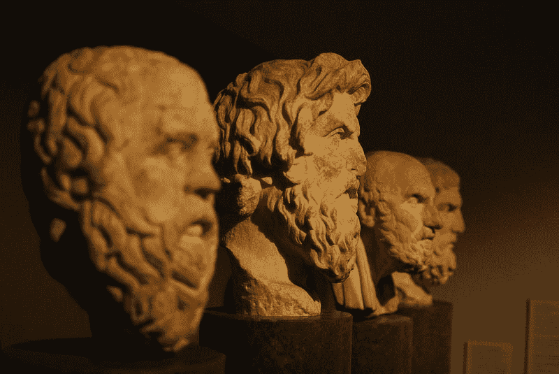
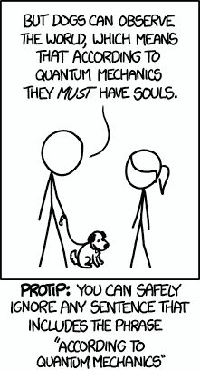
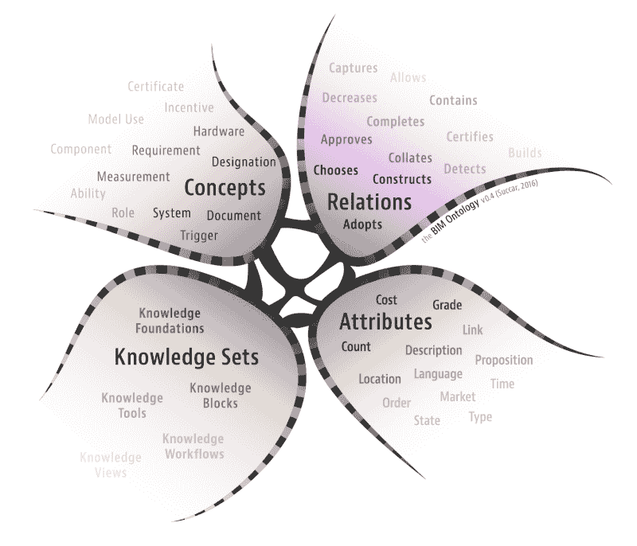
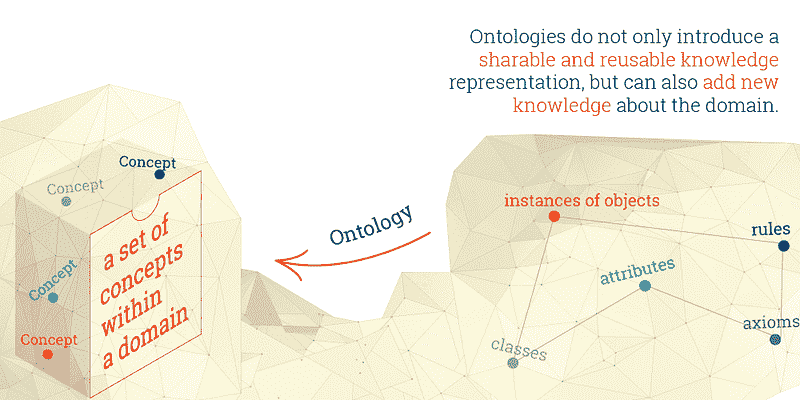
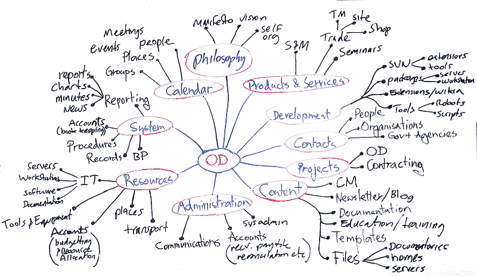
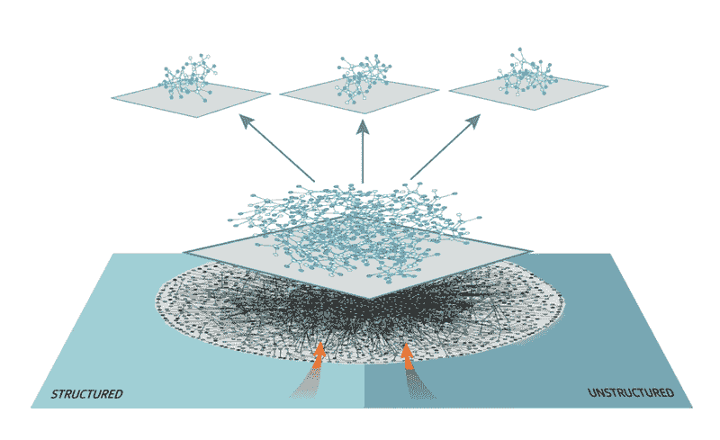
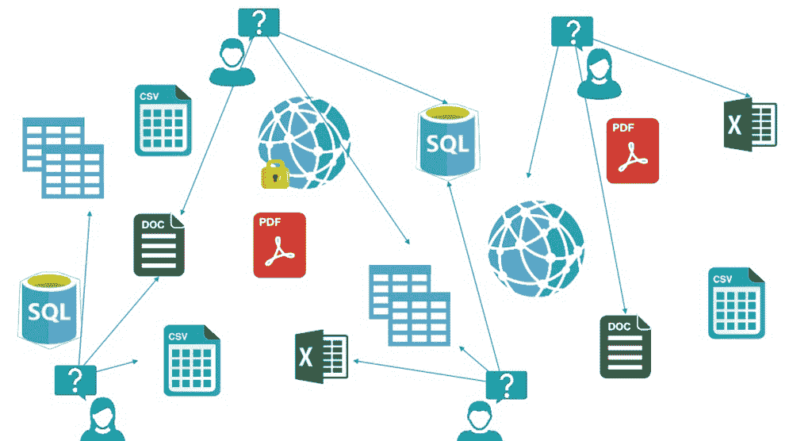
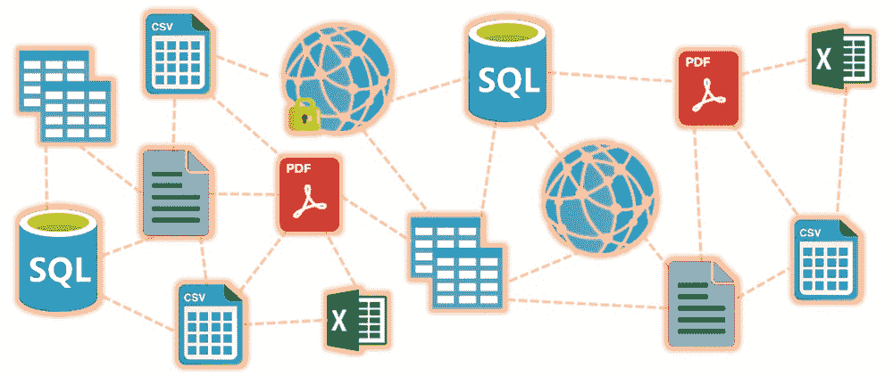
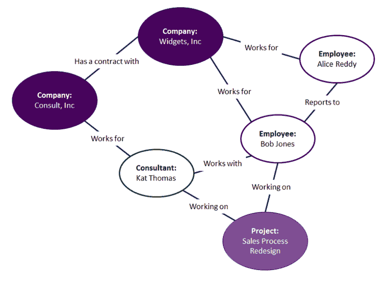

# 本体论与数据科学

> 原文：[`www.kdnuggets.com/2019/01/ontology-data-science.html`](https://www.kdnuggets.com/2019/01/ontology-data-science.html)

 评论

照片来源：Valentin Antonucci，Pexels

如果你对本体论这个词感到陌生，不用担心，我会首先介绍它是什么，然后说明它对数据世界的重要性。我将明确区分哲学本体论与计算机科学中与信息和数据相关的本体论。

* * *

## 我们的三大课程推荐

 1\. [谷歌网络安全证书](https://www.kdnuggets.com/google-cybersecurity) - 快速进入网络安全职业生涯。

 2\. [谷歌数据分析专业证书](https://www.kdnuggets.com/google-data-analytics) - 提升您的数据分析技能

 3\. [谷歌 IT 支持专业证书](https://www.kdnuggets.com/google-itsupport) - 支持您的组织 IT

* * *

### 本体论（哲学部分）

简单来说，本体论可以说是对存在的事物的研究。但这个定义还有另一部分，这部分将在接下来的章节中对我们有所帮助，那就是本体论通常也包括有关**存在实体的最一般特征和关系**的问题。

本体论为存在的事物打开了新门。让我给你一个例子。

量子力学开辟了对现实和自然中“存在”的新视角。在 20 世纪的一些物理学家看来，量子形式主义中根本没有现实。在另一极端，有许多量子物理学家持相反观点：即单一演化的量子态完全描述了实际的现实，令人震惊的是，几乎所有的量子备选态必须始终继续共存（处于叠加态）。因此，这为“存在”在自然界中的“事物”打开了全新的视角和理解。

但让我们回到定义中的实体关系部分。有时，当我们谈论实体及其关系时，本体论被称为**形式本体论**。这些理论试图给出某些实体属性和关系的精确数学表述。这样的理论通常提出关于这些实体的公理，这些公理用某种基于形式逻辑系统的形式语言表达。

这将使我们能够进行一个**量子跳跃**到文章的下一部分。

[`xkcd.com/1240/`](https://xkcd.com/1240/)

### 本体论（信息与计算部分）

如果我们重新回顾上述形式本体论的定义，然后考虑数据和信息，我们可以建立一个框架来研究数据及其与其他数据的关系。在这个框架中，我们以特别有用的方式表示信息。以特定形式本体论表示的信息可以更容易地被自动化信息处理访问，如何做到这一点是计算机科学（如数据科学）中的一个活跃研究领域。这里形式本体论的使用是**代表性的**。它是一个表示信息的框架，因此无论所使用的形式理论是否真正描述了一个实体领域，它都可以在代表性上成功。

现在是了解本体论如何在数据科学领域帮助我们的好时机。

如果你记得我上一篇关于语义技术的文章：

[**深度学习普及（… 和语义层）**](https://towardsdatascience.com/deep-learning-for-the-masses-and-the-semantic-layer-f1db5e3ab94b)

*深度学习现在无处不在，无论是在你的手表、电视、手机，还是某种程度上你所在的平台……*towardsdatascience.com](https://towardsdatascience.com/deep-learning-for-the-masses-and-the-semantic-layer-f1db5e3ab94b)

我谈到了关联数据的概念。关联数据的目标是以一种结构化的方式发布数据，使其能够被轻松消费并与其他关联数据结合起来。我还讨论了知识图谱的概念，它由集成的数据和信息集合组成，还包含大量不同数据之间的链接。

好吧，所有这些定义中缺失的概念是本体论。因为这是我们连接实体并理解其关系的方式。通过本体论可以实现这样的描述，但首先我们需要正式地指定组件，如个体（对象实例）、类、属性和关系，以及限制、规则和公理。

这里是解释上述段落的图示方式：

[`www.ontotext.com/knowledgehub/fundamentals/what-are-ontologies/`](https://www.ontotext.com/knowledgehub/fundamentals/what-are-ontologies/)

### **数据库建模与本体论**

目前，大多数采用数据建模语言（如 SQL）的技术都是使用“构建模型，然后使用模型”的僵化思维方式设计的。

例如，假设你想在关系数据库中更改一个属性。你之前认为该属性是单值的，但现在它需要是多值的。对于几乎所有现代关系数据库，这种更改将要求你删除该属性的整个列，然后创建一个全新的表来保存所有这些属性值以及一个外键引用。

这不仅仅是很多工作，还会使处理原始表的任何索引失效。它还会使用户编写的相关查询失效。简而言之，做出这个改变可能非常困难和复杂。通常，这种变化麻烦到让人们干脆不去做。

相比之下，本体论语言中的所有数据建模语句（以及其他一切）本质上是增量的。事后增强或修改数据模型可以通过修改概念轻松实现。

### 从 RDBS 到知识图谱

到目前为止，我发现的将数据湖转变为智能数据湖的最简单框架是 Anzo。通过这个，你可以迈出向完全连接的企业数据结构的第一步。

> *数据结构是支持公司所有数据的平台。它如何管理、描述、结合和普遍访问。这个平台由企业知识图谱构成，以创建一个统一且一致的数据环境。*

形成这种数据结构首先需要在现有数据之间创建本体论。这一过渡也可以被看作是从传统数据库到图数据库+语义的过程。

根据[这份演示文稿](https://www.slideshare.net/camsemantics/the-year-of-the-graph?ref=https://dzone.com/)由[剑桥语义学](https://www.cambridgesemantics.com/)公司提供，有三个原因说明图数据库是有用的：

1.  图数据库的产品展示了能力和多样性的成熟

1.  图谱被用来解决经典图问题之外的任务

1.  复杂数据的数字化转型需要图谱

因此，如果你将这些好处与基于本体论构建的语义层结合起来，你可以将数据从这种状态：

[`www.slideshare.net/camsemantics/the-year-of-the-graph`](https://www.slideshare.net/camsemantics/the-year-of-the-graph)

转变为这种状态

[`www.slideshare.net/camsemantics/the-year-of-the-graph`](https://www.slideshare.net/camsemantics/the-year-of-the-graph)

你会有一个人类可读的数据表示，它唯一标识并用通用业务术语连接数据。这一层帮助最终用户自主、安全且自信地访问数据。

然后，你可以创建复杂的模型来发现不同数据库中的模式。

[`www.slideshare.net/camsemantics/the-year-of-the-graph`](https://www.slideshare.net/camsemantics/the-year-of-the-graph)

在其中，你有表示实体之间关系的本体论。也许这里举个本体论的例子会更好。这个例子取自

[**什么是本体论以及我为什么需要它？- 企业知识**](https://www.slideshare.net/camsemantics/the-year-of-the-graph)

*本体论和语义技术再次变得流行。它们在 2000 年代初曾是热门话题，但...*enterprise-knowledge.com](https://enterprise-knowledge.com/what-is-an-ontology/)

让我们创建一个关于你的员工和顾问的本体论：

在这个例子中，Kat Thomas 是一位顾问，她正在与 Bob Jones 合作进行销售流程重设计项目。Kat 为 Consult, Inc 工作，而 Bob 向 Alice Reddy 汇报。通过这个本体论，我们可以推断出很多信息。由于销售流程重设计涉及销售，我们可以推断 Kat Thomas 和 Bob Jones 在销售方面具有专业知识。Consult, Inc 也必须在这一领域提供专业知识。我们还知道 Alice Reddy 可能负责 Widgets, Inc 的某些销售方面，因为她的直接下属正在进行销售流程重设计项目。

当然，你可以在关系数据库中使用主键，并创建多个连接来获取相同的关系，但这种方法更直观，更易于理解。

而令人惊叹的是，Anzo 将会连接到你的数据湖（意味着大量数据存储在 HDFS 或 Oracle 等中），并为你自动创建这个图表！然后你可以自行添加或更改本体论。

### 数据科学的未来（仅指明年 lol）

在这篇文章中：

**2018 年人工智能、数据科学、分析的主要发展及 2019 年关键趋势**

*和过去一样，我们为您带来专家的预测和分析汇总。我们询问了主要的...*www.kdnuggets.com

我讨论了未来几年（可能）的数据科学将会发生的事情。

对我而言，2019 年的关键趋势：

+   AutoX：我们将看到更多公司开发并将自动化机器学习和深度学习技术及库纳入其技术栈。这里的 X 意味着这些自动化工具将扩展到数据摄取、数据整合、数据清洗、探索和部署。自动化将继续存在。

+   语义技术：今年对我来说最有趣的发现之一是数据科学与语义之间的联系。这不是数据领域的新领域，但我看到越来越多的人对语义、本体论、知识图谱及其与数据科学和机器学习的关系产生兴趣。

+   编程减少：这是一件难以言说的事，但随着数据科学过程中的几乎每一步都被自动化，我们将每天编程越来越少。我们将拥有创建代码的工具，这些工具将通过自然语言处理理解我们的需求，然后将其转化为查询、句子和完整程序。我认为[编程]仍然是一个非常重要的技能，但它很快会变得更容易。

这就是我撰写这篇文章的原因之一，试图跟踪行业中的动态，你应该意识到这一点。我们将减少编程，并在不久的将来更多地使用语义技术。这更接近于我们思考的方式。我是说，你会在关系数据库中思考吗？我并不是说我们在图形中思考，但在我们的脑袋和知识图谱之间传递信息要比创建奇怪的数据库模型容易得多。

期待我在这个有趣话题上的更多内容。如果你有任何建议，请告诉我 :)

如果你有问题，直接在 Twitter 上关注我:

[**Favio Vázquez (@FavioVaz) | Twitter**]

*Favio Vázquez (@FavioVaz) 的最新推文。数据科学家。物理学家和计算工程师。我有一个…*twitter.com](https://twitter.com/faviovaz)

和 LinkedIn:

[**Favio Vázquez — 创始人 — Ciencia y Datos | LinkedIn**]

*查看 Favio Vázquez 在 LinkedIn 上的个人资料，这是全球最大的职业社区。Favio 列出了 16 个职位…*www.linkedin.com](https://www.linkedin.com/in/faviovazquez/)

那里见 :)

**简介： [Favio Vazquez](https://www.linkedin.com/in/faviovazquez/)** 是一名物理学家和计算机工程师，专注于数据科学和计算宇宙学。他对科学、哲学、编程和音乐充满热情。他是 Ciencia y Datos 的创始人，这是一个西班牙语的数据科学出版物。他热爱新挑战，喜欢与优秀团队合作并解决有趣的问题。他是 Apache Spark 合作项目的一部分，参与 MLlib、Core 和文档工作。他喜欢将自己的科学知识、数据分析、可视化和自动学习的专业技能应用于帮助世界变得更美好。

[原文](https://towardsdatascience.com/ontology-and-data-science-45e916288cc5)。经许可转载。

**相关：**

+   本体是什么？你能找到的最简单定义…或退款*

+   2018 年人工智能、数据科学、分析的主要发展以及 2019 年的关键趋势

+   数据科学的核心

### 更多相关话题

+   [停止学习数据科学以寻找目标，并通过寻找目标来…](https://www.kdnuggets.com/2021/12/stop-learning-data-science-find-purpose.html)

+   [学习数据科学统计的最佳资源](https://www.kdnuggets.com/2021/12/springboard-top-resources-learn-data-science-statistics.html)

+   [成功的数据科学家的五个特征](https://www.kdnuggets.com/2021/12/5-characteristics-successful-data-scientist.html)

+   [每个数据科学家都应该了解的三个 R 库（即使你使用 Python）](https://www.kdnuggets.com/2021/12/three-r-libraries-every-data-scientist-know-even-python.html)

+   [一项 90 亿美元的人工智能失败，经过检验](https://www.kdnuggets.com/2021/12/9b-ai-failure-examined.html)

+   [为什么 Python 是初创公司理想的编程语言](https://www.kdnuggets.com/2021/12/makes-python-ideal-programming-language-startups.html)
