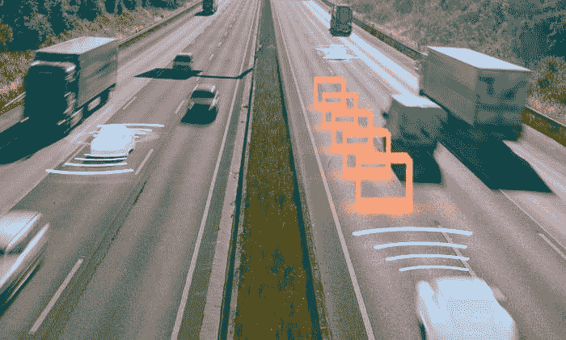
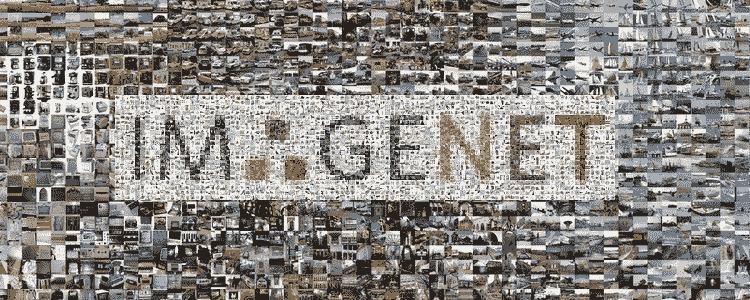
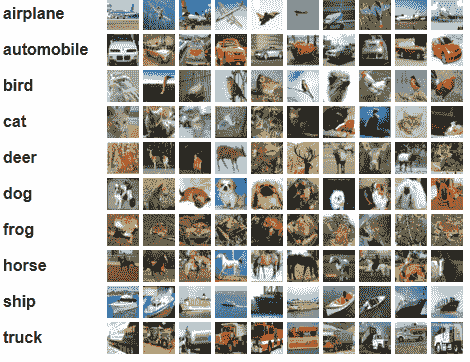
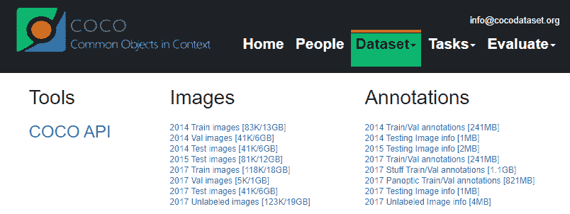
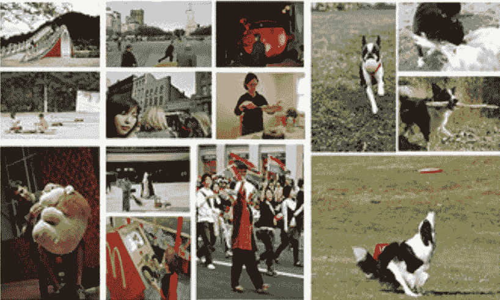
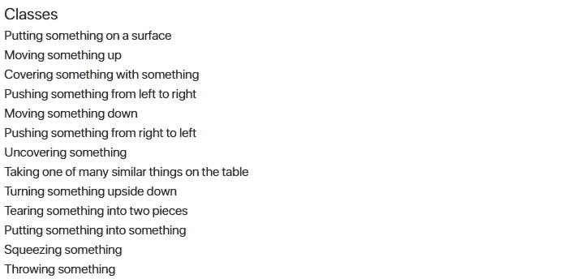
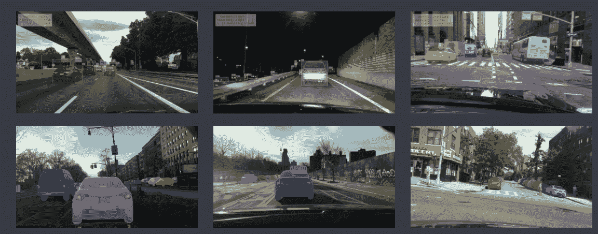

# 计算机视觉的开源数据集

> 原文：[`www.kdnuggets.com/2021/08/open-source-datasets-computer-vision.html`](https://www.kdnuggets.com/2021/08/open-source-datasets-computer-vision.html)

评论

[计算机视觉](https://www.sabrepc.com/blog/Deep-Learning-and-AI/best-gpu-for-computer-vision)（CV）是人工智能（AI）和机器学习（ML）领域中最令人兴奋的子领域之一。它是许多现代 AI/ML 管道中的重要组成部分，并且正在改变几乎所有行业，使组织能够彻底革新机器和业务系统的工作方式。

* * *

## 我们的前三大课程推荐

 1\. [谷歌网络安全证书](https://www.kdnuggets.com/google-cybersecurity) - 快速通道进入网络安全职业。

 2\. [谷歌数据分析专业证书](https://www.kdnuggets.com/google-data-analytics) - 提升你的数据分析技能

 3\. [谷歌 IT 支持专业证书](https://www.kdnuggets.com/google-itsupport) - 支持你的组织在 IT 领域

* * *

在学术上，计算机视觉已经是计算机科学中的一个成熟领域，多年来，这一领域经过了大量的研究以不断完善。然而，**深度神经网络的使用最近彻底革新了这一领域**，并为其加速增长注入了新的动力。

计算机视觉有着多种应用领域，例如：

+   自动驾驶

+   医学影像分析与诊断

+   场景检测与理解

+   自动图像标题生成

+   社交媒体上的照片/面孔标记

+   家庭安全

+   制造业缺陷识别与质量控制

在这篇文章中，我们探讨了一些在深度学习（DL）领域中用于训练最先进的机器学习系统的流行且有效的数据集。

## 仔细选择合适的开源数据集

在图像和视频文件上训练机器是一项**数据密集型操作**。单一图像文件是一个多维的、多兆字节的数字实体，仅包含整个“智能图像分析”任务中的微小“洞察”部分。

相比之下，一个相似规模的零售销售数据表可以在相同的计算硬件开支下为机器学习算法提供更多的洞见。在讨论现代计算机视觉管道所需的数据规模和计算时，值得记住这一点。

因此，在几乎所有情况下，几百张（甚至几千张）图像不足以训练高质量的机器学习模型用于计算机视觉任务。几乎所有现代计算机视觉系统使用复杂的深度学习模型架构，如果没有提供足够数量的精心选择的训练样本，即标记图像，它们将会表现不足。因此，成为一种高度常见的趋势是**稳健、具有泛化能力的生产级深度学习系统通常需要数百万张精心挑选的图像进行训练**。

此外，对于视频分析，选择和编制训练数据集的任务可能更加复杂，因为视频文件或从多个视频流中获得的帧具有动态特性。

在这里，我们列出了一些最受欢迎的数据集（包括静态图像和视频剪辑）。

## 计算机视觉模型的流行开源数据集

并非所有数据集都适用于所有类型的计算机视觉任务。常见的计算机视觉任务包括：

+   图像分类

+   对象检测

+   对象分割

+   多对象注释

+   图像描述

+   人体姿态估计

+   视频帧分析

我们展示了一些涵盖大部分这些类别的流行开源数据集。

### ImageNet（最著名）

[ImageNet](http://www.image-net.org/) 是一个持续的研究努力，旨在为全球研究人员提供一个易于访问的图像数据库。它或许是**最著名的图像数据集**，被研究人员和学习者一致称为金标准。

该项目的灵感来源于图像和视觉研究领域日益增长的需求——更多的数据。它按照 WordNet 层次结构进行组织。WordNet 中每个有意义的概念，可能由多个词或词组描述，称为“同义词集”或“synset”。WordNet 中有超过 100,000 个同义词集。类似地，ImageNet 旨在提供平均 1000 张图像来说明每个同义词集。

ImageNet 大规模视觉识别挑战赛（ILSVRC）是一个全球年度比赛，评估算法（由大学或企业研究团队提交）在大规模对象检测和图像分类方面的表现。一个主要动机是允许研究人员在更广泛的对象上比较检测进展——利用相当昂贵的标注工作。另一个动机是衡量计算机视觉在大规模图像索引、检索和注释方面的进展。**这是整个机器学习领域讨论最多的年度比赛之一。**

### CIFAR-10（适合初学者）

这是一个[图像集合](https://www.cs.toronto.edu/~kriz/cifar.html)，常用于初学者训练机器学习和计算机视觉算法。它也是机器学习研究中最受欢迎的数据集之一，用于**快速比较算法**，因为它捕捉了特定架构的优缺点，而不会对训练和超参数调整过程施加不合理的计算负担。

它包含 60,000 张 32×32 的彩色图像，分为 10 个不同的类别。这些类别包括飞机、汽车、鸟类、猫、鹿、狗、青蛙、马、船和卡车。

### MegaFace 和 LFW（面部识别）

[Labeled Faces in the Wild (LFW)](http://vis-www.cs.umass.edu/lfw/) 是一个旨在**研究非约束性面部识别问题**的面部照片数据库。它包含 13,233 张 5,749 个人的图像，这些图像从网络上抓取和检测而来。作为额外的挑战，机器学习研究人员可以使用数据集中有两张或更多张不同照片的 1,680 个人的图片。因此，它是一个公共的面部验证基准，也称为配对匹配（需要至少两张同一人的图像）。

[MegaFace](http://megaface.cs.washington.edu/dataset/download.html) 是一个大规模开源面部识别训练数据集，是**商业面部识别问题**的最重要基准之一。它包含 4,753,320 张面孔，涉及 672,057 个身份，非常适合大型深度学习架构的训练。所有图像均来自 Flickr（雅虎的数据集），并且获得了创作共用许可证。

### IMDB-Wiki（性别和年龄识别）

IMDB-Wiki 是一个具有性别和年龄标签的[最大且开源的数据集](https://data.vision.ee.ethz.ch/cvl/rrothe/imdb-wiki/)，用于训练面部图像。该数据集中共有 523,051 张面孔图像，其中 460,723 张来自 20,284 位 IMDB 名人，62,328 张来自维基百科。

### MS Coco（物体检测与分割）

COCO 或 [Common Objects in COntext](https://cocodataset.org/#home) 是一个大规模的物体检测、分割和图像说明数据集。该数据集包含 91 种易于识别的物体类型，共有 2.5 百万个标注实例，分布在 328,000 张图像中。此外，它**提供了更多复杂的计算机视觉任务资源，如多物体标注、分割掩码注释、图像说明和关键点检测**。它由一个直观的 API 提供支持，帮助加载、解析和可视化 COCO 中的注释。该 API 支持多种注释格式。

### MPII Human Pose（姿态估计）

[此数据集](http://human-pose.mpi-inf.mpg.de/)用于评估关节人体姿态估计。它包括约 25K 张图像，包含 40K 多人，具有**标注的身体关节**。每张图像都从 YouTube 视频中提取，并提供了前后未标注的帧。总体而言，数据集涵盖了 410 种人类活动，每张图像都附有活动标签。

### Flickr-30k（图像字幕）

这是一个图像字幕语料库，由 158,915 条众包字幕描述 31,783 张图像组成。这是对先前[Flickr 8k 数据集](http://nlp.cs.illinois.edu/HockenmaierGroup/8k-pictures.html)的扩展。新图像和字幕专注于涉及日常活动和事件的人们。

### 20BN-SOMETHING-SOMETHING（人类动作视频剪辑）

该数据集是一个[大量密集标注的视频剪辑集合](https://20bn.com/datasets/something-something/v2)，展示了**人类使用日常物品执行预定义的基本动作**。它由大量众包工人创建，使机器学习模型能够对物理世界中发生的基本动作进行细致入微的理解。

这里是数据集中捕获的一些常见人类活动的子集：

### Barkley DeepDrive（用于自动驾驶车辆训练）

[伯克利深度驾驶数据集](https://www.bdd100k.com/)由加州大学伯克利分校提供，包括超过 100K 个视频序列，具有多种注释类型，包括目标边界框、可驱动区域、图像级标记、车道标记和全帧实例分割。此外，该数据集在表现各种地理、环境和天气条件方面**具有广泛的多样性**。

这对训练强健的自动驾驶模型非常有用，使其不容易被不断变化的道路和驾驶条件所惊讶。

## 这些数据集的正确硬件和基准测试

不用说，仅有这些数据集不足以建立高质量的机器学习系统或商业解决方案。需要正确选择数据集、训练硬件以及巧妙的调整和基准测试策略的混合，以获得任何学术或商业问题的最佳解决方案。

这就是为什么[高性能 GPU](https://www.sabrepc.com/blog/Deep-Learning-and-AI/best-gpu-for-computer-vision)几乎总是与这些数据集配对使用，以提供所需的性能。

GPU 的开发（主要针对视频游戏行业）是为了处理**大规模的并行计算**，使用数千个微小的计算核心。它们还具有**大容量内存带宽**，以应对神经网络训练过程中需要的快速数据流（处理单元到缓存，再到较慢的主内存及回传）。这使得它们成为处理计算机视觉任务计算负载的**理想商品硬件**。

然而，市场上有许多 GPU 选项，这确实可能让普通用户感到困惑。多年来发布了一些好的基准测试策略，以指导潜在买家。在基准测试中，必须考虑多种（a）深度神经网络（DNN）架构，（b）GPU，以及（c）广泛使用的数据集（如我们在前一部分讨论的）。

例如，这篇[优秀的文章](https://l7.curtisnorthcutt.com/benchmarking-gpus-for-deep-learning)考虑了以下内容：

+   架构：[ResNet-152, ResNet-101, ResNet-50, 和 ResNet-18](https://pytorch.org/hub/pytorch_vision_resnet/)

+   GPU：[EVGA（非风扇）RTX 2080 ti](https://www.sabrepc.com/11G-P4-2280-KR-EVGA-S2403611)、[GIGABYTE（风扇）RTX 2080 ti](https://www.sabrepc.com/GV-N208TTURBO-11GC-GIGABYTE-S2405508)和[NVIDIA TITAN RTX](https://www.sabrepc.com/900-1G150-2500-000-NVIDIA-S116201296)

+   数据集：[ImageNet](http://www.image-net.org/)、[CIFAR-100](https://www.cs.toronto.edu/~kriz/cifar.html)和[CIFAR-10](https://www.cs.toronto.edu/~kriz/cifar.html)。

此外，良好的基准测试必须考虑多个性能维度。

### 性能维度考虑

主要有三个指标：

1.  **第二批次时间**：完成第二批训练的时间。这个数字衡量的是在 GPU 尚未长时间运行至升温前的性能。有效地说，没有[热降频](https://en.wikipedia.org/wiki/Dynamic_frequency_scaling)。

1.  **平均批次时间**：在 ImageNet 中 1 个 epoch 或在 CIFAR 中 15 个 epoch 后，平均批次时间。这个测量考虑了[热降频](https://en.wikipedia.org/wiki/Thermal_design_power)。

1.  **同时平均批次时间**：在 ImageNet 中 1 个 epoch 或在 CIFAR 中 15 个 epoch 后，所有 GPU 同时运行的平均批次时间。这衡量了由于所有 GPU 散发的综合热量对系统的热降频影响。

[原始](https://www.sabrepc.com/blog/Deep-Learning-and-AI/best-open-source-datasets-for-computer-vision)。经允许转载。

**相关：**

+   [2020 年计算机视觉前 10 论文](https://www.kdnuggets.com/2021/01/top-10-computer-vision-papers-2020.html)

+   [100+类别的数据集精彩列表](https://www.kdnuggets.com/2021/05/awesome-list-datasets.html)

+   [介绍 NLP 索引](https://www.kdnuggets.com/2021/04/nlp-index.html)

### 更多相关内容

+   [停止学习数据科学以寻找目标，并寻找目标以…](https://www.kdnuggets.com/2021/12/stop-learning-data-science-find-purpose.html)

+   [一个 90 亿美元的 AI 失败，探讨](https://www.kdnuggets.com/2021/12/9b-ai-failure-examined.html)

+   [学习数据科学的顶级资源](https://www.kdnuggets.com/2021/12/springboard-top-resources-learn-data-science-statistics.html)

+   [成功数据科学家的 5 个特征](https://www.kdnuggets.com/2021/12/5-characteristics-successful-data-scientist.html)

+   [是什么让 Python 成为初创企业的理想编程语言](https://www.kdnuggets.com/2021/12/makes-python-ideal-programming-language-startups.html)

+   [每个数据科学家都应该知道的三个 R 库（即使你使用 Python）](https://www.kdnuggets.com/2021/12/three-r-libraries-every-data-scientist-know-even-python.html)
