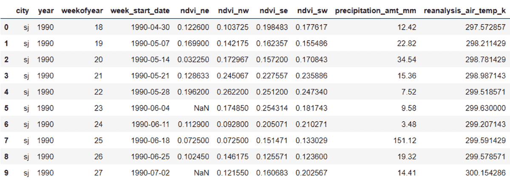
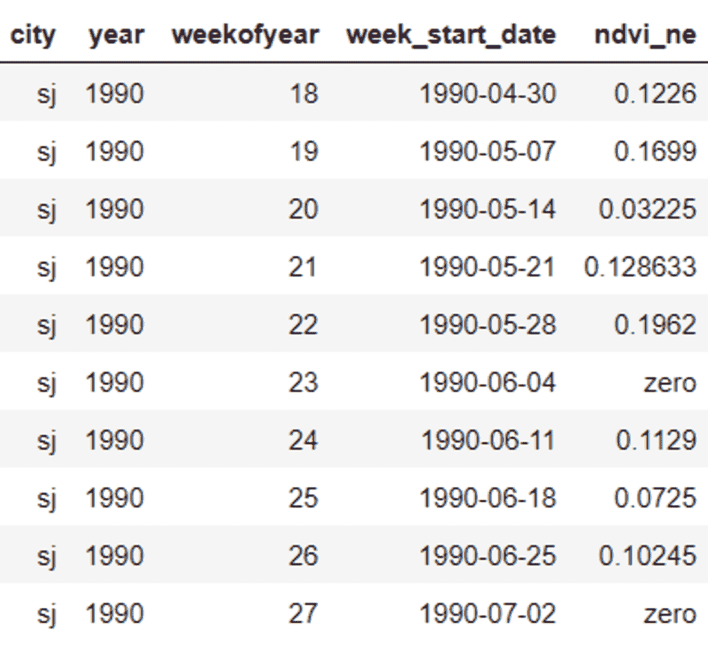
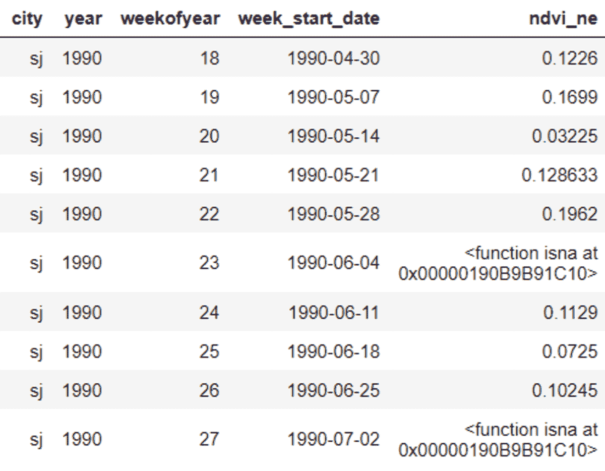
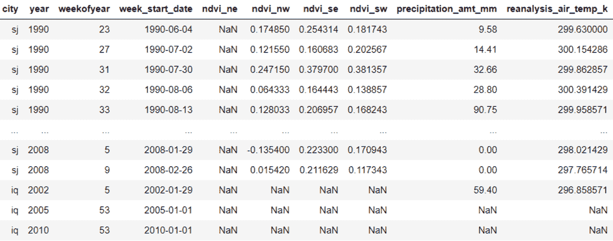
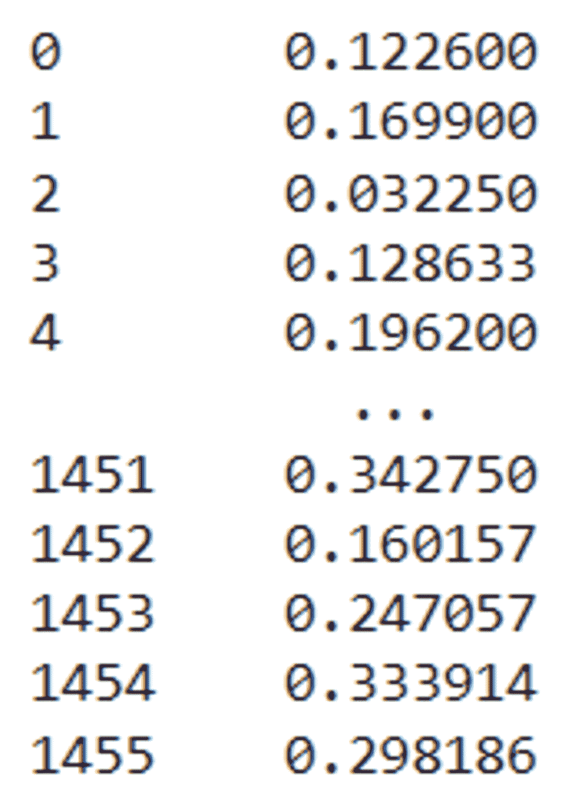
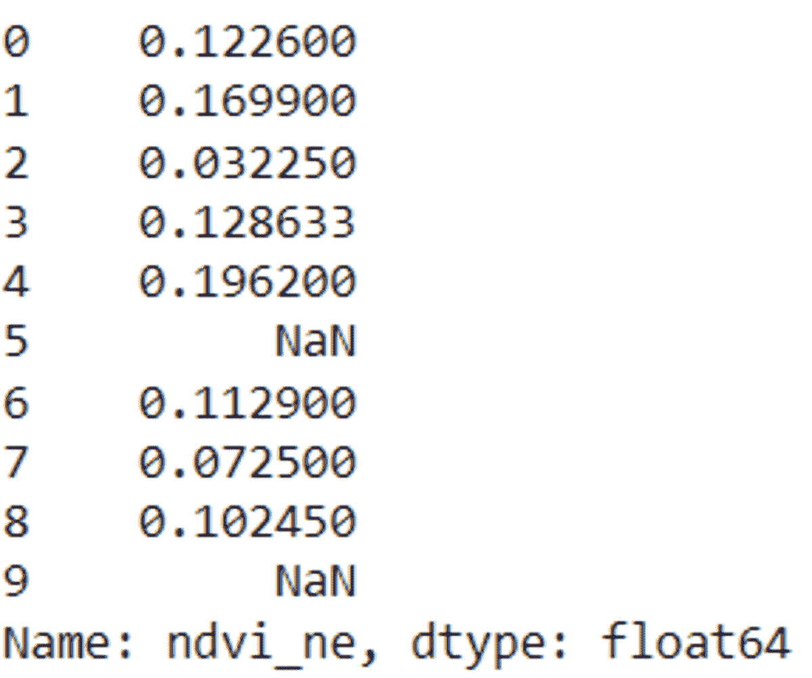
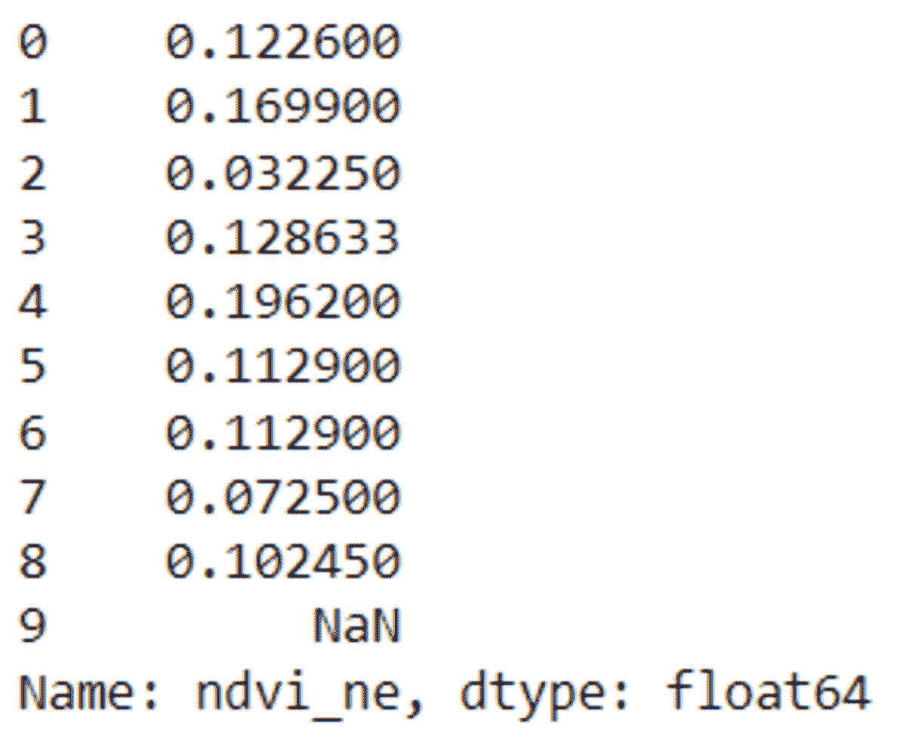

# 使用 Pandas fillna() 输入缺失数据的最佳方式

> 原文：[`www.kdnuggets.com/2023/02/optimal-way-input-missing-data-pandas-fillna.html`](https://www.kdnuggets.com/2023/02/optimal-way-input-missing-data-pandas-fillna.html)


图片由 [catalyststuff](https://www.freepik.com/free-vector/cute-panda-doughnut-cartoon-vector-icon-illustration-animal-food-icon-concept-isolated-premium-vector-flat-cartoon-style_23006622.htm#page=2&query=pandas&position=40&from_view=search&track=sph) 提供，来源于 Freepik

在数据探索阶段，我们经常会遇到缺失数据的变量。缺失数据可能由于各种原因存在；采样错误、故意遗漏或随机原因。无论原因是什么，**我们需要分析缺失数据的原因**。关于缺失数据类型的文章由 Yogita Kinha 提供，是一个很好的起点。

* * *

## 我们的前三大课程推荐

 1\. [Google 网络安全证书](https://www.kdnuggets.com/google-cybersecurity) - 快速入门网络安全职业。

 2\. [Google 数据分析专业证书](https://www.kdnuggets.com/google-data-analytics) - 提升您的数据分析技能。

 3\. [Google IT 支持专业证书](https://www.kdnuggets.com/google-itsupport) - 支持您组织的 IT 事务。

* * *

经过适当的分析，解决缺失数据问题的一种方法是填充数据。幸运的是，Pandas 允许轻松输入缺失数据。我们怎么做呢？填补缺失数据的最佳方式是什么？让我们一起学习。

# Pandas Fillna 函数

根据 Pandas 的 [文档](https://pandas.pydata.org/pandas-docs/stable/reference/api/pandas.DataFrame.fillna.html)，Fillna 是一个 Pandas 函数，用于用指定的方法填充 NA/NaN 值。在 Pandas DataFrame 中，我们将缺失的数据对象指定为 NaN 对象。使用 Fillna，我们将用我们分析过的其他值替换这些 NaN 值。

让我们试用一个数据集示例来尝试这个函数。本文将使用 [Kaggle 上的地方性登革热训练数据集](https://www.kaggle.com/datasets/arashnic/epidemy?select=dengue_features_train.csv)（许可证：CC0：公共领域）。

```py
import pandas as pd
df = pd.read_csv('dengue_features_train.csv')
df.head(10)
```



正如我们在上述数据集中所看到的，‘ndvi_ne’ 列中存在缺失数据。使用 Pandas 的 `fillna` 函数，我们可以轻松地用其他值替换缺失数据。让我给你一个例子。

```py
df.fillna(0).head(10)
```


使用`fillna`函数，我们用值 0 替换了缺失的数据。使用`fillna`函数时，你可以用任何值来替换它。例如，我用字符串‘zero’替换了缺失值。

```py
df.fillna('zero').head(10)
```



或者我甚至可以使用函数来替换缺失值，这虽然可以做到，但并不实用。

```py
df.fillna(pd.isna).head(10)
```



另外，`fillna`函数在执行时不会改变实际的数据集。如果你希望 DataFrame 在执行函数时被替换，可以运行以下代码。

```py
df.fillna(0, inplace = True)
```

当你运行上述代码时不会有输出，但你的 DataFrame 会受到影响。如果你还在实验数据中，请不要使用参数 inplace。

## 在多个列上替换缺失值

使用`fillna`函数时必须小心。如果我们在整个 DataFrame 上运行该函数，它会用传入的值填充所有缺失的数据，即使这不是你的意图。通过使用数据示例来看看我在说什么。

```py
df[df['ndvi_ne'].isna()]
```



我尝试获取所有‘ndvi_ne’列缺失的观察值。如果我们查看上面的输出，可以看到几个列也包含缺失数据。让我们尝试使用`fillna`函数来填充它们。

```py
df[df['ndvi_ne'].isna()].fillna('zero')
```


所有的缺失数据现在都被字符串‘zero’值替换了。通常，这不是我们想要的。如果我们只想替换某些列的缺失数据，我们可以在使用`fillna`函数之前先选择这些列。

```py
df['ndvi_ne'].fillna(0)
```



还有一种优化的方法来填充缺失数据，即通过传递一个包含列名作为键和替换值的字典。让我们通过代码示例来尝试一下。

```py
df[df['ndvi_ne'].isna()].fillna({'ndvi_ne':0,
                                 'ndvi_nw':'zero', 
                                 'ndvi_se': df['ndvi_se'].mean()})
```


使用上述代码，我们将列‘ndvi_ne’替换为 0，将‘ndvi_nw’替换为‘zero’，将‘ndvi_se’替换为列均值。其余部分未被修改，因为我们没有在函数中指定它们。

## 填充第 n 个连续缺失的数据

Pandas `fillna`函数还允许用户指定要替换的缺失数据的数量。通过使用 limit 参数，我们可以连续填充到第 n 个缺失数据。让我们通过代码示例尝试一下。

```py
df[df['ndvi_ne'].isna()].fillna(0, limit = 3).head()
```


从上述输出中，我们可以看到只有五行缺失数据中的三行被替换了。如果我们更改限制参数，可能会看到不同的结果。

```py
df[df['ndvi_ne'].isna()].fillna(0 , limit = 2).head()
```


显示的数据中只有两行被替换。缺失数据不需要彼此相邻。它们可以在不同的行中，限制参数只会替换前两个缺失数据（如果限制参数设置为两）。

## 前向填充和后向填充

Pandas `fillna`函数的优点在于，我们可以从前一个观测值或后续观测值中填充缺失数据。让我们尝试从前一个观测值中填充数据。提醒一下，我们在以下列中有缺失数据。

```py
df['ndvi_ne'].head(10)
```



然后，我们将使用`fillna`函数用前一行的数据替代缺失的数据。

```py
df['ndvi_ne'].head(10).fillna(method = 'ffill')
```


缺失数据现在已被前一行的数据替代，或者我们可以称之为前向填充。让我们尝试反向操作：后向填充或从后续行填充缺失数据。

```py
df['ndvi_ne'].head(10).fillna(method = 'bfill')
```



从上面的输出中，我们可以看到最后的数据仍然缺失。由于在缺失数据行之后没有任何观测值，函数将其保持原样。

前向填充和后向填充方法在知道前后数据仍然相关时非常有效，例如在时间序列数据中。假设股票数据；前一天的数据可能在第二天仍然适用。

# 结论

缺失数据是数据预处理和探索中的典型情况。处理缺失数据的一种方法是用另一个值替代它。为此，我们可以使用名为`fillna`的 Pandas 函数。使用该函数很简单，但有几种方法可以最佳地填充数据，包括在多个列中替换缺失数据、限制填充范围以及使用其他行填充数据。

**[Cornellius Yudha Wijaya](https://www.linkedin.com/in/cornellius-yudha-wijaya/)** 是一名数据科学助理经理和数据撰稿人。在全职工作于印尼安联期间，他喜欢通过社交媒体和写作媒体分享 Python 和数据技巧。

### 更多相关内容

+   [广义可扩展的最优稀疏决策树（GOSDT）](https://www.kdnuggets.com/2023/02/generalized-scalable-optimal-sparse-decision-treesgosdt.html)

+   [强化学习：教计算机做出最佳决策](https://www.kdnuggets.com/2023/07/reinforcement-learning-teaching-computers-make-optimal-decisions.html)

+   [如何使用 Pandas 中的插值技术处理缺失数据](https://www.kdnuggets.com/how-to-deal-with-missing-data-using-interpolation-techniques-in-pandas)

+   [使用 Pandas 制作美观的交互式可视化的最简单方法](https://www.kdnuggets.com/2021/12/easiest-way-make-beautiful-interactive-visualizations-pandas.html)

+   [将 JSON 转换为 Pandas DataFrames：正确解析的方法](https://www.kdnuggets.com/converting-jsons-to-pandas-dataframes-parsing-them-the-right-way)

+   [如何识别时间序列数据集中的缺失数据](https://www.kdnuggets.com/how-to-identify-missing-data-in-timeseries-datasets)
