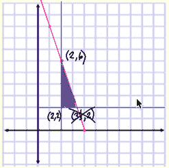
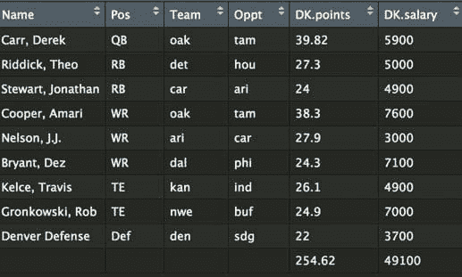

# 数据科学家的优化基础

> 原文：[`www.kdnuggets.com/2018/08/optimization-101-data-scientists.html`](https://www.kdnuggets.com/2018/08/optimization-101-data-scientists.html)

 评论

**由 [Rajiv Shah](http://www.rajivshah.com)，[DataRobot](http://www.datarobot.com)的数据科学家**

作为数据科学家，你花费大量时间来帮助做出更好的决策。你建立预测模型以提供改进的洞察力。你可能会预测图像是猫还是狗、下个月的商店销售量，或者某个部件的失败可能性。在这篇文章中，我不会帮助你做出更好的预测，而是如何做出**最佳**决策。

这篇文章致力于为你提供有关优化的一些背景知识。它从一个简单的玩具示例开始，展示了优化计算背后的数学原理。之后，这篇文章处理了一个更复杂的优化问题，尝试为幻想足球选择最佳团队。下面的 FanDuel 图片是一个非常常见的游戏，广泛被玩耍（问问你的亲戚吧）。文章中的优化策略被证明能够持续获胜！在此过程中，我将展示一些代码片段，并提供 R、Python 和 Julia 的工作代码链接。如果你赢得了钱，随时可以分享 :)

一个简单的示例，我在 [网上](http://melaniewingard.weebly.com/uploads/3/7/5/5/37554047/09-30-16_section_3.5_linear_programming_and_optimization_continued.pdf) 找到的，从一个木匠制作两种尺寸的书架开始，大型和小型。制作一个大型书架需要 6 小时，制作一个小型书架需要 2 小时。大型书架的利润是 50 美元，小型书架的利润是 20 美元。木匠每周只能花 24 小时制作书架，并且每周必须制作至少 2 个每种尺寸的书架。作为数据科学家，你的工作是帮助木匠最大化她的收入。

你最初可能会认为，由于大型书架利润最高，为什么不专注于它们呢？在这种情况下，你的利润将是 (2*$20) + (3*$50)，即 190 美元。这是一个相当不错的基准，但不是最佳答案。是时候拿出代数，创建定义问题的方程式了。首先，我们从约束条件开始：

```py

x>=2   ## large bookcases

y>=2   ## small bookcases

6x + 2y <= 24 (labor constraint)

```

我们试图最大化的目标函数是：

```py

P = 50x + 20y

```

如果我们手动做代数运算，我们可以将约束条件转换为**y <= 12 - 3x**。然后，我们绘制所有的约束条件，并找出制作小型和大型书架的可行区域：

下一步是确定最佳点。使用线性规划的角点原则，目标函数的最大值和最小值都出现在可行区域的一个顶点上。在这里，最大值（2,6）是当我们制作 2 个大书柜和 6 个小书柜时，这会产生$220 的收入。

这是一个非常简单的玩具问题，通常会有更多的约束条件，并且目标函数可能会变得复杂。在优化中有许多经典问题，例如路由算法以找到最佳路径、调度算法以优化人员配置，或者寻找将一组人分配到任务集中的最佳方法。作为数据科学家，你需要拆解你试图最大化的内容，并以方程式的形式识别约束条件。一旦你能做到这一点，我们可以交给计算机来解决。那么接下来我们将通过一个更复杂的例子来进行说明。

**幻想足球**

在过去几年中，幻想运动的受欢迎程度不断上升。其中一种游戏是选择一组足球运动员，以组成最好的球队。每个足球运动员都有一个价格，并且有一个薪资上限。挑战在于在薪资上限内优化你的球队，以获得最高的总积分。这种类型的优化问题被称为背包问题或指派问题。

**简单线性优化**

让我们从加载数据集并查看原始数据开始。你需要知道薪资以及预期积分。大多数足球迷花很多时间来预测一个球员将会得多少分。如果你想建立一个预测球员预期表现的模型，可以查看[本的博客文章](https://blog.datarobot.com/using-datarobot-to-predict-nba-player-performance)。

目标是为一个薪资上限（假设为 50,000 美元）构建最佳可能的队伍。一个队伍由一个四分卫、跑卫、外接手、紧端锋和一个防守组成。我们可以使用 R 中的**lpSolve**包来设置问题。以下是设置约束的代码片段。如果你仔细分析，你会发现我们为 QB 设置了 1 名球员的最小和最大值。然而，对于 RB，我们允许最多 3 名和最少 2 名。这在梦幻足球中并不罕见，因为有一个叫做灵活球员的角色，任何人都可以选择，而他们可以是 RB、WR 或 TE。现在让我们看看目标的代码：代码显示我们已经设置了一个最大化得分的目标，并包括了我们的约束条件。一旦代码运行，它将输出一个最佳队伍！我分叉了一个现有的仓库，并且 R 代码和数据集[可以在这里找到。](https://github.com/rajshah4/linear-optimization-fantasy-football) 还可以找到一个更复杂的[python](https://github.com/mattbrondum/Fantasy-Football-Optimization)优化仓库。**高级步骤**

到目前为止，我们已经建立了一个非常简单的优化方法来解决这个问题。还有几种其他策略可以进一步改进优化器。首先，可以通过使用一种叫做**堆叠**的策略来增加我们团队的方差，这样可以确保你的四分卫（QB）和外接手（WR）在同一支队伍中。一个简单的优化是一个选择 QB 和 WR 来自同一支队伍的约束。另一种策略是使用**重叠**约束来选择多个阵容。重叠约束确保了球员的多样性，而不是每个优化后的队伍中都是相同的球员。这个策略在提交多个阵容时特别有效。你可以在[这里](https://arxiv.org/pdf/1604.01455v2.pdf)阅读更多关于这些策略的信息，并在 Julia 中运行代码[这里](https://github.com/dscotthunter/Fantasy-Hockey-IP-Code)。以下是堆叠约束的代码片段（这是用于冰球优化的）：


去年，在 Sloan 体育会议上，[Haugh 和 Sighal](http://www.sloansportsconference.com/wp-content/uploads/2018/02/1001.pdf) 提出了一个包含附加优化约束的论文。他们包括了对**对手队伍**可能是什么样的预测。毕竟，有些球员的受欢迎程度要高得多。利用这些知识，你可以预测可能会对抗你的队伍的队伍。这里的方法使用了 Dirichlet 回归来建模球员。结果是一个大大改进的优化器，能够持续获胜！

我希望这篇文章能够向你展示优化策略如何帮助你找到最佳的解决方案。

**简介**：[Rajiv Shah](http://www.rajivshah.com) 是 [DataRobot](http://www.datarobot.com) 的数据科学家，他与客户合作进行预测并实施这些预测。之前，Rajiv 曾是 Caterpillar 和 State Farm 数据科学团队的一员。他热爱数据科学，喜欢指导数据科学家、参加活动演讲和撰写博客。他拥有伊利诺伊大学香槟分校的博士学位。

**相关：**

+   [为什么德国未能在决赛中击败巴西，或世界杯的数据科学课程](https://www.kdnuggets.com/2018/07/worldcup-data-science-lessons.html)

+   [使用 Julia 的游击机学习指南](https://www.kdnuggets.com/2017/07/guerrilla-guide-machine-learning-julia.html)

+   [仅用 Numpy：使用 Numpy 实现 GANs 和 Adam 优化器](https://www.kdnuggets.com/2018/08/only-numpy-implementing-gans-adam-optimizer.html)

* * *

## 我们的三大课程推荐

 1\. [谷歌网络安全证书](https://www.kdnuggets.com/google-cybersecurity) - 快速进入网络安全职业生涯。

 2\. [谷歌数据分析专业证书](https://www.kdnuggets.com/google-data-analytics) - 提升你的数据分析技能

 3\. [谷歌 IT 支持专业证书](https://www.kdnuggets.com/google-itsupport) - 支持你在 IT 领域的组织

* * *

### 更多相关话题

+   [数据科学家的线性规划入门](https://www.kdnuggets.com/2023/02/linear-programming-101-data-scientists.html)

+   [使用 TPOT 进行机器学习管道优化](https://www.kdnuggets.com/2021/05/machine-learning-pipeline-optimization-tpot.html)

+   [使用 AIMET 进行神经网络优化](https://www.kdnuggets.com/2022/04/qualcomm-neural-network-optimization-aimet.html)

+   [SQL 查询优化技巧](https://www.kdnuggets.com/2023/03/sql-query-optimization-techniques.html)

+   [数据库优化：探索 SQL 索引](https://www.kdnuggets.com/2023/07/database-optimization-exploring-indexes-sql.html)

+   [梯度下降：山地徒步者的优化指南……](https://www.kdnuggets.com/gradient-descent-the-mountain-trekker-guide-to-optimization-with-mathematics)
