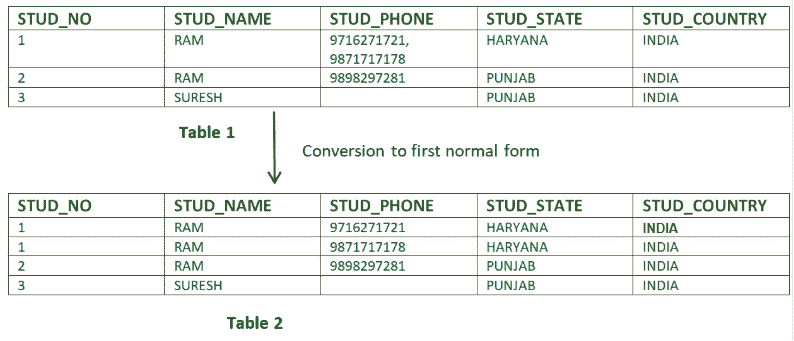

# 优化数据存储：探索 SQL 中的数据类型和规范化

> 原文：[`www.kdnuggets.com/optimizing-data-storage-exploring-data-types-and-normalization-in-sql`](https://www.kdnuggets.com/optimizing-data-storage-exploring-data-types-and-normalization-in-sql)


图片由作者提供

在当今世纪，数据是新的石油。优化数据存储对获取良好的性能始终至关重要。选择合适的数据类型并应用正确的规范化过程对于决定其性能至关重要。

* * *

## 我们的前三个课程推荐

 1\. [谷歌网络安全证书](https://www.kdnuggets.com/google-cybersecurity) - 快速进入网络安全职业道路

 2\. [谷歌数据分析专业证书](https://www.kdnuggets.com/google-data-analytics) - 提升你的数据分析技能

 3\. [谷歌 IT 支持专业证书](https://www.kdnuggets.com/google-itsupport) - 支持你的组织的 IT 工作

* * *

本文将研究最重要且常用的数据类型，并了解规范化过程。

# SQL 中的数据类型

SQL 中主要有两种数据类型：字符串和数值。除此之外，还有布尔型、日期和时间、数组、区间、XML 等额外的数据类型。

## 字符串数据类型

这些数据类型用于存储字符字符串。字符串通常作为数组数据类型实现，包含一个元素序列，通常是字符。

1.  **CHAR(n):**

这是一个固定长度的字符串，可以包含字符、数字和特殊字符。`n`表示它可以容纳的字符串的最大长度。

它的最大范围是从 0 到 255 个字符，问题在于这种数据类型会占用指定的全部空间，即使字符串的实际长度少于指定长度。额外的字符串长度会用额外的内存空间填充。

1.  **VARCHAR(n):**

Varchar 类似于 Char，但可以支持可变大小的字符串，没有填充。该数据类型的存储大小等于字符串的实际长度。

它最多可以存储 65535 个字符。由于其可变长度特性，其性能不如 CHAR 数据类型。

1.  **BINARY(n):**

它类似于 CHAR 数据类型，但只接受二进制字符串或二进制数据。它可以用于存储图像、文件或任何序列化对象。还有一种数据类型`VARBINARY(n)`，类似于 VARCHAR 数据类型，但也只接受二进制字符串或二进制数据。

1.  **TEXT(n):**

这种数据类型也用于存储字符串，但其最大尺寸为 65535 字节。

1.  **BLOB(n):** 代表二进制大型对象，存储数据最多可达 65535 字节。

除这些之外，还有其他数据类型，如 LONGTEXT 和 LONGBLOB，它们可以存储更多的字符。

## 数值数据类型

1.  **INT():**

它可以存储一个 4 字节（32 位）的数字整数。这里的 `n` 表示显示宽度，最大可以达到 255。它指定用于显示整数值的最小字符数。

范围：

1.  a)  -2147483648 <= 有符号 INT <= 2147483647

1.  b)  0 <= 无符号 INT <= 4294967295

1.  **BIGINT():**

它可以存储最大为 64 位的大整数。

范围：

1.  a)  -9223372036854775808 <= 有符号 BIGINT <= 9223372036854775807

1.  b)  0 <= 无符号 BIGINT <= 18446744073709551615

1.  **FLOAT():**

它可以存储带有小数位的浮点数，精度有一定的近似。它存在一些小的舍入误差，因此在需要精确度的情况下不适合使用。

1.  **DOUBLE():**

此数据类型表示双精度浮点数。与 FLOAT 数据类型相比，它可以存储更高精度的十进制值。

1.  **DECIMAL(n, d)：**

此数据类型表示具有固定精度的确切十进制数字，精度由 d 表示。参数 `d` 指定小数点后的位数，参数 `n` 表示数字的大小。`d` 的最大值为 30，默认值为 0。

## 其他数据类型

1.  **BOOLEAN：**

该数据类型仅存储两个状态：真或假。它用于执行逻辑操作。

1.  **ENUM：**

它代表枚举类型。它允许你从预定义选项列表中选择一个值。它还确保存储的值仅来自指定的选项。

例如，考虑一个属性 `color`，它只能是 `'Red'、'Green' 或 'Blue'`。当我们将这些值放入 ENUM 时，`color` 的值只能是这些指定的颜色。

1.  **XML：**

XML 代表可扩展标记语言。此数据类型用于存储用于结构化数据表示的 XML 数据。

1.  **自动编号：**

它是一个整数，每当添加记录时，值会自动递增。它用于生成唯一或顺序的数字。

1.  **超链接：**

它可以存储文件和网页的超链接。

这完成了我们关于 SQL 数据类型的讨论。还有许多其他数据类型，但我们讨论的数据类型是最常用的。

# SQL 中的归一化

归一化是从数据库中去除冗余、不一致和异常的过程。冗余指的是相同数据的重复值存在，而数据库中的不一致性指的是相同的数据在多个表中以不同格式存在。

数据库异常可以定义为数据库中任何突然出现或不应存在的变化或差异。这些变化可能由于各种原因，如数据损坏、硬件故障、软件漏洞等。异常可能导致严重后果，如数据丢失或不一致，因此尽快检测和修复异常至关重要。主要有三种类型的异常。我们将简要讨论每一种，但如果你想了解更多，请参考这篇[文章](https://www.geeksforgeeks.org/anomalies-in-relational-model/)。

1.  **插入异常：**

当新插入的行在表中创建不一致时，会导致插入异常。例如，我们想将一个员工添加到组织中，但他的部门尚未分配给他。那么我们无法将该员工添加到表中，这就产生了插入异常。

1.  **删除异常：**

删除异常发生在我们想从表中删除某些行时，需要从数据库中删除其他数据。

1.  **更新异常：**

当我们想更新某些行时，会发生这种异常，这会导致数据库中的不一致。

规范化过程包含一系列准则，使数据库设计高效、优化且不含冗余和异常。存在多种类型的范式，如 1NF、2NF、3NF、BCNF 等。

## 1\. 第一范式（1NF）

第一范式确保表中不包含复合属性或多值属性。这意味着单一属性中只能存在一个值。如果每个属性都是单值的，则关系处于第一范式。

例如



图片由[GeeksForGeeks](https://geeksforgeeks.org/normal-forms-in-dbms/)提供

在表 1 中，属性`STUD_PHONE`包含多个电话号码。但是在表 2 中，该属性被分解为第一范式。

## 2\. 第二范式

表必须处于第一范式，并且关系中不得存在任何部分依赖。部分依赖意味着非主属性（即不属于候选键的属性）部分依赖于候选键的任何适当子集。为了使关系处于第二范式，非主属性必须完全依赖于整个候选键。

例如，考虑一个名为`Employees`的表，具有以下属性。

```py
EmployeeID (Primary Key)
ProjectID (Primary Key)
EmployeeName
ProjectName
HoursWorked
```

在这里，EmployeeID 和 ProjectID 一起构成主键。然而，你可以注意到 EmployeeName 和 EmployeeID 之间存在部分依赖。这意味着 EmployeeName 仅依赖于主键的一部分（即 EmployeeID）。为了完全依赖，EmployeeName 必须依赖于 EmployeeID 和 ProjectID。因此，这违反了第二范式的原则。

要使该关系处于第二范式，我们必须将表拆分为两个独立的表。第一个表包含所有员工详细信息，第二个表包含所有项目详细信息。

因此，`Employee` 表具有以下属性，

```py
EmployeeID (Primary Key)
EmployeeName
```

并且 `Project` 表具有以下属性，

```py
Project ID (Primary Key)
Project Name
Hours Worked
```

现在你可以看到，通过创建两个独立的表，部分依赖关系被消除了。而两个表中的非主属性依赖于主键的完整集合。

## 3\. 第三范式

在第二范式之后，关系仍可能存在更新异常。如果我们仅更新一个元组而不更新另一个，则可能导致数据库中的不一致。

第三范式的条件是表应处于第二范式（2NF），并且非主属性之间没有传递依赖关系。传递依赖关系发生在非主属性依赖于另一个非主属性时，而不是直接依赖于主属性。主属性是候选键的一部分。

考虑一个关系 R(A, B, C)，其中 A 是主键，B 和 C 是非主属性。假设 A→B 和 B→C 是两个**函数依赖**，则 A→C 将是传递依赖关系。这意味着属性 C 并不是由 A 直接决定的。B 在它们之间充当中介。

如果一个表包含传递依赖关系，我们可以通过将表拆分成独立的关系来将其转换为第三范式（3NF）。

## 4\. 博伊斯-科得范式

尽管第二范式（2NF）和第三范式（3NF）消除了大部分冗余，但冗余仍未完全消除。如果函数依赖关系的左侧不是候选键或超键，则可能会发生冗余。**候选键** 由主属性形成，而 **超键** 是候选键的超集。为了解决这个问题，还有另一种函数依赖关系类型，称为博伊斯-科得范式（BCNF）。

要使表处于 BCNF，函数依赖关系的左侧必须是候选键或超键。例如，对于函数依赖 X→Y，X 必须是候选键或超键。

考虑一个包含以下属性的员工表。

1.  员工 ID（主键）

1.  员工姓名

1.  部门

1.  部门主管


员工 ID 是唯一标识每一行的主键。部门属性表示特定员工的部门，部门主管属性表示该特定部门的主管员工的员工 ID。

现在我们将检查此表是否符合 BCNF。条件是函数依赖关系的左侧必须是超键。以下是该表的两个函数依赖关系。

函数依赖 1: 员工 ID → 员工姓名、部门、部门主管

函数依赖 2: 部门 → 部门主管

对于 FD1，EmployeeID 是主键，也是超键。但对于 FD2，`Department` 不是超键，因为多个员工可以在同一个部门。

因此，这个表违反了 BCNF 的条件。为了满足 BCNF 的属性，我们需要将该表拆分为两个独立的表：`Employees` 和 `Departments`。Employees 表包含 EmployeeID、EmployeeName 和 Department，而 Department 表将包含 Department 和 Department Head。


现在我们可以看到在两个表中，所有的功能依赖都依赖于主键，即没有非平凡的依赖。

我们已经涵盖了所有著名的标准化技术，但除此之外，还有两种标准范式，即 4NF 和 5NF。如果你想了解更多，可以参考这篇 [文章](https://www.geeksforgeeks.org/difference-between-4nf-and-5nf/)。

# 总结

我们已经讨论了 SQL 中最常用的数据类型以及数据库管理系统中重要的标准化技术。在设计数据库系统时，我们的目标是使其可扩展，最小化冗余并确保数据完整性。

通过选择合适的数据类型，我们可以在存储、精度和内存消耗之间创建一个微妙的平衡。此外，标准化过程有助于消除数据异常，使模式更加有序。

今天就到这里。直到下次，继续阅读和学习吧。

**[Aryan Garg](https://www.linkedin.com/in/aryan-garg-1bbb791a3/)** 是一名电气工程专业的 B.Tech. 学生，目前在本科最后一年。他的兴趣在于网页开发和机器学习，他已经追求了这一兴趣，并渴望在这些方向上进一步工作。

### 更多相关内容

+   [数据转换：标准化与归一化](https://www.kdnuggets.com/2020/04/data-transformation-standardization-normalization.html)

+   [随机森林算法需要标准化吗？](https://www.kdnuggets.com/2022/07/random-forest-algorithm-need-normalization.html)

+   [Python 基础：语法、数据类型和控制结构](https://www.kdnuggets.com/python-basics-syntax-data-types-and-control-structures)

+   [数据库优化：探索 SQL 中的索引](https://www.kdnuggets.com/2023/07/database-optimization-exploring-indexes-sql.html)

+   [可视化框架类型](https://www.kdnuggets.com/types-of-visualization-frameworks)

+   [优化你的 LLM 的性能和可扩展性](https://www.kdnuggets.com/optimizing-your-llm-for-performance-and-scalability)
