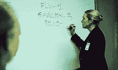
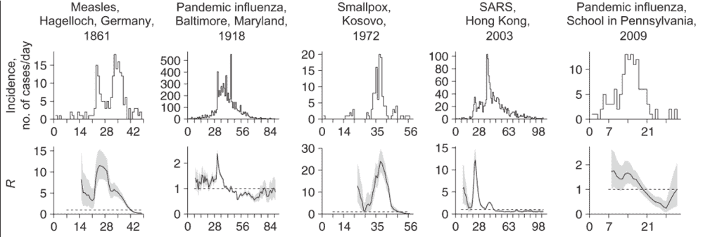
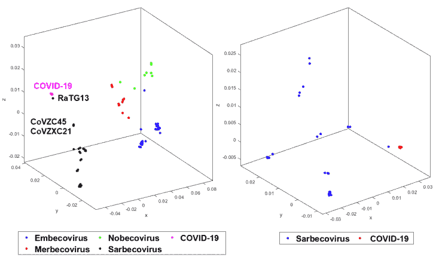
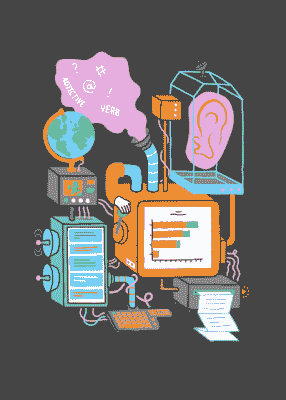

# 疫情分析：应对新问题的数据科学策略

> 原文：[`www.kdnuggets.com/2020/04/outbreak-analytics-data-science-novel-problem.html`](https://www.kdnuggets.com/2020/04/outbreak-analytics-data-science-novel-problem.html)

评论

**由 [Susan Sivek](https://community.alteryx.com/t5/user/viewprofilepage/user-id/143008) 提供，Alteryx**。

> * * *
> 
> ## 我们的前三大课程推荐
> ## 
>  1\. [谷歌网络安全证书](https://www.kdnuggets.com/google-cybersecurity) - 快速进入网络安全职业道路。
> 
>  2\. [谷歌数据分析专业证书](https://www.kdnuggets.com/google-data-analytics) - 提升你的数据分析技能
> 
>  3\. [谷歌 IT 支持专业证书](https://www.kdnuggets.com/google-itsupport) - 支持你组织的 IT
> 
> * * *
> 
> 你走在超市的一条过道上，去拿你最喜欢的麦片。在乳制品过道上，有人因 COVID-19 咳嗽。
> 
> 你在拿牛奶之前先拿麦片的决定是否可能让你保持健康？

在全球疫情期间，我们在做简单的日常决定时都会问这样的问题。但现在设想一下，你的工作是创建一个 COVID-19 传播模型，这个模型需要考虑人类不可预测的、近乎随机的选择。你的模型还可能包括政府的社交距离规定、医院护理的可用性、人口中的既有疾病等。

听起来复杂吗？确实如此，但来自各种领域的研究人员正在努力创建尽可能准确、有用的模型，以预测和解释 COVID-19 的传播。我不是流行病学家，但如果你也对迄今为止公布的数据可视化和建模感到印象深刻和好奇，这篇文章就是为你准备的。

我查阅了一些最近的研究，以了解这些研究人员如何进行所谓的 [疫情分析](https://www.ncbi.nlm.nih.gov/pubmed/31104603)。这里是对这一独特分析过程几个组成部分的初步介绍。我们也会发现一些其他分析应用的经验教训。

### 估算病毒传播

> *“一旦我们知道 R[0]，我们就能够掌握疫情的规模。”* *- 电影《传染病》*

[*再生数*，或 R[0]](https://sph.umich.edu/pursuit/2020posts/how-scientists-quantify-outbreaks.html)（读作“R 零”），指的是一个生病的人可能感染的人的数量。由于人口统计、气候、社会结构和社交距离措施等因素，R[0] 在疾病发生的每个时间和地点都会发生变化。研究人员通过确定第一次感染和第二次感染之间的时间（*生成时间*，当这种时间对许多对病人已知时，可以绘制为*生成时间分布*）来计算 R[0]。估计 R[0] 对于预测疾病传播至关重要。对于引起 COVID-19 的 SARS-CoV-2，目前[R[0] 被认为在不同地方的范围](https://sph.umich.edu/pursuit/2020posts/how-scientists-quantify-outbreaks.html)为 1.5 到 3.5。

[一个名为 R0 的 R 包](https://bmcmedinformdecismak.biomedcentral.com/articles/10.1186/1472-6947-12-147)（可以在[这里](http://cran.r-project.org/web/packages/R0/)获取）能够利用疫情数据计算当前的 R[0]。该包提供了五种不同的计算方法，还具有一个灵敏度分析选项，显示了哪种时间窗口或生成时间的选择最适合数据。

还有一个类似的 R 包，[EpiEstim](https://cran.r-project.org/web/packages/EpiEstim/index.html)，由[不同的研究小组](https://academic.oup.com/aje/article/178/9/1505/89262)开发，具有[Excel 选项](http://tools.epidemiology.net/EpiEstim.xls)。EpiEstim 基于[分支过程模型](https://en.wikipedia.org/wiki/Branching_process)，并根据简单的时间序列数据估计 R[0]。该模型试图捕捉每个感染者将感染的人的数量，但带有随机性（或随机性）元素——就像在商店里与感染者随机相遇一样。下图（[更大图的一部分](https://academic.oup.com/view-large/figure/86224225/kwt13301.tiff)）显示了该模型为过去五次疫情生成的 R[0] 估计。

### 病原体基因组测序

> *“它展示了新奇的特征……它是哥斯拉、金刚和弗兰肯斯坦的结合体。”*
> 
> - **Contagion**

对来自不同地点和时间的病人的 SARS-CoV-2 样本进行基因分析可以帮助研究人员追踪病毒的传播和突变。这项分析还可以帮助快速识别可能的治疗方法。[研究人员最近展示了](https://www.biorxiv.org/content/10.1101/2020.02.03.932350v3.full.pdf)一种新的机器学习方法，通过基因组识别未知病毒的类型及其不同的变种（即确定其分类，如[“冠状病毒”的广泛类别](https://www.nature.com/articles/s41564-020-0695-z)）。

这种方法将 SARS-CoV-2 基因组序列转换为数值表示（详见 [完整研究论文](https://www.biorxiv.org/content/10.1101/2020.02.03.932350v3.full.pdf)）。几乎 15,000 种其他病毒的序列也被用于训练数据中。研究人员训练了六种不同的机器学习模型（[线性判别分析](https://sebastianraschka.com/Articles/2014_python_lda.html)、[线性支持向量机、二次支持向量机](https://community.alteryx.com/t5/Data-Science-Blog/And-For-My-Next-Trick-An-Introduction-to-Support-Vector-Machines/ba-p/360762)、细化的 [KNN](https://help.alteryx.com/current/K_Nearest_Neighbors.htm)、子空间判别分析和子空间 KNN）。训练后的模型对 COVID-19 病毒株基因组的最高分类等级进行标签预测。研究人员随后将模型转向下一个更具体的分类等级，并重复这一过程。

下图展示了研究人员在最后两次测试中的结果，这些测试将 153 个病毒序列分类为四个亚属和 COVID-19，然后将 76 个病毒序列分类为其他 Sarbecovirus 类型或 COVID-19。

这一策略不仅帮助确认了 SARS-CoV-2 应正确归类于其他冠状病毒科和 β 冠状病毒病原体，而且还发现它与在蝙蝠中发现的其他病毒有重要的相似之处。研究人员认为，他们的方法更快（包括 10 倍交叉验证在内的 10 分钟内），且能够比较更多、更具多样性的样本，相比于以前的分析过程。虽然对当前疫情可能会有一些见解，但这种方法对未来的疫情爆发也可能有所帮助。

### 尽管存在不确定性，预测疾病传播

> *“基于我们的模型，根据 R[0] 为 3.2 … 这是我们预计在 48 小时后达到的情况。”*
> 
> - 传染*

一种流行病学建模方法是创建一个“**SIR 模型**”，该模型将整体人群划分为“**易感**”、“**感染**”和“**移除**”（即从疾病中康复并被赋予一定程度免疫，或因死亡不再在人群中）这三个“隔间”。

然而，生成这样的模型从来都不容易。由于多种原因，包括制度性障碍、缺乏检测、未知或无症状病例等，疫情数据可能难以准确收集。而且，正如我们所见，各国政府在不同时间实施了不同的社交距离和隔离措施，这可能对“易感”隔间中的人数产生不可预测的影响。

为了处理所有不确定性来源，[一组研究人员](https://www.medrxiv.org/content/10.1101/2020.02.29.20029421v1.full.pdf)开发了他们所谓的“eSIR”模型——一个扩展模型，包括“一个时间变化的概率，表示易感者遇到感染者的概率或反之亦然”，以及一个新的区隔来包括选择自我隔离的易感者。这两个因素在特定地区会根据实施隔离协议的时间而有所变化。

为了进一步将不确定性纳入模型，研究人员使用了马尔可夫链蒙特卡罗（MCMC）算法。（这里有两个对 MCMC 的解释：[一个较简单的](https://towardsdatascience.com/a-zero-math-introduction-to-markov-chain-monte-carlo-methods-dcba889e0c50)，[一个较复杂的](https://link.springer.com/article/10.3758/s13423-016-1015-8)）。MCMC 方法允许对那些不能直接知道的分布（如 SARS-CoV-2 感染的真实数量）或过于昂贵以至于难以计算的分布进行近似。eSIR 模型的预测旨在揭示疫情中的“转折点”。转折点包括每日新增病例停止增长的时候，以及感染病例达到最高点的时候。该模型还可以提供 R[0]的估计值。

研究人员正在发布一个名为 eSIR 的 R 包，该包生成模型、ggplot2 对象和总结统计数据。这种方法的有用之处在于，它可以帮助确定哪些隔离策略可能最有效以及何时实施。正如研究人员所说，“……过于严格的隔离可能会适得其反；人们可能会失去对隔离系统的信任和耐心，因此可能会尝试减少遵守或甚至避免隔离。”必须权衡实施严格隔离系统的风险与疾病预防的收益。该模型提供了一种重要计算的途径。

### 对所有建模的启示

从这些尚处于初步阶段的模型中，我们可以学到哪些超越疫情的教训？有几个关键点。

首先，这些模型展示了在应对极其复杂情况时的快速创新。（上述基因组和“eSIR”研究仍为“预印本”，即尚未经过同行评审，并已尽可能快速发布，以贡献于科学界应对疫情的努力。）尽管面临巨大的压力，看到研究人员如此迅速地将创造力应用于这场危机，实在令人印象深刻，也激励了我们在寻求应对众多新挑战的解决方案。

其次，另一个可能对数据人员来说熟悉的挑战是：让决策者采取行动 [基于数据洞察](https://community.alteryx.com/t5/Analytics-Blog/Creating-an-Analytic-Culture-for-Digital-Transformation/ba-p/412264)。伟大的“扁平化曲线”可视化和相关的预测似乎对政策制定者和公众产生了强烈的影响。同样，数据专家需要能够清晰地沟通他们的分析和模型——例如，通过 [有效的数据可视化](https://community.alteryx.com/t5/Data-Science-Blog/A-Good-Honest-Chart-Coronavirus-Data-Visualizations-and-How/ba-p/547543)——组织也应在各个领域建立数据素养。

最后，我审查的研究经常提到获取优质 COVID-19 数据以建立良好模型的挑战。即使在正常时期，获取我们需要的数据种类和质量也可能很困难。关于大流行的模型——或者任何其他现象——只有建立在高质量数据之上才有价值。数据无处不在，但并非所有数据都值得信赖、可用或相关。每个组织都需要建立稳固的数据收集、管理和分析结构（正如 [这些流行病学家建议的](http://www.centerforhealthsecurity.org/our-work/pubs_archive/pubs-pdfs/2020/200324-outbreak-science.pdf)用于爆发）。有了这些准备，如果出现任何危机，你的响应可以基于准确、相关、最新的数据。

[原文](https://community.alteryx.com/t5/Data-Science-Blog/Outbreak-Analytics-Data-Science-Strategies-for-a-Novel-Problem/ba-p/552108)。经许可转载。

**个人简介：** [苏珊·库里·西维克，博士](https://www.linkedin.com/in/ssivek/)，是一位作家和数据爱好者，喜欢以日常语言解释复杂的想法，有时以有趣的方式进行。她喜欢美食、科幻小说和狗。

**相关内容：**

+   [利用互动可视化理解 COVID-19 大流行](https://www.kdnuggets.com/2020/04/interactive-covid-19-visualizations.html)

+   [使用 Biopython 进行 COVID-19 基因组分析](https://www.kdnuggets.com/2020/04/coronavirus-covid-19-genome-analysis-biopython.html)

+   [数据科学如何被用于理解 COVID-19](https://www.kdnuggets.com/2020/04/data-science-understand-covid-19.html)

### 更多相关话题

+   [5 步蓝图应对下一个数据科学问题](https://www.kdnuggets.com/5-step-blueprint-to-your-next-data-science-problem)

+   [自然语言处理应用的现实世界范围：另一种…](https://www.kdnuggets.com/2022/03/different-solution-problem-range-nlp-applications-real-world.html)

+   [用 Python 进行遗传编程：背包问题](https://www.kdnuggets.com/2023/01/knapsack-problem-genetic-programming-python.html)

+   [梯度消失问题：原因、后果和解决方案](https://www.kdnuggets.com/2022/02/vanishing-gradient-problem.html)

+   [今天 90%的代码是为了防止失败而编写的，这才是问题](https://www.kdnuggets.com/2022/07/90-today-code-written-prevent-failure-problem.html)

+   [思维图谱：大语言模型中精细问题解决的新范式](https://www.kdnuggets.com/graph-of-thoughts-a-new-paradigm-for-elaborate-problem-solving-in-large-language-models)
