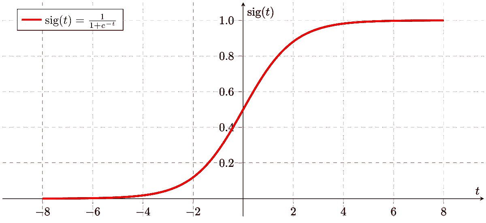

# 逻辑回归概述

> 原文：[`www.kdnuggets.com/2022/02/overview-logistic-regression.html`](https://www.kdnuggets.com/2022/02/overview-logistic-regression.html)

**由 [Arvind Thorat](https://www.linkedin.com/in/arvind-thorat-6963661a7/)，Kavikulguru 工程技术学院**

机器学习是编程计算机以便它们能够从数据中学习的科学（和艺术）。这是一个稍微更一般的定义：

* * *

## 我们的前三大课程推荐

 1\. [谷歌网络安全证书](https://www.kdnuggets.com/google-cybersecurity) - 快速进入网络安全职业生涯。

 2\. [谷歌数据分析专业证书](https://www.kdnuggets.com/google-data-analytics) - 提升你的数据分析技能

 3\. [谷歌 IT 支持专业证书](https://www.kdnuggets.com/google-itsupport) - 支持你的组织在 IT 方面

* * *

> [机器学习是](https://www.kdnuggets.com/google-itsupport) 赋予计算机在没有明确编程的情况下学习的领域。
> 
> —亚瑟·塞缪尔，1959

以及一个更面向工程的定义：

> 如果计算机程序在某个任务 T 上的表现随着经验 E 的增加而提升，并且这一表现通过性能度量 P 来衡量，那么这个程序就被认为是从经验 E 中学习了。
> 
> —汤姆·米切尔，1997

在本文中，我们将讨论**逻辑回归**这一术语，它是许多行业和机器学习应用中广泛使用的算法。

### 逻辑回归

逻辑回归是线性回归的扩展，用于解决分类问题。我们将看到如何使用基于梯度下降的优化方法来解决一个简单的逻辑回归问题，这也是最流行的优化方法之一。

### 假设

+   在二元逻辑回归中，依赖变量需要是二元的，而有序逻辑回归则要求依赖变量是有序的。*观察值不应来自重复测量或匹配数据。*逻辑回归排除了独立变量之间的多重共线性。*它基于独立线性假设，要求独立变量与对数几率线性相关。*

    你们可能会问，逻辑回归是否可以用于多个独立变量呢？

    答案是肯定的，逻辑回归可以用于任意数量的独立变量。然而，请注意，你将无法在三维以上的空间中可视化结果。

    在讨论这些要点之前，让我们首先讨论逻辑函数，也就是 sigmoid 函数。

    ### **Sigmoid 函数（见图 1）**

    逻辑回归以方法核心使用的函数命名，即逻辑函数。它也被称为 sigmoid 函数。它用于描述生态学中种群增长的特性，快速上升并在环境承载能力达到最大值时趋于稳定。它是一个三段曲线，可以将任何数值映射到 0 和 1 之间，但从不完全到达这些极限。

    我们可以推导出

    `Sigmoid Function = 1 / 1 + e^-value`

    其中：

    `e = 自然对数的底`

    当我们不能通过线性边界将数据分成类时，也会使用它。

    从示例中：

    `p / 1 - p`

    其中；

    `p = 事件的概率`

    我们可以从中创建公式

    `log p / 1 - p`

    它最初也用于生物科学，随后被广泛应用于许多社会科学领域。当因变量是分类变量时会使用它。

    这是一个简单的模型：

    `Output = 0 或 1`

    `Hypothesis => Z = Wx + B`

    `h(x) = Sigmoid(z)`

    有两个条件：

    `Z = ∞ (无限)`

    和

    `Y(predict) = 1`

    如果 `Z = -∞`

    `Y(predict) => 0`

    在实现任何算法之前，我们必须为其准备数据。以下是逻辑回归的一些数据准备方法。

    **方法论**

    1.  数据准备

    1.  二元输出变量

    1.  移除噪声

    1.  高斯分布

    1.  移除相关输入

    **使用示例**

    1.  信用评分

    1.  医学

    1.  文本编辑

    1.  游戏

    **优点**

    逻辑回归是解决分类问题的最有效技术之一。使用逻辑回归的一些优点包括：

    1.  逻辑回归容易实现、解释，并且训练效率很高。它在对未知记录进行分类时非常迅速。

    1.  当数据集是线性可分时，它表现良好。

    1.  它可以将模型系数解释为特征重要性的指标。

    **缺点**

    1.  它构造线性边界；逻辑回归需要自变量与几率线性相关。

    1.  逻辑回归的主要限制是对因变量和自变量之间线性关系的假设。

    1.  更强大且紧凑的算法，如神经网络，往往可以轻松超越该算法。

    ### 结论

    逻辑回归是传统机器学习方法之一。它与线性回归、k-均值聚类、主成分分析等算法一起，形成了一套基础的机器学习方法。神经网络也在逻辑回归的基础上发展起来的。即使你不是机器学习专家，你也可以高效地使用逻辑回归，而很多其他算法则不然。相反，没有对逻辑回归的扎实理解，无法成为机器学习大师。

    **[Arvind Thorat](https://www.linkedin.com/in/arvind-thorat-6963661a7/)** 是 NPPD 的数据科学实习生。

    ### 更多相关话题

    +   [比较线性回归和逻辑回归](https://www.kdnuggets.com/2022/11/comparing-linear-logistic-regression.html)

    +   [线性回归与逻辑回归：简明解释](https://www.kdnuggets.com/2022/03/linear-logistic-regression-succinct-explanation.html)

    +   [KDnuggets 新闻 22:n12，3 月 23 日：最佳数据科学书籍…](https://www.kdnuggets.com/2022/n12.html)

    +   [用于分类的逻辑回归](https://www.kdnuggets.com/2022/04/logistic-regression-classification.html)

    +   [逻辑回归是如何工作的？](https://www.kdnuggets.com/2022/07/logistic-regression-work.html)

    +   [分类指标解析：逻辑回归与…](https://www.kdnuggets.com/2022/10/classification-metrics-walkthrough-logistic-regression-accuracy-precision-recall-roc.html)
