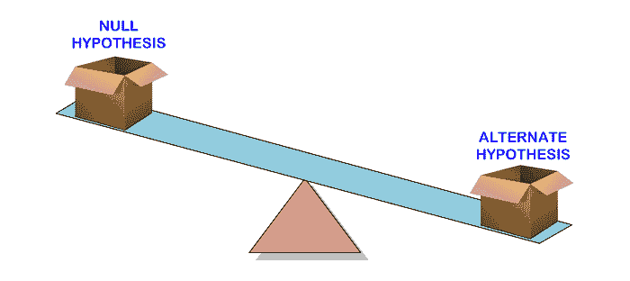
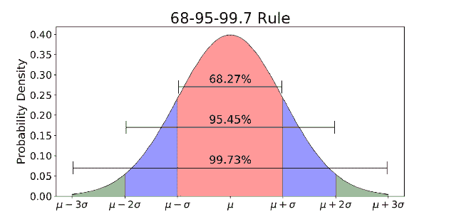
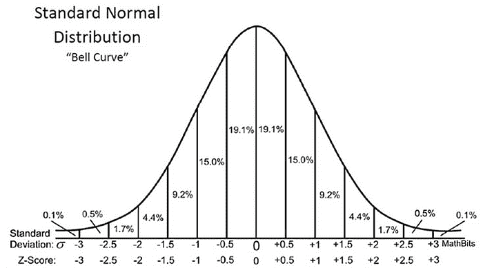

# 数据科学家解释的 P 值

> 原文：[`www.kdnuggets.com/2019/07/p-values-explained-data-scientist.html`](https://www.kdnuggets.com/2019/07/p-values-explained-data-scientist.html)

 评论

**作者 [Admond Lee](https://www.linkedin.com/in/admond1994/)，美光科技 / AI Time Journal / Tech in Asia**

我记得在我[第一次在 CERN 的暑期实习](https://towardsdatascience.com/my-journey-from-physics-into-data-science-5d578d0f9aa6?source=post_page---------------------------)时，大多数人还在谈论[希格斯玻色子的发现](https://home.cern/science/physics/higgs-boson?source=post_page---------------------------)，确认它达到了[“五个西格玛”阈值](https://blogs.scientificamerican.com/observations/five-sigmawhats-that/?source=post_page---------------------------)**（即 p 值为 0.0000003）。**

* * *

## 我们的前三个课程推荐

 1\. [谷歌网络安全证书](https://www.kdnuggets.com/google-cybersecurity) - 快速进入网络安全职业轨道。

 2\. [谷歌数据分析专业证书](https://www.kdnuggets.com/google-data-analytics) - 提升你的数据分析技能

 3\. [谷歌 IT 支持专业证书](https://www.kdnuggets.com/google-itsupport) - 支持你所在的组织的 IT

* * *

当时我对 p 值、假设检验甚至统计显著性一无所知。

你说得对。

我去谷歌搜索了“p 值”这个词，在[维基百科](https://en.wikipedia.org/wiki/P-value?source=post_page---------------------------)上的内容让我更加困惑了……

> 在统计假设检验中，***p*-值** 或 **概率值** 是对于给定的统计模型，当零假设为真时，统计摘要（如两个比较组之间样本均值差的绝对值）大于或等于实际观察结果的概率。
> 
> — [维基百科](https://en.wikipedia.org/wiki/P-value?source=post_page---------------------------)

干得好，维基百科。

好吧，我最终没能真正理解 p 值的含义。

直到现在，进入数据科学领域后，我才开始欣赏 p 值的意义以及它如何作为某些实验决策工具的一部分。

因此，我决定**在本文中解释 p 值以及它们如何在假设检验中使用**，希望能给你对 p 值有更好的直观理解。

虽然我们不能跳过其他概念的基础理解和 p 值的定义，但我保证我会以直观的方式解释，而不会用我所遇到的所有技术术语来轰炸你。

本文共有四个部分，为你提供从构建假设检验到理解 p 值以及使用这些来指导决策的完整图景。我强烈建议你通读所有部分，以详细理解 p 值：

1.  **假设检验**

1.  **正态分布**

1.  **什么是 p 值？**

1.  **统计显著性**

这将会很有趣。????

让我们开始吧！

### 1. 假设检验

假设检验

在讨论 p 值的含义之前，让我们先了解**假设检验**，其中**p 值**用于确定结果的**统计显著性**。

我们的终极目标是确定结果的统计显著性。

统计显著性建立在这 3 个简单的概念上：

+   假设检验

+   正态分布

+   p 值

[**假设检验**](https://www.statisticshowto.datasciencecentral.com/probability-and-statistics/hypothesis-testing/?source=post_page---------------------------#HTMean)用于检验关于总体的声明的有效性（*零假设*）。如果零假设被认为不成立，那么***备择假设***就是你会相信的。

换句话说，我们会提出一个声明（*零假设*），并使用样本数据来检验该声明是否有效。如果声明无效，我们将选择我们的*备择假设*。就是这么简单。

为了判断声明是否有效，我们会使用 p 值来衡量证据的强度，以查看其是否具有统计学意义。如果证据支持*备择假设*，那么我们将拒绝*零假设*并接受*备择假设*。这将在后续部分进一步解释。

让我们用一个例子来更清楚地说明这个概念，这个例子将在本文中用于其他概念。

???? ???? [**示例**](https://www.dummies.com/education/math/statistics/what-a-p-value-tells-you-about-statistical-data/?source=post_page---------------------------)**：**假设一个披萨店声称他们的送餐时间平均为 30 分钟或更少，但你认为超过了这个时间。因此你进行假设检验，并随机抽取一些送餐时间来检验这一声明：

+   **零假设**——平均送餐时间为 30 分钟或更少

+   **备择假设**——平均送餐时间超过 30 分钟

这里的目标是确定哪种声明——零假设还是备择假设——更有力地被样本数据支持。

在我们的案例中，我们将使用 [**单尾检验**](https://stats.idre.ucla.edu/other/mult-pkg/faq/general/faq-what-are-the-differences-between-one-tailed-and-two-tailed-tests/?source=post_page---------------------------)，因为我们 **只关心均值交付时间是否大于 30 分钟**。我们将忽略另一方向的可能性，因为均值交付时间低于或等于 30 分钟的后果更为可取。我们要测试的是均值交付时间是否有可能大于 30 分钟。换句话说，我们想看看比萨店是否以某种方式欺骗了我们。

常见的假设检验方法之一是使用 [**Z 检验**](https://www.analyticsvidhya.com/blog/2015/09/hypothesis-testing-explained/?source=post_page---------------------------)。这里我们不会详细讲解，因为我们想在深入探讨之前对表面上的内容有一个高层次的了解。

### 2\. 正态分布

[均值 μ 和标准差 σ 的正态分布](https://towardsdatascience.com/understanding-the-68-95-99-7-rule-for-a-normal-distribution-b7b7cbf760c2?source=post_page---------------------------)

正态分布是一个 [概率密度函数](https://towardsdatascience.com/how-to-find-probability-from-probability-density-plots-7c392b218bab?source=post_page---------------------------&sk=086eae07d154a0e263f3bb7bc85ac2c8)，用于查看数据分布。

正态分布有两个参数 — **均值 (μ)** 和 **标准差，也称为 sigma (σ)**。

**均值** 是分布的中心趋势。它定义了正态分布的峰值位置。**标准差** 是一个变异性的度量。它决定了数值偏离均值的远近程度。

正态分布通常与 ` [**68-95-99.7 规则**](https://en.wikipedia.org/wiki/68%E2%80%9395%E2%80%9399.7_rule?source=post_page---------------------------)`（见上图）相关联。

+   68% 的数据位于均值 (μ) 的 1 个标准差 (σ) 内。

+   95% 的数据位于均值 (μ) 的 2 个标准差 (σ) 内。

+   99.7% 的数据位于均值 (μ) 的 3 个标准差 (σ) 内。

还记得我一开始提到的用于发现希格斯玻色子的 [“五西格玛”阈值](https://blogs.scientificamerican.com/observations/five-sigmawhats-that/?source=post_page---------------------------) 吗？5 sigma 是大约 ***99.9999426696856%*** 的数据必须达到的水平，科学家们才确认了希格斯玻色子的发现。这是为了避免任何潜在的假信号而设定的严格阈值。

很好。现在你可能在想，“正态分布如何应用于我们之前的假设检验？”

由于我们使用 Z 检验进行假设检验，我们需要计算[**Z 分数**](https://www.statisticshowto.datasciencecentral.com/probability-and-statistics/z-score/?source=post_page---------------------------)（用于我们的[**检验统计量**](https://www.statisticshowto.datasciencecentral.com/test-statistic/?source=post_page---------------------------)），它是数据点与均值的标准差数量。在我们的例子中，**每个数据点是我们收集的比萨配送时间。**

[计算 Z 分数的公式](https://www.thoughtco.com/z-scores-worksheet-3126534?source=post_page---------------------------)用于每个数据点

请注意，当我们计算了每个比萨配送时间的所有 Z 分数并绘制了如下的**标准正态分布**曲线时，X 轴上的单位将从分钟变为标准差单位，因为我们已经**通过减去均值并除以标准差来标准化了变量**（见上面的公式）。

查看标准正态分布曲线是有用的，因为我们可以将测试结果与标准化的标准差单位的“正常”人群进行比较，尤其是当我们有一个不同单位的变量时。

[Z 分数的标准正态分布](https://mathbitsnotebook.com/Algebra2/Statistics/STzScores.html?source=post_page---------------------------)

Z 分数可以告诉我们总体数据相对于平均人群的位置。

我喜欢[Will Koehrsen](https://towardsdatascience.com/u/e2f299e30cb9?source=post_page---------------------------)这样描述——**Z 分数越高或越低，结果发生的可能性越小，结果越有意义。**

> 但是，什么程度的高（或低）被认为足够令人信服，以量化我们的结果有多么有意义？

### ????????**重点**

这就是我们需要最后一块拼图来解决难题的地方——**p 值**，并根据我们设定的[**显著性水平**（也称为*alpha*）](https://blog.minitab.com/blog/adventures-in-statistics-2/understanding-hypothesis-tests-significance-levels-alpha-and-p-values-in-statistics?source=post_page---------------------------)来检查我们的结果是否具有统计显著性，这些显著性水平是在*我们开始实验之前*设定的。

### 3. 什么是 P 值？

p 值由[Cassie Kozyrkov](https://towardsdatascience.com/u/2fccb851bb5e?source=post_page---------------------------)精彩解释

最后……我们谈论的是 p 值！

所有前面的解释都是为了铺垫，引导我们到这个 p 值。我们需要这些前置的背景和步骤，以便理解这个神秘（实际上并不那么神秘的）p 值以及它如何影响我们对假设检验的决策。

如果你已经读到这里，继续阅读。因为这一部分是所有部分中最激动人心的！

与其用 [Wikipedia](https://en.wikipedia.org/wiki/P-value?source=post_page---------------------------)（对不起 Wikipedia）给出的定义来解释 p 值，不如在我们的背景下——披萨配送时间来解释！

记住我们随机抽取了一些披萨配送时间，目标是检查平均配送时间是否超过 30 分钟。如果最终证据支持披萨店的说法（平均配送时间为 30 分钟或更少），那么我们将不拒绝原假设。否则，我们会拒绝原假设。

因此，p 值在这里的作用是回答这个问题：

> **如果我生活在一个披萨配送时间为 30 分钟或更少的世界里（原假设为真），我的证据在现实中有多令人惊讶？**

p 值用一个数字来回答这个问题——**概率**。

p 值越低，证据越令人惊讶，我们的原假设看起来就越荒谬。

当我们觉得原假设荒谬时，我们该怎么办？我们拒绝它，选择我们的替代假设。

如果 p 值低于预定的**显著性水平**（人们称之为*alpha*，我称之为*荒谬的临界值 — 不要问我为什么，我只是觉得这样更容易理解），那么我们会拒绝原假设。

现在我们理解了 p 值的含义。让我们在我们的案例中应用它。

### ???? 披萨配送时间中的 p 值 ????

现在我们收集了一些抽样的配送时间，计算发现**平均配送时间长了 10 分钟，p 值为 0.03**。

这意味着**在一个披萨配送时间为 30 分钟或更少的世界中**（**原假设为真**），我们有**3% 的机会**看到平均配送时间**因为随机噪声而至少长 10 分钟**。

p 值越低，结果越有意义，因为它越不容易被噪声造成。

大多数人对 p 值有一个常见的误解：

> p 值 0.03 意味着结果有 3%（百分比概率）是由于偶然——**这不是真的**。

人们通常希望得到明确的答案（包括我自己），这就是我长时间困惑于解释 p 值的原因。

> p 值并不*证明*任何东西。它只是用惊讶作为做出合理决策的基础。
> 
> — [Cassie Kozyrkov](https://towardsdatascience.com/u/2fccb851bb5e?source=post_page---------------------------)

### **这是我们如何使用 p 值 0.03 帮助我们做出合理决策的方法（重要）：**

+   想象一下我们生活在一个平均配送时间始终为 30 分钟或更少的世界里——因为我们相信披萨店（我们的初始信念）！

+   在分析了收集到的样本交付时间后，p 值 0.03 低于显著性水平 0.05（假设我们在实验前设定了这个值），我们可以说结果是 ***统计上显著的***。

+   因为我们一直相信披萨店能够履行其 30 分钟或更短时间内送达披萨的承诺，我们现在需要考虑这个信念是否仍然成立，因为结果告诉我们披萨店未能履行承诺，结果是 ***统计上显著的***。

+   那么我们该怎么办？首先，我们尝试找出使我们初始信念（零假设）有效的每一种可能的方法。**但是由于披萨店逐渐收到其他人的差评，并且经常提供不靠谱的借口导致迟到，即使我们自己也觉得难以再为披萨店辩解，因此，我们决定拒绝零假设。**

+   最终，合理的决策是选择不再从该地点购买任何披萨。

现在您可能已经意识到一些事情……根据我们的背景，p 值并不是用来证明或证实任何事情的。

在我看来，**p 值作为工具用于挑战我们初始的信念（零假设），当结果是 *统计上显著的* 时**。当我们觉得自己的信念有些荒谬（前提是 p 值显示结果具有统计显著性），我们就会丢弃初始信念（拒绝零假设），并做出合理的决策。

### 4\. 统计显著性

最后，这是最后阶段，我们将所有内容汇总并测试结果是否 ***统计上显著的。***

仅有 p 值是不够的，我们需要设定一个阈值（即 **显著性水平 — alpha**）。alpha 应该在实验前设定，以避免偏见。如果观察到的 p 值低于 alpha，那么我们可以得出结果是 ***统计上显著的。***

经验法则是将 alpha 设为 0.05 或 0.01（再次说明，值取决于您的具体问题）。

如前所述，假设我们在实验开始前将 alpha 设定为 0.05，得到的结果具有统计显著性，因为 p 值 0.03 低于 alpha。

**供参考，以下是 **[**整个实验的基本步骤**](http://g/?source=post_page---------------------------)**：**

1.  陈述零假设

1.  陈述替代假设

1.  确定要使用的 alpha 值

1.  找到与您的 alpha 水平相关的 Z 分数

1.  使用此公式找到检验统计量

1.  如果检验统计量的值低于 alpha 水平的 Z 分数（或 p 值低于 alpha 值），则拒绝零假设。否则，不拒绝零假设。

计算第 5 步的检验统计量的公式

如果你想了解更多关于统计显著性的信息，请随时查看这篇文章——[统计显著性解析](https://towardsdatascience.com/statistical-significance-hypothesis-testing-the-normal-curve-and-p-values-93274fa32687?source=post_page---------------------------)，由[Will Koehrsen](https://towardsdatascience.com/u/e2f299e30cb9?source=post_page---------------------------)撰写。

### 最后想法

[(来源)](https://unsplash.com/photos/JfolIjRnveY?source=post_page---------------------------)

感谢你的阅读。

这里有很多内容需要消化，不是吗？

我不能否认，p 值对于很多人来说本质上是令人困惑的，我花了相当长的时间才真正理解和欣赏 p 值的含义及其在我们作为数据科学家的决策过程中如何应用。

但不要过于依赖 p 值，因为它们仅在整个决策过程中起到一小部分的辅助作用。

我希望你觉得 p 值的解释直观且有助于理解 p 值的真正含义及其在假设检验中的应用。

归根结底，p 值的计算是简单的。困难的部分在于我们想要解读假设检验中的 p 值。希望现在困难的部分对你来说至少稍微容易一点。

如果你想学习更多关于统计学的知识，我强烈推荐你阅读这本书（我现在正在读！）——[**数据科学家的实用统计学**](https://amzn.to/2l9vhF1?source=post_page---------------------------)，专门为数据科学家编写，以帮助理解统计学的基本概念。

一如既往，如果你有任何问题或意见，请随时在下面留言，或者你可以通过[LinkedIn](https://www.linkedin.com/in/admond1994/?source=post_page---------------------------)联系我。期待在下一个帖子中见到你！ ????

**个人简介：[Admond Lee](https://www.linkedin.com/in/admond1994/)**被誉为帮助初创公司和各类公司解决数据问题的**数据科学家和顾问**中的佼佼者，他在**数据科学咨询和行业知识**方面拥有强大的专业能力。你可以通过[LinkedIn](https://www.linkedin.com/in/admond1994/)、[Medium](https://medium.com/@admond1994)、[Twitter](https://twitter.com/admond1994)和[Facebook](https://www.facebook.com/admond1994)与他联系，或者[**在这里预约与他通话**](http://bit.ly/request-a-call-with-admond)**，如果你正在寻找数据科学咨询服务。**

[原文](https://towardsdatascience.com/p-values-explained-by-data-scientist-f40a746cfc8)。经许可转载。

**相关内容：**

+   你应该关注的十大数据科学领袖

+   如何进入数据科学领域：针对有志数据科学家的终极问答指南

+   简单而实用的数据清理代码

### 更多相关主题

+   [使用 SQL 处理时间序列中的缺失值](https://www.kdnuggets.com/2022/09/handling-missing-values-timeseries-sql.html)

+   [使用 SHAP 值提高机器学习模型的可解释性](https://www.kdnuggets.com/2023/08/shap-values-model-interpretability-machine-learning.html)

+   [机器学习与大脑不同 第四部分：神经元的…](https://www.kdnuggets.com/2022/06/machine-learning-like-brain-part-4-neuron-limited-ability-represent-precise-values.html)

+   [数据科学家、数据工程师及其他数据职业解析](https://www.kdnuggets.com/2021/05/data-scientist-data-engineer-data-careers-explained.html)

+   [数据治理与可观察性解析](https://www.kdnuggets.com/2022/08/data-governance-observability-explained.html)

+   [数据库关键术语解析](https://www.kdnuggets.com/2016/07/database-key-terms-explained.html)
