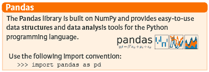
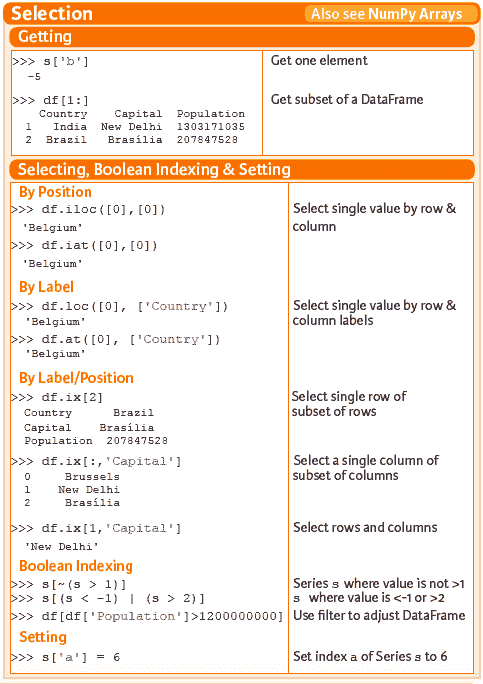
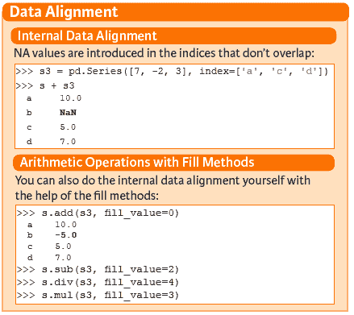

# Pandas 备忘单：Python 中的数据科学与数据处理

> 原文：[`www.kdnuggets.com/2017/01/pandas-cheat-sheet.html`](https://www.kdnuggets.com/2017/01/pandas-cheat-sheet.html)

**作者：Karlijn Willems，数据科学记者 & [DataCamp](https://www.datacamp.com/) 贡献者。**

### 使用 Python 进行数据处理

数据科学工作流中一个非常重要的组件是数据处理。就像 [matplotlib](http://matplotlib.org/) 是数据科学中数据可视化的首选工具一样，[Pandas 库](http://pandas.pydata.org/) 是你在 Python 中进行数据操作和分析时的首选工具。这个库最初建立在 [NumPy](http://www.numpy.org/) 上，NumPy 是 Python 中用于科学计算的基础库。Pandas 库提供的数据结构快速、灵活且表达力强，专门设计用于使现实世界的数据分析显著更容易。

* * *

## 我们的三大推荐课程

 1\. [谷歌网络安全证书](https://www.kdnuggets.com/google-cybersecurity) - 快速进入网络安全职业生涯

 2\. [谷歌数据分析专业证书](https://www.kdnuggets.com/google-data-analytics) - 提升你的数据分析技能

 3\. [谷歌 IT 支持专业证书](https://www.kdnuggets.com/google-itsupport) - 支持您的组织 IT 需求

* * *

然而，这种灵活性可能对初学者来说是有代价的；当你刚开始时，Pandas 库可能看起来非常复杂，可能很难找到一个统一的学习入口点：其他学习材料关注库的不同方面，你绝对可以使用备忘单来帮助你掌握它。

这就是 DataCamp 的 [Pandas 教程](https://www.datacamp.com/community/tutorials/pandas-tutorial-dataframe-python) 和 [备忘单](https://www.datacamp.com/community/blog/python-pandas-cheat-sheet) 发挥作用的地方。

### Pandas 备忘单

使用这个库的第一件事是导入它。对于刚开始学习 Python 和/或编程的人来说，导入惯例可能显得不自然。然而，如果你看过第一张备忘单，你应该已经有了一些了解；在这种情况下，导入惯例规定你应该将 pandas 导入为 pd。然后在代码中使用 Pandas 模块时，你可以使用这个缩写。

这非常方便！

### Pandas 数据结构

当你开始使用 Pandas 数据结构时，你将立即看到这种导入是如何工作的。但是，当你谈论“数据结构”时，究竟是什么意思？最简单的理解就是将它们看作是你数据的结构化容器。或者，如果你已经使用过 NumPy，这些数据结构基本上是带有索引的数组。

观看[这个视频](https://www.youtube.com/watch?v=9d5-Ti6onew)，如果你想了解更多关于 Pandas 数据结构如何与 NumPy 数组连接的信息。

无论如何，Pandas 库使用的基本结构是 Series 和 DataFrames。Series 基本上是带有索引的一维数组。要创建一个简单的 Series，可以使用`pd.Series()`。将一个列表传递给此函数，如果你愿意，还可以指定一些索引。结果可以在左侧的图片中看到。

请注意，Series 可以包含任何数据类型。

要创建 DataFrames，这些是具有不同数据类型列的二维结构，可以使用`pd.DataFrame()`。在这种情况下，你将一个字典传递给此函数，并传递一些额外的索引以指定列。

### 输入/输出

当你使用 Pandas 库进行数据处理时，你首先不会自己创建一个 DataFrame；而是从外部来源导入数据，然后将其放入 DataFrame 中，以便更容易处理。正如你在介绍中所读到的，Pandas 的**终极**目的是使现实世界的数据分析变得显著容易。

由于你的数据大多数不会仅来自文本文件，因此备忘单包括了三种将数据输入和输出到 DataFrames 或文件的方法，即 CSV、Excel 和 SQL 查询/数据库表。这三种方法被认为是数据到达你的三种最重要方式。你将看到 Pandas 有特定的函数来提取和推送数据：`pd.read_csv()`、`pd.read_excel()`和`pd.read_sql()`。但你也可以使用`pd.read_sql_table()`或`pd.read_sql_query()`，具体取决于你是从表格还是查询中读取。

请注意，`to_sql()`是对后两个函数的便捷封装。这意味着它只是调用另一个函数。类似地，如果你想将数据输出到文件中，可以使用`pd.to_csv()`、`pd.to_excel()`和`pd.to_sql()`。

想了解更多关于如何使用 Pandas 导入数据并用它来探索数据的信息吗？可以考虑参加 DataCamp 的[Pandas Foundations](https://www.datacamp.com/courses/pandas-foundations)课程。

### 帮助！

其中一个始终实用的工具是`help()`函数。使用此函数时，你不应忘记尽可能完整：如果你想获取更多关于 Pandas 库中某个函数或概念的信息，例如 Series，请调用`pd.Series`。

### 选择

当你最终获得了关于 Series 和 DataFrames 的所有信息，并且已经将数据导入这些结构中（或者你可能已经创建了自己的示例 Series 和 DataFrames，就像在备忘单中一样），你可能想要更仔细地检查数据结构。做到这一点的方法之一是选择元素。作为提示，备忘单指出你可能还会查看如何在 NumPy 数组中做到这一点。如果你已经了解 NumPy，你在这里显然会有优势！

如果你需要开始使用这个用于科学计算的 Python 库，可以考虑[这个 NumPy 教程](https://www.datacamp.com/community/tutorials/python-numpy-tutorial)。

实际上，如果你已经使用过 NumPy，选择的过程非常相似。如果你还没有使用过，也不用担心，因为它很简单：要获取一个元素，你使用方括号 [] 并放入所需的索引。在这种情况下，你在方括号中放入 ‘b’，你会得到 -5。如果你回顾一下“Pandas 数据结构”，你会发现这是正确的。对于 2D DataFrame 结构，当你使用方括号结合冒号时，也有类似的情况。冒号前面放置的是表示行索引的数字；在第二个例子中 df[1:]，你请求所有从索引 1 开始的行。这意味着具有比利时条目的行不会出现在结果中。

要根据 DataFrame 或 Series 中的位置选择值，你不仅需要使用方括号和索引，还可以使用 iloc() 或 iat()。然而，你也可以通过行和列标签来选择元素。正如你在 Pandas 数据结构的介绍中看到的那样，列有标签：“Country”、“Capital”和“Population”。借助 loc() 和 at()，你实际上可以根据这些标签选择元素。除了这四个函数，还有一个基于标签或位置的索引器：ix 主要是基于标签的，但当没有提供标签时，它将接受整数以指示 DataFrame 或 Series 中要检索值的位置。

布尔索引也包含在备忘单中；这是一个重要的机制，用于从原始 DataFrame 或 Series 中选择仅满足特定条件的值。条件可以使用逻辑运算符 & 或 | 与运算符 <、>、== 或组合（如 <= 或 >=）轻松指定。

最后，还有设置值的选项：在这种情况下，你将 Series 的索引 a 更改为值 6，而不是原始值 3。

你是否对如何操控你的 DataFrames 以充分利用它们感兴趣？可以考虑参加 DataCamp 的 [使用 Pandas 操作 DataFrames](https://www.datacamp.com/courses/manipulating-dataframes-with-pandas) 课程。

### 删除值

除了获取、选择、索引和设置 DataFrame 或 Series 的值，你还需要灵活地删除不再需要的值。利用 drop() 从列或行中删除值。此函数默认影响轴 0 或行。这意味着，如果你想从列中删除值，你不应忘记在代码中添加参数 axis=1！

### 排序与排名

操控 DataFrame 或 Series 的另一种方法是对数据结构中的值进行排序和/或排名。使用 sort_index() 按标签沿轴排序，或使用 sort_values() 按值沿轴排序。正如你所期待的，rank() 允许你对 DataFrame 或 Series 的条目进行排名。

### 检索 DataFrame/Series 信息

当你最终掌握了数据科学项目的数据时，了解一些关于 DataFrames 或 Series 的基本信息可能会很有用，特别是当这些信息可以告诉你更多关于数据的形状、索引、列和非 NA 值的数量时。此外，任何通过 info() 获得的其他信息都将是非常欢迎的，尤其是在处理不熟悉或新数据时。

除了左侧显示的属性和函数外，你还可以利用聚合函数来了解你的数据。你会发现它们中的大多数作为统计学中常用的函数（如 mean() 或 median()）应该对你很熟悉。

### 应用函数

在某些情况下，你还可能需要对 DataFrames 或 Series 应用函数。除了 lambda 函数（你可能已经从 DataCamp 的 [Python 数据科学工具箱](https://www.datacamp.com/courses/python-data-science-toolbox-part-1) 课程中了解过），你还可以使用 apply() 将函数应用于整个数据集，或者在希望逐元素应用函数时使用 applymap()。换句话说，你将对 DataFrame 或 Series 的每个元素应用函数。想看看这在实践中是如何工作的？试试 [DataCamp 的 Pandas DataFrame 教程](https://www.datacamp.com/community/tutorials/pandas-tutorial-dataframe-python)。

### 数据对齐

你需要了解的最后一件事是，当你的索引不同步时，数据是如何处理的。在示例中，你会看到 s3 的索引与 Series s 的索引不一致。

这可能经常发生！

在这种情况下，Pandas 会为你引入不重叠索引中的 NA 值。每当发生这种情况时，你可以将 fill_value 参数传递给你使用的算术函数，这样任何 NA 值都会被替换为有意义的替代值。

现在你已经了解了构成 Pandas 基础的各个组件，请点击下面的图片以访问完整的备忘单。

[DataCamp](https://www.datacamp.com/) 是一个在线互动教育平台，专注于为数据科学构建最佳学习体验。我们关于 [R](https://www.datacamp.com/courses?learn=r_programming)、[Python](https://www.datacamp.com/courses?learn=python_programming) 和 [数据科学](https://www.datacamp.com/courses) 的课程围绕特定主题展开，结合视频讲解和浏览器内编码挑战，让你通过实践学习。 [你可以随时免费开始每门课程](https://www.datacamp.com/courses)，无论何时何地。

**简介: [Karlijn Willems](https://www.linkedin.com/in/karlijnwillems)** 是一名数据科学记者，为 [DataCamp 社区](https://www.datacamp.com/community/authors/karlijn-willems) 撰写文章，专注于数据科学教育、最新新闻和热门趋势。她拥有文学与语言学以及信息管理的学位。

**相关内容**:

+   为你的团队提供的 4 个在线数据科学培训选项

+   全面学习 Python 用于数据分析和数据科学指南

+   最佳数据科学在线课程

### 更多相关内容

+   [停止学习数据科学以寻找目标，并寻找目标以…](https://www.kdnuggets.com/2021/12/stop-learning-data-science-find-purpose.html)

+   [每个数据科学家都应该知道的三个 R 库（即使你使用 Python）](https://www.kdnuggets.com/2021/12/three-r-libraries-every-data-scientist-know-even-python.html)

+   [是什么让 Python 成为初创公司理想的编程语言](https://www.kdnuggets.com/2021/12/makes-python-ideal-programming-language-startups.html)

+   [学习数据科学统计的顶级资源](https://www.kdnuggets.com/2021/12/springboard-top-resources-learn-data-science-statistics.html)

+   [成功数据科学家的 5 个特征](https://www.kdnuggets.com/2021/12/5-characteristics-successful-data-scientist.html)

+   [一个 90 亿美元的 AI 失败，探讨](https://www.kdnuggets.com/2021/12/9b-ai-failure-examined.html)
