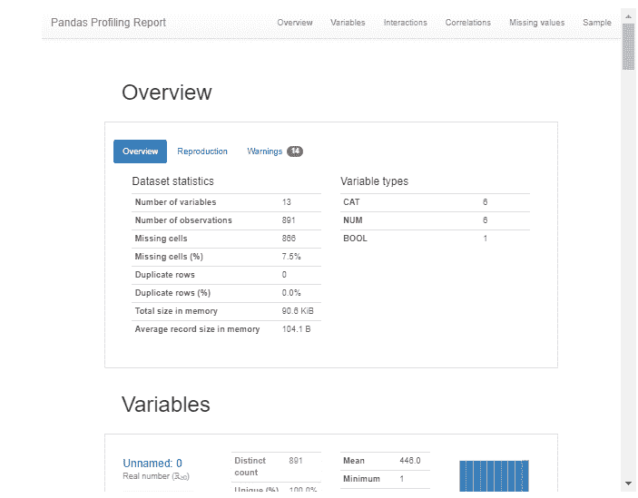
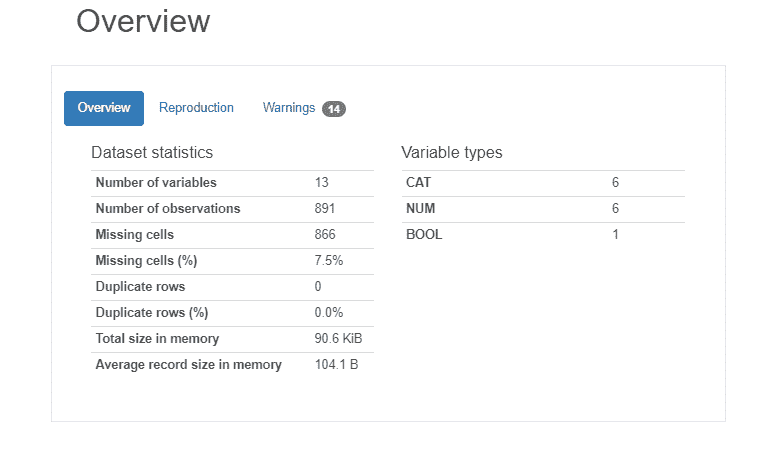
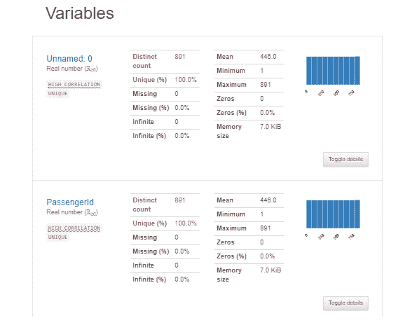
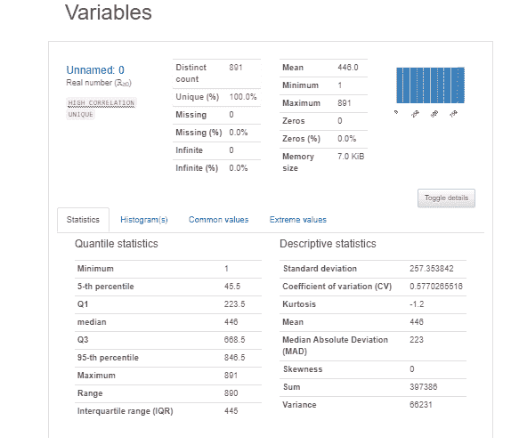
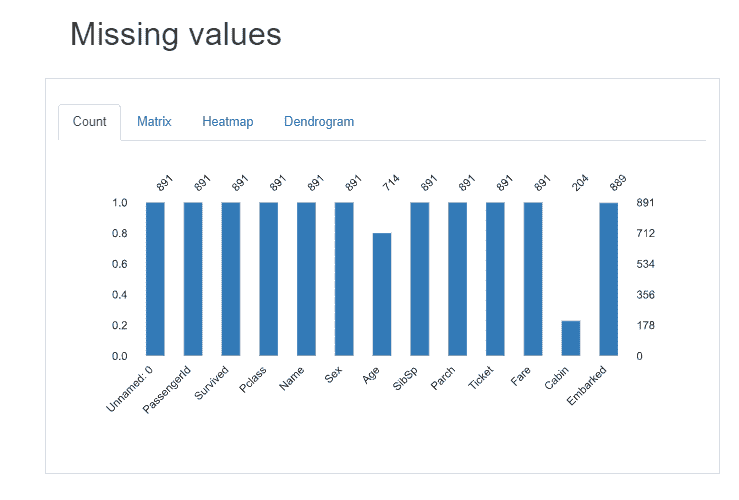
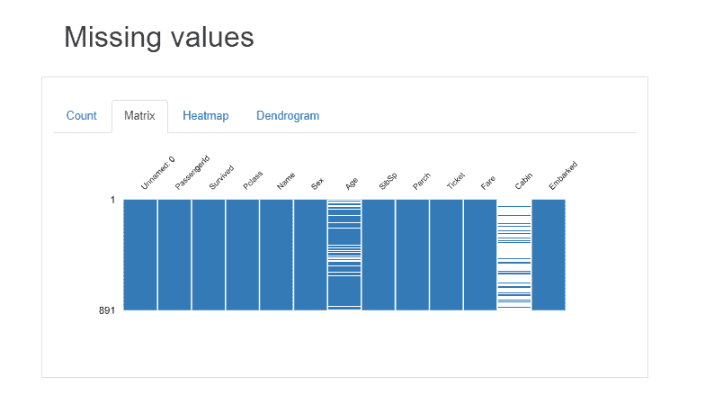
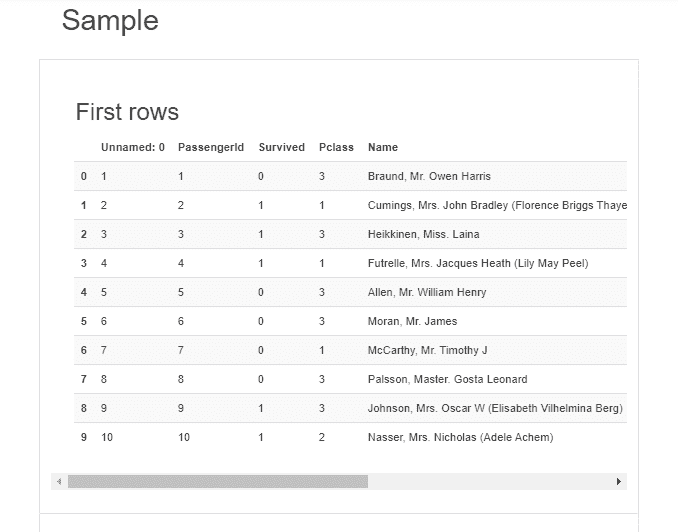
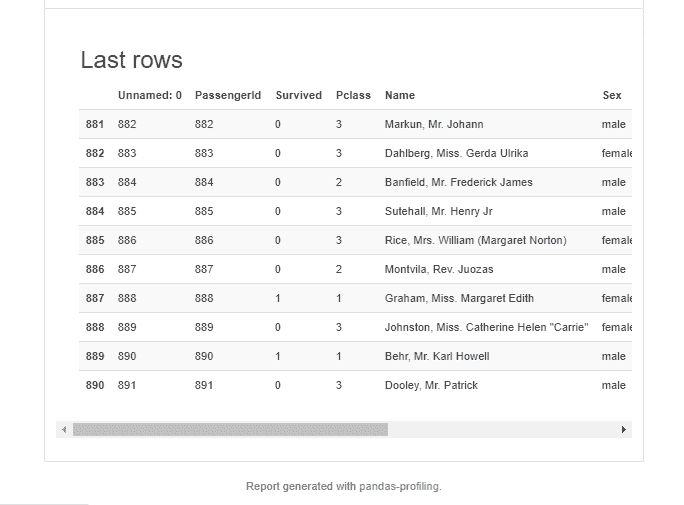

# Pandas Profiling：用于 EDA 的一行神奇代码

> 原文：[`www.kdnuggets.com/2021/02/pandas-profiling-one-line-magical-code-eda.html`](https://www.kdnuggets.com/2021/02/pandas-profiling-one-line-magical-code-eda.html)

评论

**由 [Juhi Sharma](https://www.linkedin.com/in/juhi-sharma-ds/<code>) 提供，产品分析师**

### 使用 Pandas Profiling Python 库的自动化探索性数据分析

* * *

## 我们的前三大课程推荐

 1\. [谷歌网络安全证书](https://www.kdnuggets.com/google-cybersecurity) - 快速进入网络安全职业

 2\. [谷歌数据分析专业证书](https://www.kdnuggets.com/google-data-analytics) - 提升您的数据分析技能

 3\. [谷歌 IT 支持专业证书](https://www.kdnuggets.com/google-itsupport) - 支持您的组织的 IT

* * *

探索性数据分析是一种探索/分析数据集以生成可视化形式洞察的方法。EDA 用于了解数据集的主要特征。

EDA 帮助我们了解缺失值、计数、均值、中位数、分位数、数据分布、变量间的相关性、数据类型、数据形状等。为了进行 EDA，我们需要编写大量代码，这需要很多时间。

**为了使 EDA 更加简单快捷，我们可以编写一行神奇代码来进行 EDA。**

EDA 可以通过一个名为 **Pandas Profiling** 的 Python 库进行自动化。这是一个出色的工具，可以创建交互式 HTML 格式的报告，易于理解和分析数据。让我们探索 Pandas Profiling，以便在非常短的时间内和仅用一行代码进行 EDA。

### Pandas Profiling 的安装：

使用 pip 包安装

```py
!pip install pandas-profiling
```

使用 conda 包安装

```py
conda install -c conda-forge pandas-profiling
```

### 加载数据集

在这篇文章中，我使用了 Titanic 数据集。

```py
import pandas as pd

df=pd.read_csv(“titanic2.csv”)

df.head()
```


Titanic 数据集

### 数据集属性的描述

survived — 生存（0 = 否；1 = 是）

Pclass — 乘客等级（1 = 1st；2 = 2nd；3 = 3rd）

name — 乘客姓名

sex — 性别（男/女）

age — 年龄

Sibsp — 登船的兄弟姐妹/配偶数量

Parch — 登船的父母/子女数量

Ticket — 票号

Fare — 乘客票价

Cabin — 舱位

Embarked — 登船港口（C = 切尔堡；Q = 皇后镇；S = 南安普敦）

### 运行 pandas_profiling 的代码在我们的数据框上，返回 Pandas Profiling 报告。

```py
import pandas_profiling as pp

pp.ProfileReport(df) #to display the report
```



Pandas Profiling 报告

你可以看到，我们的 Pandas Profiling EDA 报告通过一行代码已经准备好了。

### Pandas Profiling 报告包含以下部分：

1.  **概述**

1.  **变量**

1.  **交互**

1.  **相关性**

1.  **缺失值**

1.  **示例**

### 1\. 概述部分：



报告的概述部分

本部分提供了整体数据集信息。** 数据集统计** 和 **变量类型**。

**数据集统计** 显示了列、行、缺失值等信息。

**变量类型** 显示了数据集中属性的数据类型。它还显示了 **“警告”**，指出哪些特征与其他特征高度相关。

### 2.变量部分



本部分详细提供了每个特征的信息。当我们点击上图所示的 **切换详细信息** 选项时，新部分会显示出来。



本部分展示了特征的统计信息、直方图、常见值和极端值。

### 3.相关性部分


相关性部分

本部分展示了特征之间的相关性，利用 Seaborn 的热图。我们可以轻松切换不同类型的相关性，如 **Pearson, Spearman, Kendall** 和 **phik**。

### 4.缺失值部分



缺失值部分



我们可以从上述的计数和矩阵图中看到“年龄”和“船舱”列的缺失值。

### 5.样本部分



前 10 行 

最后 10 行

本部分展示了数据集的前 10 行和最后 10 行。

我希望“Pandas Profiling”库能帮助更快、更轻松地分析数据。那么你对这个美丽的库有什么看法？试试看，并在回复部分提到你的经验。

### 在离开之前

感谢阅读！如果你想与我联系，请随时通过 jsc1534@gmail.com 或我的 [LinkedIn 个人主页](http://www.linkedin.com/in/juhi-sharma-ds) 联系我。

**简介: [Juhi Sharma](https://www.linkedin.com/in/juhi-sharma-ds/)** ([Medium](https://juhi95.medium.com/)) 热衷于通过数据驱动的方法解决业务问题，包括数据可视化、机器学习和深度学习。Juhi 正在攻读数据科学硕士学位，并拥有 2.2 年分析师工作经验。

[原始](https://medium.com/analytics-vidhya/pandas-profiling-one-line-magical-code-for-eda-51db924f3ac4) 文章。经许可转载。

**相关:**

+   仅用两行代码进行强大的探索性数据分析

+   在 Python 中合并 Pandas 数据框

+   使用管道进行更清洁的数据分析

### 更多相关话题

+   [使用 timeit 和 cProfile 对 Python 代码进行性能分析](https://www.kdnuggets.com/profiling-python-code-using-timeit-and-cprofile)

+   [如何通过使用自动 EDA 工具在数据科学评估测试中取得优异成绩](https://www.kdnuggets.com/2022/04/ace-data-science-assessment-test-automatic-eda-tools.html)

+   [Python 内存分析简介](https://www.kdnuggets.com/introduction-to-memory-profiling-in-python)

+   [作为数据科学家管理你的可重用 Python 代码](https://www.kdnuggets.com/2021/06/managing-reusable-python-code-data-scientist.html)

+   [宣布 PyCaret 3.0：开源、低代码的 Python 机器学习](https://www.kdnuggets.com/2023/03/announcing-pycaret-30-opensource-lowcode-machine-learning-python.html)

+   [使用管道编写干净的 Python 代码](https://www.kdnuggets.com/2021/12/write-clean-python-code-pipes.html)
