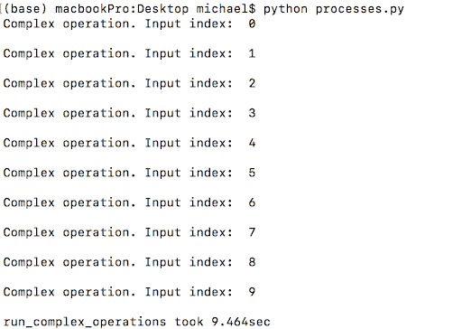
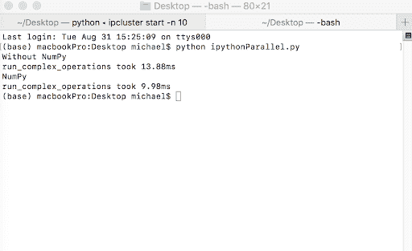
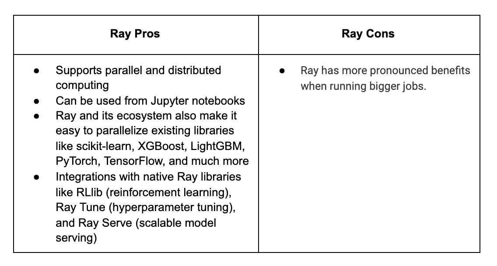

# 并行化 Python 代码

> 原文：[`www.kdnuggets.com/2021/10/parallelizing-python-code.html`](https://www.kdnuggets.com/2021/10/parallelizing-python-code.html)

评论

**由 [Dawid Borycki](https://www.linkedin.com/in/dawidborycki/)，生物医学研究员和软件工程师 & [Michael Galarnyk](https://www.linkedin.com/in/michaelgalarnyk/)，数据科学专家**

Python 非常适合用于训练机器学习模型、执行数值模拟和快速开发概念验证解决方案，而无需设置开发工具和安装多个依赖项。在执行这些任务时，你还希望尽可能多地使用底层硬件以获得快速结果。并行化 Python 代码可以实现这一点。然而，使用标准 CPython 实现意味着你无法充分利用底层硬件，因为全局解释器锁（GIL）阻止了字节码在多个线程中同时运行。

本文回顾了几种常见的并行化 Python 代码的选项，包括：

+   [基于进程的并行处理](https://docs.python.org/3/library/multiprocessing.html)

+   专门的库

+   [IPython Parallel](https://ipython.readthedocs.io/en/stable/)

+   [Ray](https://docs.ray.io/en/master/)

对于每种技术，本文列出了一些优点和缺点，并展示了代码示例，帮助你理解使用它的感觉。

## 如何并行化 Python 代码

并行化 Python 代码有几种常见的方法。你可以启动多个应用程序实例或脚本以并行执行作业。这种方法非常适合当你不需要在并行作业之间交换数据时。否则，在进程之间共享数据会显著降低性能，特别是在汇总数据时。

在同一进程内启动多个线程可以更有效地在作业之间共享数据。在这种情况下，基于线程的并行化可以将一些工作卸载到后台。然而，标准 CPython 实现的全局解释器锁（GIL）阻止了字节码在多个线程中同时运行。

以下示例函数模拟复杂计算（旨在模仿激活函数）

```py
iterations_count = round(1e7)
def complex_operation(input_index):
   print("Complex operation. Input index: {:2d}".format(input_index))
   [math.exp(i) * math.sinh(i) for i in [1] * iterations_count]
```

`complex_operation` 执行多次以更好地估计处理时间。它将长时间运行的操作分成一批较小的操作。它通过将输入值划分为多个子集，并从这些子集中并行处理输入来实现这一点。

这是运行 `complex_operation` 多次（输入范围为十）的代码，并使用 timebudget 包测量执行时间：

```py
@timebudget
def run_complex_operations(operation, input):
   for i in input:
      operation(i) 

input = range(10)
run_complex_operations(complex_operation, input)
```

执行 [这个脚本](https://gist.github.com/mGalarnyk/8c491fbdfe6ce3e498a7f62f03fa9ca4)后，你将获得类似于下面的输出：


如你所见，在本教程中使用的笔记本电脑上执行此代码大约花费了 39 秒。让我们看看如何改进这个结果。

## 基于进程的并行 ism

第一种方法是使用基于进程的并行 ism。通过这种方法，可以同时启动多个进程。这种方式可以使它们并行地执行计算。

从 Python 3 开始，[multiprocessing 包](https://docs.python.org/3/library/multiprocessing.html#module-multiprocessing) 已经预装，并且为我们提供了启动并发进程的便捷语法。它提供了 Pool 对象，该对象自动将输入划分为子集，并在多个进程中分配它们。

[这是一个示例](https://gist.github.com/mGalarnyk/b5455b0454815b04363ef9994f22fbf3) 展示了如何使用 Pool 对象启动十个进程：

```py
import math
import numpy as np
from timebudget import timebudget
from multiprocessing import Pool

iterations_count = round(1e7)

def complex_operation(input_index):
    print("Complex operation. Input index: {:2d}\n".format(input_index))
    [math.exp(i) * math.sinh(i) for i in [1] * iterations_count]

@timebudget
def run_complex_operations(operation, input, pool):
    pool.map(operation, input)

processes_count = 10

if __name__ == '__main__':
    processes_pool = Pool(processes_count)
    run_complex_operations(complex_operation, range(10), processes_pool)
```

[代码示例](https://gist.github.com/mGalarnyk/b5455b0454815b04363ef9994f22fbf3)

每个进程并行执行复杂的操作。因此，理论上代码可以将总执行时间减少最多十倍。然而，下面的代码输出仅显示了大约四倍的改进（上一节的 39 秒 vs 本节的 9.4 秒）。



改进效果没有达到十倍的原因有几个。首先，能够同时运行的最大进程数取决于系统中的 CPU 数量。你可以通过使用`os.cpu_count()`方法来查看系统中的 CPU 数量。

```py
import os
print('Number of CPUs in the system: {}'.format(os.cpu_count()))
```


本教程中使用的机器有八个 CPU。

改进效果没有更好的原因是，本教程中的计算相对较小。最后，需要注意的是，进行并行计算时通常会有一些开销，因为需要通信的进程必须利用[进程间通信机制](https://en.wikipedia.org/wiki/Inter-process_communication)。这意味着对于非常小的任务，并行计算往往比串行计算（普通 Python）要慢。如果你对了解更多关于 multiprocessing 的内容感兴趣，Selva Prabhakaran 有一篇[优秀的博客](https://www.anyscale.com/blog/writing-your-first-distributed-python-application-with-ray) ，这篇博客启发了本教程的这一部分。如果你想了解更多关于并行/分布式计算的权衡，[可以查看这个教程](https://towardsdatascience.com/writing-your-first-distributed-python-application-with-ray-4248ebc07f41)。


## 专用库

[像 NumPy 这样的专用库的许多计算不受 GIL 影响](https://stackoverflow.com/questions/36479159/why-are-numpy-calculations-not-affected-by-the-global-interpreter-lock) ，能够使用线程和其他技术进行并行计算。本教程的这一部分讲解了结合 NumPy 和 multiprocessing 的好处。

为了展示原始实现和基于 NumPy 的实现之间的差异，需要实现一个额外的函数：

```py
def complex_operation_numpy(input_index):
      print("Complex operation (numpy). Input index: {:2d}".format(input_index))

      data = np.ones(iterations_count)
      np.exp(data) * np.sinh(data)
```

代码现在使用 NumPy 的 exp 和 sinh 函数对输入序列进行计算。然后，代码使用进程池执行 complex_operation 和 complex_operation_numpy 十次，以比较它们的性能：

```py
processes_count = 10
input = range(10)

if __name__ == '__main__':
    processes_pool = Pool(processes_count)
    print(‘Without NumPy’)
    run_complex_operations(complex_operation, input, processes_pool)
    print(‘NumPy’)
    run_complex_operations(complex_operation_numpy, input, processes_pool)
```

以下输出显示了使用和不使用 NumPy 的性能对比，针对 [这个脚本](https://gist.github.com/mGalarnyk/703c53bb98aa94d66bb6c49d48ce5c09)。


NumPy 提供了显著的性能提升。在这里，NumPy 将计算时间减少到原始时间的大约 10%（859ms 对比 9.515 秒）。它更快的原因之一是因为 NumPy 中的大部分处理都是向量化的。通过向量化，底层代码有效地被“并行化”，因为操作可以一次计算多个数组元素，而不是逐一循环处理。如果你对了解更多内容感兴趣，Jake Vanderplas 进行了一次很好的讲座，[可以在这里](https://youtu.be/EEUXKG97YRw?t=613)观看。


## IPython Parallel

IPython shell 支持在多个 IPython 实例之间进行交互式并行和分布式计算。IPython Parallel 几乎是与 IPython 一起开发的。当 IPython 被更名为 Jupyter 时，它们将 IPython Parallel 分离成了一个独立的包。[IPython Parallel](https://ipython.org/ipython-doc/3/parallel/parallel_intro.html) 有许多优势，但也许最大的优势是它使得并行应用程序可以以交互的方式开发、执行和监控。在使用 IPython Parallel 进行并行计算时，你通常会从 ipcluster 命令开始。

```py
ipcluster start -n 10
```

最后的参数控制要启动的引擎（节点）数量。上述命令在 [安装 ipyparallel Python 包](https://ipyparallel.readthedocs.io/en/latest/)后变得可用。以下是一个示例输出：


下一步是提供应该连接到 ipcluster 并启动并行作业的 Python 代码。幸运的是，IPython 提供了一个方便的 API 来实现这一点。代码看起来像是基于 Pool 对象的进程并行：

```py
import math
import numpy as np
from timebudget import timebudget
import ipyparallel as ipp

iterations_count = round(1e7)

def complex_operation(input_index):
    print("Complex operation. Input index: {:2d}".format(input_index))

    [math.exp(i) * math.sinh(i) for i in [1] * iterations_count]

def complex_operation_numpy(input_index):
    print("Complex operation (numpy). Input index: {:2d}".format(input_index))

    data = np.ones(iterations_count)
    np.exp(data) * np.sinh(data)

@timebudget
def run_complex_operations(operation, input, pool):
    pool.map(operation, input)

client_ids = ipp.Client()
pool = client_ids[:]

input = range(10)
print('Without NumPy')
run_complex_operations(complex_operation, input, pool)
print('NumPy')
run_complex_operations(complex_operation_numpy, input, pool)
```

[代码示例](https://gist.github.com/mGalarnyk/6dab23cc6485f145d2b148fc64d34b3c)

在终端中新标签页中执行的代码生成了如下输出：



对于 IPython Parallel，使用和不使用 NumPy 的执行时间分别为 13.88 毫秒和 9.98 毫秒。注意，标准输出中没有包含日志，但可以通过额外的命令进行评估。


## Ray

类似于 IPython Parallel，[Ray](https://docs.ray.io/en/master/index.html) 可以用于并行 **和** 分布式计算。Ray 是一个快速、简单的分布式执行框架，使得扩展应用程序和利用最先进的机器学习库变得容易。使用 Ray，你可以将顺序运行的 Python 代码转化为分布式应用程序，代码修改最小。


虽然这个教程简要讲解了 Ray 如何简化普通 Python 代码的并行化，但值得注意的是，Ray 及其生态系统也使得并行化现有库变得容易，如 [scikit-learn](https://medium.com/distributed-computing-with-ray/how-to-speed-up-scikit-learn-model-training-aaf17e2d1e1)、[XGBoost](https://www.anyscale.com/blog/distributed-xgboost-training-with-ray)、[LightGBM](https://www.anyscale.com/blog/introducing-distributed-lightgbm-training-with-ray)、[PyTorch](https://medium.com/pytorch/getting-started-with-distributed-machine-learning-with-pytorch-and-ray-fd83c98fdead) 等等。

使用 Ray 时，需要 ray.init() 来启动所有相关的 Ray 进程。默认情况下，Ray 为每个 CPU 核心创建一个工作进程。如果你想在集群上运行 Ray，你需要传入类似 ray.init(address='insertAddressHere') 的集群地址。

```py
ray.init() 
```

下一步是创建一个 Ray 任务。这可以通过使用 @ray.remote 装饰器装饰一个普通的 Python 函数来完成。这会创建一个可以在你的笔记本电脑的 CPU 核心（或 Ray 集群）上调度的任务。下面是对之前创建的 complex_operation_numpy 的一个示例：

```py
@ray.remote
def complex_operation_numpy(input_index):
   print("Complex operation (numpy). Input index: {:2d}".format(input_index))
   data = np.ones(iterations_count)
   np.exp(data) * np.sinh(data)
```

在最后一步，在 Ray 运行时执行这些函数，如下所示：

```py
@timebudget
def run_complex_operations(operation, input):
   ray.get([operation.remote(i) for i in input])
```

执行 [这个脚本](https://gist.github.com/mGalarnyk/30c8672620c8655a37940be935899a57) 后，你将得到类似以下的输出：


使用和不使用 NumPy 的 Ray 执行时间分别为 3.382 秒和 419.98 毫秒。重要的是要记住，当执行长时间运行的任务时，Ray 的性能优势会更加明显，如下图所示。


当运行更大规模的任务时，Ray 的好处更为明显 [(image source)](https://towardsdatascience.com/10x-faster-parallel-python-without-python-multiprocessing-e5017c93cce1)

如果你想了解 Ray 的语法，可以在 [这里](https://www.anyscale.com/blog/writing-your-first-distributed-python-application-with-ray) 查阅介绍教程。



## 其他 Python 实现

一个最终的考虑是，你可以使用其他 Python 实现来应用多线程。例如，IronPython 用于 .NET，Jython 用于 Java。在这种情况下，你可以使用底层框架的低级线程支持。如果你已经有 .NET 或 Java 的多处理经验，这种方法会非常有利。

## 结论

这篇文章回顾了通过代码示例并突出一些优缺点来并行化 Python 的常见方法。我们使用简单的数值数据进行了基准测试。重要的是要记住，并行化的代码通常会引入一些开销，并且并行化的好处在处理较大的任务时更为明显，而不是在本教程中的短期计算。

请记住，并行化对于其他应用可能更为强大。尤其是在处理典型的基于 AI 的任务时，你必须对模型进行重复的微调。在这种情况下，[Ray](https://github.com/ray-project/ray) 由于其丰富的生态系统、自动扩展、容错能力和使用远程机器的能力，提供了最佳支持。

**[Dawid Borycki](https://www.linkedin.com/in/dawidborycki/)** 是生物医学研究员和软件工程师，书籍作者和会议讲者。

**[Michael Galarnyk](https://www.linkedin.com/in/michaelgalarnyk/)** 是数据科学专业人士，并在 Anyscale 从事开发者关系工作。

[原文](https://www.anyscale.com/blog/parallelizing-python-code)。已获得许可重新发布。

**相关内容：**

+   如何加速 Scikit-Learn 模型训练

+   使用 Ray 编写你的第一个分布式 Python 应用程序

+   Dask 和 Pandas：数据量再多也不为过

* * *

## 我们的前三大课程推荐

 1\. [Google 网络安全证书](https://www.kdnuggets.com/google-cybersecurity) - 快速进入网络安全职业生涯。

 2\. [Google 数据分析专业证书](https://www.kdnuggets.com/google-data-analytics) - 提升你的数据分析技能

 3\. [Google IT 支持专业证书](https://www.kdnuggets.com/google-itsupport) - 支持你的组织 IT

* * *

### 更多相关话题

+   [优化 Python 代码性能：深入探讨 Python 分析工具](https://www.kdnuggets.com/2023/02/optimizing-python-code-performance-deep-dive-python-profilers.html)

+   [作为数据科学家管理你的可重用 Python 代码](https://www.kdnuggets.com/2021/06/managing-reusable-python-code-data-scientist.html)

+   [宣布 PyCaret 3.0：Python 中的开源低代码机器学习](https://www.kdnuggets.com/2023/03/announcing-pycaret-30-opensource-lowcode-machine-learning-python.html)

+   [使用管道编写清晰的 Python 代码](https://www.kdnuggets.com/2021/12/write-clean-python-code-pipes.html)

+   [跟踪和可视化 Python 代码执行的 3 个工具](https://www.kdnuggets.com/2021/12/3-tools-track-visualize-execution-python-code.html)

+   [使用 timeit 和 cProfile 进行 Python 代码性能分析](https://www.kdnuggets.com/profiling-python-code-using-timeit-and-cprofile)
