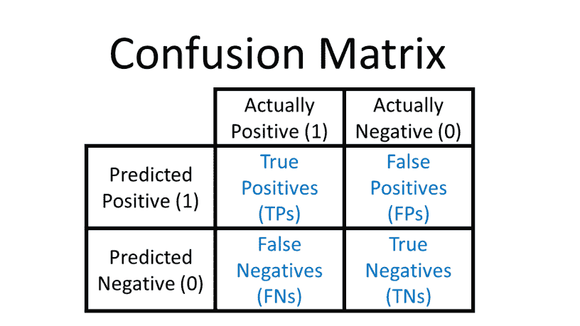
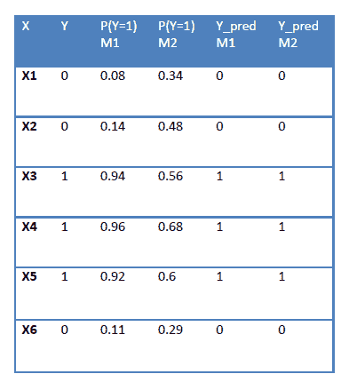
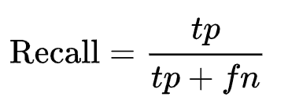
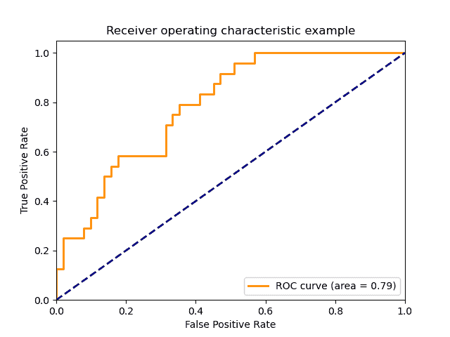
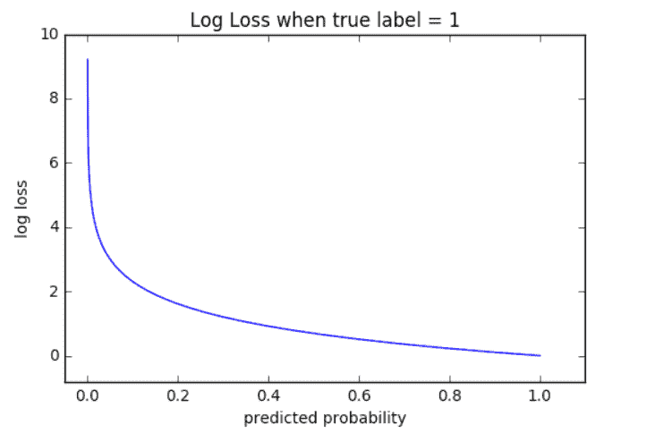
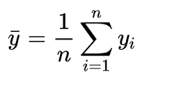
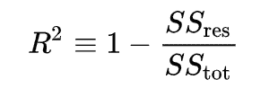

# 如何评估你的机器学习模型的性能

> 原文：[`www.kdnuggets.com/2020/09/performance-machine-learning-model.html`](https://www.kdnuggets.com/2020/09/performance-machine-learning-model.html)

评论

**作者 [Saurabh Raj](https://www.linkedin.com/in/saurabh-raj-445821153/)，印度理工学院贾穆**。

### 为什么评估是必要的？

* * *

## 我们的前三个课程推荐

 1\. [Google 网络安全证书](https://www.kdnuggets.com/google-cybersecurity) - 快速进入网络安全职业轨道。

 2\. [Google 数据分析专业证书](https://www.kdnuggets.com/google-data-analytics) - 提升你的数据分析技能

 3\. [Google IT 支持专业证书](https://www.kdnuggets.com/google-itsupport) - 支持你在组织中的 IT 工作

* * *

让我从一个非常简单的例子开始。

> *罗宾和萨姆都开始为工程学院的入学考试做准备。他们共享一个房间，并在解决数值问题时付出了相同的努力。他们几乎每天都学习相同的小时数，并参加了最终考试。令人惊讶的是，罗宾通过了，而萨姆没有。经过询问，我们了解到他们准备策略中有一个不同点，“测试系列。”罗宾参加了一个测试系列，他通过这些考试来测试自己的知识和理解，然后进一步评估自己的不足之处。但萨姆很自信，他只是继续训练自己。*

以同样的方式，如上所述，一个机器学习模型可以通过许多参数和新技术进行广泛的训练，但只要你忽视其评估，你就无法信任它。

**如何阅读混淆矩阵？**

一个**混淆矩阵**是模型预测与数据点实际类别标签之间的关联。

*二分类的混淆矩阵。*

假设你正在构建一个模型来检测一个人是否患有糖尿病。在训练-测试分割后，你得到了一个长度为 100 的测试集，其中 70 个数据点标记为正例（1），30 个数据点标记为负例（0）。现在，让我绘制一下你的测试预测矩阵：

在 70 个实际正例数据点中，你的模型预测了 64 个点为正例，6 个点为负例。在 30 个实际负例数据点中，它预测了 3 个点为正例，27 个点为负例。

**注意：** 在这些符号中，**真正例、真负例、假正例和假负例**，注意第二个术语（正例或负例）表示你的预测，而第一个术语表示你预测的正确性。

基于上述矩阵，我们可以定义一些非常重要的比率：

+   **TPR（真正阳性率）=（真正阳性 / 实际阳性）**

+   **TNR（真正负性率）=（真正负性 / 实际负性）**

+   **FPR（假阳性率）=（假阳性 / 实际负例）**

+   **FNR（假阴性率）=（假阴性 / 实际阳性）**

对于我们糖尿病检测模型的情况，我们可以计算这些比例：

TPR = 91.4%

TNR = 90%

FPR = 10%

FNR = 8.6%

如果你想让你的模型变得智能，你的模型必须准确预测。这意味着你的**真正阳性**和**真正负性** *应该尽可能高*，同时，你需要尽量减少你的错误，即**假阳性**和**假阴性** *应该尽可能低*。同时，在比例方面，你的**TPR & TNR** *应该非常高*，而**FPR & FNR** *应该非常低*。

**一个智能模型：** TPR ↑，TNR ↑，FPR ↓，FNR ↓

**一个糟糕的模型：** 任何其他组合的 TPR、TNR、FPR、FNR。

有人可能会争辩说，不可能对所有四个比例进行平等处理，因为最终没有模型是完美的。那么我们应该怎么做？

是的，这是真的。这就是为什么我们在构建模型时要考虑领域的原因。有些领域要求我们将特定的比例作为主要优先级，即使其他比例较差也是如此。例如，在癌症诊断中，我们不能以任何代价漏掉任何一个阳性患者。因此，我们应该将 TPR 保持在最大值，而 FNR 接近 0。即使我们将任何健康患者预测为已诊断，仍然可以接受，因为他们可以进行进一步检查。

### 准确率

准确率就是其字面意义上所说的，衡量你的模型有多准确。

**准确率 = 正确预测 / 总预测**

**通过使用混淆矩阵，准确率 = （TP + TN）/（TP + TN + FP + FN）**

准确率是我们可以使用的最简单的性能指标之一。但我需要警告你，准确率有时会让你对模型产生错误的幻想，因此你应该首先了解你的数据集和使用的算法，然后决定是否使用准确率。

在讨论准确率的失败案例之前，让我先介绍两种数据集：

1.  **平衡数据集：** 一个包含几乎所有标签/类别都有相等条目的数据集。例如，在 1000 个数据点中，600 个是正例，400 个是负例。

1.  **不平衡数据集：** 一个包含偏向特定标签/类别的条目的数据集。例如，在 1000 个条目中，990 个是正例，10 个是负例。

**非常重要：处理不平衡测试集时，永远不要使用准确率作为衡量标准。**

为什么？

假设你有一个不平衡的测试集，包含 1000 个条目，其中**990 (+ve)**和**10 (-ve)**。假如你创建了一个糟糕的模型，由于不平衡的训练集，该模型总是预测“+ve”。现在，当你预测测试集标签时，它将总是预测“+ve”。所以，在 1000 个测试集点中，你得到 1000 个“+ve”预测。然后你的准确率将是，

990/1000 = 99%

哇！太棒了！你很高兴看到如此出色的准确度评分。

但是，你应该知道你的模型实际上很差，因为它总是预测“+ve”标签。

**非常重要：另外，我们不能比较两个返回概率分数并且具有相同准确度的模型。**

有些模型提供每个数据点属于特定类别的概率，就像逻辑回归中的那样。让我们来看看这种情况：

*表 1。*

正如你所看到的，**如果 P(Y=1) > 0.5，它预测类别 1。** 当我们计算 M1 和 M2 的准确度时，结果是相同的，但很明显**M1 是比 M2 更好的模型，看看概率分数就可以看出来。**

**Log Loss**很好地解决了这个问题，我将在博客中进一步解释。

### 精确度与召回率

**精确度：** 它是实际正例（TP）与所有正例预测的比例。基本上，它告诉我们你的正例预测中有多少次实际上是正例。

**召回率：** 这就是上面解释的 TPR（真正阳性率）。它告诉我们所有正例中有多少被预测为正例。

**F-Measure：** 精确度和召回率的调和平均数。

为了理解这一点，我们来看一个例子：当你在 Google 中查询时，它返回了 40 页结果，但只有 30 页是相关的。然而，你的朋友，一个 Google 的员工，告诉你总共有 100 页相关的结果。所以，它的精确度是 30/40 = 3/4 = 75%，而召回率是 30/100 = 30%。所以，在这个例子中，精确度是“搜索结果的有用性”，而召回率是“结果的完整性”。

### ROC 与 AUC

**接收者操作特征曲线（ROC）：**

这是一个**TPR（真正阳性率）与 FPR（假阳性率）的绘图**，通过从模型给出的概率分数的逆序列表中取多个阈值计算得出。

*典型的 ROC 曲线。*

那么，我们如何绘制 ROC 曲线？

为了回答这个问题，让我带你回到上面的表 1。只考虑 M1 模型。你会看到，对于所有 x 值，我们都有一个概率分数。在这个表中，我们将分数大于 0.5 的数据点分配为类别 1。现在按概率分数的降序排列所有值，一一取等于所有概率分数的阈值。然后我们会得到阈值 = [0.96,0.94,0.92,0.14,0.11,0.08]。对应每个阈值，预测类别，并计算 TPR 和 FPR。你将得到 6 对 TPR 和 FPR。将它们绘制出来，你将得到 ROC 曲线。

**注意：由于最大 TPR 和 FPR 值为 1，ROC 曲线下的面积（AUC）介于 0 和 1 之间。**

蓝色虚线下的面积是 0.5。AUC = 0 表示模型很差，AUC = 1 表示完美模型。只要你的模型的 AUC 分数超过 0.5，模型就是有意义的，因为即使是随机模型也可以获得 0.5 的 AUC。

**非常重要：** 即使在不平衡数据集生成的简单模型中，你也可以获得很高的 AUC。因此，处理不平衡数据集时一定要小心。

**注意：** 只要顺序保持一致，AUC 与数值概率分数无关。只要所有模型在基于概率分数排序后给出相同的数据点顺序，所有模型的 AUC 都将相同。

### 对数损失

这个性能指标检查数据点的概率分数与临界分数的偏差，并赋予一个与偏差成比例的惩罚。

对于二分类中的每个数据点，我们使用下面的公式计算它的对数损失，

*二分类对数损失公式。*

其中 p = 数据点属于类别 1 的概率，y 是类别标签（0 或 1）。

假设某些 x_1 的 p_1 是 0.95，某些 x_2 的 p_2 是 0.55，且类别 1 的合格概率是 0.5。那么两者都符合类别 1，但 p_2 的对数损失将远高于 p_1 的对数损失。

从曲线中可以看到，对数损失的范围是 0, 无穷)。

对于多分类中的每个数据点，我们使用下面的公式计算它的对数损失，

![

*多分类对数损失公式。*

其中 y(o,c) = 1 如果 x(o,c) 属于类别 1。其余的概念是相同的。

### 决定系数

它用*R²*表示。在预测测试集的目标值时，我们遇到了一些误差（e_i），这是预测值与实际值之间的差异。

假设我们有一个包含 n 个条目的测试集。我们知道，所有的数据点都有一个目标值，比如 [y1,y2,y3…….yn]。让我们将测试数据的预测值取为 [f1,f2,f3,……fn]。

计算**残差平方和**，这是所有误差（e_i）平方的总和，使用这个公式，其中 fi 是模型为第 i 个数据点预测的目标值。

*总平方和。*

取所有实际目标值的均值：

然后计算**总平方和**，它与测试集目标值的方差成正比：

如果你观察平方和的两个公式，你会发现唯一的区别是第二项，即 y_bar 和 fi。总平方和在某种程度上给了我们一个直觉，即它与残差平方和是一样的，只不过预测值为 [ȳ, ȳ, ȳ, ……ȳ ,n 次]。是的，你的直觉是对的。假设有一个非常简单的均值模型，它每次都给出目标值的平均预测，无论输入数据是什么。

现在我们将 R² 公式化为：

如你所见，现在 R² 是用来将你的模型与每次返回目标值平均值的非常简单均值模型进行比较的指标。比较有 4 种情况：

**案例 1: SS_R = 0**

(R² = 1) 完美模型，没有任何错误。

**案例 2: SS_R > SS_T**

(R² < 0) 模型甚至比简单均值模型还要差。

**案例 3: SS_R = SS_T**

(R² = 0) 模型与简单均值模型相同。

**案例 4: SS_R < SS_T**

(0< R² <1) 模型还可以。

### 摘要

总之，你应该非常了解你的数据集和问题，然后你可以始终创建一个混淆矩阵，检查其准确性、精确性、召回率，并绘制 ROC 曲线，找出 AUC 以满足你的需求。但如果你的数据集不平衡，绝不要使用准确率作为衡量标准。如果你想更深入地评估你的模型，以便概率评分也被考虑，可以使用对数损失。

记住，始终评估你的训练！

[原文](https://medium.com/swlh/how-to-evaluate-the-performance-of-your-machine-learning-model-40769784d654). 经许可转载。

**相关：**

+   [精确度、召回率和混淆矩阵的傻瓜指南](https://www.kdnuggets.com/2020/01/guide-precision-recall-confusion-matrix.html)

+   [使用混淆矩阵量化错误成本](https://www.kdnuggets.com/2018/10/confusion-matrices-quantify-cost-being-wrong.html)

+   [通过训练数据集实现准确性](https://www.kdnuggets.com/2020/03/supahands-accuracy-training-dataset.html)

### 更多相关主题

+   [停止学习数据科学以寻找目标，并通过找到目标来……](https://www.kdnuggets.com/2021/12/stop-learning-data-science-find-purpose.html)

+   [学习数据科学统计的顶级资源](https://www.kdnuggets.com/2021/12/springboard-top-resources-learn-data-science-statistics.html)

+   [一个 90 亿美元的 AI 失败，进行分析](https://www.kdnuggets.com/2021/12/9b-ai-failure-examined.html)

+   [成功数据科学家的 5 个特征](https://www.kdnuggets.com/2021/12/5-characteristics-successful-data-scientist.html)

+   [是什么使 Python 成为初创公司的理想编程语言](https://www.kdnuggets.com/2021/12/makes-python-ideal-programming-language-startups.html)

+   [每个数据科学家都应该知道的三个 R 库（即使你使用 Python）](https://www.kdnuggets.com/2021/12/three-r-libraries-every-data-scientist-know-even-python.html)
