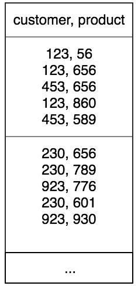

# 为什么数据库表的物理存储可能很重要

> 原文：[`www.kdnuggets.com/2019/05/physical-storage-database-tables-might-matter.html`](https://www.kdnuggets.com/2019/05/physical-storage-database-tables-might-matter.html)

 comments

**由 [Apoorva Aggarwal](https://www.linkedin.com/in/apoorvaaggarwal/) 提供，Grofers 的机器学习和数据工程师**


在简化和丰富我们用户的在线购物体验的过程中，我们尝试为每位用户提供个性化的商品推荐。为此，我们以批处理模式操作，预计算了每个用户的相关前 200 项推荐，并将结果存储在我们的 OLTP PostgreSQL 数据库中的一张表里，以便实时提供这些推荐。对此表的查询时间过长，导致用户体验不佳。

### **缩小问题范围**

为所有曾经在我们平台上交易的用户预计算了推荐，表的大小接近 12 GB。使用简单的 SELECT 查询从这张表中检索推荐。

```py
db=> SELECT *
FROM personalized_recommendations 
WHERE customer_id = 1;
...
```

```py
db=> \d personalized_recommendations
           Table "public.personalized_recommendations"
    Column    |       Type       | Collation | Nullable | Default
--------------+------------------+-----------+----------+---------
 customer_id  | integer          |           | not null |
 product_id   | integer          |           | not null |
 score        | double precision |           | not null |
 ...
Indexes:
    "personalized_recommendations_temp_customer_id_idx1" btree (customer_id)
```

在 `customer_id` 列上创建了 BTree 索引以实现更快的查找。但即便如此，有时查询时间仍然大约为 **~1 s**。

查看查询计划：

```py
EXPLAIN ANALYZE 
SELECT * 
FROM personalized_recommendations 
WHERE customer_id = 25001;

QUERY PLAN
— — — — — — — — — — — — —
Index Scan using personalized_recommendations_temp_customer_id_idx on personalized_recommendations (cost=0.57..863.90 rows=214 width=38) (actual time=10.372..110.246 rows=201 loops=1)
 Index Cond: (customer_id = 25001)
Planning time: 0.066 ms
Execution time: 110.335 ms
```

### **隔离原因**

尽管查询规划器使用了创建的索引，查询时间仍然非常长。这迫使我们深入探讨“索引”究竟意味着什么？索引如何帮助更快地获取查询结果？让我们重新审视索引的基本构造。

PostgreSQL 默认索引类型是 BTree，它由索引条目的 BTree 或平衡树和存储索引条目物理地址的索引叶节点组成。

索引查找需要三个步骤：

1.  树遍历

1.  跟随叶子节点链

1.  获取表数据

上述步骤详细解释 [这里](https://use-the-index-luke.com/sql/anatomy/the-tree)。

树遍历是访问块数量有上限的唯一步骤——即索引深度。其他两个步骤可能需要访问许多块——它们的上限可以大到完全表扫描的程度。¹

索引扫描执行 B-tree 遍历，遍历叶子节点以查找所有匹配的条目，并提取对应的表数据。这类似于 *INDEX RANGE SCAN* 随后进行 *TABLE ACCESS BY INDEX ROWID* 操作。

跟随叶子节点链需要获取符合 `customer_id` 条件的 *ROWID*：在我们的案例中，它的最大限制是 200 个行 ID。由于这些索引叶节点以排序方式存储，它们的访问上限由这条链的长度或表中的总行数决定。

下一步是*TABLE ACCESS BY INDEX ROWID*操作。它使用*ROWID*从前一步获取所有列的行。从表中检索行时，数据库引擎必须逐个获取行，访问页面中的每条记录，并将其加载到内存中进行检索。除了读取操作外，还涉及随机访问 IO。

我们决定可能值得查看这些查询结果行在物理内存中的分布。在 postgres 中，行的位置由`ctid`给出，它是一个元组。`ctid`的类型是`tid`（元组标识符），在 C 代码中称为`ItemPointer`。 [根据文档](http://www.postgresql.org/docs/current/interactive/datatype-oid.html)：

*这是系统列*`*ctid*`*的数据类型。一个元组 ID 是一个（****块编号****，****块内元组索引****）对，标识了表中行的物理位置。*

分布情况如下：

```py
customer_id | product_id | ctid
 — — — — — — -+ — — — — — — 
 1254 | 284670 | (3789,28)
 1254 | 18934 | (7071,73)
 1254 | 14795 | (8033,19)
 1254 | 10908 | (9591,60)
 1254 | 95032 | (11017,83)
 1254 | 318562 | (11134,65)
 1254 | 18854 | (11275,54)
 1254 | 109943 | (11827,76)
 1254 | 105 | (16309,104)
 1254 | 3896 | (18432,8)
 1254 | 3890 | (20062,90)
 1254 | 318550 | (20488,84)
 1254 | 37261 | (20585,62)
 ...
```

显然，特定客户 ID 的行在磁盘上相距很远。这似乎解释了包含`customer_id`的 WHERE 子句查询的高执行时间。数据库引擎正在访问磁盘上的页面以检索每一行。随机访问 IO 很高。如果我们能将特定客户的所有行放在一起会怎样？如果做到这一点，数据库引擎可能能够一次性检索结果集中的所有行。

### **可能的根本原因及可行性探索**

Postgres 提供了一个`[CLUSTER](https://www.postgresql.org/docs/9.1/static/sql-cluster.html)`命令，它根据给定的列在磁盘上物理地重新排列行。但是，由于需要在表上获取 READ WRITE 锁并且需要 2.5 倍的表大小，这使得使用起来很棘手。我们开始探索是否可以按客户 ID 行的排序方式写入表。写入这些行的应用程序是一个使用协同过滤算法来推导推荐产品的 Spark 应用程序。

### 试图从*源头*解决问题

**了解 Spark 如何写入表**

这个问题要求我们深入探讨 Spark 如何写入 Postgres。它是按`[partition](https://jaceklaskowski.gitbooks.io/mastering-apache-spark/spark-rdd-partitions.html)`分区的。那么，这个分区是什么呢？

Spark 作为一个分布式计算框架，将特定的数据框分配到其工作节点的分区中。它允许你根据分区键显式地对数据框进行分区，以确保最小化数据的重新分布（将分区从一个工作节点转移到另一个节点进行读取/写入操作）。通过代码我们发现，我们在特定的转换操作中对`product_id`进行了分区。


Spark 数据框的分区。注意包含特定产品 ID 的行位于一个分区中

这意味着写入我们 Postgres 表的数据应该按`product_id`分类，即所有推荐为特定产品 ID 的客户 ID 的行应该被聚集在一起。我们通过查看以下结果来测试我们的假设：

```py
SELECT *, ctid FROM personalized_recommendations WHERE product_id = 284670
 product_id | customer_id |   ctid
------------+-------------+----------
     284670 |        1133 | (479502,71)
     284670 |        2488 | (479502,72)
     284670 |        3657 | (479502,73)
     284670 |        2923 | (479502,74)
     284670 |        6911 | (479502,75)
     284670 |        9018 | (479502,76)
     284670 |        4263 | (479502,77)
     284670 |        1331 | (479502,78)
     284670 |        3242 | (479502,79)
     284670 |        3661 | (479502,80)
     284670 |        9867 | (479502,81)
     284670 |        7066 | (479502,82)
     284670 |       10267 | (479502,83)
     284670 |        7499 | (479502,84)
     284670 |        8011 | (479502,85)
```

确实，表中所有特定产品 ID 的行都在一起。所以如果我们改为按`customer_id`分区，我们的目标就是将所有属于一个`customer_id`的结果行集中在一起。这可以通过重新分区数据框来实现。 [这个](https://deepsense.ai/optimize-spark-with-distribute-by-and-cluster-by/)帖子详细讨论了重新分区。

**尝试对齐数据**

我们按以下方式重新分区了数据框：

```py
df.repartition($”customer_id”)
```

然后将最终的数据框写入 Postgres。现在我们检查了行的分布情况。

```py
db=> SELECT product_id,customer_id,ctid FROM personalized_recommendations WHERE customer_id = 28460
limit 20;
 customer_id | product_id | ctid
 — — — — — — + — — — — — — -+ — — — — — 
 28460 | 1133 | (0,24)
 28460 | 2488 | (4,7)
 28460 | 3657 | (9,83)
 28460 | 2923 | (18,54)
 28460 | 6911 | (20,42)
 28460 | 9018 | (31,59)
 28460 | 4263 | (35,79)
 28460 | 1331 | (38,14)
 28460 | 3242 | (40,41)
 28460 | 3661 | (55,105)
 28460 | 9867 | (57,21)
 28460 | 7066 | (61,28)
 28460 | 10267 | (62,63)
 28460 | 7499 | (66,8)
```

可惜的是，表仍然没有以`customer_id`为中心进行透视。我们做错了什么？

显然，数据重新排列的默认分区数量是 200。但由于不同的客户 ID 数量超过了 200（约 1000 万），这意味着单个分区将包含超过 1 个客户的推荐产品，如下图所示。在这种情况下，接近（~1000 万/200=50,000）个客户。



重新分区的数据框。注意一个产品 ID 的所有行都在一个分区中

当这个特定的分区写入数据库时，这仍然不能确保所有属于一个`customer_id`的行被一起写入。于是我们在分区内按`customer_id`对行进行了排序：

```py
df.repartition($”customer_id”).sortWithinPartitions($”customer_id”)
```


分区后按`customer_id`键排序的数据框

对 Spark 来说，这是一项昂贵的操作，但对我们来说却是必要的。我们进行了这项操作，并再次写入数据库。接下来，我们检查了分布情况。

```py
customer_id | product_id | ctid
 — — — — — — -+ — — — — — — + — — — — — -
 1254 | 284670 | (212,95)
 1254 | 18854 | (212,96)
 1254 | 18850 | (212,97)
 1254 | 318560 | (212,98)
 1254 | 318562 | (212,99)
 1254 | 318561 | (212,100)
 1254 | 10732 | (212,101)
 1254 | 108 | (212,102)
 1254 | 11237 | (212,103)
 1254 | 318058 | (212,104)
 1254 | 38282 | (212,105)
 1254 | 3884 | (212,106)
 1254 | 31 | (212,107)
 1254 | 318609 | (215,1)
 1254 | 2 | (215,2)
 1254 | 240846 | (215,3)
 1254 | 197964 | (215,4)
 1254 | 232970 | (215,5)
 1254 | 124472 | (215,6)
 1254 | 19481 | (215,7)
 …
```

看！现在它以`customer_id`为中心（喜极而泣：,-)）。

**测试解决方案**

最终的测试仍然存在。查询执行现在是否会更快？让我们看看查询规划器怎么说。

```py
EXPLAIN ANALYZE 
SELECT * 
FROM personalized_recommendations 
WHERE customer_id = 25001;

QUERY PLAN

Bitmap Heap Scan on personalized_recommendations(cost=66.87..13129.94 rows=3394 width=38) (actual time=2.843..3.259 rows=201 loops=1)
 Recheck Cond: (customer_id = 25001)
 Heap Blocks: exact=2
 -> Bitmap Index Scan on personalized_recommendations_temp_customer_id_idx (cost=0.00..66.02 rows=3394 width=0) (actual time=1.995..1.995 rows=201 loops=1)
 Index Cond: (customer_id = 25001)
 Planning time: 0.067 ms
 Execution time: 3.322 ms
```

> **执行时间从~100 毫秒降至~3 毫秒。**

这种优化确实帮助我们使用个性化推荐服务各种用例，如为超过 20 万用户的不断增长的消费群体生成定向广告推送等。首次启动时，数据的大小约为 12 GB。现在过去一年，它增长到了约 22GB，但重新排列表中的记录有助于将数据库检索延迟保持到最低。虽然现在生成这些推荐、排列数据框和写入数据库所需的时间增加了很多倍，但由于这些操作是在批处理模式下进行的，因此仍然可以接受。

随着平台用户规模的增长，数据也在每天增长，处理这些数据并使其对数据驱动的决策有用的挑战也在增加。如果你喜欢在大规模下解决类似问题，我们始终在寻找新的人才。可以在 [这里](https://grofers.recruiterbox.com/?team=Technology+-+Engineering%2C+Product+and+Design#content) 查看空缺职位。

**脚注：**

[1]. [`use-the-index-luke.com/sql/anatomy/slow-indexes`](https://use-the-index-luke.com/sql/anatomy/slow-indexes)

**个人简介： [Apoorva Aggarwal](https://www.linkedin.com/in/apoorvaaggarwal/)** 是 Grofers 的机器学习和数据工程师。

[最初发布于 Grofers 工程博客](https://lambda.grofers.com/why-physical-storage-of-your-database-tables-might-matter-74b563d664d9)。经许可转载。

**相关：**

+   掌握 SQL 的 7 个步骤 — 2019 版

+   PostgreSQL 查询优化的简单技巧

+   将 PB 级数据从 Postgres 加载到 BigQuery

* * *

## 我们的 3 个课程推荐

 1\. [Google 网络安全证书](https://www.kdnuggets.com/google-cybersecurity) - 快速进入网络安全职业生涯。

 2\. [Google 数据分析专业证书](https://www.kdnuggets.com/google-data-analytics) - 提升您的数据分析技能

 3\. [Google IT 支持专业证书](https://www.kdnuggets.com/google-itsupport) - 支持您的组织进行 IT

* * *

### 更多相关主题

+   [24 个 SQL 问题，你可能会在下一次面试中遇到](https://www.kdnuggets.com/2022/06/24-sql-questions-might-see-next-interview.html)

+   [从初学者到专家：为什么您的 Python 技能在数据科学中很重要](https://www.kdnuggets.com/novice-to-ninja-why-your-python-skills-matter-in-data-science)

+   [你可能不知道的 5 个 Pandas 绘图函数](https://www.kdnuggets.com/2023/02/5-pandas-plotting-functions-might-know.html)

+   [什么是数据血缘关系，为什么它很重要？](https://www.kdnuggets.com/what-is-data-lineage-and-why-does-it-matter)

+   [从 Oracle 到 AI 数据库：数据存储的演变](https://www.kdnuggets.com/2022/02/oracle-databases-ai-evolution-data-storage.html)

+   [云存储的采用是商业的迫切需求](https://www.kdnuggets.com/2022/02/cloud-storage-adoption-need-hour-business.html)
