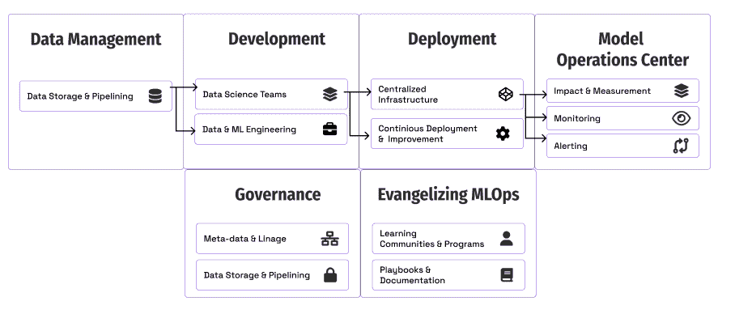
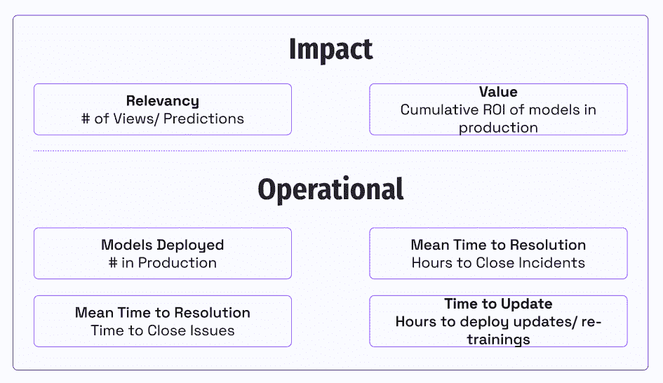

# 扩展 MLOps 的手册

> 原文：[`www.kdnuggets.com/2023/06/playbook-scale-mlops.html`](https://www.kdnuggets.com/2023/06/playbook-scale-mlops.html)

作者：Mike Caravetta 和 Brendan Kelly

# 为您的团队扩展 MLOps

* * *

## 我们的三大课程推荐

 1\. [谷歌网络安全证书](https://www.kdnuggets.com/google-cybersecurity) - 快速进入网络安全职业生涯。

 2\. [谷歌数据分析专业证书](https://www.kdnuggets.com/google-data-analytics) - 提升您的数据分析水平

 3\. [谷歌 IT 支持专业证书](https://www.kdnuggets.com/google-itsupport) - 支持您的组织进行 IT 工作

* * *

MLOps 团队面临着提升其能力以扩展 AI 的压力。在 2022 年，我们看到 AI 和 MLOps 在组织内外的热潮爆炸。2023 年承诺带来更多的炒作，伴随着 ChatGPT 的成功和模型在企业中的受欢迎程度。

MLOps 团队寻求在满足业务迫切需求的同时扩展他们的能力。这些团队在 2023 年开始时有一长串决议和计划，以改善他们如何 [工业化 AI](https://www2.deloitte.com/content/dam/insights/articles/7022_TT-MLOps-industrialized-AI/DI_2021-TT-MLOps-industrialized-AI.pdf)。我们如何扩展 MLOps 的组件（部署、监控和治理）？我们团队的首要任务是什么？

[AlignAI](http://getalignai.com) 与福特汽车合作编写了这本手册，以指导 MLOps 团队，根据我们看到的成功经验来进行扩展。

# MLOps 的含义是什么？

首先，我们需要一个有效的 MLOps 定义。MLOps 是组织从交付少量 AI 模型转向可靠地大规模交付算法的过渡。这一过渡需要一个可重复和可预测的过程。MLOps 意味着更多的 AI 及其相关的投资回报。团队在 MLOps 上取得成功，当他们专注于协调过程、团队和工具时。

**扩展 MLOps 的基础组件**

让我们通过来自福特汽车的示例和一些帮助您入门的想法来逐一了解每个领域。

+   **测量与影响**：团队如何跟踪和衡量进展。

+   **部署与基础设施**：团队如何扩展模型部署。

+   **监控**：维持生产中模型的质量和性能。

+   **治理**：围绕模型创建控制和可见性。

+   **推广 MLOps**：教育业务和其他技术团队了解为什么以及如何利用 MLOps 方法。

# 测量与影响

一天，一位商业高管走进了福特的 MLOps 指挥中心。我们回顾了一个模型的使用指标，并就使用量下降的原因进行了富有成效的讨论。对模型的影响和采纳情况的可见性对于建立信任和响应业务需求至关重要。

对于利用 AI 并投资于 MLOps 能力的团队来说，一个基本问题是我们如何知道自己是否在进步？

关键在于使我们的团队对我们如何为客户和业务利益相关者提供价值达成一致。团队专注于量化他们提供的业务影响和支持这一影响的操作指标。衡量影响能捕捉我们如何产生效果的全貌。

**启动的想法：**

1.  你如何衡量当前模型在开发或生产中的价值？你如何追踪业务利益相关者的使用和参与情况？

1.  当前你们的模型在生产中的操作或工程指标是什么？谁负责这些指标的改进？你如何让人们查看这些指标？

1.  人们如何知道用户行为或解决方案使用情况是否发生了变化？谁来回应这些问题？

# 部署与基础设施

团队在 MLOps 中面临的第一个障碍是将模型部署到生产环境中。随着模型数量的增长，团队必须创建一个标准化的流程和共享平台来处理增加的工作量。使用 20 种不同模式部署的 20 个模型管理起来会非常繁琐。企业团队通常会围绕 X 个模型创建集中式基础设施资源。选择合适的架构和基础设施在模型和团队之间可能是一场艰巨的战斗。然而，一旦建立起来，它将为构建监控和治理能力提供坚实的基础。

在福特，我们使用 Kubernetes、Google Cloud Platform 以及一个支持团队创建了一个标准部署功能。

[**Lucid Link**](https://lucid.app/lucidchart/0ebe6cd4-cacf-4080-8e6f-1885e510b666/edit?invitationId=inv_67a19c1e-5868-4ad1-b659-cc09e0606270&page=0_0#)

**为你的团队提供的想法：**

1.  你将如何集中管理模型的部署？你能否创建或指定一个集中团队和资源来管理这些部署？

1.  使用哪些部署模式（REST、批处理、流式处理等）？

1.  你打算如何定义并与其他团队共享这些功能？

1.  对你的建模团队来说，哪些方面最耗时或最困难，以将模型投入生产？如何设计集中部署系统以缓解这些问题？

# 监控

机器学习的一个独特而具有挑战性的方面是[模型在生产中漂移和变化](https://proceedings.neurips.cc/paper/2015/file/86df7dcfd896fcaf2674f757a2463eba-Paper.pdf)的能力。监控对建立与利益相关者的信任至关重要，以便使用这些模型。[谷歌的机器学习规则](https://developers.google.com/machine-learning/guides/rules-of-ml)建议“实践良好的警报管理，如使警报可操作”。这要求团队定义监控领域以及如何生成这些警报。一个具有挑战性的部分是使这些警报具有可操作性。需要建立一个调查和缓解生产问题的过程。

在福特，模型操作中心是一个集中展示信息和数据的地方，用于了解模型是否在近实时中达到了我们的预期。

这是一个简化的仪表盘示例，用于监测使用量或记录数量是否降到设定阈值以下。

**监控指标**

以下是考虑用于模型的监控指标：

+   **延迟**：返回预测的时间（例如，处理 100 条记录的批处理时间）。

+   **统计性能**：模型在给定测试数据集上的正确或接近正确预测的能力（例如，均方误差、F2 等）。

+   **数据质量**：对预测或训练数据的完整性、准确性、有效性和及时性的量化（例如，缺少某个特征的预测记录百分比）。

+   **数据漂移**：数据分布随时间变化（例如，计算机视觉模型的光照变化）。

+   **模型使用**：模型预测被用于解决业务或用户问题的频率（例如，作为 REST 端点部署的模型预测次数）。

**给团队的建议：**

1.  所有模型应如何进行监控？

1.  每个模型需要包含哪些指标？

1.  是否有标准工具或框架来生成这些指标？

1.  我们将如何管理监控警报和问题？

# 治理

创新本质上会带来风险，特别是在企业环境中。因此，成功引领创新需要在系统中设计控制措施以降低风险。主动出击可以节省大量麻烦和时间。MLOps 团队应该主动预测和教育利益相关者关于风险及其缓解方法。

发展主动的治理方法有助于避免对业务需求的被动响应。策略的两个关键部分是控制对敏感数据的访问以及捕获血统和元数据以便于可视化和审计。

治理在团队扩展时提供了很好的自动化机会。等待数据是数据科学项目中的持续动力杀手。在福特，一种模型能够以 97%的准确率自动确定数据集中是否存在个人身份信息。机器学习模型还帮助处理访问请求，将处理时间从几周减少到 90%的案例中的几分钟。

另一个方面是跟踪模型生命周期中的元数据。扩展机器学习需要扩展对模型本身的信任。大规模的 MLOps 需要内置的质量、安全性和控制，以避免生产中的问题和偏差。

团队可能会陷入有关治理的理论和意见中。最佳的做法是从清晰的用户访问权限和控制开始。

从那里开始，元数据的捕获和自动化是关键。下表概述了收集元数据的领域。在可能的情况下，利用管道或其他自动化系统自动捕获这些信息，以避免人工处理和不一致性。

**需要收集的元数据**

这里是每个模型需要收集的项目：

+   版本/训练模型工件：训练模型工件的唯一标识符。

+   训练数据 - 用于创建训练模型工件的数据。

+   训练代码 - 推断的 Git 哈希或源代码链接。

+   依赖项 - 训练中使用的库。

+   预测代码 - 推断的 Git 哈希或源代码链接。

+   历史预测 - 为审计目的存储推断结果。

**团队的想法：**

1.  我们在项目中遇到了哪些问题？

1.  我们的业务利益相关者正在经历或关注哪些问题？

1.  我们如何管理数据的访问请求？

1.  谁来批准它们？

1.  是否有自动化的机会？

1.  我们的模型管道或部署创造了哪些漏洞？

1.  我们需要捕获哪些元数据？

1.  它是如何存储和提供的？

# 推广 MLOps

许多技术团队陷入了“如果我们建造它，他们就会来”的误区。解决问题不仅仅是构建解决方案，还涉及到分享和宣传解决方案以增加组织影响力。MLOps 团队需要分享最佳实践以及如何解决组织工具、数据、模型和利益相关者的独特问题。

MLOps 团队中的任何人都可以通过与业务利益相关者合作，展示他们的成功案例来成为布道者。展示来自你组织的示例可以清楚地说明好处和机会。

组织中希望工业化 AI 的人需要教育、文档和其他支持。午餐学习会、入职培训和导师计划都是很好的起点。随着组织的扩展，更多正式化的学习和入职培训程序以及支持文档可以加速组织的转型。

**团队的想法：**

1.  你如何为 MLOps 创建一个社区或持续的学习和最佳实践？

1.  我们需要建立和分享哪些新的角色和能力？

1.  我们解决了哪些可以分享的问题？

1.  你如何提供培训或文档以与其他团队分享最佳实践和成功故事？

1.  我们如何为数据科学家、数据工程师和业务相关者创建学习项目或检查清单，以学习如何与 AI 模型合作？

# 开始使用

MLOps 团队和领导者面临着大量机会，同时平衡工业化模型的紧迫需求。每个组织面临的挑战各不相同，取决于其数据、模型和技术。如果 MLOps 很容易，我们可能就不会喜欢解决这个问题了。

**挑战总是优先排序。**

我们希望这本行动指南能激发你的团队产生新的想法和探索领域。第一步是为你的团队在 2023 年生成一个大机会列表。然后根据对客户的最大影响来无情地进行优先排序。团队还可以根据新兴基准定义和衡量他们的成熟进展。[谷歌的这份指南](https://cloud.google.com/architecture/mlops-continuous-delivery-and-automation-pipelines-in-machine-learning)可以为你的团队提供一个框架和成熟度里程碑。

**给你的团队的想法：**

1.  我们在 MLOps 方面推进成熟度或复杂性的最大机会是什么？

1.  我们如何捕捉和跟踪在推进成熟度方面的项目进展？

1.  为本指南和你的团队生成任务列表。根据实施时间和预期收益进行优先排序。制定一个路线图。

## 参考文献

+   [`www2.deloitte.com/content/dam/insights/articles/7022_TT-MLOps-industrialized-AI/DI_2021-TT-MLOps-industrialized-AI.pdf`](https://www2.deloitte.com/content/dam/insights/articles/7022_TT-MLOps-industrialized-AI/DI_2021-TT-MLOps-industrialized-AI.pdf)

+   [`proceedings.neurips.cc/paper/2015/file/86df7dcfd896fcaf2674f757a2463eba-Paper.pdf`](https://proceedings.neurips.cc/paper/2015/file/86df7dcfd896fcaf2674f757a2463eba-Paper.pdf)

+   [`developers.google.com/machine-learning/guides/rules-of-ml`](https://developers.google.com/machine-learning/guides/rules-of-ml)

+   [`cloud.google.com/architecture/mlops-continuous-delivery-and-automation-pipelines-in-machine-learning`](https://cloud.google.com/architecture/mlops-continuous-delivery-and-automation-pipelines-in-machine-learning)

**[迈克·卡拉维塔](https://www.linkedin.com/in/michael-cavaretta-795a965/)** 利用分析技术创造了数亿美元的商业价值。他目前负责推进福特在制造业的 MLOps 扩展和复杂性降低。

**[布伦丹·凯利](https://www.linkedin.com/in/brendan-kelly-5b79135a/)**，AlignAI 的联合创始人，帮助了几十个组织加速了银行、金融服务、制造业和保险行业的 MLOps。

### 相关主题

+   [终极人工智能战略手册](https://www.kdnuggets.com/the-ultimate-ai-strategy-playbook)

+   [现代企业的数字化转型实用手册](https://www.kdnuggets.com/digital-transformation-playbook-for-modern-businesses)

+   [如何高效地使用云计算扩展数据科学项目](https://www.kdnuggets.com/2023/05/efficiently-scale-data-science-projects-cloud-computing.html)

+   [从 Google Colab 到 Ploomber 管道：使用 GPU 进行大规模机器学习](https://www.kdnuggets.com/2022/03/google-colab-ploomber-pipeline-ml-scale-gpus.html)

+   [数据隐私：学习实施技术隐私解决方案……](https://www.kdnuggets.com/2022/04/manning-data-privacy-learn-implement-technical-privacy-solutions-tools-scale.html)

+   [MLOps 中的设计模式](https://www.kdnuggets.com/2022/02/design-patterns-machine-learning-mlops.html)
