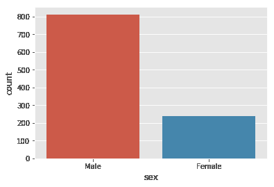
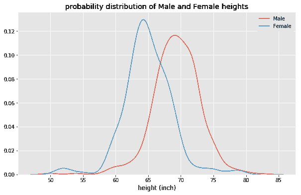
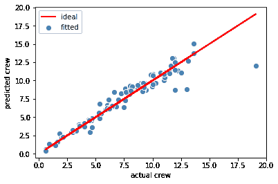
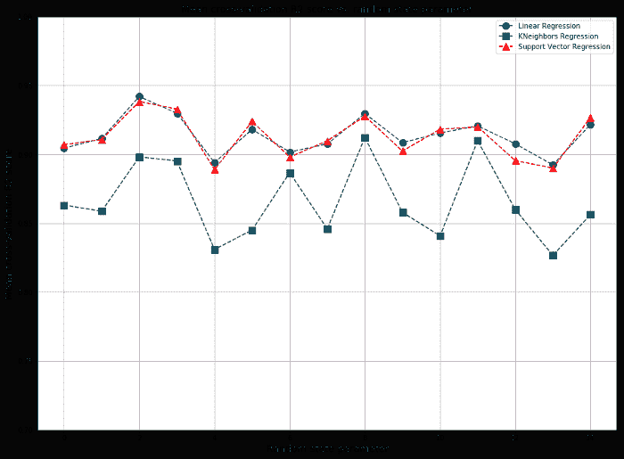
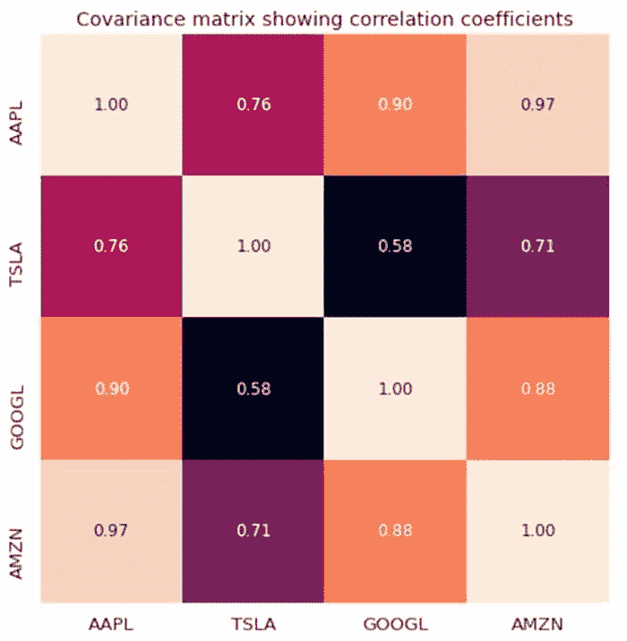
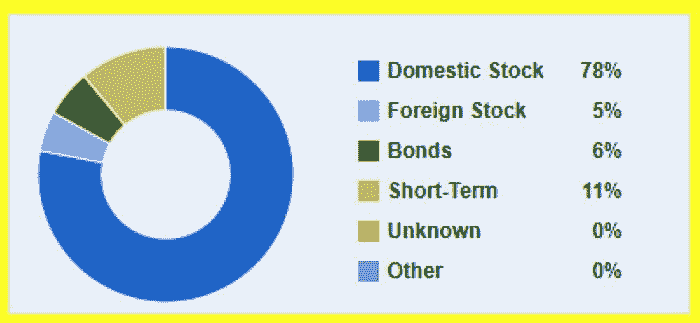

# 绘图和数据可视化在数据科学中的应用

> 原文：[`www.kdnuggets.com/2022/06/plotting-data-visualization-data-science.html`](https://www.kdnuggets.com/2022/06/plotting-data-visualization-data-science.html)

照片由 [艾萨克·史密斯](https://unsplash.com/@isaacmsmith?utm_source=medium&utm_medium=referral) 提供，发布于 [Unsplash](https://unsplash.com/?utm_source=medium&utm_medium=referral)

## 关键要点

+   大多数希望进入数据科学领域的初学者总是担心数学要求。

+   数据科学是一个非常定量的领域，需要高级数学知识。

+   但要入门，你只需掌握几个数学主题。

+   在这篇文章中，我们讨论了绘图和数据可视化在数据科学和机器学习中的重要性。

* * *

## 我们的三大课程推荐

 1\. [谷歌网络安全证书](https://www.kdnuggets.com/google-cybersecurity) - 快速进入网络安全职业。

 2\. [谷歌数据分析专业证书](https://www.kdnuggets.com/google-data-analytics) - 提升你的数据分析能力

 3\. [谷歌 IT 支持专业证书](https://www.kdnuggets.com/google-itsupport) - 支持你的组织的 IT 需求

* * *

# 绘图和数据可视化

大部分基本的数据科学关注的是找到***特征***（***预测变量***）和***目标变量***（***结果***）之间的关系。预测变量也称为***自变量***，而目标变量是***因变量***。

绘图和数据可视化可以在特征与目标变量之间讲述不同类型的故事，例如比较不同的数量、研究趋势、量化关系或展示比例。绘图或数据可视化是数据科学中最古老且最重要的分支。

在这篇文章中，我们探讨了数据科学和机器学习中使用的各种类型的图表。

# 生成图表的基本组件

一个好的图表或数据可视化由几个组件组成，这些组件需要组合在一起以生成最终产品：

1.  **数据组件**：决定如何可视化数据的一个重要第一步是了解数据的类型，例如，分类数据、离散数据、连续数据、时间序列数据等。

1.  **几何组件**：在这里，你决定什么样的可视化适合你的数据，例如，散点图、折线图、条形图、直方图、Q-Q 图、平滑密度图、箱线图、对角图、热力图、饼图等。

1.  **映射组件：**在这里，你需要决定使用哪个变量作为***自变量***（*x-变量*）以及使用哪个变量作为***因变量***（*y-变量*）。这很重要，特别是当你的数据集是多维的，具有多个特征时。

1.  **尺度组件：**在这里，你决定在图中使用什么样的尺度，例如线性尺度、对数尺度等。

1.  **标签组件：**这包括诸如轴标签、标题、图例、字体大小等内容。

1.  **伦理组件：**在这里，你要确保你的可视化讲述了真实的故事。你需要在清理、总结、操控和生成数据可视化时注意你的行为，确保不会利用你的可视化误导或操控观众。

重要的数据可视化工具包括 Python 的 matplotlib 和 seaborn 包，以及 R 的 ggplot2 包。

# 绘图和数据可视化示例

在本节中，我们讨论了数据科学和机器学习中使用的几种图表。每个图表的说明中包含一个链接，该链接将带你到原始文章，在那里你可以找到更多细节，如生成图表所用的数据集和源代码。

## 1. 条形图用于比较不同的数量

图 1. 数据集分布。N=1050：812（男性）和 238（女性）身高。这显示我们有一个非常不平衡的数据集，男性身高占 77%，女性身高占 23%。来源：[贝叶斯定理解释](https://pub.towardsai.net/bayes-theorem-explained-66ebf8285fcc)。

图 2. [2016 年选定国家电动车市场份额](https://medium.com/towards-artificial-intelligence/tutorial-on-barplots-using-rs-ggplot-package-b7f86104a974)。图片由 Benjamin O. Tayo 提供。

图 3. [2020 年全球按技能分类的工作数量使用 LinkedIn 搜索工具](https://medium.com/towards-artificial-intelligence/top-10-tech-skills-in-2020-worldwide-ecef27c8d8ad)。图片由 Benjamin O. Tayo 提供。

## 2. 密度图用于研究变量的分布

图 4. [使用蒙特卡洛模拟的均匀分布样本均值的概率分布](https://towardsdatascience.com/proof-of-central-limit-theorem-using-monte-carlo-simulation-34925a7bc64a)。图片由 Benjamin O. Tayo 提供。

图 5. [男性和女性身高的概率分布](https://pub.towardsai.net/bayes-theorem-explained-66ebf8285fcc)。显示男性的平均身高高于女性。

## 3. 散点图用于研究关系

图 6. [使用多元回归分析的理想和拟合图](https://medium.com/towards-artificial-intelligence/role-of-data-visualization-in-machine-learning-a6dd62ad1082)。图片由 Benjamin O. Tayo 提供。

图 7. [不同回归模型的均值交叉验证分数](https://medium.com/towards-artificial-intelligence/role-of-data-visualization-in-machine-learning-a6dd62ad1082)。图片由 Benjamin O. Tayo 提供。

## 4\. 用于量化关系的热图

图 8. [选定科技股票的协方差矩阵图](https://pub.towardsai.net/essential-linear-algebra-for-data-science-and-machine-learning-10d47d61000b)。

## 5\. 用于研究趋势的时间依赖图

图 9. [2021 年 4 月前 16 天特斯拉股票价格](https://pub.towardsai.net/essential-linear-algebra-for-data-science-and-machine-learning-10d47d61000b)。

## 6\. 显示比例的饼图

图 10. [展示投资组合中各种资产类别的饼图](https://medium.com/personal-finance-analytics/data-driven-portfolio-management-c7724690643d)。

# 总结

+   大多数数据科学问题归结为研究特征变量与目标变量之间的数学关系。

+   绘图或数据可视化是量化特征变量与目标变量之间关系的第一步。

+   良好的数据可视化具有几个基本组成部分，如数据组件、几何组件、映射组件、刻度组件、标签组件和伦理组件。

+   有几种类型的图表，如比较图、用于研究趋势的图、显示比例的图等。

+   在确定适合数据的图表或可视化方式之前，理解给定的数据集是很重要的。

**[Benjamin O. Tayo](https://www.linkedin.com/in/benjamin-o-tayo-ph-d-a2717511/)** 是一位物理学家、数据科学教育者和作家，也是 DataScienceHub 的创始人。此前，Benjamin 曾在中欧大学、大峡谷大学和匹兹堡州立大学教授工程学和物理学。

### 更多相关话题

+   [7 个用于快速数据可视化的 Pandas 绘图函数](https://www.kdnuggets.com/7-pandas-plotting-functions-for-quick-data-visualization)

+   [5 个你可能不知道的 Pandas 绘图函数](https://www.kdnuggets.com/2023/02/5-pandas-plotting-functions-might-know.html)

+   [用于数据可视化的 SQL：如何准备数据以制作图表和图形](https://www.kdnuggets.com/sql-for-data-visualization-how-to-prepare-data-for-charts-and-graphs)

+   [如何使用数据可视化来提升工作报告的影响力……](https://www.kdnuggets.com/2022/08/data-visualization-add-impact-work-reports-presentations.html)

+   [数据可视化：理论与技术](https://www.kdnuggets.com/data-visualization-theory-and-techniques)

+   [38 个顶尖 Python 库：数据科学、数据可视化与……](https://www.kdnuggets.com/2020/11/top-python-libraries-data-science-data-visualization-machine-learning.html)
