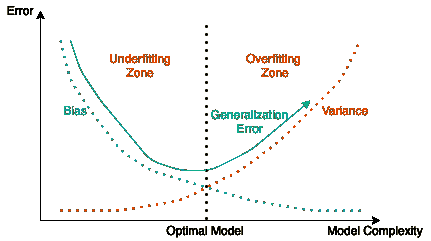
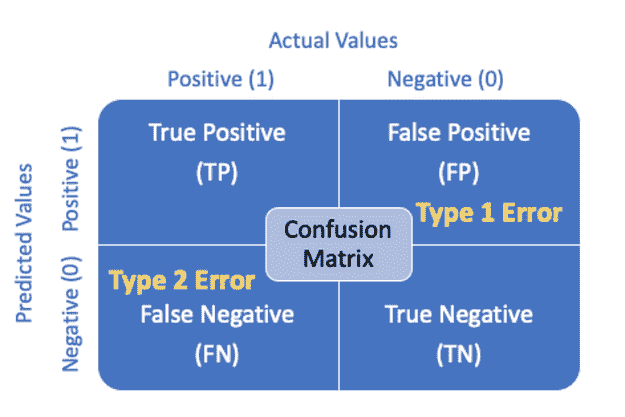
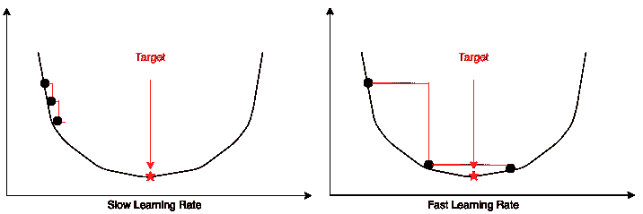
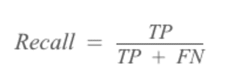

# 流行的机器学习面试问题

> 原文：[`www.kdnuggets.com/2021/01/popular-machine-learning-interview-questions.html`](https://www.kdnuggets.com/2021/01/popular-machine-learning-interview-questions.html)

评论

**由[Mo Daoud](https://mohamed-daoud214.medium.com/)提供，科技工作者，AI 爱好者**。

面试足够困难和压力重重，我在这里的目标是帮助你为机器学习面试做好准备。这份清单并不包括所有面试问题，也不能保证帮助你通过面试。它基本上是一份我从担任面试官时收集的面试问题列表。

*照片由[Clem Onojeghuo](https://unsplash.com/@clemono?utm_source=medium&utm_medium=referral)在[Unsplash](https://unsplash.com/?utm_source=medium&utm_medium=referral)上提供。*

### *Q1\. 机器学习的不同类型是什么，简要说明一下？*

预期的答案应提到监督学习、无监督学习和强化学习。

**监督学习** 你给算法标签数据，算法必须从中学习并弄清楚如何解决未来类似的问题。可以把它看作是给算法问题和答案。算法必须学习这些问题是如何解决的，以便以类似的方式解决未来的问题。这就像上面的例子，其中银行从你的习惯中学习哪些信用卡交易是真实的，哪些是欺诈的。

**无监督学习** 你给算法一个没有标签的数据或对答案没有任何先验知识的问题。可以把它看作是给算法问题而没有答案。算法必须通过从数据中获取洞察力来找到最佳答案。这类似于银行根据各种参数对其客户进行聚类，决定谁有资格获得信用卡优惠、信用额度优惠，谁不符合任何优惠。这通常使用一种叫做**K-Means**的机器学习方法来完成。

**强化学习** 这是当算法通过奖励和惩罚从自己的经验中学习。最简单的例子是自动驾驶汽车，其中有一个代理通过每一步的移动来学习。朝目标的正向移动会给代理带来奖励，而远离目标的负向移动会给代理带来惩罚。

### *Q2\. 给我一个监督学习的例子，以及一个无监督学习的例子？*

在这里，我通常期望听到 3 个词：**分类**、**回归**和**聚类**。这些是机器学习的一些最流行和基础的用法。

分类和回归主要使用监督学习，候选人可以举例说明如何使用历史数据来训练模型。

例如，如果有人盗用了你的信用卡并进行了一次在线交易。你可能会收到来自银行的电子邮件或短信，要求你确认这笔交易。否则，银行会认为这是欺诈。你的银行算法通过你的购买历史学会了你的信用卡购买习惯，当检测到异常交易时，银行怀疑这是欺诈。这是一种机器学习形式，可能是决策树**分类**。

另一个例子是一个汽车公司尝试根据今年的销售数字和历史数据预测明年的销售情况，这是一种机器学习形式，可能是线性**回归**。

**聚类**主要使用无监督学习，其中没有历史数据。一个简单的例子是垃圾邮件过滤器，其中算法检查所有传入邮件的不同部分，将它们组合在一起，然后将邮件分为垃圾邮件和正常邮件。

### *Q3\. 你构建了一个深度学习模型，在训练过程中，你注意到在经过一定数量的周期后，准确率在下降。是什么问题，如何解决？*

答案应该与**过拟合**有关。

似乎模型正在学习确切的数据集特征，而不是捕捉其特征，这被称为模型过拟合。可能模型相比数据集非常复杂。模型在层数和神经元方面比所需的要复杂。

根据情况，有几种方法可以修复这个过拟合模型。最常见的方法是**早期停止**和**dropout 正则化**。

早期停止就是它听起来的意思：一旦开始看到准确率下降，就提前停止训练。Dropout 正则化是丢弃一些输出层或节点。因此，剩余的节点具有不同的权重，并且必须额外工作以捕捉特征。

### *Q4\. 深度学习模型中的偏差（Bias）和方差（Variance）有什么区别？如何在它们之间实现平衡？*

这与前一个问题有点相关。答案应该包括欠拟合的简单模型、过拟合的复杂模型，以及偏差和方差不能同时最小化的事实。

**高偏差**意味着模型很简单，在训练阶段无法捕捉许多特征，也就是欠拟合模型。**高方差**意味着模型很复杂，不仅捕捉了特征，还学习了除了那些特定训练集特征之外的其他内容，这也被称为过拟合。

*图像来源：作者。*

如你所见，在中间有一个甜点区域可以平衡偏差和方差。如果你的模型向右移动，则模型变得更加复杂，从而增加了方差，导致过拟合。如果你的模型向左移动，则变得过于简单，从而增加了偏差，导致欠拟合。

一个好的数据科学家知道如何通过调整模型的超参数来权衡偏差和方差，从而实现最佳模型复杂度。

简单模型意味着少量的神经元和较少的层，而复杂模型意味着大量的神经元和几层。

### *Q5\. 什么是混淆矩阵？它用于监督学习和无监督学习吗？类型 1 和类型 2 错误是什么？*

混淆矩阵仅用于评估监督学习模型的性能，不能用于无监督模型。

*混淆矩阵。来源：[你想知道的机器学习知识但又太害怕去问的事](https://medium.com/swlh/everything-you-wanted-to-know-about-machine-learning-but-were-too-afraid-to-ask-d7d92021038).*

混淆矩阵是一种展示模型四种结果的方法：真正例、假正例、假负例和真负例。召回率、精确度、准确率和 F1 分数都可以从混淆矩阵中计算得出。

**类型 1 错误**是当你的算法做出正面预测，但实际上是负面的。例如，你的算法预测一个患者有癌症，但实际上他没有。

**类型 2 错误**是当你的算法做出负面预测，但实际上是正面的。例如，你的算法预测一个患者没有癌症，但实际上他有。

### *Q6\. 什么是模型学习率？高学习率总是好吗？*

学习率是一个调整参数，它决定了每次迭代（epoch）的步长。步长是指你在估计错误后更新神经元权重的速度。模型权重通过反向传播错误方法进行更新。因此，输入会从模型的输入节点流经神经元到输出节点，然后确定错误并反向传播以更新神经元（模型）权重。更新这些神经元权重的速度就是学习率。

*图片作者。*

如果学习率高，则模型权重更新迅速且频繁，那么你的模型将快速收敛，但可能会超过真实错误的最小值。这意味着一个较快但有误的模型。

如果学习率低，则模型权重更新缓慢，那么你的模型将需要很长时间才能收敛，但不会超过真实错误的最小值。这意味着一个较慢但更准确的模型。

### *Q7\. 什么是梯度消失？*

这个问题与前一个问题相关。这里我期待对梯度下降的快速解释以及反向传播如何影响它。

可以将梯度下降视为在反向传播过程中用来更新神经网络的权重。将激活函数视为与模型中每个神经元相关联的方程。这个方程决定了该神经元是否应该被激活，这取决于神经元输入与模型预测的相关性。

在某些情况下，当你有一个多层的深度神经网络，并且根据你选择的激活函数（以及其他超参数），梯度会变得非常小，并且可能在从输出到输入节点的反向传播过程中消失。这里的问题是模型中神经元的权重不会被更新（或被非常小的值更新）。因此，你的模型不会学习（或学习很少）。这明显是梯度消失问题的例子。

### *Q8. KNN 和 K-means 之间有什么区别？*

我个人对有这么多候选人混淆这两个概念感到惊讶。答案应说明**KNN 是一种监督**模型用于分类，而**K-means 是一种无监督**模型用于聚类。然后候选人应提供一个分类的例子和一个聚类的例子。

### *Q9. 什么是交叉验证机器学习模型？*

这是另一个简单的例子，答案应包括在模型从未见过的新数据上进行测试。最佳的例子是当你使用 Scikit Learn（或任何其他库）将数据拆分为训练集和测试集时。测试集数据用于在模型训练后进行交叉验证，以便你可以评估模型的性能。

### *Q10. 如何评估你的监督学习模型？什么是召回率和准确率？*

**准确率**：这是指在所有模型预测为正的情况下，有多少实际是正的。当假阳性对你的输出很重要时，你需要关注准确率。

*准确率。*

假设你是一个小公司，你向潜在的客户发送样品，这些客户可能会购买你的产品。你不想将样品发送给那些无论如何都不会购买你产品的客户。那些收到样品但不购买你产品的客户是假阳性，因为你预测他们会购买你的产品（预测 = 1），但实际上他们永远不会（实际 = 0）。在这种情况下，你希望尽可能减少假阳性，以获得高准确率。

*召回率。*

**召回率**：这是对实际正例中有多少被正确分类的答案。当假阴性对输出很重要时，你会关心召回率。以你的信用卡为例。有人偷了你的信用卡号码，并在一个你从未访问过的可疑网站上购买了东西。这显然是欺诈交易，但不幸的是，你的银行算法没有检测到。发生的情况是，你的银行预测这不是欺诈（预测 = 0），但实际上是欺诈（实际 = 1）。在这种情况下，你的银行应该开发一种减少 FN 从而提高召回率的欺诈检测算法。

### *Q11。什么是维度诅咒，如何解决它？*

这适用于数据集具有过多特征时，这使得模型难以学习和提取这些特征。

可能会发生两种主要情况

+   特征数量多于观察值，从而增加了过拟合模型的风险

+   特征过多，观察值变得更难以聚类。过多的维度导致数据集中的每个观察值都与所有其他观察值等距，从而无法形成有意义的簇

解决此问题的主要技术是**主成分分析（PCA）**。

PCA 是一种无监督机器学习算法，旨在降低数据集中维度（特征数量），同时尽可能保留更多信息。其方法是找到一组新的特征，称为主成分，这些主成分是原始特征的复合体，相互之间不相关。它们还受到约束，使得第一个主成分解释数据中可能的最大变异性，第二个主成分解释第二大变异性，依此类推。

最后，希望这些示例问题和答案能帮助你为即将到来的面试做准备。它们也可以作为你机器学习知识的复习材料。

[原文](https://towardsdatascience.com/popular-machine-learning-interview-questions-91d569afe147)。经许可转载。

*准备好更多面试问题了吗？查看**[本文第二部分](https://www.kdnuggets.com/2021/01/popular-machine-learning-interview-questions-part2.html)**！*

**相关：**

+   [如何在面试中解释关键的机器学习算法](https://www.kdnuggets.com/2020/10/explain-machine-learning-algorithms-interview.html)

+   [破解 SQL 面试](https://www.kdnuggets.com/2020/12/crack-sql-interviews.html)

+   [数据科学面试学习指南](https://www.kdnuggets.com/2020/01/data-science-interview-study-guide.html)

* * *

## 我们的前三大课程推荐

 1\. [谷歌网络安全证书](https://www.kdnuggets.com/google-cybersecurity) - 快速进入网络安全职业。

 2\. [谷歌数据分析专业证书](https://www.kdnuggets.com/google-data-analytics) - 提升你的数据分析技能

 3\. [谷歌 IT 支持专业证书](https://www.kdnuggets.com/google-itsupport) - 支持你组织中的 IT

* * *

### 更多相关内容

+   [停止学习数据科学，寻找目标，然后寻找目标去……](https://www.kdnuggets.com/2021/12/stop-learning-data-science-find-purpose.html)

+   [学习数据科学统计的顶级资源](https://www.kdnuggets.com/2021/12/springboard-top-resources-learn-data-science-statistics.html)

+   [一个 90 亿美元的 AI 失败，经过检讨](https://www.kdnuggets.com/2021/12/9b-ai-failure-examined.html)

+   [成功数据科学家的 5 个特征](https://www.kdnuggets.com/2021/12/5-characteristics-successful-data-scientist.html)

+   [是什么让 Python 成为初创公司理想的编程语言](https://www.kdnuggets.com/2021/12/makes-python-ideal-programming-language-startups.html)

+   [每位数据科学家都应该知道的三个 R 库（即使你使用 Python）](https://www.kdnuggets.com/2021/12/three-r-libraries-every-data-scientist-know-even-python.html)
