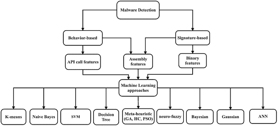

# 实用的机器学习特征工程方法

> 原文：[`www.kdnuggets.com/2023/07/practical-approach-feature-engineering-machine-learning.html`](https://www.kdnuggets.com/2023/07/practical-approach-feature-engineering-machine-learning.html)

照片由[Pixabay](https://www.pexels.com/photo/abstract-art-circle-clockwork-414579/)提供

特征学习是机器学习的重要组成部分，但常常被忽视，许多指南和博客文章集中在机器学习生命周期的后期阶段。这个辅助步骤可以使机器学习模型更加准确和高效，将原始数据转化为更具体且可以使用的东西。如果没有这个步骤，构建一个完全优化的模型是不可能的。

* * *

## 我们的前三大课程推荐

 1\. [谷歌网络安全证书](https://www.kdnuggets.com/google-cybersecurity) - 快速进入网络安全职业。

 2\. [谷歌数据分析专业证书](https://www.kdnuggets.com/google-data-analytics) - 提升你的数据分析技能

 3\. [谷歌 IT 支持专业证书](https://www.kdnuggets.com/google-itsupport) - 支持组织中的 IT

* * *

在本文中，我们将讨论特征学习在机器学习中的工作原理及其如何以简单、实用的步骤实施。此外，我们还将讨论机器学习的一些缺点，全面概述这一关键过程。

## 什么是特征工程？

特征工程是一种重要的机器学习（ML）技术，它处理数据集并将其转化为适用于特定任务的可用数据。

[来源](https://www.heavy.ai/technical-glossary/feature-engineering)

特征是被分析的数据元素，在数据集中表现为列。通过修正、排序和[归一化这些数据元素](https://learn.microsoft.com/en-us/azure/machine-learning/component-reference/normalize-data?view=azureml-api-2#:~:text=Normalization%20is%20a%20technique%20often,of%20values%20or%20losing%20information.)，模型可以被优化以获得更好的性能。特征学习修改这些数据元素，使其变得相关，从而使模型更加准确，响应时间更快，因为使用的变量更少。

特征工程过程可以分解为以下步骤：

+   对数据进行分析，以纠正发现的任何问题，例如不完整的字段、不一致性和其他异常情况。

+   任何与模型行为无关的变量都将被删除。

+   重复数据被忽略。

+   记录被相关化和归一化。

### 为什么特征工程在机器学习中如此重要？

如果没有特征工程，将无法设计出能够准确执行其功能的预测模型。特征学习还减少了所需的时间和计算资源，使模型更高效。

数据的特征决定了预测模型的工作方式，帮助训练每个模型以实现预期结果。这意味着即使数据并不完全适用于某个特定功能，也可以通过修改来实现合适的结果。特征学习还显著减少了后续数据分析所花费的时间。

### 特征工程：优点和缺点

尽管特征学习至关重要，但它确实存在一些局限性，同时也有明显的好处，详见下文。

**特征工程：优点**

+   具有工程化特征的模型在数据处理上更快。

+   模型简化，因此更易于维护。

+   预测和估算更准确。

**特征工程：缺点**

+   特征工程可能是一个耗时的过程。

+   要构建有效的特征列表，需要进行深入分析。这包括对数据集、模型的处理行为以及业务背景的透彻理解。

## 机器学习中的实际特征工程方法：六个步骤

现在我们对特征学习的作用及其缺点有了更好的理解，让我们考虑一种实际的过程方法，分为 6 个关键步骤。

### #1 数据准备

特征工程过程的第一步是将从各种来源收集的原始数据转换为可用格式。可用的机器学习格式包括：.csc; .tfrecords; .json; .xml; 和 .avro。为了准备数据，必须经过一系列处理步骤，如清洗、融合、[数据摄取](https://www.techtarget.com/whatis/definition/data-ingestion)和加载。

### #2 数据分析

分析阶段，有时被称为探索阶段，是从数据集中提取见解和描述性统计数据，并以可视化方式呈现，以便更好地理解数据。接下来是识别相关变量及其属性，以便进行清理。

### #3 改进

数据分析和清洗完成后，是时候通过添加任何缺失值、归一化、转换和缩放来改进数据。数据还可以通过添加虚拟值进一步修改，虚拟值是表示分类数据的定性/离散变量。

### #4 构建

特征可以通过手动和自动 使用算法（例如 [tSNE](https://en.wikipedia.org/wiki/T-distributed_stochastic_neighbor_embedding#:~:text=t%2Ddistributed%20stochastic%20neighbor%20embedding%20(t%2DSNE)%20is,two%20or%20three%2Ddimensional%20map.) 或 主成分分析（[PCA](https://en.wikipedia.org/wiki/Principal_component_analysis)））来构建。特征构建的选项几乎是无穷无尽的，但解决方案总是依赖于问题。

### #5 选择

特征/变量/属性选择通过仅选择与模型预测目标变量最相关的特征来减少输入变量（特征列）的数量。这有助于提供更好的处理速度并减少计算资源的使用。

特征选择技术包括：

+   过滤器用于移除任何不相关的特征。

+   封装器用于训练机器学习模型以使用多个特征

+   结合过滤器和封装器的混合模型

基于过滤器的技术，例如，依赖统计测试来确定特征是否与目标变量有足够的相关性。

### #6 评估与验证

评估过程确定模型在训练数据中的准确性，基于所选特征。如果准确性达到标准，那么模型可以被验证。如果没有，那么需要重复特征选择阶段。

## 特征工程的使用案例

现在让我们深入了解机器学习中三个常见的特征工程使用案例。

### 来自同一数据集的额外见解

许多数据集包含任意值，例如日期、年龄等，这些值可以修改为不同的格式，以提供有关查询的特定信息。例如，可以交叉参考日期和持续时间详情，以确定用户行为，例如他们访问网站的频率和在网站上花费的时间。

### 预测模型

选择正确的特征可以帮助构建适用于各种行业的预测模型，其中一个可以受益于这种模型的行业是公共交通，帮助估算特定日期可能有多少乘客使用某项服务。

### 恶意软件检测

手动恶意软件检测非常困难，大多数神经网络在这方面也存在问题。然而，特征工程可以结合手动技术和神经网络，以突出异常行为。

[来源](https://hcis-journal.springeropen.com/articles/10.1186/s13673-018-0125-x)

## 机器学习中的特征工程：结论

特征工程是构建机器学习模型时的重要阶段，做好这一阶段可以确保机器学习模型更加准确，使用更少的计算资源，并以更高的速度处理数据。

特征工程过程可以分为六个阶段，从初始数据准备到验证，选择最相关的数据元素以完成特定任务。

**[Nahla Davies](http://nahlawrites.com/)** 是一位软件开发者和技术作家。在全职投入技术写作之前，她曾担任 Inc. 5000 体验品牌组织的首席程序员，该组织的客户包括三星、时代华纳、Netflix 和索尼，这只是她工作中的一部分引人入胜的经历。

### 更多相关主题

+   [Feature Store Summit 2022：一场关于特征工程的免费会议](https://www.kdnuggets.com/2022/10/hopsworks-feature-store-summit-2022-free-conference-feature-engineering.html)

+   [Python 中的客户细分：一种实用的方法](https://www.kdnuggets.com/customer-segmentation-in-python-a-practical-approach)

+   [Feature Store Summit 2023：部署 ML 模型的实用策略…](https://www.kdnuggets.com/2023/09/hopsworks-feature-store-summit-2023-practical-strategies-deploying-ml-models-production-environments)

+   [为多变量时间序列构建可处理的特征工程管道](https://www.kdnuggets.com/2022/03/building-tractable-feature-engineering-pipeline-multivariate-time-series.html)

+   [使用 RAPIDS cuDF 在特征工程中利用 GPU](https://www.kdnuggets.com/2023/06/rapids-cudf-leverage-gpu-feature-engineering.html)

+   [初学者的特征工程](https://www.kdnuggets.com/feature-engineering-for-beginners)
