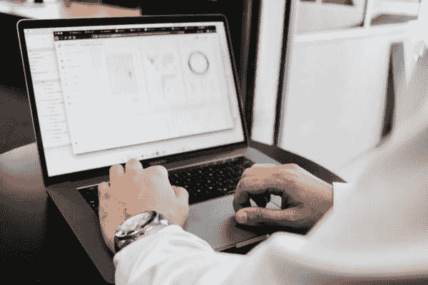

# 如何获得实际的数据科学经验以准备职业生涯

> 原文：[`www.kdnuggets.com/2021/07/practical-data-science-experience-career-ready.html`](https://www.kdnuggets.com/2021/07/practical-data-science-experience-career-ready.html)

评论

在这篇文章中，我将给你三个方法，通过这些方法你可以自行获得实际的数据科学经验。完成这些项目后，你将对**SQL**、**Pandas** 和**机器学习建模**有一个深入的理解。

1.  首先，我将提供一些真实的 SQL 案例研究，其中你会遇到商业问题，并需要查询数据库以诊断问题并提出解决方案。

1.  第二，我将为你提供几十个 Pandas 实践问题，Pandas 是一个用于数据操作和分析的 Python 库。这将帮助你发展数据整理和数据清理所需的技能。

1.  第三，我将为你提供各种机器学习问题，你可以开发机器学习模型来进行预测。通过这样做，你将学会如何处理机器学习问题，以及从头到尾开发机器学习模型所需的基本步骤。

* * *

## 我们的前 3 个课程推荐

 1\. [谷歌网络安全证书](https://www.kdnuggets.com/google-cybersecurity) - 快速进入网络安全职业轨道

 2\. [谷歌数据分析专业证书](https://www.kdnuggets.com/google-data-analytics) - 提升你的数据分析能力

 3\. [谷歌 IT 支持专业证书](https://www.kdnuggets.com/google-itsupport) - 支持你的组织进行 IT 管理

* * *

话虽如此，让我们深入探讨吧！

### 1\. SQL 案例研究

如果你想成为数据科学家，你必须具备强大的 SQL 技能。Mode 提供了三个实际的 SQL 案例研究，这些案例模拟了现实中的商业问题，还有一个在线 SQL 编辑器，你可以在其中编写和运行查询。

> *要打开 Mode 的 SQL 编辑器，请访问*[*此链接*](https://mode.com/sql-tutorial/intro-to-intermediate-sql/)*，然后点击上面写着‘打开另一个窗口到 Mode’的超链接。*

**学习 SQL**

如果你对 SQL 不熟悉，我建议你首先从[Mode 的 SQL 教程](https://mode.com/sql-tutorial/introduction-to-sql/)开始，在那里你可以学习基本、中级和高级的 SQL 技巧。如果你已经对 SQL 有很好的理解，可以跳过这部分。

*案例研究 1：调查用户参与度下降*

+   [案例链接](https://mode.com/sql-tutorial/a-drop-in-user-engagement/).

本案例的目标是确定 Yammer 项目用户参与度下降的原因。在深入数据之前，你应该阅读一下 Yammer 的概述，[点击这里](https://mode.com/sql-tutorial/sql-business-analytics-training/)。你需要处理 4 张表格。

案例链接将提供有关问题、数据和应回答的问题的更多详细信息。

如果你需要指导，可以查看我如何处理这个案例研究，[点击这里](https://towardsdatascience.com/sql-case-study-investigating-a-drop-in-user-engagement-510b27d0cbcc?source=friends_link&sk=49cdc679e66cae75257b955db51f4fe5)。

*案例研究 2: 理解搜索功能*

+   [案例链接](https://mode.com/sql-tutorial/understanding-search-functionality/)。

本案例更侧重于产品分析。在这里，你需要深入分析数据，确定用户体验是好还是坏。这个案例有趣的地方在于，由你来确定什么是“好”和“坏”，以及如何评估用户体验。

*案例研究 3: 验证 A/B 测试结果*

+   [案例链接](https://mode.com/sql-tutorial/validating-ab-test-results/)。

数据科学中最实用的应用之一是进行 A/B 测试。在这个案例研究中，你将深入分析一个 A/B 测试的结果，其中对照组和处理组之间存在 50% 的差异。你需要在彻底分析后验证或否定这些结果。

### 2\. Pandas 练习问题

当我刚开始开发机器学习模型时，我发现自己缺乏 Pandas 技能是一个很大的限制。不幸的是，互联网上没有太多资源可以让你练习 Pandas 技能，这与 Python 和 SQL 不同。

不过，几周前，我发现了[这个资源](https://github.com/guipsamora/pandas_exercises)— 这是一个专门为 Pandas 准备的练习问题的仓库。通过完成这些练习问题，你将学会：

+   筛选和排序数据

+   分组和汇总数据

+   使用 .apply() 操作数据

+   合并数据集

+   以及更多内容。

如果你能完成这些练习问题，你应该可以自信地说你知道如何在数据科学项目中使用 Pandas。这也将对下一部分有很大的帮助。

### 3\. 机器学习建模

获得数据科学经验的最佳方法之一是创建你自己的机器学习模型。这意味着要找到一个公开的数据集，定义一个问题，并通过机器学习解决这个问题。

[Kaggle](https://www.kaggle.com/) 是全球最大的一个数据科学社区，拥有数百个数据集供你选择。以下是一些可以帮助你入门的想法。

*预测葡萄酒质量*

+   数据集[点击这里](https://www.kaggle.com/uciml/red-wine-quality-cortez-et-al-2009)。

*图片来源于 [Terry Vlisidis](https://unsplash.com/@vlisidis?utm_source=unsplash&utm_medium=referral&utm_content=creditCopyText) 在 [Unsplash](https://unsplash.com/s/photos/red-wine?utm_source=unsplash&utm_medium=referral&utm_content=creditCopyText)。*

该数据集包含关于各种葡萄酒、其成分和葡萄酒质量的数据。这可以是回归问题或分类问题，具体取决于你的框架。看看你是否能预测一款红葡萄酒的质量，考虑 11 个输入（固定酸度、挥发酸、柠檬酸、残留糖、氯化物、游离二氧化硫、总二氧化硫、密度、pH 值、硫酸盐和酒精）。

> *如果你想获得一些关于为这个数据集创建机器学习模型的指导，请查看我的方法*[*这里*](https://towardsdatascience.com/predicting-wine-quality-with-several-classification-techniques-179038ea6434)*。*

*二手车价格估算器*

+   数据集 [在这里](https://www.kaggle.com/austinreese/craigslist-carstrucks-data)。

*图片来源于 [Parker Gibbs](https://unsplash.com/@parkergibbsmccullough?utm_source=unsplash&utm_medium=referral&utm_content=creditCopyText) 在 [Unsplash](https://unsplash.com/s/photos/used-car?utm_source=unsplash&utm_medium=referral&utm_content=creditCopyText)。*

Craigslist 是全球最大的二手车出售平台。该数据集由从 Craigslist 抓取的数据组成，并且每隔几个月更新一次。使用这个数据集，看看你是否能创建一个数据集来预测汽车列表是否定价过高或过低。

**相关内容：**

+   [成为数据科学家的学习路径](https://www.kdnuggets.com/2021/07/learning-path-data-scientist.html)

+   [2021 年数据科学学习路线图](https://www.kdnuggets.com/2021/02/data-science-learning-roadmap-2021.html)

+   [作为数据科学初学者你应该避免的 10 个错误](https://www.kdnuggets.com/2021/06/10-mistakes-avoid-data-science-beginner.html)

### 更多相关主题

+   [停止学习数据科学以寻找目标，并寻找目标以……](https://www.kdnuggets.com/2021/12/stop-learning-data-science-find-purpose.html)

+   [学习数据科学统计学的顶级资源](https://www.kdnuggets.com/2021/12/springboard-top-resources-learn-data-science-statistics.html)

+   [成功数据科学家的 5 个特征](https://www.kdnuggets.com/2021/12/5-characteristics-successful-data-scientist.html)

+   [每个数据科学家都应该了解的三个 R 库（即使你使用 Python）](https://www.kdnuggets.com/2021/12/three-r-libraries-every-data-scientist-know-even-python.html)

+   [一个 90 亿美元的 AI 失败，进行分析](https://www.kdnuggets.com/2021/12/9b-ai-failure-examined.html)

+   [是什么让 Python 成为初创公司的理想编程语言](https://www.kdnuggets.com/2021/12/makes-python-ideal-programming-language-startups.html)
